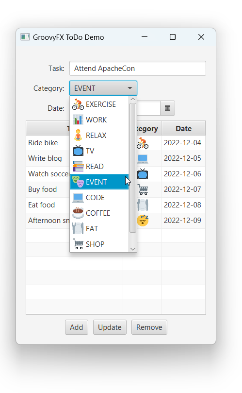

= Adventures with GroovyFX
Paul King
:revdate: 2022-12-12T14:22:57+00:00
:keywords: groovy, groovyfx, javafx, emoji, jackson databind
:description: This blog looks at a GroovyFX TODO application.

This blog looks at a http://groovyfx.org/[GroovyFX] version of a https://donraab.medium.com/my-weird-and-wonderful-first-adventures-with-javafx-6efe3b1923c8[ToDo application originally written in JavaFX].
First we start with a `ToDoCategory` enum of our ToDo categories:

[source,groovy]
----
enum ToDoCategory {
    EXERCISE("🚴"),
    WORK("📊"),
    RELAX("🧘"),
    TV("📺"),
    READ("📚"),
    EVENT("🎭"),
    CODE("💻"),
    COFFEE("☕️"),
    EAT("🍽"),
    SHOP("🛒"),
    SLEEP("😴")

    final String emoji

    ToDoCategory(String emoji) {
        this.emoji = emoji
    }
}

----

We will have a `ToDoItem` class containing the todo task, the previously mentioned category and the due date.

[source,groovy]
----
@Canonical
@JsonIncludeProperties(['task', 'category', 'date'])
@FXBindable
class ToDoItem {
    final String task
    final ToDoCategory category
    final LocalDate date
}

----

It's annotated with `@JsonIncludeProperties` to allow easy serialization to/from JSON format, to provide easy persistence, and `@FXBindable` which eliminates the boilerplate required to define JavaFX properties.

Next, we'll define some helper variables:

[source,groovy]
----
var file = 'todolist.json' as File
var mapper = new ObjectMapper().registerModule(new JavaTimeModule())
var open = { mapper.readValue(it, new TypeReference<List<ToDoItem>>() {}) }
var init = file.exists() ? open(file) : []
var items = FXCollections.observableList(init)
var close = { mapper.writeValue(file, items) }
var table, task, category, date, images = [:]
var urls = ToDoCategory.values().collectEntries {
    [it, "emoji/${Integer.toHexString(it.emoji.codePointAt(0))}.png"]
}

----

Here, `mapper` serializes and deserializes our top-level domain object (the ToDo list) into JSON using the https://github.com/FasterXML/jackson[Jackson library]. The `open` and `close` Closures do the reading and writing respectively.

For a bit of fun and only slightly more complexity, we have included some slightly nicer images in our application. JavaFX's default emoji font rendering is a little sketchy on some platforms, and it's not much work to have nice multicolored images. This is achieved using the icons from https://github.com/pavlobu/emoji-text-flow-javafx.
The application is perfectly functional without them (and the approximately 20 lines for the `cellFactory` and `cellValueFactory` definitions could be elided) but is prettier with the nicer images. We shrunk them to 1/3 their original size but we could certainly make them larger if we felt inclined.

Our application will have a combo box for selecting a ToDo item's category. We'll create a factory for the combo box so that each selection will be a label with both graphic and text components.

[source,groovy]
----
def graphicLabelFactory = {
    new ListCell<ToDoCategory>() {
        void updateItem(ToDoCategory cat, boolean empty) {
            super.updateItem(cat, empty)
            if (!empty) {
                graphic = new Label(cat.name()).tap {
                    graphic = new ImageView(images[cat])
                }
            }
        }
    }
}
----

When displaying our ToDo list, we'll use a table view. So, let's create a factory for table cells that will use the pretty images as a centered graphic.

[source,groovy]
----
def graphicCellFactory = {
    new TableCell<ToDoItem, ToDoItem>() {
        void updateItem(ToDoItem item, boolean empty) {
            graphic = empty ? null : new ImageView(images[item.category])
            alignment = Pos.CENTER
        }
    }
}
----

Finally, with these definitions out of the way, we can define our GroovyFX application for manipulating our ToDo list:

[source,groovy]
----
start {
    stage(title: 'GroovyFX ToDo Demo', show: true, onCloseRequest: close) {
        urls.each { k, v -> images[k] = image(url: v, width: 24, height: 24) }
        scene {
            gridPane(hgap: 10, vgap: 10, padding: 20) {
                columnConstraints(minWidth: 80, halignment: 'right')
                columnConstraints(prefWidth: 250)

                label('Task:', row: 1, column: 0)
                task = textField(row: 1, column: 1, hgrow: 'always')

                label('Category:', row: 2, column: 0)
                category = comboBox(items: ToDoCategory.values().toList(),
                        cellFactory: graphicLabelFactory, row: 2, column: 1)

                label('Date:', row: 3, column: 0)
                date = datePicker(row: 3, column: 1)

                table = tableView(items: items, row: 4, columnSpan: REMAINING,
                        onMouseClicked: {
                            var item = items[table.selectionModel.selectedIndex.value]
                            task.text = item.task
                            category.value = item.category
                            date.value = item.date
                        }) {
                    tableColumn(property: 'task', text: 'Task', prefWidth: 200)
                    tableColumn(property: 'category', text: 'Category', prefWidth: 80,
                            cellValueFactory: { new ReadOnlyObjectWrapper(it.value) },
                            cellFactory: graphicCellFactory)
                    tableColumn(property: 'date', text: 'Date', prefWidth: 90, type: Date)
                }

                hbox(row: 5, columnSpan: REMAINING, alignment: CENTER, spacing: 10) {
                    button('Add', onAction: {
                        if (task.text && category.value && date.value) {
                            items << new ToDoItem(task.text, category.value, date.value)
                        }
                    })
                    button('Update', onAction: {
                        if (task.text && category.value && date.value &&
                                !table.selectionModel.empty) {
                            items[table.selectionModel.selectedIndex.value] =
                                    new ToDoItem(task.text, category.value, date.value)
                        }
                    })
                    button('Remove', onAction: {
                        if (!table.selectionModel.empty)
                            items.removeAt(table.selectionModel.selectedIndex.value)
                    })
                }
            }
        }
    }
}
----

We could have somewhat separated the concerns of application logic and display logic by placing the GUI part of this app in an `fxml` file. For our purposes however, we'll keep the whole application in one source file and use Groovy's declarative builder style.

Here is the application in use:

== Further information

The code for this application can be found here:

https://github.com/paulk-asert/groovyfx-todo

It's a Groovy 3 and JDK 8 application but see this
https://groovy.apache.org/blog/reading-and-writing-csv-files[blog post]
if you want to see Jackson deserialization of classes and records
(and Groovy's emulated records) from CSV files using recent
Groovy and JDK versions.