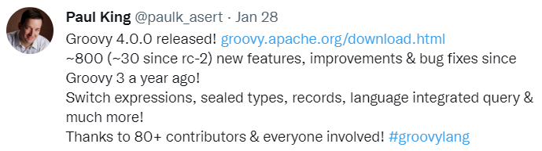
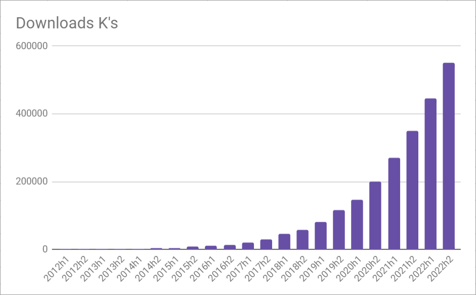
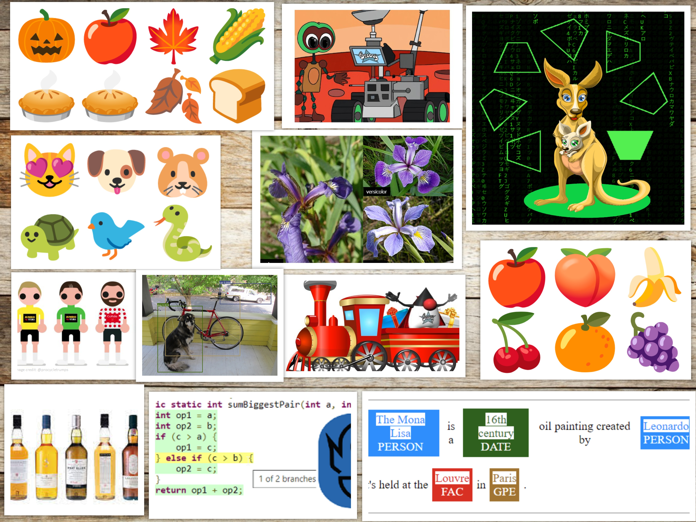
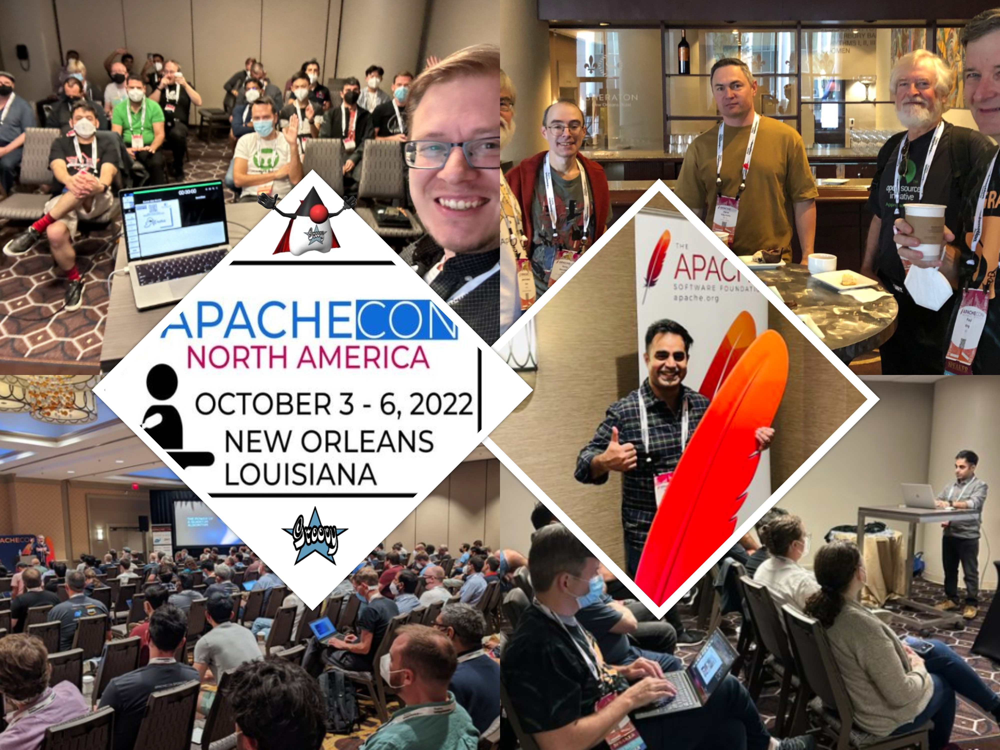

= Apache Groovy 2022 Year In Review
Paul King
:revdate: 2022-12-29T14:28:20+00:00
:keywords: groovy, 2022, apachecon
:description: This post looks back at some highlights for Groovy in 2022.

The year 2022 has been a reasonably good one for the Groovy Programming Language.
Here are just a few of the highlights.

== Releases & Contributions

In 2022, Groovy had 18 releases starting with Groovy 4 in January:

The latest release of Groovy 4 is 4.0.7 which includes over 300 improvements
and bug fixes since 4.0.0. For more details about Groovy 4, you can read the
https://groovy-lang.org/releasenotes/groovy-4.0.html[release notes].
There have also been bug fix releases for earlier Groovy versions.

For our main branch of our main source code repo, there were 820 commits from 28
contributors. This is the branch which corresponds to Groovy 5 but many fixes
were also back-ported to earlier Groovy versions.

Just on Groovy 5, we expect to have alpha versions available for review in the
first quarter of 2023. Also, while discussing commit counts, we should note that
https://github.com/eric-milles[Eric Milles] became the 5th person to overtake James
Strachan (the original founder of Groovy) in numbers of commits to the project.
Congrats Eric!

There were also many contributions outside those code commits.
_We thank all those involved in contributing to or promoting Groovy in 2022_!

== Downloads

In early 2021, Groovy surpassed the 1 billion artifacts downloaded mark.
This is downloads of artifacts from repositories like Maven Central and
(at least until recently) Bintray. We now only collect stats from Maven Central.
We don't collect stats on downloads of the zip releases nor attempt to account
for the many downloads where Groovy is bundled within other products, so
the stats are no doubt much higher. Well, the good news is that the rate of
downloads is still increasing, so interest in Groovy remains high.
While the figures for December are not yet finalised, it looks like
*_2022 will be the first year Groovy surpasses 1 Billion downloads in a single calendar year_*!

== Blogs

We also started increasing the number of posts in the
https://groovy.apache.org/blog[Groovy project blog].
There were nearly 30 posts for you to peruse from this year.
We try to show off Groovy features and also have some fun.

You might also like to check out the https://www.javaadvent.com/2022/12/groovy-and-data-science.html[Groovy and Data Science blog post] from
the https://www.javaadvent.com/[JVM Advent] folks. It summarises a handful of the above-mentioned blog posts.

== ApacheCon

Several folks from the project and many friends of Groovy participated in the sold out
ApacheCon conference in New Orleans in October. We thank the conference organisers,
speakers and attendees for the wonderful conference.

We have plenty more in store for 2023. We invite you to come on the journey with us!

Social media: https://twitter.com/ApacheGroovy[@ApacheGroovy]
https://fosstodon.org/@ApacheGroovy[@ApacheGroovy@fosstodon.org]