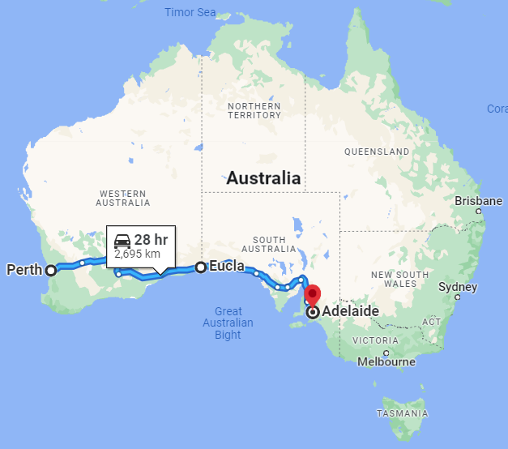
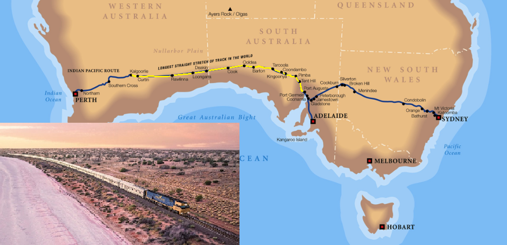

= Australian Time Zones
Paul King
:revdate: 2023-02-20T20:00:00+00:00
:keywords: groovy, datetime, timezone, date
:description: Inspired by a recent update related to Antarctic timezones, this post looks at some interesting Australian time zone facts.

https://kenkousen.substack.com/[Ken Kousen] posted another
https://t.co/VM4f4lpM7a[Tales from the jar side] episode
covering among other things, time zones in Antarctica.

image:https://external-preview.redd.it/16_JjhwH0lSETAc7LMNvulifXMrs-43lWIs_nr2OPIs.jpg?width=960&crop=smart&auto=webp&v=enabled&s=7fe189e9ed24d481d3445fad245bd6ae18ee5740[Research stations and timezones in Antarctica]

Let's replicate his example in Groovy before looking at time zones
more broadly in Australia. Why Australia? Well, that's where I'm from but also
there's a reference in Ken's article to one of the facts we'll look at. First, here
is the equivalent of Ken's exploration at the South Pole:

[subs="quotes"]
----
[lime]*Groovy Shell* (4.0.9, JVM: 17.0.2)
Type ':help' or ':h' for help.
-------------------------------------------------------------------------------
groovy:000> import java.time.*
===> java.time.*
groovy:000> southPole = ZoneId.of('Antarctica/South_Pole')
===> Antarctica/South_Pole
groovy:000> dst = southPole.rules.isDaylightSavings(Instant.now())
===> true
groovy:000> "The South Pole ${dst ? 'IS' : 'IS NOT'} currently on DST"
===> The South Pole IS currently on DST
groovy:000>
----

Without wanting to give away Ken's punch line, the South Pole,
in particular, the Amundsen-Scott station, is currently on daylight saving time.
Read https://t.co/VM4f4lpM7a[his article]
or attend one of Ken's talks if you wonder why that might be strange!

Speaking of strange, Ken also mentioned another strange fact related
to Australian timezones. Australia has a zone, Eucla, with a 45-minute offset.
And that's not the only interesting fact!

Let's look at all Australian timezones, including Eucla, and the three
Antarctic research stations, Casey, Davis, and Mawson
(seen on the right of the above map).

Before we dive into coding, let's look at the timezones we're interested in:

[cols="1,3,2,5"]
|===
| Abbreviation  | Time zone name  | Offset | Where used

| https://www.timeanddate.com/time/zones/acdt[ACDT]
| Australian Central Daylight Time
| UTC +10:30
| _Summer:_ South Australia, Broken Hill/Yancowinna County in New South Wales

| https://www.timeanddate.com/time/zones/acst[ACST]
| Australian Central Standard Time
| UTC +9:30
| _Winter:_ South Australia, Broken Hill/Yancowinna County in New South Wales +
_All year:_ Northern Territory

| https://www.timeanddate.com/time/zones/act-australia[ACT]
| Australian Central Time
|
| Often used as an abbreviation for places which switch between ACDT/ACST

| https://www.timeanddate.com/time/zone/australia/eucla[ACWST]
| Australian Central Western Standard Time
| UTC +8:45
| Eucla

| https://www.timeanddate.com/time/zones/aedt[AEDT]
| Australian Eastern Daylight Time
| UTC +11
| _Summer:_ Australian Capital Territory, New South Wales except Broken Hill/Yancowinna County in New South Wales, Tasmania, Victoria +
_All year:_ Macquarie Island

| https://www.timeanddate.com/time/zones/aest[AEST]
| Australian Eastern Standard Time
| UTC +10
| _Winter:_ Australian Capital Territory, New South Wales except Broken Hill/Yancowinna County in New South Wales, Tasmania, Victoria +
_All year:_ Queensland, Coral Sea Islands

| https://www.timeanddate.com/time/zones/aet[AET]
| Australian Eastern Time
|
| Often used as an abbreviation for places in either AEDT or AEST (or switching between them)

| https://www.timeanddate.com/time/zones/awdt[AWDT]
| Australian Western Daylight Time
| UTC +9
| _Not currently in use_

| https://www.timeanddate.com/time/zones/awst[AWST]
| Australian Western Standard Time
| UTC +8
| Western Australia, Ashmore and Cartier Islands

| https://www.timeanddate.com/time/zones/cct[CCT]
| Cocos Islands Time
| UTC +6:30
| Cocos (Keeling) Islands

| https://www.timeanddate.com/time/zones/cxt[CXT]
| Christmas Island Time
| UTC +7
| Christmas Island

| https://www.timeanddate.com/time/zones/lhdt[LHDT]
| Lord Howe Daylight Time
| UTC +11
| _Summer:_ Lord Howe Island

| https://www.timeanddate.com/time/zones/lhst[LHST]
| Lord Howe Standard Time
| UTC +10:30
| _Winter:_ Lord Howe Island

| https://www.timeanddate.com/time/zones/nfdt[NFDT]
| Norfolk Daylight Time
| UTC +12
| _Summer:_ Norfolk Island

| https://www.timeanddate.com/time/zones/nft[NFT]
| Norfolk Time
| UTC +11
| _Winter:_ Norfolk Island

| https://www.timeanddate.com/time/zones/tft[TFT]
| French Southern and Antarctic Time
| UTC +5
| Heard and McDonald Islands

| https://www.timeanddate.com/time/zones/cast[CAST]
| Casey Time
| _Winter:_ UTC +8 +
_Summer:_ UTC +11
| Casey Antarctic Station

| https://www.timeanddate.com/time/zones/davt[DAVT]
| Davis Time
| UTC +7
| Davis Antarctic Station

| https://www.timeanddate.com/time/zones/mawt[MAWT]
| Mawson Time
| UTC +5
| Mawson Antarctic Station
|===

The first thing you might notice, is that's quite a few time zones!
Secondly, most countries have whole number zone offsets, but you
should notice that Australia has several 30-minute offsets too.
Ken mentioned that 45-minute offsets are even rarer (3 in the world).
Let's look at Australia's contribution to that exclusive club:

[source,groovy]
----
var eucla = ZoneId.of('Australia/Eucla')
println eucla.rules.getStandardOffset(now)
----

This has the following result:

----
+08:45
----

Why such a strange offset? Well, Eucla sits on the Nullarbor plain,
about halfway between Perth and Adelaide, and close to the state border.
It was once home to a telegram station and
http://www.drivemelbournetoperth.com.au/time-zones-across-nullarbor.html#:~:text=To%20sort%20this%20issue%20out,time%20zone%20of%2045%20minutes[the story goes] that to minimise confusion between the West Australian and
South Australian workers who sat side-by-side sorting telegrams,
they set the time zone to exactly halfway between their respective state
timezones. Western Australia and South Australia are (excluding daylight saving)
an hour and 30 minutes apart, so halfway between results in the 45-minute offset!

Incidentally, if you want to see
the longest straight section of railway in the world (478 km, 297 mi),
or the longest straight section of tarred road in Australia (146 km, 91 mi),
then the Nullarbor plain is the place to be, but otherwise it's not high
on most folks tourist attractions must-see list.

image:https://upload.wikimedia.org/wikipedia/commons/thumb/9/91/Highway_sign%2C_Nullarbor%2C_2017_%2802%29.jpg/1920px-Highway_sign%2C_Nullarbor%2C_2017_%2802%29.jpg[Nullarbor plain,600]

But the Nullarbor is the place to be if you want to know about another obscure timezone fact!
When the Indian Pacific train travels between
Kalgoorlie, Western Australia and Port Augusta, South Australia,
it has its own time known as
https://en.wikipedia.org/wiki/Time_in_Australia#:~:text=The%20Indian%20Pacific%20train%20has,the%20eastern%20and%20southern%20states["Train Time"] (UTC+09:00).
We won't follow this unofficial timezone in our later exploration,
but it would add another to our list if we wanted to include it too!

A few other obscure timezone facts relate to some of Australia's smaller islands.

One interesting timezone fact applies to
https://lordhoweisland.info/[Lord Howe Island].
Lord Howe Island is a little over 600 km (380mi)
out from the north coast of New South Wales.
That's about 1/4 of the way to New Zealand!
Being that far East of the mainland, it's not surprising to find out that
it has a timezone 30 minutes earlier than the mainland.

image:https://www.thesenior.com.au/images/transform/v1/crop/frm/ezJUJGp6GbYvhKygBYtWTb/90dd6397-e247-4c3f-aacf-bd15b7cf8586.jpg/r0_31_600_371_w1200_h678_fmax.jpg[Lord Howe Island]

Apparently, some years back,
https://www.atlasobscura.com/places/lord-howe-islands-time#:~:text=The%20reason%20for%20this%20unique,UTC%20%2B10%3A00%20clock[the governor wanted to have a timezone coinciding
with the mainland], for at least part of the year, so they held a referendum
and voted in a 30-minute daylight saving time during Summer.

Let's check this phenomenon:

[source,groovy]
----
var lordHowe = ZoneId.of('Australia/Lord_Howe')
assert lordHowe.rules.getDaylightSavings(now).toMinutes() == 30
----

Another Island timezone anomaly applies to Heron Island, 72 km (45 mi) off the
coast of Gladstone in Queensland. It has two time zones: the island resort follows
daylight saving time all year round, whereas the Marine Research Centre and the Parks and Wildlife office on the island remain on Eastern Standard Time.

Finally, let's collect all the different offsets applicable to Australia:

[source,groovy]
----
var ids = ['Australia/Tasmania', 'Antarctica/Davis',
   'Australia/ACT', 'Australia/Eucla', 'Australia/North', 'Australia/Yancowinna',
   'Australia/Victoria', 'Australia/Adelaide', 'Antarctica/Mawson', 'Antarctica/Casey',
   'Australia/Queensland', 'Australia/Lord_Howe', 'Australia/NSW', 'Australia/South',
   'Australia/West', 'Indian/Christmas', 'Indian/Cocos', 'Pacific/Norfolk']
Set offsets = []
for (id in ids) {
    var rules = ZoneId.of(id).rules
    offsets << rules.getStandardOffset(now) // non daylight saving offset
    offsets << rules.getOffset(now)         // daylight saving offset when run in Summer
}
----

Let's check that there are 10 different offsets we need to deal with in
Australian territories, with 4 being the less usual _not-on-the-hour_ offsets.
Then, we'll print out the offsets.

[source,groovy]
----
assert offsets.size() == 10
assert offsets*.toString().count{ !it.endsWith(':00')} == 4
println offsets
----

The two assertions pass and the final println has the following output:

----
[+10:00, +11:00, +07:00, +08:45, +09:30, +10:30, +05:00, +08:00, +06:30, +12:00]
----

Just one final timezone obscurity to wrap up.

The Queensland-New South Wales border actually cuts Gold Coast Airport almost
precisely in half, including the runway. Technically, flights departing in the summer
months leave the terminal in one time zone and take off from the ground in another.
This has the potential to severely muck up the airlines _departed-on-time_ statistics!
Thankfully the airport chooses to operate exclusively on Queensland time to avoid
any potential confusion.

image:https://www.wearegoldcoast.com.au/wp-content/uploads/2021/04/ryanfowlerphotography.jpg[Fireworks on the Gold Coast,600]

Incidentally, if you love to celebrate New Year's Eve, Gold Coast might be the
perfect destination. You can party and watch fireworks in Tweed Heads before heading
just 10s of metres North to count down to midnight all over again, just one hour later.
