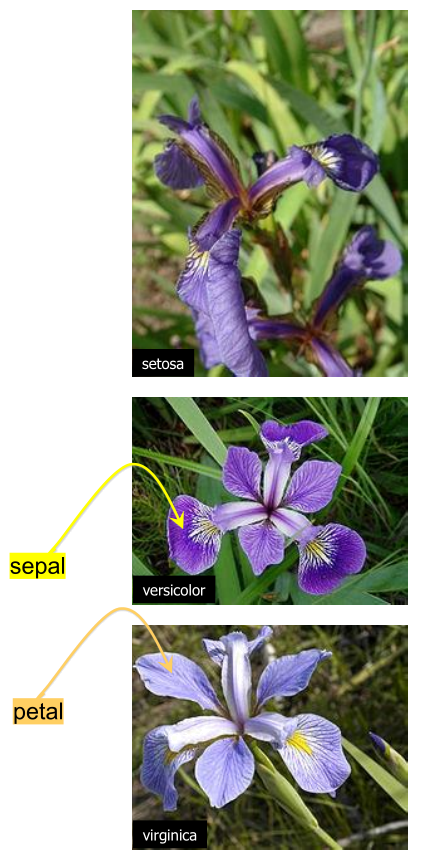
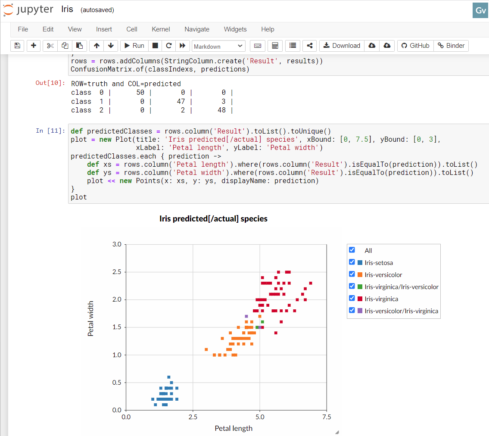
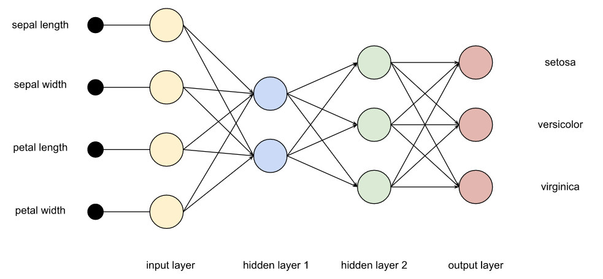
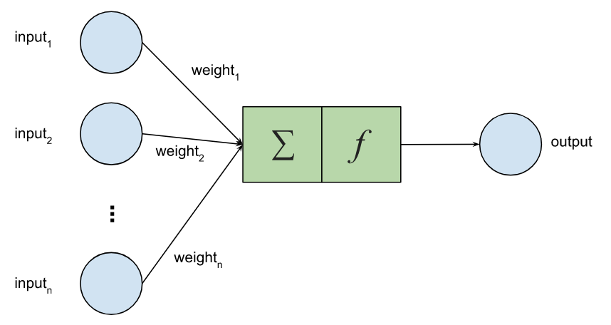

= Classifying Iris Flowers with Deep Learning, Groovy and GraalVM
Paul King
:revdate: 2022-06-25T10:52:59+00:00
:updated: 2022-06-27T11:16:59+00:00
:keywords: groovy, machine learning, artificial intelligence, neural networks, tribuo, deep netts, encog, eclipse deeplearning4j, data science, deep learning, graalvm, native
:description: This post looks at classifying Iris flowers using traditional and neural net based approaches \
using Eclipse DeepLearning4j, Encog, Deep Netts and GraalVM.

A classic data science https://en.wikipedia.org/wiki/Iris_flower_data_set[dataset] captures flower characteristics of Iris flowers.
It captures the _width_ and _length_ of the _sepals_ and _petals_ for three _species_ (https://en.wikipedia.org/wiki/Iris_setosa[Setosa], https://en.wikipedia.org/wiki/Iris_versicolor[Versicolor], and https://en.wikipedia.org/wiki/Iris_virginica[Virginica]).

The https://github.com/paulk-asert/groovy-data-science/tree/master/subprojects/Iris[Iris project] in the https://github.com/paulk-asert/groovy-data-science[groovy-data-science repo] is dedicated to this example.
It includes a number of Groovy scripts and a Jupyter/BeakerX notebook highlighting this example
comparing and contrasting various libraries and various classification algorithms.

[cols="2,7"]
|===
| |Technologies/libraries covered

|_Data manipulation_ |https://www.cs.waikato.ac.nz/ml/weka/[Weka] https://tablesaw.tech/[Tablesaw] https://github.com/jeffheaton/encog-java-core[Encog] https://github.com/EdwardRaff/JSAT[JSAT] https://github.com/deeplearning4j/DataVec[Datavec] https://tribuo.org/[Tribuo]

|_Classification_ |https://www.cs.waikato.ac.nz/ml/weka/[Weka] http://haifengl.github.io/[Smile] https://github.com/jeffheaton/encog-java-core[Encog] https://tribuo.org/[Tribuo] https://github.com/EdwardRaff/JSAT[JSAT] https://deeplearning4j.org/[Deep Learning4J] https://www.deepnetts.com/blog/deep-netts-community-edition[Deep Netts]

|_Visualization_ |https://knowm.org/open-source/xchart/[XChart] https://jtablesaw.github.io/tablesaw/userguide/Introduction_to_Plotting.html[Tablesaw Plot.ly] https://openjfx.io/[JavaFX]

|_Main aspects/algorithms covered_ |Reading csv, dataframes, visualization, exploration, https://en.wikipedia.org/wiki/Naive_Bayes_classifier[naive bayes], https://en.wikipedia.org/wiki/Logistic_regression[logistic regression], https://en.wikipedia.org/wiki/K-nearest_neighbors_algorithm#k-NN_regression[knn regression], https://en.wikipedia.org/wiki/Multinomial_logistic_regression[softmax regression], https://en.wikipedia.org/wiki/Decision_tree_learning[decision trees], https://en.wikipedia.org/wiki/Support-vector_machine[support vector machine]
|_Other aspects/algorithms covered_ |https://en.wikipedia.org/wiki/Artificial_neural_network[neural networks], https://en.wikipedia.org/wiki/Multilayer_perceptron[multilayer perceptron], https://en.wikipedia.org/wiki/Principal_component_analysis[PCA]
|===

Feel free to browse these other examples and the Jupyter/BeakerX notebook if you are interested in any of these additional techniques.

For this blog, let's just look at the Deep Learning examples. We'll look at solutions using Encog, Eclipse DeepLearning4J and Deep Netts (with standard Java and as a native image using GraalVM) but first a brief introduction.

== Deep Learning

Deep learning falls under the branches of https://en.wikipedia.org/wiki/Machine_learning[machine learning] and https://en.wikipedia.org/wiki/Artificial_intelligence[artificial intelligence]. It involves multiple layers (hence the "deep") of an https://en.wikipedia.org/wiki/Artificial_neural_network[artificial neural network].
There are lots of ways to configure such networks and the details are beyond the scope of this blog post,
but we can give some basic details. We will have four input nodes corresponding to the measurements of our four characteristics.
We will have three output nodes corresponding to each possible _class_ (_species_). We will also have one or more additional layers in between.

Each node in this network mimics to some degree a neuron in the human brain. Again, we'll simplify the details.
Each node has multiple inputs, which are given a particular weight, as well as an activation function which will
determine whether our node "fires". Training the model is a process which works out what the best weights should be.

The math involved for converting inputs to output for any node isn't too hard. We could write it ourselves (as shown https://github.com/paulk-asert/groovy-data-science/blob/master/subprojects/Mnist/src/main/groovy/MnistTrainer.groovy[here] using matrices
and https://commons.apache.org/proper/commons-math/[Apache Commons Math] for a digit recognition example) but luckily we don't have to.
The libraries we are going to use do much of the work for us. They typically provide a fluent API which lets us specify,
in a somewhat declarative way, the layers in our network.

Just before exploring our examples, we should pre-warn folks that while we do time running the examples, no attempt was made to rigorously ensure that the examples were identical across the different technologies. The different technologies support slightly different ways to set up their respective network layers. The parameters were tweaked so that when run there was typically at most one or two errors in the validation. Also, the initial parameters for the runs can be set with random or pre-defined seeds. When random ones are used, each run will have slightly different errors. We'd need to do some additional alignment of examples and use a framework like https://github.com/openjdk/jmh[JMH] if we wanted to get a more rigorous time comparison between the technologies. Nevertheless, it should give a very rough guide as to the speed to the various technologies.

== Encog

https://www.heatonresearch.com/encog/[Encog] is a pure Java machine learning framework that was created in 2008.
There is also a C# port for .Net users. Encog is a simple framework that supports a number of advanced algorithms
not found elsewhere but isn't as widely used as other more recent frameworks.

The complete source code for our Iris classification example using Encog is
https://github.com/paulk-asert/groovy-data-science/blob/master/subprojects/Iris/src/main/groovy/NNFF_Encog.groovy[here],
but the critical piece is:

[source,groovy]
----
def model = new EncogModel(data).tap {
    selectMethod(data, TYPE_FEEDFORWARD)
    report = new ConsoleStatusReportable()
    data.normalize()
    holdBackValidation(0.3, true, 1001) // test with 30%
    selectTrainingType(data)
}

def bestMethod = model.crossvalidate(5, true) // 5-fold cross-validation

println "Training error: " + pretty(calculateRegressionError(bestMethod, model.trainingDataset))
println "Validation error: " + pretty(calculateRegressionError(bestMethod, model.validationDataset))
----

When we run the example, we see:

[subs="quotes"]
----
[lime]#paulk@pop-os#:[blue]##/extra/projects/iris_encog##$ time groovy -cp "build/lib/*" IrisEncog.groovy
1/5 : Fold #1
1/5 : Fold #1/5: Iteration #1, Training Error: 1.43550735, Validation Error: 0.73302237
1/5 : Fold #1/5: Iteration #2, Training Error: 0.78845427, Validation Error: 0.73302237
...
5/5 : Fold #5/5: Iteration #163, Training Error: 0.00086231, Validation Error: 0.00427126
5/5 : Cross-validated score:0.10345818553910753
Training error:  0.0009
Validation error:  0.0991
Prediction errors:
predicted: Iris-virginica, actual: Iris-versicolor, normalized input: -0.0556, -0.4167,  0.3898,  0.2500
Confusion matrix:            Iris-setosa     Iris-versicolor      Iris-virginica
         Iris-setosa                  19                   0                   0
     Iris-versicolor                   0                  15                   1
      Iris-virginica                   0                   0                  10

real	0m3.073s
user	0m9.973s
sys	0m0.367s

----

We won't explain all the stats, but it basically says we have a pretty good model with low errors in prediction.
If you see the green and purple points in the notebook image earlier in this blog, you'll see there are some points
which are going to be hard to predict correctly all the time. The confusion matrix shows that the model predicted
one flower incorrectly on the validation dataset.

One very nice aspect of this library is that it is a single jar dependency!

== Eclipse DeepLearning4j

https://deeplearning4j.konduit.ai/[Eclipse DeepLearning4j] is a suite of tools for running deep learning on the JVM.
It has support for scaling up to https://spark.apache.org/[Apache Spark] as well as some integration with python at a number of levels.
It also provides integration to GPUs and C/++ libraries for native integration.

The complete source code for our Iris classification example using DeepLearning4J is
https://github.com/paulk-asert/groovy-data-science/blob/master/subprojects/Iris/src/main/groovy/NNFF_Dl4j.groovy[here],
with the main part shown below:

[source,groovy]
----
MultiLayerConfiguration conf = new NeuralNetConfiguration.Builder()
    .seed(seed)
    .activation(Activation.TANH) // global activation
    .weightInit(WeightInit.XAVIER)
    .updater(new Sgd(0.1))
    .l2(1e-4)
    .list()
    .layer(new DenseLayer.Builder().nIn(numInputs).nOut(3).build())
    .layer(new DenseLayer.Builder().nIn(3).nOut(3).build())
    .layer(new OutputLayer.Builder(LossFunctions.LossFunction.NEGATIVELOGLIKELIHOOD)
        .activation(Activation.SOFTMAX) // override activation with softmax for this layer
        .nIn(3).nOut(numOutputs).build())
    .build()

def model = new MultiLayerNetwork(conf)
model.init()

model.listeners = new ScoreIterationListener(100)

1000.times { model.fit(train) }

def eval = new Evaluation(3)
def output = model.output(test.features)
eval.eval(test.labels, output)
println eval.stats()
----

When we run this example, we see:

[subs="quotes"]
----
[lime]#paulk@pop-os#:[blue]##/extra/projects/iris_encog##$ time groovy -cp "build/lib/*" IrisDl4j.groovy
[main] INFO org.nd4j.linalg.factory.Nd4jBackend - Loaded [CpuBackend] backend
[main] INFO org.nd4j.nativeblas.NativeOpsHolder - Number of threads used for linear algebra: 4
[main] INFO org.nd4j.nativeblas.Nd4jBlas - Number of threads used for OpenMP BLAS: 4
[main] INFO org.nd4j.linalg.api.ops.executioner.DefaultOpExecutioner - Backend used: [CPU]; OS: [Linux]
...
[main] INFO org.deeplearning4j.optimize.listeners.ScoreIterationListener - Score at iteration 0 is 0.9707752535968273
[main] INFO org.deeplearning4j.optimize.listeners.ScoreIterationListener - Score at iteration 100 is 0.3494968712782093
...
[main] INFO org.deeplearning4j.optimize.listeners.ScoreIterationListener - Score at iteration 900 is 0.03135504326480282

========================Evaluation Metrics========================
 # of classes:    3
 Accuracy:        0.9778
 Precision:       0.9778
 Recall:          0.9744
 F1 Score:        0.9752
Precision, recall & F1: macro-averaged (equally weighted avg. of 3 classes)

=========================Confusion Matrix=========================
  0  1  2
----------
 18  0  0 | 0 = 0
  0 14  0 | 1 = 1
  0  1 12 | 2 = 2

Confusion matrix format: Actual (rowClass) predicted as (columnClass) N times
==================================================================

real	0m5.856s
user	0m25.638s
sys	0m1.752s
----

Again the stats tell us that the model is good. One error in the confusion matrix for our testing dataset.
DeepLearning4J does have an impressive range of technologies that can be used to enhance performance in certain scenarios.
For this example, I enabled AVX (Advanced Vector Extensions) support but didn't try using the CUDA/GPU support nor
make use of any Apache Spark integration. The GPU option might have sped up the application but given the size of the
dataset and the amount of calculations needed to train our network, it probably wouldn't have sped up much.
For this little example, the overheads of putting the plumbing in place to access native C++ implementations and so forth,
outweighed the gains. Those features generally would come into their own for much larger datasets or
massive amounts of calculations; tasks like intensive video processing spring to mind.

The downside of the impressive scaling options is the added complexity. The code was slightly more complex than the other technologies we look at in this blog based around certain assumptions in the API which would be needed if we wanted to make use of Spark integration even though we didn't here. The good news is that once the work is done, if we did want to use Spark, that would now be relatively straight forward.

The other increase in complexity is the number of jar files needed in the classpath. I went with the easy option of using the `nd4j-native-platform` dependency plus added the `org.nd4j:nd4j-native:1.0.0-M2:linux-x86_64-avx2` dependency for AVX support. This made my life easy but brought in over 170 jars including many for unneeded platforms. Having all those jars is great if users of other platforms want to also try the example, but it can be a little troublesome with certain tooling that breaks with long command lines on certain platforms. I could certainly do some more work to shrink those dependency lists if it became a real problem.

(For the interested reader, the groovy-data-science repo has other DeepLearning4J examples. The https://www.cs.waikato.ac.nz/ml/weka/[Weka]
library can wrap DeepLearning4J as shown for this Iris example https://github.com/paulk-asert/groovy-data-science/blob/master/subprojects/Iris/src/main/groovy/MLP_Weka.groovy[here]. There are also two variants of the digit recognition example we alluded to earlier using https://github.com/paulk-asert/groovy-data-science/blob/master/subprojects/Mnist/src/main/groovy/OneLayerMLP.groovy[one] and https://github.com/paulk-asert/groovy-data-science/blob/master/subprojects/Mnist/src/main/groovy/TwoLayerMLP.groovy[two] layer neural networks.)

== Deep Netts

https://www.deepnetts.com/[Deep Netts] is a company offering a range of products and services related to deep learning.
Here we are using the free open-source https://www.deepnetts.com/blog/deep-netts-community-edition[Deep Netts community edition]
pure java deep learning library. It provides support for the Java Visual Recognition API
(https://jcp.org/en/jsr/detail?id=381[JSR381]). The expert group from JSR381 released their final spec earlier this year, so hopefully we'll see more compliant implementations soon.

The complete source code for our Iris classification example using Deep Netts is
https://github.com/paulk-asert/groovy-data-science/blob/master/subprojects/Iris/src/main/groovy/NNFF_DeepNetts.groovy[here]
and the important part is below:

[source,groovy]
----
var splits = dataSet.split(0.7d, 0.3d)  // 70/30% split
var train = splits[0]
var test = splits[1]

var neuralNet = FeedForwardNetwork.builder()
    .addInputLayer(numInputs)
    .addFullyConnectedLayer(5, ActivationType.TANH)
    .addOutputLayer(numOutputs, ActivationType.SOFTMAX)
    .lossFunction(LossType.CROSS_ENTROPY)
    .randomSeed(456)
    .build()

neuralNet.trainer.with {
    maxError = 0.04f
    learningRate = 0.01f
    momentum = 0.9f
    optimizer = OptimizerType.MOMENTUM
}

neuralNet.train(train)

new ClassifierEvaluator().with {
    println "CLASSIFIER EVALUATION METRICS\n${evaluate(neuralNet, test)}"
    println "CONFUSION MATRIX\n$confusionMatrix"
}
----

When we run this command we see:

[subs="quotes"]
----
[lime]#paulk@pop-os#:[blue]##/extra/projects/iris_encog##$ time groovy -cp "build/lib/*" Iris.groovy
16:49:27.089 [main] INFO deepnetts.core.DeepNetts - ------------------------------------------------------------------------
16:49:27.091 [main] INFO deepnetts.core.DeepNetts - TRAINING NEURAL NETWORK
16:49:27.091 [main] INFO deepnetts.core.DeepNetts - ------------------------------------------------------------------------
16:49:27.100 [main] INFO deepnetts.core.DeepNetts - Epoch:1, Time:6ms, TrainError:0.8584314, TrainErrorChange:0.8584314, TrainAccuracy: 0.5252525
16:49:27.103 [main] INFO deepnetts.core.DeepNetts - Epoch:2, Time:3ms, TrainError:0.52278274, TrainErrorChange:-0.33564866, TrainAccuracy: 0.52820516
...
16:49:27.911 [main] INFO deepnetts.core.DeepNetts - Epoch:3031, Time:0ms, TrainError:0.029988592, TrainErrorChange:-0.015680967, TrainAccuracy: 1.0
TRAINING COMPLETED
16:49:27.911 [main] INFO deepnetts.core.DeepNetts - Total Training Time: 820ms
16:49:27.911 [main] INFO deepnetts.core.DeepNetts - ------------------------------------------------------------------------
CLASSIFIER EVALUATION METRICS
Accuracy: 0.95681506 (How often is classifier correct in total)
Precision: 0.974359 (How often is classifier correct when it gives positive prediction)
F1Score: 0.974359 (Harmonic average (balance) of precision and recall)
Recall: 0.974359 (When it is actually positive class, how often does it give positive prediction)

CONFUSION MATRIX
                          none    Iris-setosaIris-versicolor Iris-virginica
           none              0              0              0              0
    Iris-setosa              0             14              0              0
Iris-versicolor              0              0             18              1
 Iris-virginica              0              0              0             12

real	0m3.160s
user	0m10.156s
sys	0m0.483s
----

This is faster than DeepLearning4j and similar to Encog. This is to be expected given our small data set and isn't indicative of performance for larger problems.

Another plus is the dependency list. It isn't quite the single jar situation as we saw with Encog but not far off.
There is the Encog jar, the JSR381 VisRec API which is in a separate jar, and a handful of logging jars.

== Deep Netts with GraalVM

Another technology we might want to consider if performance is important to us is https://www.graalvm.org/[GraalVM]. GraalVM is a high-performance JDK distribution designed to speed up the execution of applications written in Java and other JVM languages. We'll look at creating a native version of our Iris Deep Netts application. We used GraalVM 22.1.0 Java 17 CE and Groovy 4.0.3. We'll cover just the basic steps but there are other places for additional setup info and troubleshooting help like https://e.printstacktrace.blog/graalvm-and-groovy-how-to-start/[here], https://github.com/wololock/gttp[here] and https://simply-how.com/fix-graalvm-native-image-compilation-issues[here].

Groovy has two natures. It's dynamic nature supports adding methods at runtime through metaprogramming
and interacting with method dispatch processing through missing method interception and other tricks.
Some of these tricks make heavy use of reflection and dynamic class loading and cause problems for
GraalVM which is trying to determine as much information as it can at compile time. Groovy's static
nature has a more limited set of metaprogramming capabilities but allows bytecode much closer to
Java to be produced. Luckily, we aren't relying on any dynamic Groovy tricks for our example.
We'll compile it up using static mode:

[subs="quotes"]
----
[lime]#paulk@pop-os#:[blue]##/extra/projects/iris_encog##$ groovyc -cp "build/lib/*" --compile-static Iris.groovy
----

Next we build our native application:

[subs="quotes"]
----
[lime]#paulk@pop-os#:[blue]##/extra/projects/iris_encog##$ native-image  --report-unsupported-elements-at-runtime \
   --initialize-at-run-time=groovy.grape.GrapeIvy,deepnetts.net.weights.RandomWeights \
   --initialize-at-build-time --no-fallback  -H:ConfigurationFileDirectories=conf/  -cp ".:build/lib/*" Iris
----

We told GraalVM to initialize `GrapeIvy` at runtime (to avoid needing Ivy jars in the classpath
since Groovy will lazily load those classes only if we use `@Grab` statements).
We also did the same for the `RandomWeights` class to avoid it being locked into a random seed fixed at compile time.

Now we are ready to run our application:

[subs="quotes"]
----
[lime]#paulk@pop-os#:[blue]##/extra/projects/iris_encog##$ time ./iris
...
CLASSIFIER EVALUATION METRICS
Accuracy: 0.93460923 (How often is classifier correct in total)
Precision: 0.96491224 (How often is classifier correct when it gives positive prediction)
F1Score: 0.96491224 (Harmonic average (balance) of precision and recall)
Recall: 0.96491224 (When it is actually positive class, how often does it give positive prediction)

CONFUSION MATRIX
                          none    Iris-setosaIris-versicolor Iris-virginica
           none              0              0              0              0
    Iris-setosa              0             21              0              0
Iris-versicolor              0              0             20              2
 Iris-virginica              0              0              0             17

real    0m0.131s
user    0m0.096s
sys     0m0.029s
----

We can see here that the speed has dramatically increased. This is great,
but we should note, that using GraalVM often involves some tricky
investigation especially for Groovy which by default has its dynamic
nature. There are a few features of Groovy which won't be available
when using Groovy's static nature and some libraries might be
problematical. As an example, Deep Netts has log4j2 as one of its
dependencies. At the time of writing, there are still issues using
log4j2 with GraalVM. We excluded the `log4j-core` dependency and used
`log4j-to-slf4j` backed by `logback-classic` to sidestep this problem.

== Conclusion

We have seen a few different libraries for performing deep learning classification
using Groovy. Each has its own strengths and weaknesses.
There are certainly options to cater for folks wanting blinding fast startup speeds
through to options which scale to massive computing farms in the cloud.

.Update history
****
*27/Sep/2022*: I put the Deep Netts GraalVM _iris_ application with some more detailed instructions into its own https://github.com/paulk-asert/groovy-data-science/tree/master/subprojects/IrisGraalVM[subproject].
****
