= Community Over Code (North America) 2023
Paul King
:revdate: 2023-10-26T17:00:00+00:00
:description: This post looks at the ASF Community Over Code conference in Halifax, Nova Scotia, October 7-10 2023, with a particular focus on the Groovy Track.
:keywords: groovy, asf, apachecon, communityovercode

This year's North American edition of the ASF conference, https://communityovercode.org/[Community Over Code],
featured four in-person days of sessions (October 7-10) at the Halifax Convention Centre.

NOTE: The presentation slides and audio/video (where available) are still being added onto the conference site.
If additional material becomes available, this post will be updated with links to the additional content.

This post gives an update on the conference. It is mostly a focus on the Groovy track,
but there is also material about other tracks and the many other aspects of the conference.
In particular, hopefully, this post gives you some insight into why going to conferences,
and the ASF conferences in particular, can be a rewarding experience. I hope to see you at
a future conference.

== Upon arrival

Before getting into the conference report proper, just a pro-tip for anyone travelling
to conferences from more than a few time-zones away. If you base your knowledge just on viewing
social media, regular speaking at conferences may look like a glamorous life, but without a little
bit of planning, you may see little more than the inside of planes, hotels, and conference rooms.
It pays to allocate some time to seeing the host city/country. If you also get some sun on the
first day you arrive (or first full day after you arrive if arriving at night), it seems to help
with getting over jet lag.
In my case, I took the opportunity to do a bicycle ride East of Halifax mostly along some
cyclist-friendly bike trails.

The route was 90% on trails built upon now disused railroad tracks
which form part of the https://tctrail.ca/[Trans Canada Trail].
It is further broken down into smaller sections including
the https://www.alltrails.com/trail/canada/nova-scotia/shearwater-flyer-trail[Shearwater Flyer Trail],
the https://www.alltrails.com/trail/canada/nova-scotia/salt-marsh-trail[Salt Marsh Trail],
the https://www.alltrails.com/trail/canada/nova-scotia/atlantic-view-trail[Atlantic View Trail],
and the https://www.alltrails.com/trail/canada/nova-scotia/dartmouth-waterfront-trail[Dartmouth Waterfront Trail].
The place I hired the bike from recommended riding to https://parks.novascotia.ca/park/lawrencetown-beach[Lawrencetown Beach], but I went just a little further for good measure.
The views were spectacular. I particularly like some of the autumn color scenery which is seldom seen
where I live.

image:img/HalifaxRideCollage.jpg[]

== The Groovy Track

image:https://photos.apachecon.com/_data/i/upload/2023/10/20/20231020033313-d56c0136-me.jpg[stickers,200,float="right"]

The Groovy track was spread over the first two days of the conference and had ten sessions
as well as a _birds-of-a-feather_ session after the first day.
The sessions typically had mini-themes: Groovy update, for Java developers, Kubernetes and Groovy,
Groovy and Data Science (this year featuring Apache Ignite) and so on.
Here we'll just look at a few highlights of each talk. You are encouraged to peruse
the slides and other content if you want more details.

=== Groovy update

The first two talks covered the state of the Groovy project with also some updates
from the broader Groovy ecosystem.

image:https://photos.apachecon.com/_data/i/upload/2023/10/12/20231012195704-e8e8482f-me.jpg[Paul King,150,float="right"]
The first talk was https://speakerdeck.com/paulk/groovy-roadmap[Groovy and Groovy Ecosystem Update].
This talked about the status of the Groovy project itself as well as some important projects
within the broader Groovy ecosystem.

Some highlights:

* Groovy downloads recently surpassed the 3 billion mark in total and is currently tracking just over
3 million downloads per day on average.
* Groovy already supports classes and scripts but with JEP 445 scripting on the way in Java (preview in JDK21),
Groovy 5 supports additional forms so that JEP 445 code examples will run straight in Groovy (for JDK11+).
+
[source,groovy]
----
def main() {
    println 'Hello world!'
}
----
There are variations that remain strictly JEP 445 compatible (to gain the same bytecode simplifications)
and variations which retain Groovy's extra features like access to the script binding and context.
The `run` method is used instead of the `main` method to gain the traditional Groovy script features.
An added bonus is that Groovy's `@Field` annotation isn't needed to designate fields within JEP 445-like scripts.
Here is another example, this one using Jackson data binding to serialize itself as a JSON file:
+
[source,groovy]
----
@JsonIgnoreProperties(["binding"])
def run() {
    var mapper = new ObjectMapper()
    assert mapper.writeValueAsString(this) == '{"pets":["cat","dog"]}'
}

public pets = ['cat', 'dog']
----
* Groovy added support for "underscore as a placeholder" functionality. This is similar to JEP 443 (preview in JDK21) but Groovy also adds the feature for Closures and multi-assignment expressions.
+
[source,groovy]
----
var (_, y, m, _, _, d) = Calendar.instance
println "Today is $y-${m+1}-$d" // Today is 2023-8-23
----
* An additional `@OperatorRename` AST transform is now available which makes it easier to use
a multitude of libraries with Groovy's operator overloading. This is handy when working with
libraries that might manipulate complex numbers, matrices, or fractions (as per the example below
which uses the Apache Commons Numbers Fraction library).
Previously, you may have forgone using the operator overloading shortcuts,
or you (or someone else) would have possibly written some Groovy specific
extension methods to provide the nicer operator overloading syntactic sugar for a particular library
of interest. Now, such libraries can now easily be used straight out-of-the-box
with the operator overloading feature.
+
[source,groovy]
----
@OperatorRename(plus='add')
def testAddOfTwoFractions() {
    var half = Fraction.of(1, 2)
    var third = Fraction.of(1, 3)
    assert half.add(third) == Fraction.of(5, 6)  // old style still works
    assert half + third == Fraction.of(5, 6)     // fraction '+' operator!
}
----
* Grails 6 was recently released with support for recent versions of Groovy 3.
* Micronaut 4 was recently released with support for recent versions of Groovy 4.
* Geb 7 and several versions of the Spock testing framework also support Groovy 4.
* The latest version of the Deep Netts deep learning library works well when using
Groovy 5 with GraalVM.
* The latest version of Apache Ignite works well with Groovy 5 when scaling up
your distributed data, distributed compute, and distributed data science applications.

The second talk was https://speakerdeck.com/paulk/groovy-today[Why use Groovy in 2023]?
This discussed the features that make Groovy a compelling language choice even given the
wonderful progress being made in other languages within the JDK ecosystem.

Some highlights:

* Groovy is compelling if you need its dynamic features like runtime metaprogramming,
lifecycle hooks, and dynamic builders.
* Groovy also offers features like ranges, default parameters, named arguments,
command chains, operator overloading, extensible tooling including an
extensible type checker.
* As well as its own native features, Groovy 5 provides about 2000 extension
methods for around 150 Java classes.
* Traits provide similar functionality to default methods in interfaces but rather
than just tackling the problem of API evolution, traits are a more ambitious and
powerful OO feature. Groovy offers stateful traits, more powerful method selection
options, offers trait application at runtime (dynamic traits) and supports the
stackable traits pattern like Scala.
* Groovy's Closure abstraction offers several powerful mechanisms over and above
what lambdas offer including memoization and tail call recursion handling.
You can write factorial in a more natural recursive form (avoiding an explicitly
imperative algorithm) and not suffer from stack overflow issues.
You can write recursive fibonacci algorithms that take milliseconds
to execute rather than the trillions of years a naïve recursive algorithm would take.
* AST transforms (based around annotations) and
macro methods (which are similar but look like methods calls)
allow a declarative style of programming where a few lines of code
can be replaced with hundreds or thousands of lines of equivalent code.
The generated code follows best practice and is much less error-prone.
Groovy 5 has 80+ AST transforms.
* Language integrated queries allow a SQL-like style for querying data.
+
[source,groovy]
----
GQ {
    from fruit in ['Apple', 'Apricot', 'Banana', 'Cantaloupe']
    groupby fruit[0] as firstChar
    select firstChar, list(fruit.toUpperCase()) as fruit_list
}
----
which yields:
+
----
+-----------+------------------+
| firstChar | fruit_list       |
+-----------+------------------+
| A         | [APPLE, APRICOT] |
| B         | [BANANA]         |
| C         | [CANTALOUPE]     |
+-----------+------------------+
----
* While we like, many of the exciting changes for switch expressions coming along with
recent Java versions, Groovy still provides numerous additional options (for JDK8+):
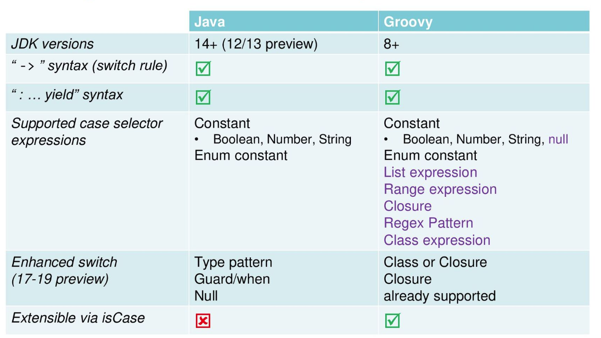
* Groovy gives you the choice of emulated records for JDK8+
or native records for JDK16+ with many record enhancements:
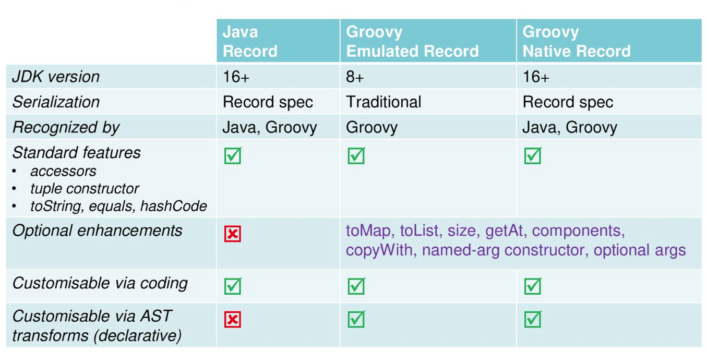
Over and above the built-in enhancements, record development is made
easier by Groovy's AST transforms. The slides have examples of combining
records with the following AST transforms:
`@PropertyOptions`, `@ToString`, `@Memoized`, `@Builder`,
`@Requires`, `@Sortable`, `@Newify`, and `@OperatorRename`.
But of course, you aren't limited to just that list.

=== Groovy for Java developers

The next two talks were aimed at Java developers who wanted to understand how
they could use Groovy for their development or testing needs.

image:https://photos.apachecon.com/_data/i/upload/2023/10/12/20231012200013-649bb746-me.jpg[Jeff Scott Brown,200,float="right"]

The next talk was by https://www.linkedin.com/in/jeffscottbrown/[Jeff Scott Brown] on
_Groovy for Java Developers_. Jeff covered a range of topics including:

* Groovy optional typing
* Groovy properties
* Groovy script syntax
* Evolving Java source to Groovy
* Special features of Groovy
* Groovy extension methods for Groovy and Java classes

The next talk was
https://speakerdeck.com/paulk/property-based-testing[Testing your Java with Groovy, Spock, JUnit5, Jacoco, Jqwik and Pitest].
This talk covered a common scenario of using Groovy tests with Java production code, though most of the content
is applicable for production code in other JVM languages (including Groovy!) too.
It also showed examples of a few advanced tools you might want to consider as part of your testing toolkit.

The central example for the talk was based around what initially appears to be a very
simple mathematical calculation originally implemented using the following Java code:

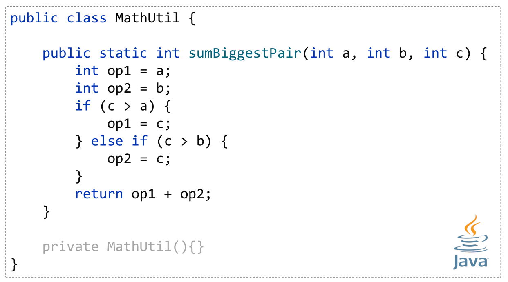

We write a Groovy test using the https://spockframework.org/[Spock] testing framework which
at first glance seems to indicate our initial implementation is correct since all the tests
pass and we have 100% test coverage.

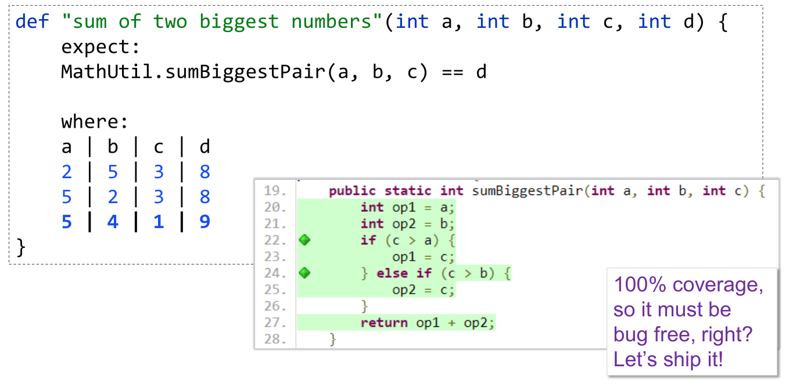

But this is 100% line and branch coverage but doesn't reflect 100% state coverage.
We can illustrate this by adding one more test case, which now fails:

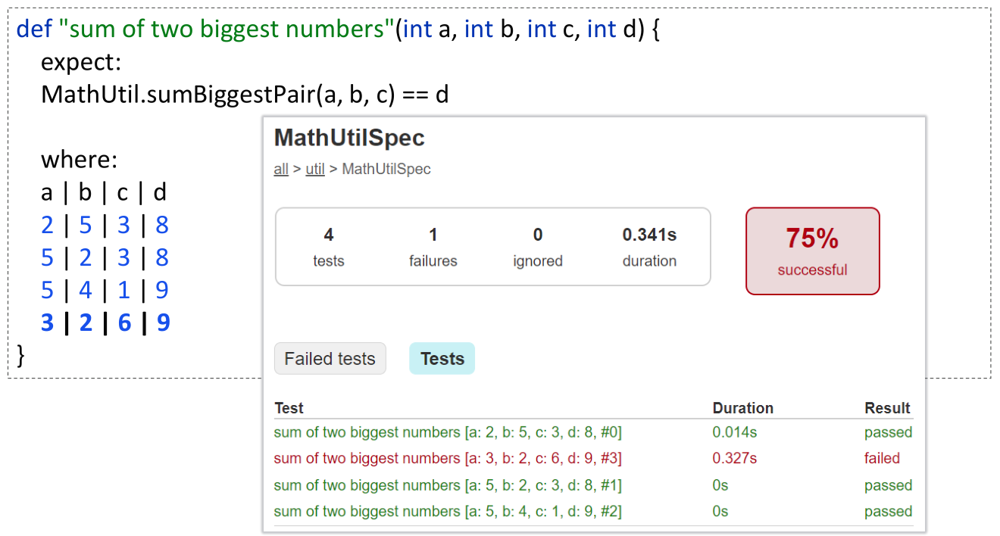

It turns out there was one edge case the initial implementation didn't cater
for but it is simple enough to fix:

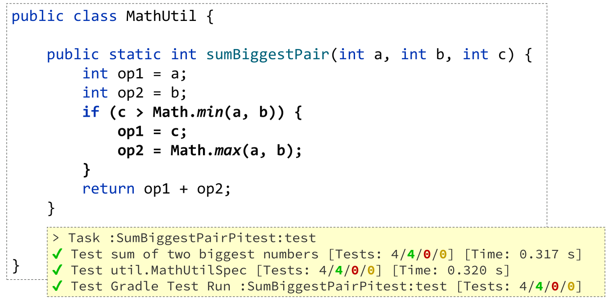

We now have all test cases passing and still 100% coverage.

The moral of the story is that 100% line and branch coverage isn't sufficient
to ensure a correct implementation. You should try to add test cases until
you think the problem domain is fully tested. The rest of the talk looked
at two advanced tools which could assist you in finding test case deficiencies.

The https://pitest.org/[Pitest tool] is a mutation testing tool.
Understanding how it works and how it can help is a little mind-bending at first.
Pitest mutates your production code and then re-runs your test suite.
If the test suite still passes, i.e. the mutant survives, it represents a possible code smell.

Often it means that your test suite isn't complete enough to kill the mutant,
and you should add some more test cases.
But mutation testing is not an exact science, if a mutant survives,
it could mean there is a missing test case,
it could mean there is a flaw in the existing test cases,
it could mean there is a bug in the implementation code,
or it could be a false positive.

Running the tool on the faulty implementation when we had 3 test cases,
indeed reveals some surviving mutations and analysis indicates that indeed the mutations
correspond to the faulty edge case:

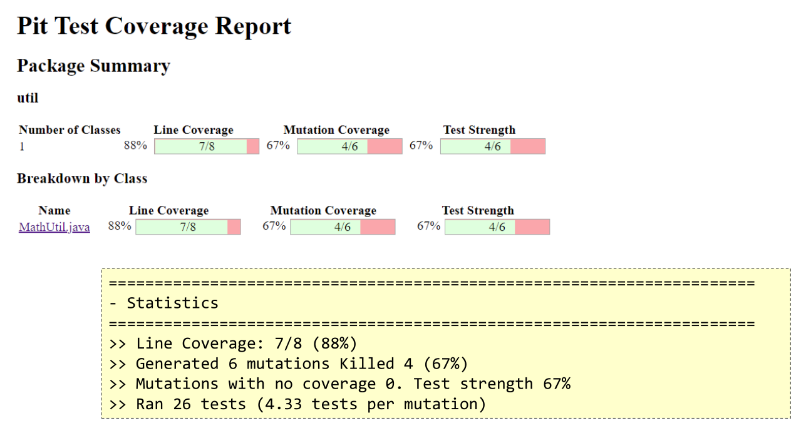

This should direct us to add the additional test case like we did manually earlier
and this would hopefully have forced us to discover the bug.

Running the tool on the fixed implementation showed an improvement
but still indicated a possible code smell. That finding reflects that
for our fixed implementation, that `c > Math.min(a, b)` and `c >= Math.min(a, b)`
are equivalent, even though in the general case it might mean
an edge case wasn't being tested. So mutation testing can certainly be
useful but often requires human analysis to rule out any false positives.

The other tool examined was https://jqwik.net/[Jqwik], a property-based testing tool.
Such tools check that certain properties hold when exercising the implementation
under test with random data. Indeed, such testing also reveals the flaw in the
original code, with no flaw found in the fixed code.

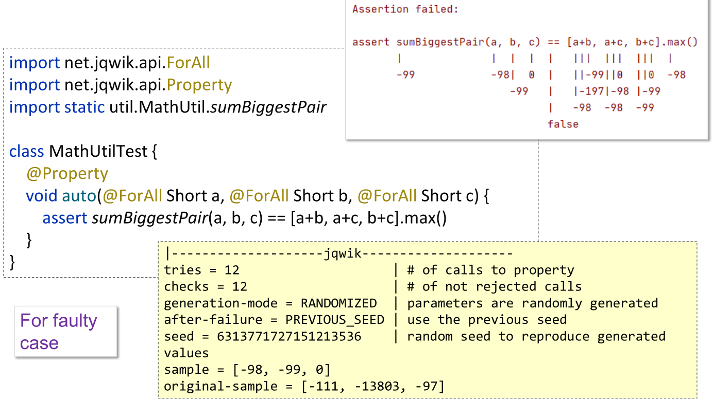

=== Kubernetes and Groovy

The next mini-theme in the Groovy track was Kubernetes and Groovy.
image:https://photos.apachecon.com/_data/i/upload/2023/10/12/20231012200925-e882ed51-me.jpg[Jorge Aguilera,200,float="right"]

The first talk was by https://jvm.social/@jorge[Jorge Aguilera]: _It works on my cluster. Deploying a groovy kubernetes application to Okteto._
https://communityovercode.files.wordpress.com/2023/10/sat_groovy_it_works_on_my_cluster-jorge.pdf[Slides]

In this talk, Jorge showed a
https://groovy-lang.org/[Groovy]
https://micronaut.io/[Micronaut]
https://kubernetes.io/[Kubernetes] (k8s) application deployed in the cloud.
It was deployed to the Okteto platform, so that in fact most of the k8s details were taken
care of by the platform.

The sample application was a simple solution to the
https://en.wikipedia.org/wiki/Collatz_conjecture[Collatz conjecture].
I remember studying this back in my Uni days but had forgotten the details.
Basically, given a starting number, one of two calculations is performed,
depending on whether the current number is even.
Odd numbers are multiplied by 3 and then 1 is added, even numbers are divided by 2.
This is stopped if the result becomes the number 1, but otherwise continues.
The conjecture is that eventually, the calculation terminates, i.e. it always eventually equals 1.

Of interest is the number of cycles needed to get to 1.
Here is an algorithm that returns the number of cycles:

[source,groovy]
----
class Collatz {
  static long getAt(BigInteger n) {
    var result = n
    var count = 0L
    while (result != 1G) {
      if (result % 2G == 0G) {
        result /= 2G
      } else {
        result *= 3G
        result++
      }
      count++
    }
    count
  }
}
----

We used a static `getAt` method to give us a neat shorthand for getting the result.
We can test out some of the example sequences mentioned in the https://en.wikipedia.org/wiki/Collatz_conjecture[Wikipedia page]:

[source,groovy]
----
assert Collatz[12] == 9
assert Collatz[19] == 20
assert Collatz[27] == 111
----

Now, to create our microservice based around this algorithm.
We can create a fully working (but skeleton) project for Micronaut in a number
of ways. Here, is what is needed from the command-line:

[source]
----
mn create-app \
    --features kubernetes \
    --features postgres \
    --features jdbc-data \
    --lang groovy collatz
----

We've shown some example features you might want to use.
You could add further features depending on your application's needs.

We can change the skeleton controller to have our desired functionality:

[source,groovy]
----
@Controller
  ...
  @Get('{n}')
  Map index(BigInteger n) {
    [n: n, count: Collatz[n]]
  }
...
----

Jorge then went on to explain the k8s configuration details and gave a demonstration
deploying the application.

Jorge also presented the next talk: https://communityovercode.files.wordpress.com/2023/10/sat_groovy_let_groovy_operate_your_cluster-jorge.pdf[Let Groovy operate your k8s cluster].
This dived into more k8s details. He showed how to write a swagger-operator in Groovy
which removed the need for tedious manual steps when deploying k8s applications.
The operator monitors our services, rewrites the configmap if needed and restarts the pod.

The operator itself was written in https://micronaut.io/[Micronaut]:

[source,groovy]
----
@Operator(
    informer = @Informer(
        apiType = V1Swagger,
        apiListType = V1SwaggerList,
        apiGroup = V1SwaggerWrapper.GROUP,
        resourcePlural = V1SwaggerWrapper.PLURAL,
        resyncCheckPeriod = 10000L)
)
class SwaggerOperator implements ResourceReconciler<V1Swagger>{
}
----

=== Apache Groovy and Apache Ignite

The next mini-theme was Groovy and Data Science. Groovy has been described
as the Python equivalent for the JVM and Groovy works well with many of the ASF
frameworks and technologies related to data science and big data in general.

This year the Groovy track's data science content had a particular focus on
scaling up your data science applications,
and your data and compute applications in general,
using https://ignite.apache.org/[Apache Ignite].

The first talk was https://speakerdeck.com/paulk/whisky-clustering-groovy-ignite[Whisky Clustering with Apache Groovy and Apache Ignite]. This was a case study looking at how to cluster
86 single malt scotch whiskies.

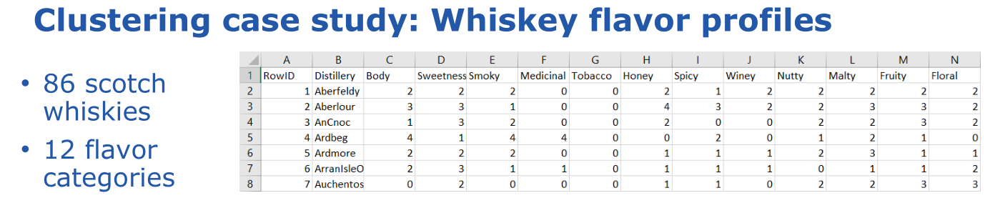

There are different algorithms that can be used to do the clustering.
Here K-Means clustering was used.

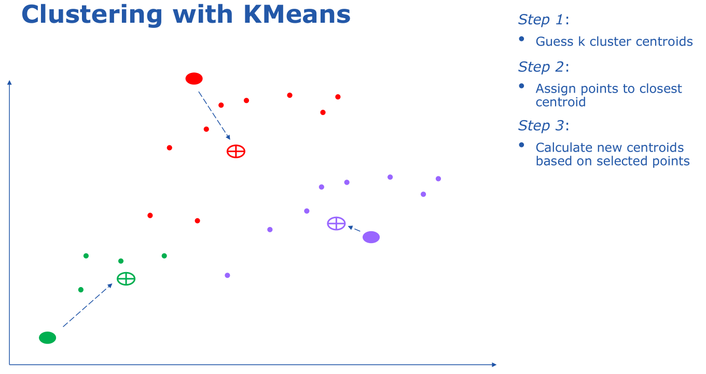

For this particular dataset, the number of datapoints is relatively small
and scaling up isn't crucial. But larger datasets would be split up in the same way
so we'll look at how we'd scale this up. First we read in the data:

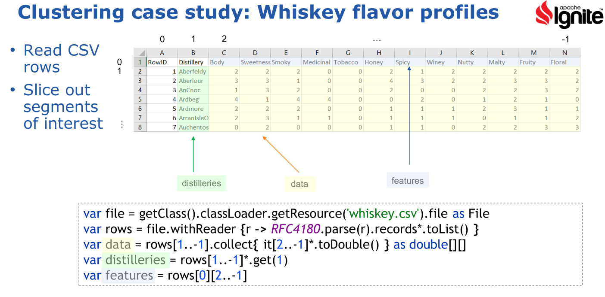

Apache Ignite has special features for reading in data within a cluster environment,
but we can get by using Apache Commons CSV for our example.

If you know the K-Means algorithm, at first glance it doesn't appear amenable to
distribution. To cluster points you need to calculate distances of _all_ the points
to your centroids. Luckily, various distributed versions of the algorithm have been
devised and this is what is included in the `ignite-ml` library. We just use the library
in the same way we'd use a non-distributed version and Ignite does the hard work for you.
Here is the result:

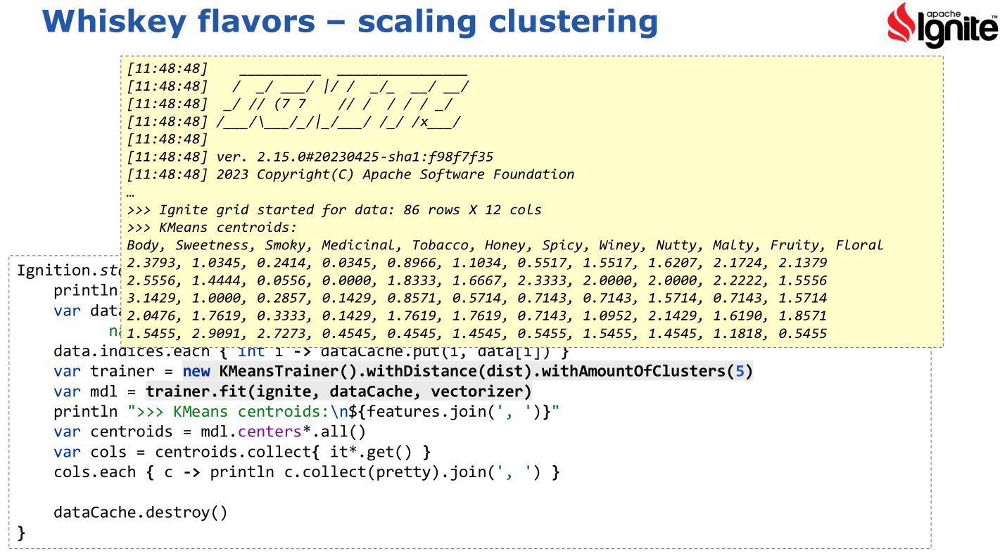

There are various options we have to tweak the algorithm and various
ways to visualize the results.

image:img/Clustering4.png[Whiskey flavour profiles]

As a side note, it is rumoured that additional extensive research on this topic may (or may not)
have been held in conjunction with the conference. Only because the conference was in (Nova) Scotia no doubt!

image:https://photos.apachecon.com/_data/i/upload/2023/10/13/20231013192401-65a58458-cu_s9999x410.jpg[Jeremy Meyer,200,float="right"]
The second talk was by https://www.linkedin.com/in/jeremy-s-meyer/[Jeremy Meyer] discussing
https://drive.google.com/file/d/1vjDkFmG9zz9y7yDY10ru9tya7KidJsqG/view?usp=sharing[Scalable Distributed Computing with Groovy Using Apache Ignite].

In this talk, Jeremy posed the question:

[quote]
What if we used the dynamic, easy to code and prototype aspects of Groovy... +
...with the fantastically scalable compute power of Apache Ignite's
compute grid, and clever peer class loading?

For those that know Ignite, it can be used in numerous ways:

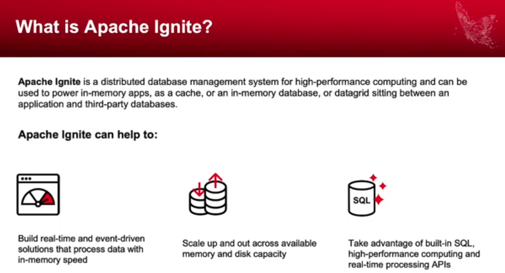

In this scenario, it was going to be used for distributed computing
and the task at hand was to solve Rubik's cubes. In this case,
particular non-destructive corner moves of a 3x3x2 cube.

image:img/IgniteRubiks2.png[Numbers,90%]

First up was to create a little domain model to represent the cube:

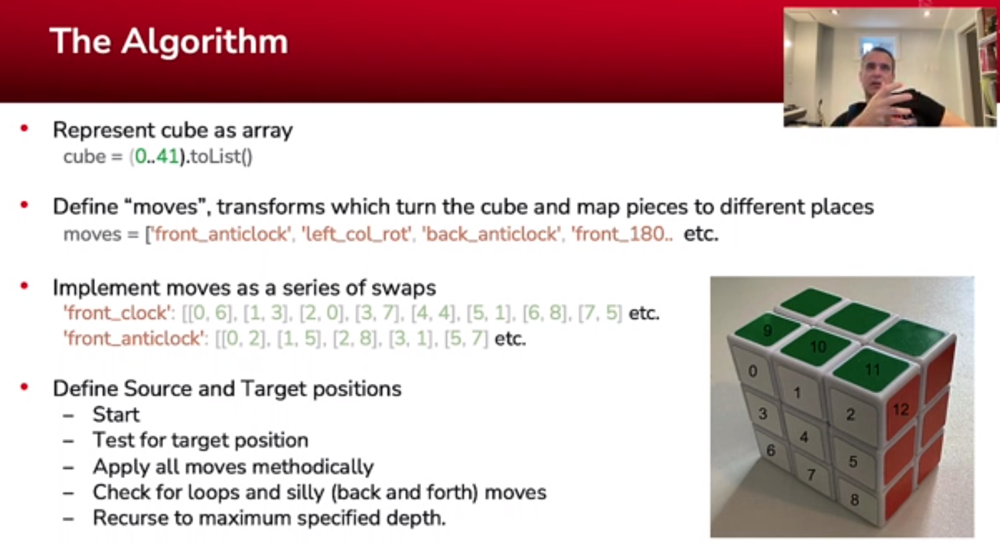

Then piece together a cluster of computers of varying skills for the compute grid:

Or a different visualization of the machines if you're not
a Guardians of the Galaxy fan:

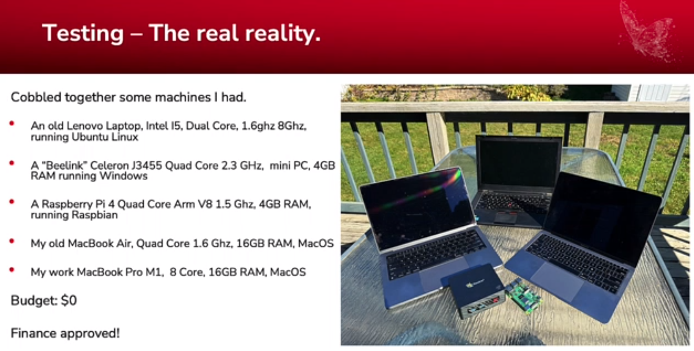

Then code up the corner swapping algorithm:

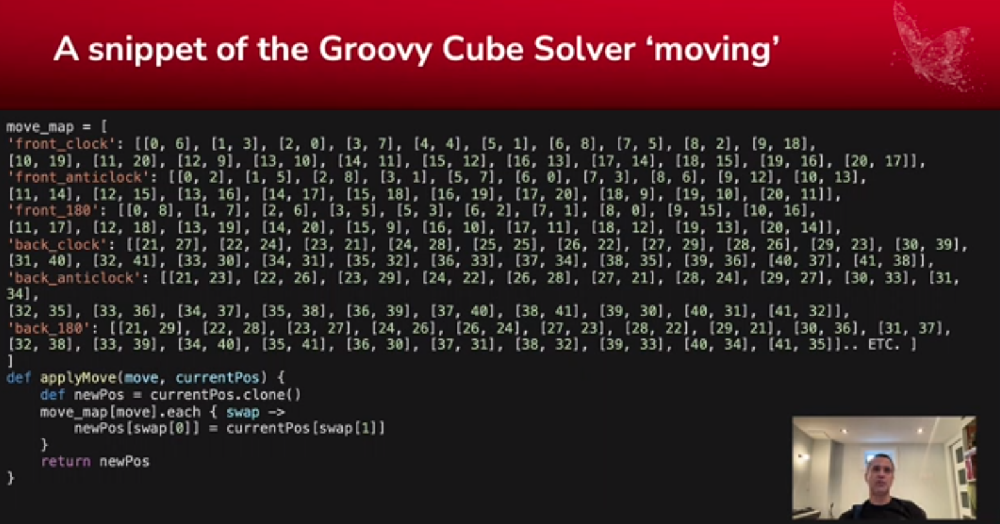

And finally get the results:

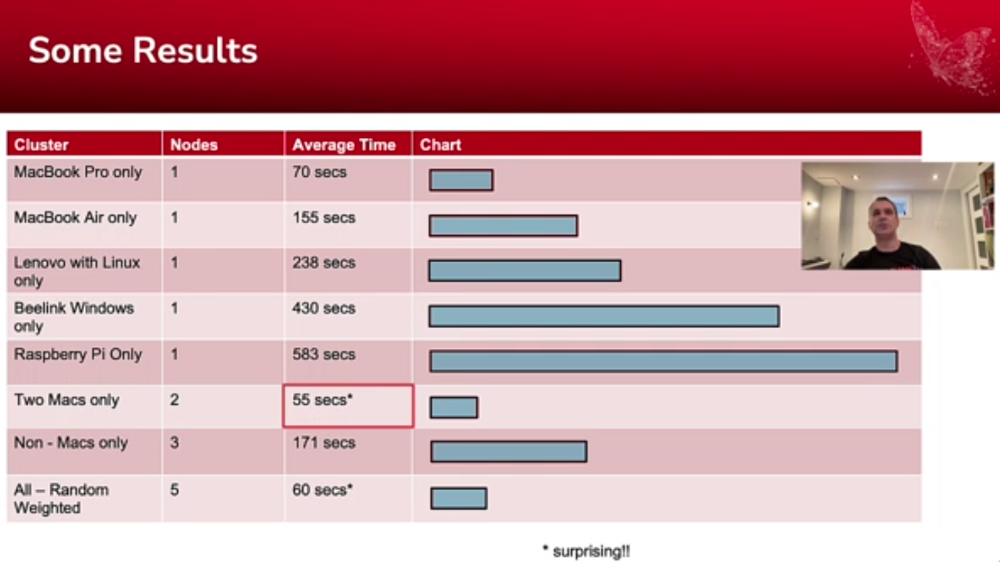

I won't steal Jeremy's thunder. Check out the link for details.
But a lesson learned is that naively allocating work to machines of
differing capabilities can sometimes yield surprising results.
Luckily, there are various ways that compute grids job allocation
can account for such variations.

=== Miscellaneous

Jeff gave another talk, this time on _GORM Data Services_.
First covered was the traditional GORM functionality including dynamic finders,
the Criteria API, Where queries, and HQL:

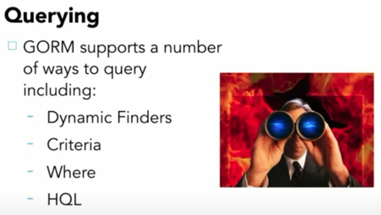

Then he covered GORM Data Services:

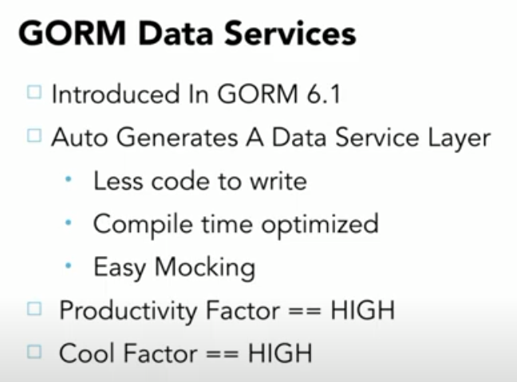

image:img/JeffOpenSourceSoftwareAndYou.jpg[Jeff Scott Brown,300,float="right"]
Jeff also gave the final talk for the track: _Open Source Software and You_.
In this talk, Jeff gave an insight into his own open source journey.
He covered some of his insights from his 30+ years working in open source.
Discussing why you might want to contribute to open source, and how you could contribute.
His journey gives us all some inspiration for anyone starting
or continuing on their own open source journeys.

Jeff covered some of his early projects. He went on to discuss Grails
which was a key driver during Groovy's early evolution.
He also reiterated the continuing investment Unity Foundation
is making towards the Grails foundation and Micronaut foundation - two technologies
which are very well known to many Groovy users.
He also discussed some of Unity Foundation's recent projects
which target applying open source to help underserved communities.

== Other tracks

In addition to the Groovy track, the conference was full of other fascinating content too,
grouped into the following tracks:

* API/Microservices Track
* Big Data: Compute Track
* Big Data: Storage Track
* Cloud and Runtime Track
* Community Track
* Content Wrangling Track
* Data Engineering Track
* Fintech Track
* Frameworks Track
* Geospatial Track
* Highlights Track
* Incubator Track
* Internet of Things Track
* Performance Engineering Track
* Search Track
* Serverside Chat with ASF Infra
* Streaming Track
* Sustainability Track
* Tomcat and httpd Track

I did manage to see quite a few talks from some of the
other tracks but instead of trying to summarise everything I saw,
I'll point you to the online content which is being linked to the conference
https://communityovercode.org/schedule/[schedule].

== An evening at the Citadel

The conference attendee event was an evening at the Halifax Citadel National Historic Site.
The Citadel is a fortification that was built (and rebuilt several times) to
protect the city. It stands high on a hill overlooking the harbour and also has
been a crucial communication hub at times.

It is worthwhile visiting the Citadel if you are ever in Halifax.
They have historical tours, ghost tours, daily cannon firing,
and occasional marching and band drills. I'll just point out one feature
that was mentioned in the tour. The flag poles served the dual purpose of
military and commercial signalling before the advent of electronic telecommunications.
Even after the invention of the telegraph, the flags have still been used
as a tradition to earlier times.

The commercial signal mast was used by the British army to communicate marine
traffic in the harbour to the public. Different flags would indicate the
number and nationality of approaching ships (among other things).
The military signal mast used a code based on flags and disks.
Messages could be relayed to other signal posts and allowed a message
to be sent great distances quickly. A message that might take half a day
to deliver on horseback could be done in 30 minutes using the signal masts and codes.

== But wait, there's more...

Of course, there is much more to ASF conferences than I can hope to do justice to hear.
There's great people, great food, hallway conversations, a chance to chat to the wonderful
Infra folks. And did I say great people and great food?

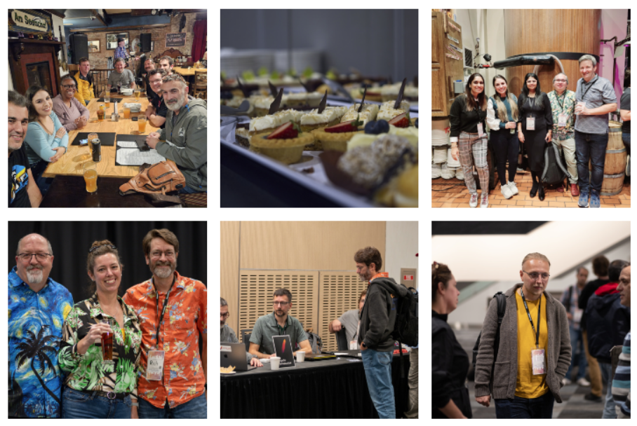

I hope to see you at a future ASF conference.

== Back home

When you return from a trip, make sure to catch up with family and friends.
In my case, this involved a weekend away at the beach.

If you visit Australia, make sure to pop in.

== Other information

Other trip reports for the Halifax Community over Code conference 2023:

* https://www.linkedin.com/pulse/code-connections-collaboration-unpacking-community-over-atita-arora-b0gfe/[A review by Atita Arora].

See also:

* https://photos.apachecon.com/index.php?/category/37[Additional photos] grouped roughly into days and sessions within each day.
* https://communityovercode.org/schedule/[The official schedule] includes all tracks and will include
links to the slides of the talks if/when available.
* Details for https://eu.communityovercode.org/[Community over Code EU] next year.