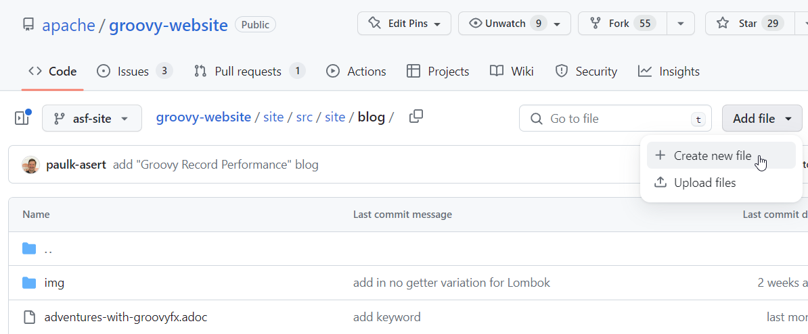
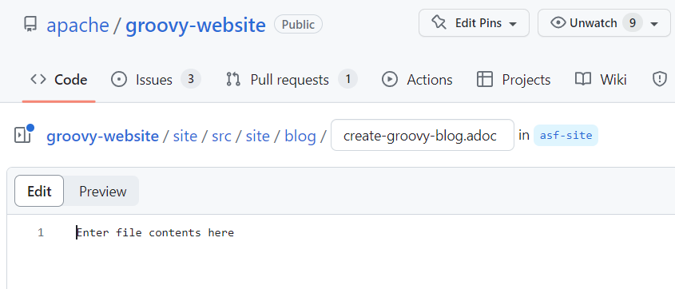
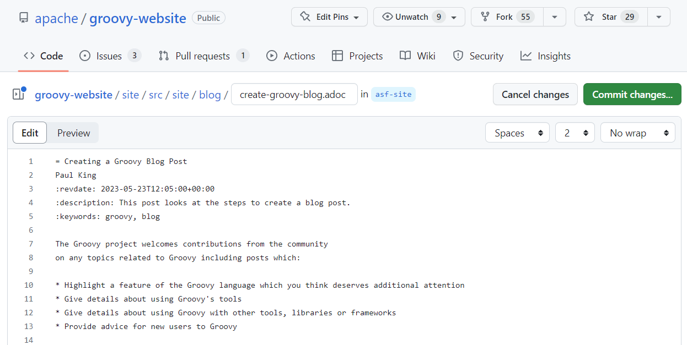
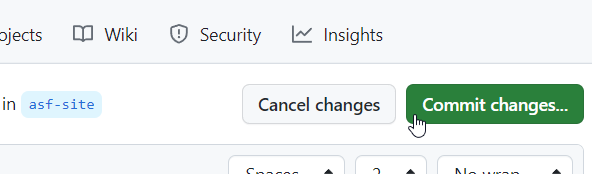
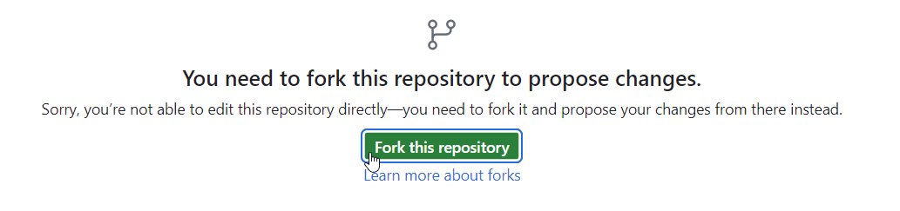
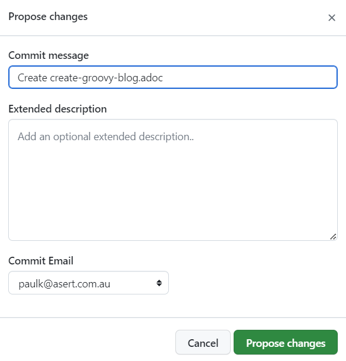
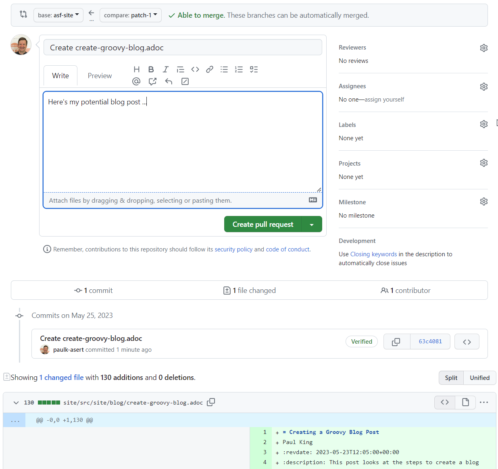

= Creating a Groovy Blog Post
Paul King
:revdate: 2023-05-25T23:35:00+00:00
:description: This post looks at the steps to create a blog post.
:keywords: groovy, blog

The Groovy project welcomes contributions from the community
on any topics related to Groovy including posts which:

* Highlight a feature of the Groovy language which you think deserves additional attention
* Give details about using Groovy's tools
* Give details about using Groovy with other tools, libraries or frameworks
* Provide advice for new users to Groovy

As mentioned on the
https://groovy.apache.org/#blogging[Groovy website],
you can use your own blogging platform if you wish,
or add a post to Groovy's own
https://groovy.apache.org/blog[blogging site].
This post goes into more detail about this second option.

The summary is that writing a blog is easy if you know the basics of
https://asciidoc.org/[Asciidoc] and git.
A blog is normally just an asciidoc file added to the
https://github.com/apache/groovy-website/tree/asf-site/site/src/site/blog[blog part]
of the
https://github.com/apache/groovy-website/[apache/groovy-website]
GitHub repo and maybe an image or two
in the corresponding
https://github.com/apache/groovy-website/tree/asf-site/site/src/site/blog/img[image] directory.

== Using the command line

If you are already familiar with git, first fork the repo using the WebUI.
Then clone the repo on the commandline in the normal way:

```
$ git clone https://github.com/apache/groovy-website.git
```

Or if you have the https://cli.github.com/[GitHub CLI] tools installed,
you can fork and clone in one step using:

```
$ gh repo fork https://github.com/apache/groovy-website.git --clone
```

Now create a new `.adoc` file in the `site/src/site/blog/` directory.
You can edit the file using your favourite text/Asciidoc editor or an IDE.
I generally use
https://www.jetbrains.com/idea/[Intellij IDEA]
with the
https://plugins.jetbrains.com/plugin/7391-asciidoc[Asciidoc plugin].

You'll want to follow all the normal steps to
https://www.digitalocean.com/community/tutorials/how-to-create-a-pull-request-on-github[create a pull request on GitHub]. This will typically involve
creating a branch, committing your new file (and maybe images),
pushing your branch to your fork, and then creating the actual PR.

== Using the GitHub WebUI

If you don't want to install git and an editor/IDE, you can use the WebUI.
Simply navigate to the repo, go to the `site/src/site/blog/` folder, then
under `Add file` click on `Create new file`. It should look something like
the following image:



You will be prompted to enter an appropriate name for your file:



You generally pick a unique name that isn't too long. Here we picked
`create-groovy-blog.adoc`. Don't get too stressed out about the name,
we can provide further guidance once your PR is submitted if your
name seems out-of-place compared to existing names.
We generally avoid using exotic characters like emojis in the filenames.
Some of the tooling doesn't like such characters.

We now enter Asciidoc content into the file:



The first line is the title for the post.
The second line is the author (or authors).
The next few lines contain metadata. Your best bet is to copy
the metadata from an existing post and change accordingly, but
we'll guide you through any changes if needed once the PR is submitted.

When finished, click on "Commit changes...":



If you haven't forked the repository before, you might be prompted
to do that now:



Next, you have the option to override the default commit message
and provide an optional extended description if you wish:



When ready, click "Propose changes".

You should now see a summary of your pull request.



Add a comment if you wish and finally click "Create pull request".

Your PR should now be listed under the repo's pull requests:

https://github.com/apache/groovy-website/pulls

== Choosing your content

As mentioned earlier, we welcome a wide range of topics for the posts.
Not every topic may be suitable. We need to make sure anything we post
conforms with normal copyright restrictions and can be released under
the Apache license. Also, we generally don't want duplicated content
or content which is overtly commercial in nature.

If in doubt, it might be good to have a short conversation
with the Apache Groovy team on the mailing list or Slack channel
before you create your PR.
Further details about contacting the team are on the
https://groovy.apache.org/[getting involved] page.

If your post takes inspiration from other sites or content, make sure to provide
appropriate attribution. Finally, make sure you have some fun writing
the post. It will be more enjoyable for you and our readers!

== Next steps

The acceptance process might involve several iterations to
improve the content.

Your PR, once accepted, will be merged into the repo.
At this point, a CI job kicks off and will build a new version of the website.
You can watch the CI progress here:

https://ci-builds.apache.org/job/Groovy/job/Groovy%20dev%20website/

And the end result will appear here:

https://groovy.apache.org/blog

