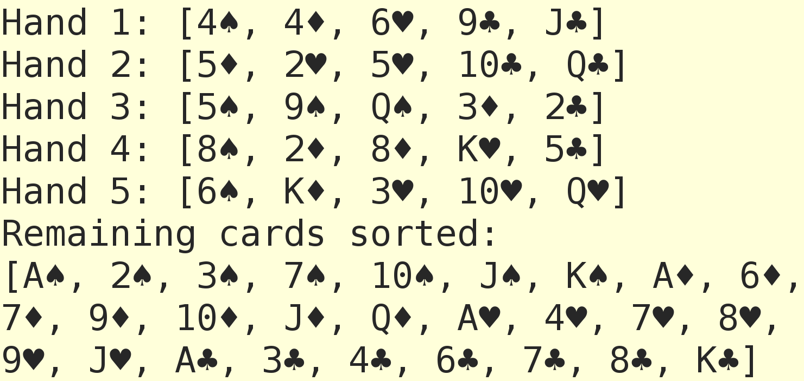

= Deck of cards with Groovy, JDK collections and Eclipse Collections
Paul King
:revdate: 2022-09-23T10:18:36+00:00
:updated: 2022-09-25T11:15:32+00:00
:keywords: eclipse collections, groovy, @Sortable, records
:description: This post highlights some code for modelling and manipulating cards with records, JDK collections, and Eclipse Collections.

Once again, https://twitter.com/TheDonRaab[Donald Raab] has produced an interesting
https://donraab.medium.com/how-to-create-a-deck-of-cards-using-eclipse-collections-d9838ac430b7[blog post] on
https://github.com/eclipse/eclipse-collections[Eclipse Collections] this one shows some code for modelling and manipulating cards with Java 17 and Eclipse Collections. His related katas are highly recommended.
Here is the same example in Groovy (4.0.5 was used here) with just a few tweaks:

[source,groovy]
----
enum Rank { ACE, TWO, THREE, FOUR, FIVE, SIX, SEVEN, EIGHT, NINE, TEN, JACK, QUEEN, KING }

enum Suit { SPADES, DIAMONDS, HEARTS, CLUBS }

@Sortable(includes='suit,rank')
record Card(Rank rank, Suit suit) { }

var cards = Sets.cartesianProduct(EnumSet.allOf(Rank), EnumSet.allOf(Suit), Card::new)
var cardsBySuit = cards.groupBy(Card::suit)
var cardsByRank = cards.groupBy(Card::rank)

assert [cards, cardsByRank, cardsBySuit]*.size() == [52, 13 ,4]

var random = new Random(42L)
var deck = cards.toList().shuffleThis(random).shuffleThis(random).shuffleThis(random).toStack()
(1..5).collect(i -> deck.pop(5).toSortedList()).each(this::println)

----

And here is the output:

----
[Card[rank=FOUR, suit=SPADES], Card[rank=FOUR, suit=DIAMONDS], Card[rank=SIX, suit=HEARTS], Card[rank=NINE, suit=CLUBS], Card[rank=JACK, suit=CLUBS]]
[Card[rank=FIVE, suit=DIAMONDS], Card[rank=TWO, suit=HEARTS], Card[rank=FIVE, suit=HEARTS], Card[rank=TEN, suit=CLUBS], Card[rank=QUEEN, suit=CLUBS]]
[Card[rank=FIVE, suit=SPADES], Card[rank=NINE, suit=SPADES], Card[rank=QUEEN, suit=SPADES], Card[rank=THREE, suit=DIAMONDS], Card[rank=TWO, suit=CLUBS]]
[Card[rank=EIGHT, suit=SPADES], Card[rank=TWO, suit=DIAMONDS], Card[rank=EIGHT, suit=DIAMONDS], Card[rank=KING, suit=HEARTS], Card[rank=FIVE, suit=CLUBS]]
[Card[rank=SIX, suit=SPADES], Card[rank=KING, suit=DIAMONDS], Card[rank=THREE, suit=HEARTS], Card[rank=TEN, suit=HEARTS], Card[rank=QUEEN, suit=HEARTS]]
----

We can do a similar example with the built-in JDK collections and make some additional tweaks for nicer output:

[source,groovy]
----
enum Rank {
    ACE, TWO, THREE, FOUR, FIVE, SIX, SEVEN, EIGHT, NINE, TEN, JACK, QUEEN, KING
    String toString() { ['A', *'2'..'9', '10', 'J', 'Q', 'K'][ordinal()] }
}

enum Suit {
    SPADES, DIAMONDS, HEARTS, CLUBS
    String toString() { '♠♦♥♣'[ordinal()] }
}

@Sortable(includes='suit,rank')
record Card(Rank rank, Suit suit) {
    Card(List srPair) { this(srPair[1], srPair[0]) }
    String toString() { "${rank}${suit}" }
}

var cards = [Suit.values(), Rank.values()].combinations().collect(Card::new)
var cardsBySuit = cards.groupBy(Card::suit)
var cardsByRank = cards.groupBy(Card::rank)

assert [cards, cardsByRank, cardsBySuit]*.size() == [52, 13, 4]

var random = new Random(42L)
3.times { cards.shuffle(random) }
var deck = cards as Stack
5.times { println "Hand ${it+1}: ${(0..5).collect{ deck.pop() }.sort()}" }

println "Remaining cards sorted:\n${deck.sort()}"
----

Which has this output:

Both these Groovy examples run on JDK versions from 8 to 19 +
(emulated records are used in JDK versions 8 to 15).

.Update history
****
*25/Sep/2022*: Tweaked to use the same ordering for the JDK collections version.
****
