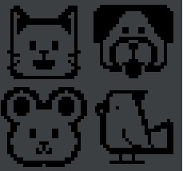
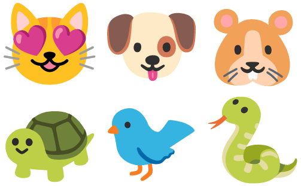

= Deep Learning and Eclipse Collections
Paul King
:revdate: 2022-10-11T10:41:58+00:00
:keywords: deep learning, eclipse collections, groovy, emoji, records, eclipse deeplearning4j
:description: This post uses Emojis and Eclipse Collections to process pet records. We then use deep learning to predict whether each emoji looks like a dog or cat.

In previous blogs, we've covered
https://groovy.apache.org/blog/deck-of-cards-with-groovy[Eclipse Collections] and
https://groovy.apache.org/blog/detecting-objects-with-groovy-the[Deep Learning].
Recently, a couple of the highly recommended katas for Eclipse Collections have been
revamped to include "pet" and "fruit" emojis for a bit of extra fun. What could be better
than _Learning_ Eclipse Collections?_Deep Learning_ and Eclipse Collections of course!

== Setting up our model and data

First, we create a `PetType` enum with the emoji as `toString`:

[source,groovy]
----
enum PetType {
    CAT("🐱"),
    DOG("🐶"),
    HAMSTER("🐹"),
    TURTLE("🐢"),
    BIRD("🐦"),
    SNAKE("🐍")

    private final String emoji

    PetType(String emoji) { this.emoji = emoji }

    @Override
    String toString() { emoji }
}
----

Then a `Pet` record (with the `type` as the `toString`):

[source,groovy]
----
record Pet(PetType type, String name, int age) {
    String toString() { type.toString() }
}
----

Similarly, we'll create a `Person` record. We'll also populate a `people` list as is done in the kata. The full details are in the https://github.com/paulk-asert/deep-learning-eclipse-collections[repo].

Let's use a GQuery expression to explore the pre-populated list:

[source,groovy]
----
println GQ {
    from p in people
    select p.fullName, p.pets
}
----

The result is:

[source]
----
+---------------+----------+
| fullName      | pets     |
+---------------+----------+
| Mary Smith    | [🐱]     |
| Bob Smith     | [🐱, 🐶] |
| Ted Smith     | [🐶]     |
| Jake Snake    | [🐍]     |
| Barry Bird    | [🐦]     |
| Terry Turtle  | [🐢]     |
| Harry Hamster | [🐹, 🐹] |
| John Doe      | []       |
+---------------+----------+
----

Now let's duplicate the assertion from the `getCountsByPetType` test in the original kata's exercise3 which checks pet counts:

[source,groovy]
----
var counts = people.countByEach(person -> person.petTypes).collect(Object::toString)
var expected = Bags.mutable.withOccurrences("🐱", 2, "🐶", 2, "🐹", 2).with("🐍").with("🐢").with("🐦")
assert counts == expected
----

As we expect, it passes.

== Applying deep learning

Now, for a bit of fun, we will use a neural network trained to detect cat and dog images and apply it to our emojis. We'll follow the process described http://ramok.tech/2018/01/03/java-image-cat-vs-dog-recognizer-with-deep-neural-networks/[here]. It uses https://deeplearning4j.konduit.ai/[Eclipse DeepLearning4j] to train and then use a model. The images used to train the model were real cat and dog images, not emojis, so we aren't expecting our model to be super accurate.

The first attempt was to write the emojis into swing JLabel components and then save using a buffered image. This lead to poor looking images:

And consequently, poor image inference. Recent JDK versions on some platforms might do better, but we gave up on this approach.

Instead, emoji image files from the https://fonts.google.com/noto/specimen/Noto+Color+Emoji?preview.text=%F0%9F%98%BB%F0%9F%90%B6%F0%9F%90%B9%F0%9F%90%A2%F0%9F%90%A6%F0%9F%90%8D&amp;preview.text_type=custom[Noto Color Emoji] font were used and saved under the pet type in the `resources` folder. These look much nicer:

Here is the code which makes use of those saved images to detect the animal types (note the use of type aliasing since we have two `PetType` classes; we rename one to `PT`):

[source,groovy]
----
import ramo.klevis.ml.vg16.PetType as PT
import ramo.klevis.ml.vg16.VG16ForCat

var vg16ForCat = new VG16ForCat().tap{ loadModel() }
var results = []
people.each{ p ->
    results << p.pets.collect { pet ->
        var file = new File("resources/${pet.type.name()}.png")
        PT petType = vg16ForCat.detectCat(file, 0.675d)
        var desc = switch(petType) {
            case PT.CAT -> 'is a cat'
            case PT.DOG -> 'is a dog'
            default -> 'is unknown'
        }
        "$pet.name $desc"
    }
}
println results.flatten().join('\n')
----

Note that the model exceeds the maximum allowable size for normal GitHub repos, so you should create it following the original repo https://github.com/klevis/CatAndDogRecognizer[instructions] and then store the resulting `model.zip` in the `resources` folder.

When we run the script, we get the following output:

[subs="quotes"]
----
[maroon]##[main] INFO org.nd4j.linalg.factory.Nd4jBackend - Loaded [CpuBackend] backend
...
[main] INFO org.nd4j.linalg.api.ops.executioner.DefaultOpExecutioner - Blas vendor: [OPENBLAS]
...
==========================================================================================
VertexName (VertexType)                 nIn,nOut       TotalParams    ParamsShape                    Vertex Inputs
==========================================================================================
input_1 (InputVertex)                   -,-            -              -                              -
block1_conv1 (Frozen ConvolutionLayer)  3,64           1792           b:{1,64}, W:{64,3,3,3}         [input_1]
block1_conv2 (Frozen ConvolutionLayer)  64,64          36928          b:{1,64}, W:{64,64,3,3}        [block1_conv1]
block1_pool (Frozen SubsamplingLayer)   -,-            0              -                              [block1_conv2]
block2_conv1 (Frozen ConvolutionLayer)  64,128         73856          b:{1,128}, W:{128,64,3,3}      [block1_pool]
block2_conv2 (Frozen ConvolutionLayer)  128,128        147584         b:{1,128}, W:{128,128,3,3}     [block2_conv1]
block2_pool (Frozen SubsamplingLayer)   -,-            0              -                              [block2_conv2]
block3_conv1 (Frozen ConvolutionLayer)  128,256        295168         b:{1,256}, W:{256,128,3,3}     [block2_pool]
block3_conv2 (Frozen ConvolutionLayer)  256,256        590080         b:{1,256}, W:{256,256,3,3}     [block3_conv1]
block3_conv3 (Frozen ConvolutionLayer)  256,256        590080         b:{1,256}, W:{256,256,3,3}     [block3_conv2]
block3_pool (Frozen SubsamplingLayer)   -,-            0              -                              [block3_conv3]
block4_conv1 (Frozen ConvolutionLayer)  256,512        1180160        b:{1,512}, W:{512,256,3,3}     [block3_pool]
block4_conv2 (Frozen ConvolutionLayer)  512,512        2359808        b:{1,512}, W:{512,512,3,3}     [block4_conv1]
block4_conv3 (Frozen ConvolutionLayer)  512,512        2359808        b:{1,512}, W:{512,512,3,3}     [block4_conv2]
block4_pool (Frozen SubsamplingLayer)   -,-            0              -                              [block4_conv3]
block5_conv1 (Frozen ConvolutionLayer)  512,512        2359808        b:{1,512}, W:{512,512,3,3}     [block4_pool]
block5_conv2 (Frozen ConvolutionLayer)  512,512        2359808        b:{1,512}, W:{512,512,3,3}     [block5_conv1]
block5_conv3 (Frozen ConvolutionLayer)  512,512        2359808        b:{1,512}, W:{512,512,3,3}     [block5_conv2]
block5_pool (Frozen SubsamplingLayer)   -,-            0              -                              [block5_conv3]
flatten (PreprocessorVertex)            -,-            -              -                              [block5_pool]
fc1 (Frozen DenseLayer)                 25088,4096     102764544      b:{1,4096}, W:{25088,4096}     [flatten]
fc2 (Frozen DenseLayer)                 4096,4096      16781312       b:{1,4096}, W:{4096,4096}      [fc1]
predictions (OutputLayer)               4096,2         8194           b:{1,2}, W:{4096,2}            [fc2]
------------------------------------------------------------------------------------------
            Total Parameters:  134268738
        Trainable Parameters:  8194
           Frozen Parameters:  134260544
==========================================================================================
...##
Tabby is a cat
Dolly is a cat
Spot is a dog
Spike is a dog
Serpy is a cat
Tweety is unknown
Speedy is a dog
Fuzzy is unknown
Wuzzy is unknown
----

As we can see, it correctly predicted the cats (Tabby and Dolly) and dogs
(Spot and Spike) but incorrectly thought a snake (Serpy) was a cat and a
turtle (Speedy) was a dog. Given the lack of detail in the emoji images
compared to the training images, this lack of accuracy isn't unexpected.
We could certainly use better images or train our model differently if
we wanted better results, but it is fun to see our model not doing too
badly even with emojis!