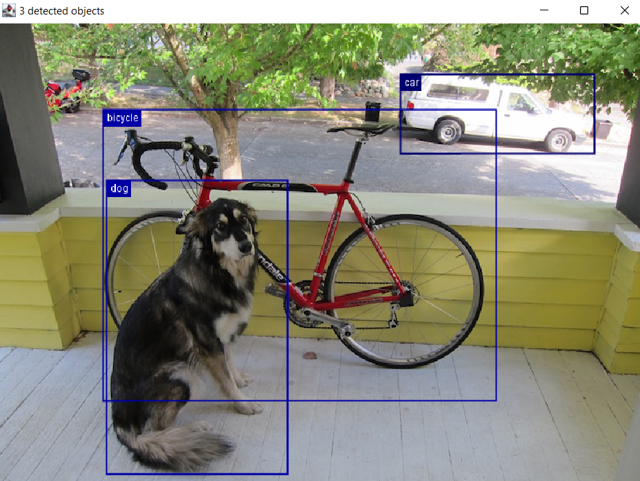

= Detecting objects with Groovy, the Deep Java Library (DJL), and Apache MXNet
Paul King
:revdate: 2022-08-01T11:52:26+00:00
:keywords: data science, deep learning, groovy, neural networks, apache mxnet, DJL, artifical intelligence, machine learning, gradle
:description: This post looks at using Apache Groovy, DLJ and Apache MXNet to use neural networks to detect objects within an image.

This blog posts looks at using https://groovy-lang.org/[Apache Groovy] with the
https://djl.ai/[Deep Java Library (DJL)] and backed by the
https://mxnet.incubator.apache.org/[Apache MXNet] engine to detect objects within an image. (Apache MXNet is an https://incubator.apache.org/[incubating project] at https://www.apache.org/[the ASF].)

== Deep Learning

Deep learning falls under the branches of https://en.wikipedia.org/wiki/Machine_learning[machine learning] and https://en.wikipedia.org/wiki/Artificial_intelligence[artificial intelligence]. It involves multiple layers (hence the "deep") of an https://en.wikipedia.org/wiki/Artificial_neural_network[artificial neural network]. There are lots of ways to configure such networks and the details are beyond the scope of this blog post, but we can give some basic details. We will have four input nodes corresponding to the measurements of our four characteristics. We will have three output nodes corresponding to each possible class (species). We will also have one or more additional layers in between.

image:img/deep_network.png[Deep learning network,630]

Each node in this network mimics to some degree a neuron in the human brain. Again, we'll simplify the details. Each node has multiple inputs, which are given a particular weight, as well as an activation function which will determine whether our node "fires". Training the model is a process which works out what the best weights should be.

image:img/deep_node.png[Node in a deep learning network,580]

== Deep Java Library (DJL) & Apache MXNet

Rather than writing your own neural networks, libraries such as https://djl.ai/[DJL] provide high-level abstractions which automate to some degree the creation of the necessary neural network layers. DJL is engine agnostic, so it's capable of supporting different backends including Apache MXNet, PyTorch, TensorFlow and ONNX Runtime. We'll use the default engine which for our application (at the time of writing) is Apache MXNet.

https://mxnet.apache.org/[Apache MXNet] provides the underlying engine. It has support for imperative and symbolic execution, distributed training of your models using multi-gpu or multi-host hardware, and multiple language bindings. Groovy is fully compatible with the Java binding.

== Using DJL with Groovy

Groovy uses the Java binding. Consider looking at the DJL beginner tutorials for Java - they will work almost unchanged for Groovy.

For our example, the first thing we need to do is download the image we want to run the object detection model on:

[source,groovy]
----
Path tempDir = Files.createTempDirectory("resnetssd")
def imageName = 'dog-ssd.jpg'
Path localImage = tempDir.resolve(imageName)
def url = new URL("https://s3.amazonaws.com/model-server/inputs/$imageName")
DownloadUtils.download(url, localImage, new ProgressBar())
Image img = ImageFactory.instance.fromFile(localImage)
----

It happens to be a well-known already available image. We'll store a local copy of the image in a temporary directory, and we'll use a utility class that comes with DJL to provide a nice progress bar while the image is downloading. DJL provides its own image classes, so we'll create an instance using the appropriate class from the downloaded image.

Next we want to configure our neural network layers:

[source,groovy]
----
def criteria = Criteria.builder()
    .optApplication(Application.CV.OBJECT_DETECTION)
    .setTypes(Image, DetectedObjects)
    .optFilter("backbone", "resnet50")
    .optEngine(Engine.defaultEngineName)
    .optProgress(new ProgressBar())
    .build()
----

DLJ supports numerous model _applications_ including image classification, word recognition, sentiment analysis, linear regression, and others. We'll select _object detection_. This kind of application looks for the bounding box of known objects within an image. The _types_ configuration option identifies that our input will be an image and the output will be detected objects. The _filter_ option indicates that we will be using ResNet-50 (a 50-layers deep convolutional neural network often used as a backbone for many computer vision tasks). We set the _engine_ to be the default engine which happens to be Apache MXNet. We also configure an optional progress bar to provide feedback of progress while our model is running.

Now that we have our configuration sorted, we'll use it to load a model and then use the model to make object predictions:

[source,groovy]
----
def detection = criteria.loadModel().withCloseable { model ->
    model.newPredictor().predict(img)
}
detection.items().each { println it }
img.drawBoundingBoxes(detection)
----

For good measure, we'll draw the bounding boxes into our image.

Next, we save our image into a file and display it using Groovy's SwingBuilder.

[source,groovy]
----
Path imageSaved = tempDir.resolve('detected.png')
imageSaved.withOutputStream { os -> img.save(os, 'png') }
def saved = ImageIO.read(imageSaved.toFile())
new SwingBuilder().edt {
    frame(title: "$detection.numberOfObjects detected objects",
          size: [saved.width, saved.height],
          defaultCloseOperation: DISPOSE_ON_CLOSE,
          show: true) { label(icon: imageIcon(image: saved)) }
}
----

== Building and running our application

Our code is stored on a source file called `ObjectDetect.groovy`.

We used https://gradle.org/[Gradle] for our build file:

[source,groovy]
----
apply plugin: 'groovy'
apply plugin: 'application'

repositories {
    mavenCentral()
}

application {
    mainClass = 'ObjectDetect'
}

dependencies {
    implementation "ai.djl:api:0.18.0"
    implementation "org.apache.groovy:groovy:4.0.4"
    implementation "org.apache.groovy:groovy-swing:4.0.4"
    runtimeOnly "ai.djl:model-zoo:0.18.0"
    runtimeOnly "ai.djl.mxnet:mxnet-engine:0.18.0"
    runtimeOnly "ai.djl.mxnet:mxnet-model-zoo:0.18.0"
    runtimeOnly "ai.djl.mxnet:mxnet-native-auto:1.8.0"
    runtimeOnly "org.apache.groovy:groovy-nio:4.0.4"
    runtimeOnly "org.slf4j:slf4j-jdk14:1.7.36"
}
----

We run the application with the gradle `run` task:

[subs="quotes"]
----
[lime]#paulk@pop-os#:[blue]##/extra/projects/groovy-data-science##$ ./gradlew DLMXNet:run
> Task :DeepLearningMxnet:run
Downloading: 100% |[olive]#████████████████████████████████████████#| dog-ssd.jpg
Loading:     100% |[olive]#████████████████████████████████████████#|
...
class: [green]*"car"*, probability: *0.99991*, bounds: [x=0.611, y=0.137, width=0.293, height=0.160]
class: [green]*"bicycle"*, probability: *0.95385*, bounds: [x=0.162, y=0.207, width=0.594, height=0.588]
class: [green]*"dog"*, probability: *0.93752*, bounds: [x=0.168, y=0.350, width=0.274, height=0.593]
----

The displayed image looks like this:

== Further Information

The full source code can be found in the following repo: +
https://github.com/paulk-asert/groovy-data-science/subprojects/DeepLearningMxnet

== Conclusion

We have examined using Apache Groovy, DLJ and Apache MXNet to detect objects
within an image. We've used a model based on a rich deep learning model, but we
didn't need to get into the details of the model or its neural network layers.
DLJ and Apache MXNet did the hard lifting for us. Groovy provided a simple coding
experience for building our application.
