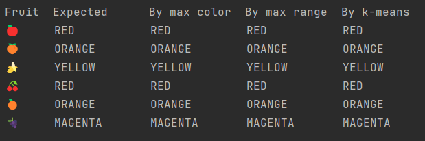

= Fruity Eclipse Collections
Paul King
:revdate: 2022-10-13T11:05:54+00:00
:keywords: datascience, eclipse collections, groovy, kmeans, emoji, virtual threads, scala integration
:description: This post looks at using KMeans to compare fruit nominated color with the colors used in its emoji.

This blog post continues on to some degree from the
https://blogs.apache.org/groovy/entry/deep-learning-and-eclipse-collections[previous post],
but instead of deep learning, we'll look at clustering using k-means after first exploring some top methods of https://www.eclipse.org/collections/[Eclipse Collections] with fruit emoji examples.

== Eclipse Collections Fruit Salad

First, we'll define a Fruit enum (it adds one additional fruit compared to the related
https://github.com/eclipse/eclipse-collections-kata/tree/master/top-methods-kata-solutions[Eclipse Collections kata]):

image:https://blogs.apache.org/groovy/mediaresource/8d0d5468-f58a-445a-8e79-854c7815d861[code for fruit enum]

We can use this enum in the following examples which show off numerous common Eclipse Collections methods:

image:https://blogs.apache.org/groovy/mediaresource/c272dd74-9d35-49b7-8857-c7fccf1989f0[exploring common eclipse collections methods]

The last example calculates red fruit in parallel threads.
As coded, it uses virtual threads when run on JDK19 with preview features enabled.
You can follow the suggestion in the comment to run on other JDK versions or with normal threads.
In addition to Eclipse Collections, we have the GPars library on our classpath.
Here we are only using one method which is managing pool lifecycle for us.

== Exploring emoji colors

For some fun, let's look at whether the nominated color of each fruit matches the color
of the related emoji. As in the previous blog, we'll use the slightly nicer
https://fonts.google.com/noto/specimen/Noto+Color+Emoji?preview.text=%F0%9F%8D%8E%F0%9F%8D%91%F0%9F%8D%8C%F0%9F%8D%92%F0%9F%8D%8A%F0%9F%8D%87&amp;preview.text_type=custom[Noto Color Emoji]
fonts for our fruit as shown here:
image:https://blogs.apache.org/groovy/mediaresource/4e4f1abe-0775-442d-ba17-7488e3eeca49[Noto Color Emoji]
We'll use an Eclipse Collection `BiMap` to switch back and forth between the color names
and java.awt colors:

[source,groovy]
----
@Field public static COLOR_OF = BiMaps.immutable.ofAll([
WHITE: WHITE, RED: RED, GREEN: GREEN, BLUE: BLUE,
ORANGE: ORANGE, YELLOW: YELLOW, MAGENTA: MAGENTA
])
@Field public static NAME_OF = COLOR_OF.inverse()
----

We are also going to use some helper functions to switch between RGB and HSB color values:

[source,groovy]
----
static hsb(int r, int g, int b) {
    float[] hsb = new float[3]
    RGBtoHSB(r, g, b, hsb)
    hsb
}

static rgb(BufferedImage image, int x, int y) {
    int rgb = image.getRGB(x, y)
    int r = (rgb >> 16) & 0xFF
    int g = (rgb >> 8) & 0xFF
    int b = rgb & 0xFF
    [r, g, b]
}
----

The HSB color space represents colors in a spectrum from 0 to 360 degrees:

image:https://nycdoe-cs4all.github.io/images/lessons/unit_1/3.2/circle.png[Color Circle]
Image credit: https://nycdoe-cs4all.github.io/units/1/lessons/lesson_3.2

We have two helper methods to assist with colors.
The first picks out "_mostly black_" and "_mostly white_" colors while
the second uses a switch expression to carve out some regions of the
color space for our colors of interest:

[source,groovy]
----
static range(float[] hsb) {
    if (hsb[1] < 0.1 && hsb[2] > 0.9) return [0, WHITE]
    if (hsb[2] < 0.1) return [0, BLACK]
    int deg = (hsb[0] * 360).round()
    return [deg, range(deg)]
}

static range(int deg) {
    switch (deg) {
        case 0..<16 -> RED
        case 16..<35 -> ORANGE
        case 35..<75 -> YELLOW
        case 75..<160 -> GREEN
        case 160..<250 -> BLUE
        case 250..<330 -> MAGENTA
        default -> RED
    }
}
----

Note that the JDK doesn't have a standard color of PURPLE, so we combine purple with magenta by choosing an appropriate broad spectrum for MAGENTA.

We used a https://plotly.com/javascript/[Plotly] 3D interactive scatterplot
(as supported by the https://jtablesaw.github.io/tablesaw/userguide/Introduction_to_Plotting[Tablesaw] Java dataframe and visualization library to visualize our emoji colors (as degrees on the color spectrum) vs the XY coordinates:
image:https://blogs.apache.org/groovy/mediaresource/85b4c127-52a3-4cc6-a7fc-1e72aa49e8b8[Color vs xy plot]

We are going to try out 3 approaches for determining the predominant color of each emoji:

* *Most common color*: We find the color spectrum value for each point and count up the number of points of each color. The color with the most points will be selected. This is simple and works in many scenarios but if an apple or cherry has 100 shades of red but only one shade of green for the stalk or a leaf, green may be selected.
* *Most common range*: We group each point into a color range. The range with the most points will be selected.
* *Centroid of biggest cluster*: We divide our emoji image into a grid of sub-images. We will perform k-means clustering of the RGB values for each point in the sub-image. This will cluster similar colored points together in a cluster. The cluster with the most points will be selected and its centroid will be chosen as the selected pre-dominant color. This approach has the affect of pixelating our sub-image by color. This approach is inspired by this https://medium.com/swlh/getting-dominant-colour-of-an-image-using-k-means-f7fdca880063[python article].

=== Most Common Color

Ignoring the background white color, the most common color for our PEACH emoji is a shade of orange. The graph below shows the count of each color:
image:https://blogs.apache.org/groovy/mediaresource/b9f82465-62e2-45c0-926f-634568381be8[Color histogram for PEACH]

=== Most Common Range

If instead of counting each color, we group colors into their range and count the numbers in each range, we get the following graph for PEACH:
image:https://blogs.apache.org/groovy/mediaresource/4ce2ac0e-87ac-4509-9fa8-10928419f4a0[Range histogram for PEACH]

=== K-Means

K-Means is an algorithm for finding cluster centroids. For k=3, we would start by picking
3 random points as our starting centroids.

image:https://blogs.apache.org/groovy/mediaresource/6192d3b7-a3c7-4ce5-b0c0-a3286619dd12[kmeans step 1]

We allocate all points to their closest centroid:

image:https://blogs.apache.org/groovy/mediaresource/751eaac0-5ba2-448d-8f67-6ebf53613ac9[kmeans step 2]

Given this allocation, we re-calculate each centroid from all of its points:

image:https://blogs.apache.org/groovy/mediaresource/daa9530e-fc5d-458d-8029-a1fd8a62d521[kmeans step 3]

We repeat this process until either a stable centroid selection
is found, or we have reached a certain number of iterations.
We used the K-Means algorithm from
https://commons.apache.org/proper/commons-math/userguide/ml.html#clustering[Apache Commons Math].

Here is the kind of result we would expect if run on the complete
set of points for the PEACH emoji. The black dots are the centroids.
It has found one green, one orange and one red centroid.
The centroid with the most points allocated to it should be the
most predominant color. (This is another interactive 3D scatterplot.)

image:https://blogs.apache.org/groovy/mediaresource/f6bf5f7e-f384-4316-a1da-f8ec62ebae47[RgbPeach3d]
We can plot the number of points allocated to each cluster as a
bar chart. (We used a https://github.com/alexarchambault/plotly-scala[Scala plotting library]
to show Groovy integration with Scala.)
image:https://blogs.apache.org/groovy/mediaresource/9bfd0a6e-85a8-4615-b0d7-f719a9459ad3[Peach colour centroid sizes]

The code for drawing the above chart looks like this:

[source,groovy]
----
var trace = new Bar(intSeq([1, 2, 3]), intSeq(sizes))
        .withMarker(new Marker().withColor(oneOrSeq(colors)))

var traces = asScala([trace]).toSeq()

var layout = new Layout()
        .withTitle("Centroid sizes for $fruit")
        .withShowlegend(false)
        .withHeight(600)
        .withWidth(800)

Plotly.plot(path, traces, layout, defaultConfig, false, false, true)
----

=== K-Means with subimages

The approach we will take for our third option enhances K-Means.
Instead of finding centroids for the whole image as the graphs just
shown do, we divide the image into subimages and perform the K-Means
on each subimage. Our overall pre-dominant color is determined to be
the most common color predicated across all of our subimages.

== Putting it all together

Here is the final code covering all three approaches (including printing some pretty images highlighting the third approach and the Plotly 3D scatter plots):

[source,groovy]
----
var results = Fruit.ALL.collect { fruit ->
    var file = getClass().classLoader.getResource("${fruit.name()}.png").file as File
    var image = ImageIO.read(file)

    var colors = [:].withDefault { 0 }
    var ranges = [:].withDefault { 0 }
    for (x in 0..<image.width) {
        for (y in 0..<image.height) {
            def (int r, int g, int b) = rgb(image, x, y)
            float[] hsb = hsb(r, g, b)
            def (deg, range) = range(hsb)
            if (range != WHITE) { // ignore white background
                ranges[range]++
                colors[deg]++
            }
        }
    }
    var maxRange = ranges.max { e -> e.value }.key
    var maxColor = range(colors.max { e -> e.value }.key)

    int cols = 8, rows = 8
    int grid = 5 // thickness of black "grid" between subimages
    int stepX = image.width / cols
    int stepY = image.height / rows
    var splitImage = new BufferedImage(image.width + (cols - 1) * grid, image.height + (rows - 1) * grid, image.type)
    var g2a = splitImage.createGraphics()
    var pixelated = new BufferedImage(image.width + (cols - 1) * grid, image.height + (rows - 1) * grid, image.type)
    var g2b = pixelated.createGraphics()

    ranges = [:].withDefault { 0 }
    for (i in 0..<rows) {
        for (j in 0..<cols) {
            def clusterer = new KMeansPlusPlusClusterer(5, 100)
            List<DoublePoint> data = []
            for (x in 0..<stepX) {
                for (y in 0..<stepY) {
                    def (int r, int g, int b) = rgb(image, stepX * j + x, stepY * i + y)
                    var dp = new DoublePoint([r, g, b] as int[])
                    var hsb = hsb(r, g, b)
                    def (deg, col) = range(hsb)
                    data << dp
                }
            }
            var centroids = clusterer.cluster(data)
            var biggestCluster = centroids.max { ctrd -> ctrd.points.size() }
            var ctr = biggestCluster.center.point*.intValue()
            var hsb = hsb(*ctr)
            def (_, range) = range(hsb)
            if (range != WHITE) ranges[range]++
            g2a.drawImage(image, (stepX + grid) * j, (stepY + grid) * i, stepX * (j + 1) + grid * j, stepY * (i + 1) + grid * i,
                    stepX * j, stepY * i, stepX * (j + 1), stepY * (i + 1), null)
            g2b.color = new Color(*ctr)
            g2b.fillRect((stepX + grid) * j, (stepY + grid) * i, stepX, stepY)
        }
    }
    g2a.dispose()
    g2b.dispose()

    var swing = new SwingBuilder()
    var maxCentroid = ranges.max { e -> e.value }.key
    swing.edt {
        frame(title: 'Original vs Subimages vs K-Means',
                defaultCloseOperation: DISPOSE_ON_CLOSE, pack: true, show: true) {
            flowLayout()
            label(icon: imageIcon(image))
            label(icon: imageIcon(splitImage))
            label(icon: imageIcon(pixelated))
        }
    }

    [fruit, maxRange, maxColor, maxCentroid]
}

println "Fruit  Expected      By max color  By max range  By k-means"
results.each { fruit, maxRange, maxColor, maxCentroid ->
    def colors = [fruit.color, maxColor, maxRange, maxCentroid].collect {
        NAME_OF[it].padRight(14)
    }.join().trim()
    println "${fruit.emoji.padRight(6)} $colors"
}
----

Here are the resulting images:

image:https://blogs.apache.org/groovy/mediaresource/442d7100-5023-43ce-a525-0db682fc7b60[peach images]
image:https://blogs.apache.org/groovy/mediaresource/1fc50ff2-7881-4bd3-a8c7-a6283222d91d[banana images]
image:https://blogs.apache.org/groovy/mediaresource/6b35338d-be4b-40a4-81dc-e317a68fbb1e[cherry images]
image:https://blogs.apache.org/groovy/mediaresource/d3ff8625-d429-4c7c-bfcd-531df53a8256[orange images]
image:https://blogs.apache.org/groovy/mediaresource/1f1b755a-7dcf-4c53-b930-07c3ef8f0a2f[grape images]
image:https://blogs.apache.org/groovy/mediaresource/d166e557-2ba2-4058-9bde-fb8b682d4c4b[apple images]

And, here are the final results:

In our case, all three approaches yielded the same results.
Results for other emojis may vary.

== Further information

* Repo with example code: https://github.com/paulk-asert/fruity-eclipse-collections
* Further examples of k-means clustering: https://github.com/paulk-asert/groovy-data-science/tree/master/subprojects/Whiskey
* Related slides for clustering: https://speakerdeck.com/paulk/groovy-data-science?slide=94
* Eclipse collections homepage: https://www.eclipse.org/collections/
