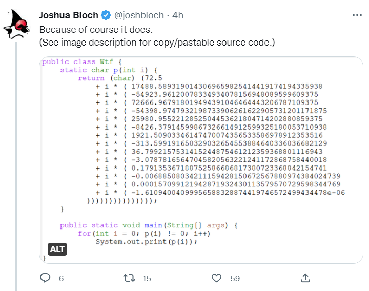

= Fun with obfuscated Groovy
Paul King
:revdate: 2022-12-08T00:40:23+00:00
:keywords: groovy, java, obfuscated, commons math
:description: This post looks at some Obfuscated code for outputting some well-known text.

An interesting tweet appeared in my feed this morning:

And of course it prints the same thing in Groovy:

[source,groovy]
----
char p(int i) {
    (char) (72.5
    + i * (17488.589319014318
    + i * (-54923.96120078333
    + i * (72666.96791801952
    + i * (-54398.97479321991
    + i * (25980.955221285272
    + i * (-8426.37914599868
    + i * (1921.5090334614745
    + i * (-313.59919165032926
    + i * (36.799215753141524
    + i * (-3.0787816564704586
    + i * (0.17913536718875267
    + i * (-0.0068850803421115925
    + i * (1.5709912194287188E-4
    + i * (-1.6109400409995646E-6
    )))))))))))))))
}

var i = 0
while (p(i)) print p(i++)

----

[red]#STOP# reading now and try it out for yourself … or browse the
https://community.oracle.com/tech/developers/discussion/1239419/java-code-obfuscation-contest[possible origin]

[red]#SPOILER ALERT# okay, if you didn't stop, I guess it's still okay to scroll down to see what it prints out and how to create an obfuscated script yourself…

&#160; +
&#160; +
&#160; +
&#160; +
&#160; +
&#160; +
&#160; +
&#160; +
&#160;&#160;&#160;&#160;&#160;&#160;&#160;&#160;&#160;&#160;&#160;&#160;&#160;&#160;&#160;
&#160;&#160;&#160;&#160;&#160;&#160;&#160;&#160;&#160;&#160;&#160;&#160;&#160;&#160;&#160;
&#160;&#160;&#160;&#160;&#160;&#160;&#160;&#160;&#160;&#160;&#160;&#160;&#160;&#160; ↓ +

&#160; +
&#160; +
&#160; +
&#160; +
&#160; +
&#160; +
&#160; +
&#160; +
&#160;&#160;&#160;&#160;&#160;&#160;&#160;&#160;&#160;&#160;&#160;&#160;&#160;&#160;&#160;
&#160;&#160;&#160;&#160;&#160;&#160;&#160;&#160;&#160;&#160;&#160;&#160;&#160;&#160;&#160;
&#160;&#160;&#160;&#160;&#160;&#160;&#160;&#160;&#160;&#160;&#160;&#160;&#160;&#160; ↓ +

&#160; +
&#160; +
&#160; +
&#160; +
&#160; +
&#160; +
&#160; +
&#160; +
&#160;&#160;&#160;&#160;&#160;&#160;&#160;&#160;&#160;&#160;&#160;&#160;&#160;&#160;&#160;
&#160;&#160;&#160;&#160;&#160;&#160;&#160;&#160;&#160;&#160;&#160;&#160;&#160;&#160;&#160;
&#160;&#160;&#160;&#160;&#160;&#160;&#160;&#160;&#160;&#160;&#160;&#160;&#160;&#160; ↓ +

&#160; +
&#160; +
&#160; +
&#160; +
&#160; +
&#160; +
&#160; +
&#160; +

Let's Groovify the https://twitter.com/nikialeksey/status/1600598026678149120[reply] from
https://twitter.com/nikialeksey[Alexey Nikitin] which uses
https://commons.apache.org/proper/commons-math/[Apache Commons Math] to
replicate the problem:

[source,groovy]
----
@Grab('org.apache.commons:commons-math3:3.6.1')
import org.apache.commons.math3.analysis.interpolation.NevilleInterpolator

var text = 'Hello, world!\n'
var size = text.size()
var x = new double[size + 1]
var y = new double[size + 1]
for(i in 0..<size) {
    x[i] = i
    y[i] = (int) text[i]
}
x[size] = size
y[size] = 0

var lines = []
var interpolator = new NevilleInterpolator()
var function = interpolator.interpolate(x, y)
var coeff = function.coefficients
lines << 'char p(int i) {'
lines << "  (char) (${coeff[0]} + 0.5"
for(i in 1..<coeff.length) {
    lines << '    + i * (' + coeff[i]
}
lines << '  ' + ')' * coeff.length
lines << '''}
var i = 0
var out = ''
while(p(i)) out += p(i++)
out
'''
var script = lines.join('\n')
println script
assert text == Eval.me(script)
----

This generates the script, prints it out, and then runs it to make sure it produces what we intended. It only differs from above in that instead of printing out each character, it builds up and returns a String so that we can assert our expectations. It was simpler than capturing stdout by other means.

Enjoy!