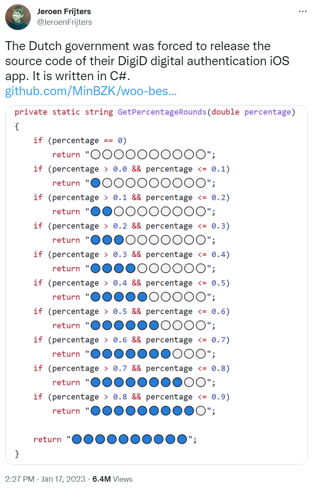

= Fun with rating stars

:category: blog

== Star Ratings

A recent tweet showed some C# code for producing a String of stars that might
be used when displaying ratings on a website:



Let's have a look at several ways to do the same thing in Groovy.

```
def rating0(percentage) {
    int stars = Math.ceil(percentage * 10)
    ("⬤" * stars).padRight(10, "○")
}
```
```
def rating1(percentage) {
    int stars = Math.ceil(percentage * 10)
    "⬤" * stars + "○" * (10-stars)
}
```
```
def rating2(percentage) {
    int skip = 10 - Math.ceil(percentage * 10)
    "⬤⬤⬤⬤⬤⬤⬤⬤⬤⬤○○○○○○○○○○"[skip..<10+skip]
}
```

```
def rating3(percentage) {
    switch(percentage) {
        case 0 -> "○○○○○○○○○○"
        case { it <= 0.1 } -> "⬤○○○○○○○○○"
        case { it <= 0.2 } -> "⬤⬤○○○○○○○○"
        case { it <= 0.3 } -> "⬤⬤⬤○○○○○○○"
        case { it <= 0.4 } -> "⬤⬤⬤⬤○○○○○○"
        case { it <= 0.5 } -> "⬤⬤⬤⬤⬤○○○○○"
        case { it <= 0.6 } -> "⬤⬤⬤⬤⬤⬤○○○○"
        case { it <= 0.7 } -> "⬤⬤⬤⬤⬤⬤⬤○○○"
        case { it <= 0.8 } -> "⬤⬤⬤⬤⬤⬤⬤⬤○○"
        case { it <= 0.9 } -> "⬤⬤⬤⬤⬤⬤⬤⬤⬤○"
        default -> "⬤⬤⬤⬤⬤⬤⬤⬤⬤⬤"
    }
}
```

If you want you can test the various edge cases:

```
for (i in 0..3)
    for (j in [0, 0.09, 0.1, 0.11, 0.9, 1])
        println "rating$i"(j)

```

== Increasing Robustness

The code examples here assume that the input is in the range `0 \<= percentage \<= 1`. There are several tweaks we could do to guard against inputs outside those ranges.

We could simply add an assert, e.g.:

```
def rating4(percentage) {
    assert percentage >= 0 && percentage <= 1
    int stars = Math.ceil(percentage * 10)
    ("⬤" * stars).padRight(10, "○")
}
```

Or, if we wanted to not fail, tweak some of our conditions, e.g.
for `rating3`, instead of `case 0`, we could use `case { it <= 0 }`.

We could push the checks into our types by making a special class, `Percent` say, which only permitted the allowed values:
```
final class Percent {
    final Double value
    Percent(Double value) {
        assert value >= 0 && value <= 1
        this.value = value
    }
}
```
And we could optionally also use some metaprogramming to provide a custom `isCase` method:
```
Double.metaClass.isCase = { Percent p -> delegate >= p.value }
```
Which means we could tweak the rating method to be:
```
def rating5(Percent p) {
    switch(p) {
        case 0.0d -> "○○○○○○○○○○"
        case 0.1d -> "⬤○○○○○○○○○"
        case 0.2d -> "⬤⬤○○○○○○○○"
        case 0.3d -> "⬤⬤⬤○○○○○○○"
        case 0.4d -> "⬤⬤⬤⬤○○○○○○"
        case 0.5d -> "⬤⬤⬤⬤⬤○○○○○"
        case 0.6d -> "⬤⬤⬤⬤⬤⬤○○○○"
        case 0.7d -> "⬤⬤⬤⬤⬤⬤⬤○○○"
        case 0.8d -> "⬤⬤⬤⬤⬤⬤⬤⬤○○"
        case 0.9d -> "⬤⬤⬤⬤⬤⬤⬤⬤⬤○"
        default   -> "⬤⬤⬤⬤⬤⬤⬤⬤⬤⬤"
    }
}
```

We can be fancier here using `@EqualsAndHashCode` on the `Percent` class and/or using `@Delegate` on the `value` property, depending on how rich in
functionality we wanted the `Percent` instances to be.

Alternatively, we could use a design-by-contract approach:

```
@Requires({ percentage >= 0 && percentage <= 1 })
def rating6(percentage) {
    int stars = Math.ceil(percentage * 10)
    ("⬤" * stars).padRight(10, "○")
}
```

== References

https://twitter.com/JeroenFrijters/status/1615204074588180481[Original tweet]

== Update history

1.0 (2023-01-25):: Initial version
