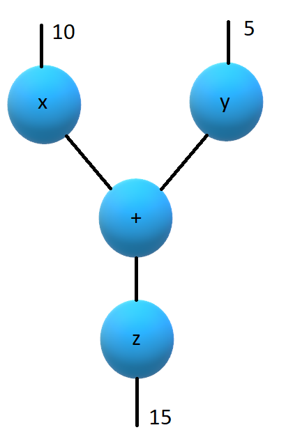

= GPars meets Virtual Threads
Paul King
:revdate: 2022-06-15T11:28:56+00:00
:updated: 2023-04-14T18:23:00+00:00
:keywords: concurrency, groovy, virtual threads, actors, dataflow, agents
:description: This post looks at using GPars with virtual threads.

image:img/gpars_logo.png[gpars,150,float="right"]
An exciting feature coming in JDK21 is Virtual Threads
(https://openjdk.java.net/jeps/444[JEP 444]).
It has been previewed in JDK19 (https://openjdk.java.net/jeps/425[JEP 425])
and JDK20 (https://openjdk.java.net/jeps/436[JEP 436]) but JDK21 will be the first version
that the feature is available without using Java's preview switch.
The examples in this blog were tested with Groovy 4.0.11 using JDK version 21-ea+18-1480
(and using JDK19 with preview features enabled).

Virtual threads work well with my favourite Groovy parallel
and concurrency library http://gpars.org/[GPars]. GPars has been
around a while (since Java 5 and Groovy 1.8 days) but still has
many useful features. Let's have a look at a few examples.

If you want to try these out, use the latest JDK21ea version which has virtual
thread support as standard. Or use a recent JDK19-20 version
and enable _preview_ features with your Groovy tooling.

== Parallel Collections

First a refresher, we'll first look at using the GPars parallel collections feature
with normal threads. Let's start with a list of numbers:

[source,groovy]
----
var nums = [1, 2, 3]
----

To calculate the list of squares of our original numbers in
parallel with normal threads, we use the `GParsPool.withPool` method as follows:

[source,groovy]
----
withPool {
    assert nums.collectParallel{ it ** 2 } == [1, 4, 9]
}
----

For any Java readers, don't get confused with the `collectParallel`
method name. Groovy's `collect` method (naming inspired by
Smalltalk) is the equivalent of Java's `map` method. So, the
equivalent Groovy code using the Java streams API would be
something like:

[source,groovy]
----
assert nums.parallelStream().map(n -> n ** 2).toList() == [1, 4, 9]
----

Now, let's bring virtual threads into the picture. Luckily,
GPars parallel collection facilities provide a hook for using
an _existing_ custom executor service. This makes using virtual
threads for such code easy. First we create our pool (backed by virtual threads):

[source,groovy]
----
var vtPool = Executors.newVirtualThreadPerTaskExecutor()
----

Now, we can use it as follows:

[source,groovy]
----
withExistingPool(vtPool) {
    assert nums.collectParallel{ it ** 2 } == [1, 4, 9]
}
----

Or we can use one of the other many _'*Parallel'_ methods, in this case `findAllParallel`:
[source,groovy]
----
var isEven = n -> n % 2 == 0
withExistingPool(vtPool) {
    assert (1..9).findAllParallel(isEven) == (2..8).step(2)
}
----

Nice! Using virtual threads is very simple!

Let's look at one more example, the https://en.wikipedia.org/wiki/Fizz_buzz[FizzBuzz] example:

[source,groovy]
----
var result = withExistingPool(vtPool) {
    (1..15).collectParallel {
        switch(it) {
            case { it % 15 == 0 } -> 'FizzBuzz'
            case { it % 5 == 0 } -> 'Buzz'
            case { it % 3 == 0 } -> 'Fizz'
            default -> it
        }
    }.join(',')
}
assert result == '1,2,Fizz,4,Buzz,Fizz,7,8,Fizz,Buzz,11,Fizz,13,14,FizzBuzz'
----

Now, let's move onto some examples which might be
less familiar to Java developers.

GPars has additional features for providing custom thread pools
and the remaining examples rely on those features. The current
version of GPars doesn't have a `DefaultPool` constructor that
takes a vanilla executor service; so, we'll write our own class:

[source,groovy]
----
@AutoImplement
class VirtualPool implements Pool {
    private final ExecutorService pool = Executors.newVirtualThreadPerTaskExecutor()
    int getPoolSize() { pool.poolSize }
    void execute(Runnable task) { pool.execute(task) }
    ExecutorService getExecutorService() { pool }
}
----

It is essentially a delegate from the GPars `Pool` interface
to the virtual threads executor service.

We'll use this in the remaining examples.

== Agents

Agents provide a thread-safe non-blocking wrapper around an
otherwise potentially mutable shared state object. They are
inspired by agents in Clojure.

In our case we'll use an agent to "protect" a plain `ArrayList`.
For this simple case, we could have used some synchronized list,
but in general, agents eliminate the need to find thread-safe
implementation classes or indeed care at all about the thread
safety of the underlying wrapped object.

[source,groovy]
----
var mutableState = []     // a non-synchronized mutable list
var agent = new Agent(mutableState)

agent.attachToThreadPool(new VirtualPool()) // omit line for normal threads

agent { it << 'Dave' }    // one thread updates list
agent { it << 'Joe' }     // another thread also updating
assert agent.val.size() == 2
----

== Actors

Actors allow for a message passing-based concurrency model.
The actor model ensures that at most one thread processes
the actor's body at any time. The GPars API and DSLs for actors
are quite rich supporting many features. We'll look at a simple
example here.

GPars manages actor thread pools in groups.
Let's create one backed by virtual threads:

[source,groovy]
----
var vgroup = new DefaultPGroup(new VirtualPool())
----

Now we can write an encrypting and decrypting actor pair as follows:

[source,groovy]
----
var decryptor = vgroup.actor {
    loop {
        react { String message ->
            reply message.reverse()
        }
    }
}

var console = vgroup.actor {
    decryptor << 'lellarap si yvoorG'
    react {
        println 'Decrypted message: ' + it
    }
}

console.join() // output: Decrypted message: Groovy is parallel
----

== Dataflow

Dataflow offers an inherently safe and robust declarative
concurrency model. Dataflows are also managed via thread
groups, so we'll use `vgroup` which we created earlier.

For the sake of an example, we'll create a scenario where two
tasks are producing some results and a third task is adding the results
of the other tasks.

We have three logical tasks which can run in parallel and perform
their work. The tasks need to exchange data and they do so using
_dataflow variables_. Think of dataflow variables as one-shot
channels safely and reliably transferring data from producers to
their consumers.

[source,groovy]
----
var df = new Dataflows()

vgroup.with {
    task {
        df.z = df.x + df.y
    }

    task {
        df.x = 10
    }

    task {
        df.y = 5
    }

    assert df.z == 15
}
----

This code is declarative in style. We can specify the three tasks in any order.
We aren't giving any indication of which tasks should occur first.
The dataflow framework works out how to schedule the individual
tasks and ensures that a task's input variables are ready when
needed.

== Conclusion

We have had a quick glimpse at using virtual threads with Groovy
and GPars. It is still early days with virtual threads, so expect
much more to emerge as JDK21 becomes more mainstream.
