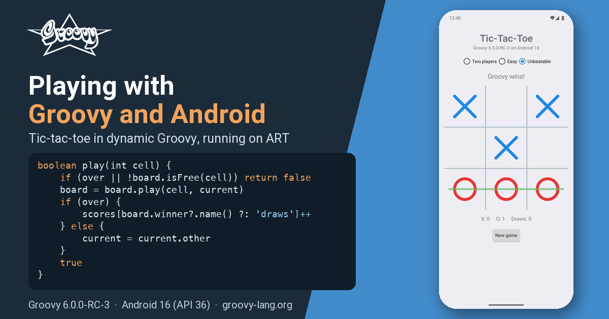
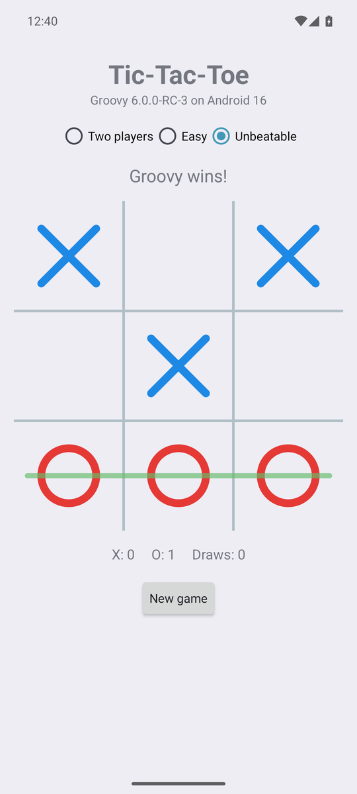
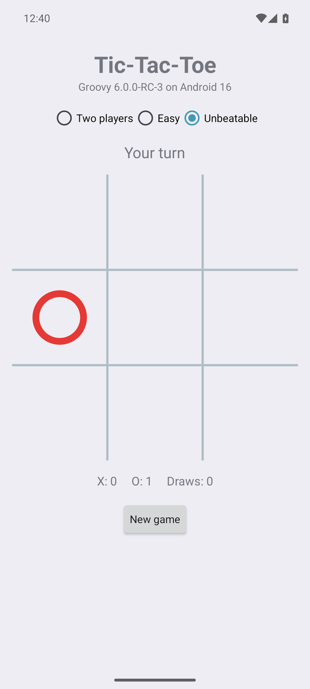

= Playing with Groovy&trade; and Android
Paul King
:revdate: 2026-09-18T14:00:00+00:00
:keywords: android, groovy 6, tic-tac-toe, minimax, invokedynamic, art, dynamic groovy, preview
:description: A playable tic-tac-toe app written in dynamic Groovy 6, built with a stock Android Gradle plugin and running on Android 16. More to come in Groovy 7.

== Introduction

Groovy and Android have history. Back in the Groovy 2.4 days, a special
_grooid_ build of the Groovy jar and a dedicated Gradle plugin let you write
Android apps in Groovy. Android's tooling moved on quite dramatically over the
following years, and Groovy's Android story went quiet.

Groovy 6 gives us a fresh opportunity. A good deal of the work that went into
Groovy 6 was about making the runtime leaner and more predictable: every
dynamic call now goes through `invokedynamic`, the reflective machinery has
been trimmed and comes with reachability metadata for GraalVM native images,
and the runtime no longer leans on a few JDK corners that only a full JDK has.
A happy side effect is that dynamic Groovy now runs on a modern Android
runtime (ART) using a stock Android Gradle plugin. No Groovy-specific plugin
is needed.

We are calling this a _preview_ feature in Groovy 6. It works, as this post
shows, but it needs one small shim (more on that later), and the current
release candidate has a couple of rough edges. Removing the shim is earmarked
for Groovy 7, and we expect the rough edges to be gone before Groovy 6.0.0
final. Consider this post a taste of what's coming, and an invitation to play
along.

Rather than "hello world", let's build a game: tic-tac-toe (noughts and
crosses for some of us), with an unbeatable computer opponent.

== The app

There are three ways to play: two people passing the phone around, an easy
opponent that moves at random, and an unbeatable one that has searched the
whole game. The board is drawn on a canvas, the winning line is highlighted,
scores are kept, and the game in progress survives rotation and relaunch.
Nothing fancy, but a real app that real people can play (well, real people
who enjoy losing to their phone).

Everything you see is Groovy 6.0.0-RC-3 running on an Android 16 (API 36)
emulator. The project is a stock Android application module plus a plain
Groovy library module, built with the Android Gradle Plugin 9.4, Gradle 9.7
and JDK 17. Both the debug build and the R8-shrunk release build were used
while writing this post.

The source is on GitHub if you want to follow along (link at the end).

== The engine: plain Groovy, tested on the JVM

The game logic has no Android in it at all. `Board` is an immutable 3x3
board with cells numbered 0 to 8. It is statically compiled since it sits at
the bottom of every search, but it reads like any other Groovy class:

[source,groovy]
----
@CompileStatic
final class Board {
    static final List<List<Integer>> LINES = [
        [0, 1, 2], [3, 4, 5], [6, 7, 8],   // rows
        [0, 3, 6], [1, 4, 7], [2, 5, 8],   // columns
        [0, 4, 8], [2, 4, 6]               // diagonals
    ]

    private final List<Mark> cells
    ...
    Mark getAt(int cell) { cells[cell] }

    Board play(int cell, Mark mark) {
        if (cells[cell]) throw new IllegalArgumentException("cell $cell is already taken")
        List<Mark> next = new ArrayList<>(cells)
        next[cell] = mark
        new Board(next)
    }

    List<Integer> getFreeCells() {
        (0..8).findAll { int cell -> !cells[cell] }
    }

    List<Integer> getWinningLine() {
        LINES.find { List<Integer> line ->
            Mark first = cells[line[0]]
            first && line.every { int cell -> cells[cell] == first }
        }
    }

    Mark getWinner() {
        List<Integer> line = winningLine
        line ? cells[line[0]] : null
    }

    boolean isFull() { !cells.contains(null) }

    boolean isOver() { winner || full }
}
----

The unbeatable opponent is a full-depth minimax search. Tic-tac-toe has only
5478 reachable positions, so every position visited is remembered, and after
one search from an empty board the whole game is known. Positions are stored
with the player to move always called X, so games opened by either mark
share the table:

[source,groovy]
----
@CompileStatic
final class Minimax {
    private static final Map<String, Integer> VALUES = new ConcurrentHashMap<>()
    private static final Random RANDOM = new Random()

    /** The best cell for {@code mark} to play. Ties are broken at random so games differ. */
    static int bestMove(Board board, Mark mark) {
        Map<Integer, List<Integer>> cellsByValue = board.freeCells.groupBy { int cell ->
            -value(board.play(cell, mark), mark.other)
        }
        List<Integer> best = cellsByValue.max { Map.Entry<Integer, List<Integer>> entry -> entry.key }.value
        best[RANDOM.nextInt(best.size())]
    }

    /** Positive for a forced win, negative for a forced loss, zero for a draw. */
    static int value(Board board, Mark toMove) {
        if (toMove == Mark.O) return value(board.swapped, Mark.X)
        String key = board.toString()
        Integer known = VALUES[key]
        if (known != null) return known
        int result
        if (board.winner) {
            result = -(board.freeCells.size() + 1)   // O has just won
        } else if (board.full) {
            result = 0
        } else {
            result = board.freeCells.collect { int cell -> -value(board.play(cell, Mark.X), Mark.O) }.max()
        }
        VALUES[key] = result
        result
    }
}
----

The three ways to play are an enum whose constants carry a closure. Groovy
lets an enum constant take a closure as a constructor argument, which is a
tidy way to bundle a strategy with its label:

[source,groovy]
----
enum Mode {
    TWO_PLAYERS('Two players', null),
    EASY('Easy', { Board board, Mark mark -> board.freeCells.shuffled().first() }),
    UNBEATABLE('Unbeatable', { Board board, Mark mark -> Minimax.bestMove(board, mark) })

    final String label
    private final Closure<Integer> chooser

    Mode(String label, Closure<Integer> chooser) {
        this.label = label
        this.chooser = chooser
    }

    boolean isComputer() { chooser != null }

    int choose(Board board, Mark mark) { chooser(board, mark) }
}
----

A `Game` ties these together: the board, whose turn it is, the mode and the
running score. It is dynamic Groovy, and the heart of it is a dozen lines:

[source,groovy]
----
class Game {
    static final Mark HUMAN = Mark.X

    Board board = new Board()
    Mode mode = Mode.UNBEATABLE
    Mark starter = Mark.X
    Mark current = Mark.X
    Map<String, Integer> scores = [X: 0, O: 0, draws: 0]

    boolean isOver() { board.over }

    boolean isComputerTurn() { mode.computer && !over && current != HUMAN }

    boolean play(int cell) {
        if (over || !board.isFree(cell)) return false
        board = board.play(cell, current)
        if (over) {
            scores[board.winner?.name() ?: 'draws']++
        } else {
            current = current.other
        }
        true
    }

    void newGame() {
        if (over) starter = starter.other
        board = new Board()
        current = starter
    }
    ...
}
----

Because none of this touches Android, it is tested where tests are cheap:
plain JUnit 5 tests run by Gradle on the JVM. My favourite plays two hundred
games against a random opponent and checks the computer never loses:

[source,groovy]
----
@Test
void 'never loses to a random opponent as either mark'() {
    def random = new Random(42)
    200.times { n ->
        def computer = n % 2 == 0 ? X : O
        def board = new Board()
        def turn = X
        while (!board.over) {
            def free = board.freeCells
            int cell = turn == computer ? Minimax.bestMove(board, turn) : free[random.nextInt(free.size())]
            board = board.play(cell, turn)
            turn = turn.other
        }
        assertNotEquals(computer.other, board.winner, "lost game $n: $board".toString())
    }
}
----

== The screen: dynamic Groovy meets Android

Now for the Android part, and this is where it gets interesting: the custom
`View` that draws the board and the `Activity` that runs the screen are
_dynamic_ Groovy. Android calls `onMeasure`, `onDraw` and `onTouchEvent`,
and every call inside them goes through the Groovy runtime on ART.

[source,groovy]
----
class BoardView extends View {
    private Board board = new Board()
    /** Called with the tapped cell number (0..8). */
    Closure onCellTapped

    private final Paint gridPaint, xPaint, oPaint, winPaint
    ...
    @Override
    protected void onDraw(Canvas canvas) {
        super.onDraw(canvas)
        int cell = cellSize
        int size = cell * 3
        int inset = cell.intdiv(4)

        (1..2).each { i ->
            canvas.drawLine(i * cell, 0, i * cell, size, gridPaint)
            canvas.drawLine(0, i * cell, size, i * cell, gridPaint)
        }

        (0..8).each { i ->
            def mark = board[i]
            if (!mark) return
            int left = (i % 3) * cell
            int top = i.intdiv(3) * cell
            if (mark == Mark.X) {
                canvas.drawLine(left + inset, top + inset, left + cell - inset, top + cell - inset, xPaint)
                canvas.drawLine(left + cell - inset, top + inset, left + inset, top + cell - inset, xPaint)
            } else {
                canvas.drawCircle(centreX(i), centreY(i), cell.intdiv(2) - inset, oPaint)
            }
        }
        ...
    }

    @Override
    boolean onTouchEvent(MotionEvent event) {
        if (event.action == MotionEvent.ACTION_DOWN) {
            int col = (event.x / cellSize) as int
            int row = (event.y / cellSize) as int
            if (col in 0..2 && row in 0..2) {
                performHapticFeedback(HapticFeedbackConstants.VIRTUAL_KEY)
                onCellTapped?.call(row * 3 + col)
            }
            performClick()
        }
        true
    }
}
----

One Groovy-ism worth knowing if you write drawing code: Groovy promotes
`float` arithmetic to `double`, and a `Double` won't dispatch dynamically to
`Canvas`'s `float` parameters, whereas an `Integer` will. Keeping the
geometry in integer pixels, as above, sidesteps that neatly.

The activity builds its screen in code, which is where Groovy's property
syntax, `tap`, and closures-as-listeners really shine:

[source,groovy]
----
def modes = new RadioGroup(this).tap {
    orientation = LinearLayout.HORIZONTAL
    gravity = Gravity.CENTER
}
Mode.values().each { mode ->
    modes.addView(new RadioButton(this).tap {
        text = mode.label
        id = mode.ordinal() + 1
    })
}
modes.check(game.mode.ordinal() + 1)
modes.setOnCheckedChangeListener { group, checkedId ->
    def mode = Mode.values()[checkedId - 1]
    if (mode != game.mode) {
        game.mode = mode
        game.newGame()
        render()
    }
}

boardView = new BoardView(this).tap {
    onCellTapped = { int cell ->
        if (!game.computerTurn && game.play(cell)) render()
    }
}

def newGame = new Button(this).tap {
    text = 'New game'
    setOnClickListener { game.newGame(); render() }
    setOnLongClickListener { game.resetScores(); render(); true }
}
----

Every Android listener interface is a SAM type, so a closure slots straight
in. The same goes for `Runnable`: the computer's move is searched on a
background thread and applied on the UI thread, but only if the game it was
searched for is still the one on screen (the user may have started a new
game or rotated the phone in the meantime):

[source,groovy]
----
private void think() {
    thinking = true
    def board = game.board
    def mark = game.current
    new Thread({ ->
        int cell = game.mode.choose(board, mark)
        runOnUiThread {
            thinking = false
            if (active && game.board == board && game.computerTurn) {
                game.play(cell)
                render()
            }
        }
    } as Runnable).start()
}
----

Finally, the whole game is saved to the activity's preferences after every
change, using the one-line `save()` form that `Game` provides, so rotation
and relaunch both just pick up where you left off. Groovy's string handling
makes the round trip a couple of lines:

[source,groovy]
----
String save() {
    "$board $mode $starter $current ${scores.X} ${scores.O} ${scores.draws}"
}

static Game restore(String saved) {
    def (board, mode, starter, current, x, o, draws) = saved.split(' ')
    new Game(board: Board.parse(board), mode: Mode.valueOf(mode),
             starter: Mark.valueOf(starter), current: Mark.valueOf(current),
             scores: [X: x as int, O: o as int, draws: draws as int])
}
----

== How it is built

The recipe is pleasingly boring, which is rather the point. There are three
modules:

* `game/` is a plain Groovy library module. It applies the ordinary `groovy`
  Gradle plugin and compiles against the SDK's `android.jar` stubs. It holds
  all of the Groovy code above, and its tests.
* `app/` is an ordinary Android application module: manifest, theme, launcher
  icon, R8 rules. It depends on `game` like any other jar and supplies the
  Android flavour of the Groovy runtime.
* `shim/` is the preview part, described below.

The interesting lines from `game/build.gradle`:

[source,groovy]
----
plugins {
    id 'groovy'
}

dependencies {
    // compile against the plain jar; the app module supplies the Android (grooid) jar at run time
    compileOnly "org.apache.groovy:groovy:${groovyVersion}"
    compileOnly files("${sdkDir()}/platforms/android-36/android.jar")

    testImplementation "org.apache.groovy:groovy:${groovyVersion}"
    testImplementation 'org.junit.jupiter:junit-jupiter:6.1.3'
    testRuntimeOnly 'org.junit.platform:junit-platform-launcher'
}
----

And from `app/build.gradle`:

[source,groovy]
----
android {
    compileSdk 36
    defaultConfig {
        // Groovy 6 emits invokedynamic for every dynamic call, which D8 accepts from API 26 up
        minSdk 26
        ...
    }
}

dependencies {
    implementation project(':game')
    // the groovy jar with java.beans replaced by a repackaged openbeans, since Android has no Introspector
    runtimeOnly "org.apache.groovy:groovy:${groovyVersion}:grooid"
    implementation project(':shim')   // preview: java.lang.invoke.SwitchPoint for ART
}
----

The `grooid` classifier jar is the same idea as in the Groovy 2.4 days: the
Groovy runtime with `java.beans` swapped for a repackaged OpenBeans, since
Android has no `Introspector`. D8 turns the class files from both modules
into DEX like any other library. The release build shrinks with R8, and the
keep rules for Groovy's own reflective surface are derived from the
reachability metadata the Groovy jars now ship for native images, so the
native-image work and the Android work feed each other.

=== About that shim

Groovy's runtime uses `java.lang.invoke.SwitchPoint` to invalidate cached
call sites when a metaclass changes. ART does not have `SwitchPoint`. The
`shim` module supplies a forty-line stand-in built on `MutableCallSite`,
which ART does have, compiled into the app's DEX under the `java.lang.invoke`
package. On a JVM the real class always wins; on Android the app's copy is
the only one there is.

This is what makes the feature a preview. The shim works, and the app you
see here runs on it, but it is not something we want to ask app developers to
carry around. For Groovy 7 we have earmarked an invalidation abstraction
inside the runtime itself, so that no shim is required, and we expect app
speed to be better without it too.

== How fast is it?

Honest numbers from the arm64 emulator, since this is the question everyone
asks:

[cols="3,1",options="header"]
|===
|Measurement |Result

|Whole-game search at startup, cold ART, background thread |about 3 to 4 seconds
|The same search on a warm JVM |about 50 ms
|Each computer move after that |1 to 10 ms
|Release APK after R8 |about 1 MB
|Debug APK |about 4.9 MB
|===

The app is perfectly responsive: the search runs in the background while you
are still reading the title, and every move after it is a table lookup. But
the gap between a cold ART and a warm JVM is real. Some of it is ART's
interpreter warming up, some of it is the runtime's reflective cold tier, and
some of it is the shim. This is an evolving story; the Groovy 7 work is aimed
squarely at it, and we would rather show you the numbers now than pretend
there is nothing to improve.

== Rough edges in RC-3

Two things came up while writing this post, and both are expected to be
fixed before Groovy 6.0.0 final:

* Static extension methods such as `Thread.start { }` and `sleep` are not
  available on Android in RC-3
  (link:https://issues.apache.org/jira/browse/GROOVY-12418[GROOVY-12418]),
  which is why the code above uses `new Thread(closure as Runnable)`.
* The R8 release build needs one keep rule beyond the ones derived from the
  reachability metadata, for the helper Groovy enums call by name
  (link:https://issues.apache.org/jira/browse/GROOVY-12419[GROOVY-12419]).

Neither gets in the way of writing the app; they are the kind of thing a
preview is for.

== Further information

* https://github.com/paulk-asert/groovy-android-tictactoe[Source code on GitHub]
* https://groovy-lang.org/releasenotes/groovy-6.0.html[Groovy 6 release notes]
* https://developer.android.com/build[Android Gradle Plugin documentation]

== Conclusion

Writing an Android app in Groovy 6 turns out not to be a hard thing to do:
a plain Groovy module, a stock Android module, one runtime jar and, for now,
one small shim. The engine is ordinary Groovy tested on the JVM, and the
screen is dynamic Groovy talking to the Android APIs with all the usual
sugar. It leverages the runtime and native-image work that went into Groovy 6,
and Groovy 7 should make it easier and faster still. Go on, have a play.

.Update history
****
*18/Sep/2026*: Initial version
****
