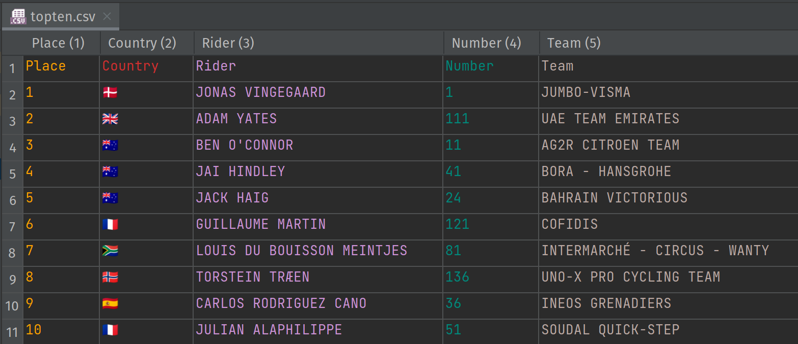

= Processing Results for the Critérium du Dauphiné
Paul King
:revdate: 2023-06-13T17:00:00+00:00
:description: This post looks at processing the general classification results for the Critérium du Dauphiné using Groovy, GQuery and DuckDB.
:keywords: groovy, cycling, duckdb, sql, ginq, gquery, csv

The 2023 https://www.criterium-du-dauphine.fr/en/[Critérium du Dauphiné]
has just finished. Let's examine the results using Groovy and DuckDB.
For the purposes of this post, we are interested in the overall top ten
riders in the general classification.

== Results file

Our results are stored in a CSV file:

In a
https://groovy.apache.org/blog/reading-and-writing-csv-files[previous article],
we looked at reading and writing CSV files using a number of CSV libraries. Today we will use a nice feature of
https://duckdb.org/[DuckDB]
which can read in CSV files on the fly.

Our goal is very simple, just print out the information but grouped by each rider's country.

[source,groovy]
----
Sql.withInstance('jdbc:duckdb:', 'org.duckdb.DuckDBDriver') { sql ->
    println "Country  Riders                                  Places    Count"
    sql.eachRow("""SELECT Country,
        rpad(string_agg(Rider, ', '), 40, ' ') as Riders,
        rpad(string_agg(Place, ', '), 10, ' ') as Places,
        bar(count(Country), 0, 4, 30) as Count
        FROM 'topten.csv' GROUP BY Country""") { row ->
        row.with {
            println "$Country       $Riders$Places$Count"
        }
    }
}
----

Here we are making use of several built-in functions from DuckDB
including `rpad` to right pad the output, `string_agg` to aggregate
the riders (and their places) from the same country, and `bar`
to produce a pretty barchart.

Running this code produces the following output:

[source,text]
----
Country  Riders                                  Places    Count
🇩🇰       JONAS VINGEGAARD                        1         ███████▌
🇬🇧       ADAM YATES                              2         ███████▌
🇦🇺       BEN O’CONNOR, JAI HINDLEY, JACK HAIG    3, 4, 5   ██████████████████████▌
🇫🇷       GUILLAUME MARTIN, JULIAN ALAPHILIPPE    6, 10     ███████████████
🇿🇦       LOUIS DU BOUISSON MEINTJES              7         ███████▌
🇳🇴       TORSTEIN TRÆEN                          8         ███████▌
🇪🇸       CARLOS RODRIGUEZ CANO                   9         ███████▌
----

We can achieve a similar result using GQuery (AKA GINQ) using the following code:

[source,groovy]
----
var f = 'topten.csv' as File
var lines = f.readLines()*.split(',')
var cols = lines[0].size()
var rows = lines[1..-1].collect{row ->
    (0..<cols).collectEntries{ col -> [lines[0][col], row[col]] }}
var commaDelimited = Collectors.joining(', ')
var aggRiders = { it.stream().map(rec -> rec.r.Rider).collect(commaDelimited) }
var aggPlaces = { it.stream().map(rec -> rec.r.Place).collect(commaDelimited) }
println GQ {
    from r in rows
    groupby r.Country
    select r.Country,
        agg(aggRiders(_g)) as Riders,
        agg(aggPlaces(_g)) as Places,
        '██' * count(r.Country) as Count
}
----

We could use a CSV library to read in the data, but for this simple example
we'll just use Groovy's line/text processing capabilities.
GQuery doesn't currently have built in equivalents to `bar` or `string_agg`
so we roll our own crude bar character function and aggregators, `aggRiders`
and `aggPlaces`.

Running this code gives the following output:

[source,text]
----
+---------+--------------------------------------+---------+--------+
| Country | Riders                               | Places  | Count  |
+---------+--------------------------------------+---------+--------+
| 🇦🇺      | BEN O’CONNOR, JAI HINDLEY, JACK HAIG | 3, 4, 5 | ██████ |
| 🇩🇰      | JONAS VINGEGAARD                     | 1       | ██     |
| 🇳🇴      | TORSTEIN TRÆEN                       | 8       | ██     |
| 🇿🇦      | LOUIS DU BOUISSON MEINTJES           | 7       | ██     |
| 🇬🇧      | ADAM YATES                           | 2       | ██     |
| 🇪🇸      | CARLOS RODRIGUEZ CANO                | 9       | ██     |
| 🇫🇷      | GUILLAUME MARTIN, JULIAN ALAPHILIPPE | 6, 10   | ████   |
+---------+--------------------------------------+---------+--------+
----

For Groovy 5, we are currently exploring the possibility of adding more
functions in GQuery, like `bar` and `stringAgg`. If you are interested in this
functionality, please get in touch via the
https://groovy-lang.org/mailing-lists.html[mailing lists] or
http://groovycommunity.com/[Slack].