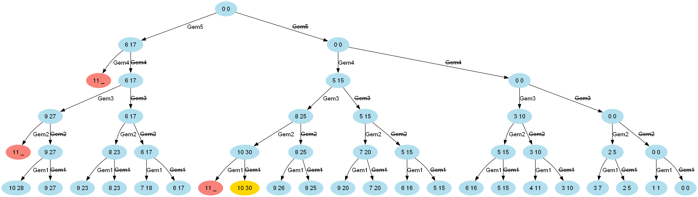
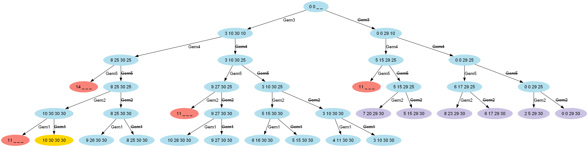

= Solving the Knapsack Problem with Groovy
Paul King
:revdate: 2024-02-09T15:00:00+00:00
:keywords: knapsack, optimisation, choco, genetic algorithms, dynamic programming
:description: This post looks at solving the knapsack problem with Groovy.

The
https://en.wikipedia.org/wiki/Knapsack_problem[knapsack problem]
is a problem in combinatorial optimization.
Given a set of items, each of a given weight and value,
determine which items to place into a knapsack (or other container)
in order to maximise the value within the knapsack without exceeding
a given weight limit.

== Case Study

For our case study, we'll start with placing gems within the
knapsack. The gems have the following characteristics:

|===
| Index&nbsp; | Weight&nbsp; | Value

| 0
| 1
| 1

| 1
| 2
| 5

| 2
| 3
| 10

| 3
| 5
| 15

| 4
| 6
| 17
|===

The gem can either be in the knapsack or not.
This is known as the 0/1 knapsack variation of the problem.
We'll look at some other variations later.

Our goal then is to find out which gems we place into the knapsack to
maximise the value.

== Brute force

The first approach we might take is simply to try all
possible combinations, throwing away any which exceed
the weight limit, and then finding the maximum value of those that are left.

One way to do this is to generate all possible index combinations.
Then, select the ones which satisfy the knapsack weight constraint.
Then, find the one which yields the highest value as shown here:

[source,groovy]
----
int[] values = [1, 5, 10, 15, 17]  // Gem values
int[] weights = [1, 2, 3, 5, 6]    // Weights
int W = 10

var totalValue = { it*.v.sum() }
var withinLimit = { it*.w.sum() <= W }
var asTriple = { [i:it, w:weights[it], v:values[it]] }

var best = weights
    .indices
    .collect(asTriple)
    .subsequences()
    .findAll(withinLimit)
    .max(totalValue)

println "Total value for capacity $W = ${totalValue(best)}"
println "Gems taken: ${best*.i}"
println "Gem weights: ${best*.w}"
----

In a bit more detail, we first define three helper closures, `totalValue`, `withinLimit`,
and `asTriple`. Collecting our data into the list of maps (triples) isn't required
but simplifies subsequent processing. Once we have our data, we find the
subsequences, retain the ones within the weight limit, and then find the maximum value.

Running this script yields the following output:

----
Total value for capacity 10 = 30
Gems taken: [1, 2, 3]
Gem weights: [2, 3, 5]
----

While this is simple enough, it doesn't offer many opportunities
for optimisation. For a small problem like our case study,
optimisation is not important, but for larger problems,
the number of combinations may grow exponentially large,
and we'll want to keep that in mind.

Let's instead, consider a recursive solution which lets us opt out
earlier for cases which will exceed the maximum knapsack weight limit:

[source,groovy]
----
int solve(int[] w, int[] v, int W) {
    knapsack(w, v, v.length, W)
}

int knapsack(int[] w, int[] v, int n, int W) {
    if (n <= 0) {
        0
    } else if (w[n - 1] > W) {
        knapsack(w, v, n - 1, W)
    } else {
        [knapsack(w, v, n - 1, W),
         v[n - 1] + knapsack(w, v, n - 1, W - w[n - 1])].max()
    }
}

int[] values = [1, 5, 10, 15, 17]  // Gem values
int[] weights = [1, 2, 3, 5, 6]    // Weights
[6, 8, 10].each {
    println "Total value for capacity $it = ${solve(weights, values, it)}"
}
----

Here, we consider each gem (for a given stage, gem `n`, or index `n - 1`).
There are two paths to calculate, one with the gem _included_,
the other with it _excluded_. We remember the maximum value returned
from the two paths and continue processing. When a gem is included,
we then solve the smaller problem of fitting the remaining gems into a conceptually
smaller knapsack. If placing a gem into the knapsack causes the weight to exceed
the limit, then we can discard that path from further processing.

It is useful to visualize the above process as a solution tree (shown for capacity 10):

//[graphviz,brute-force-tree]
[comment]
--
digraph unix {
	fontname="Helvetica,Arial,sans-serif"
	node [fontname="Helvetica,Arial,sans-serif"]
	edge [fontname="Helvetica,Arial,sans-serif"]
	node [color=lightblue2, style=filled];
	n [label="0 0"]
	n5 [label="6 17"]
	n_ [label="0 0"]

	n54 [label="11 _", color="#f88379"]
	n_4 [label="5 15"]
	n5_ [label="6 17"]
	n__ [label="0 0"]

	n5_3 [label="9 27"]
	n5__ [label="6 17"]
	n_43 [label="8 25"]
	n_4_ [label="5 15"]
	n__3 [label="3 10"]
	n___ [label="0 0"]

	n__32 [label="5 15"]
	n___2 [label="2 5"]
	n5_32 [label="11 _", color="#f88379"]
	n5__2 [label="8 23"]
	n_432 [label="10 30"]
	n_4_2 [label="7 20"]

	n__3_ [label="3 10"]
	n____ [label="0 0"]
	n5_3_ [label="9 27"]
	n5___ [label="6 17"]
	n_43_ [label="8 25"]
	n_4__ [label="5 15"]
	n__3_ [label="3 10"]
	n____ [label="0 0"]

	n__321 [label="6 16"]
	n___21 [label="3 7"]
	n5__21 [label="9 23"]
	n_4321 [label="11 _", color="#f88379"]
	n_4_21 [label="9 20"]
	n__3_1 [label="4 11"]
	n____1 [label="1 1"]
	n5_3_1 [label="10 28"]
	n5___1 [label="7 18"]
	n_43_1 [label="9 26"]
	n_4__1 [label="6 16"]
	n__3_1 [label="4 11"]
	n____1 [label="1 1"]

	n__32_ [label="5 15"]
	n___2_ [label="2 5"]
	n5__2_ [label="8 23"]
	n_432_ [label="10 30", color=gold]
	n_4_2_ [label="7 20"]
	n__3__ [label="3 10"]
	n_____ [label="0 0"]
	n5_3__ [label="9 27"]
	n5____ [label="6 17"]
	n_43__ [label="8 25"]
	n_4___ [label="5 15"]
	n__3__ [label="3 10"]
	n_____ [label="0 0"]

	n -> n5 [label="Gem5"];
	n -> n_ [label=<<s>Gem5</s>>];

	n5 -> n54 [label="Gem4"];
	n5 -> n5_ [label=<<s>Gem4</s>>];
	n_ -> n_4 [label="Gem4"];
	n_ -> n__ [label=<<s>Gem4</s>>];

	n5_ -> n5_3 [label="Gem3"];
	n5_ -> n5__ [label=<<s>Gem3</s>>];
	n_4 -> n_43 [label="Gem3"];
	n_4 -> n_4_ [label=<<s>Gem3</s>>];
	n__ -> n__3 [label="Gem3"];
	n__ -> n___ [label=<<s>Gem3</s>>];

	n5_3 -> n5_32 [label="Gem2"];
	n5_3 -> n5_3_ [label=<<s>Gem2</s>>];
	n_43 -> n_432 [label="Gem2"];
	n_43 -> n_43_ [label=<<s>Gem2</s>>];
	n__3 -> n__32 [label="Gem2"];
	n__3 -> n__3_ [label=<<s>Gem2</s>>];
	n5__ -> n5__2 [label="Gem2"];
	n5__ -> n5___ [label=<<s>Gem2</s>>];
	n_4_ -> n_4_2 [label="Gem2"];
	n_4_ -> n_4__ [label=<<s>Gem2</s>>];
	n___ -> n___2 [label="Gem2"];
	n___ -> n____ [label=<<s>Gem2</s>>];

	n_432 -> n_4321 [label="Gem1"];
	n_432 -> n_432_ [label=<<s>Gem1</s>>];
	n__32 -> n__321 [label="Gem1"];
	n__32 -> n__32_ [label=<<s>Gem1</s>>];
	n5__2 -> n5__21 [label="Gem1"];
	n5__2 -> n5__2_ [label=<<s>Gem1</s>>];
	n_4_2 -> n_4_21 [label="Gem1"];
	n_4_2 -> n_4_2_ [label=<<s>Gem1</s>>];
	n___2 -> n___21 [label="Gem1"];
	n___2 -> n___2_ [label=<<s>Gem1</s>>];

	n5_3_ -> n5_3_1 [label="Gem1"];
	n5_3_ -> n5_3__ [label=<<s>Gem1</s>>];
	n_43_ -> n_43_1 [label="Gem1"];
	n_43_ -> n_43__ [label=<<s>Gem1</s>>];
	n__3_ -> n__3_1 [label="Gem1"];
	n__3_ -> n__3__ [label=<<s>Gem1</s>>];
	n5___ -> n5___1 [label="Gem1"];
	n5___ -> n5____ [label=<<s>Gem1</s>>];
	n_4__ -> n_4__1 [label="Gem1"];
	n_4__ -> n_4___ [label=<<s>Gem1</s>>];
	n____ -> n____1 [label="Gem1"];
	n____ -> n_____ [label=<<s>Gem1</s>>];
}
--

The light red nodes indicate where subsequent processing of the solution tree can be skipped.

We calculate here the result for 3 different knapsack weight limits (6, 8, and 10).
The output looks like this:

----
Total value for capacity 6 = 17
Total value for capacity 8 = 25
Total value for capacity 10 = 30
----

Instead of having 32 combinations (2^5 for our 5 gems), we'll only process 11,
16, and 21 combinations where both paths are traversed when the maximum weight
limit is 6, 8, and 10 respectively.

More importantly, we'll have further possibilities for optimisation.
One quick win is to memoize (cache) the results of calling the `knapsack` method.
Groovy makes this easy. The only change from above is the addition of the `@Memoized` annotation:

[source,groovy]
----
@Memoized
int knapsack(int[] w, int[] v, int n, int W) {
    if (n <= 0) {
        0
    } else if (w[n - 1] > W) {
        knapsack(w, v, n - 1, W)
    } else {
        [knapsack(w, v, n - 1, W),
         v[n - 1] + knapsack(w, v, n - 1, W - w[n - 1])].max()
    }
}
----

Running this has the same result as before but the number of executions of
the `knapsack` method reduces from 44 to 32 (when just calculating for the knapsack of weight limit 10), and from 107 to 49 (when calculating for 6, 8, and 10).

== Using Branch and Bound

Another technique often used for optimisation is
https://en.wikipedia.org/wiki/Branch_and_bound[branch and bound].
It's a special form of the general principle of divide and conquer;
solving a big problem by turning it into smaller problems.

Divide and conquer is similar to what we did for the recursive solution above,
but with branch and bound, we perform smarter elimination.
Before processing the children of a branch, the branch is checked against
upper and lower estimated bounds of some optimal solution. Processing for
a given path is terminated if we can determine that heading down that
path can't possibly be better than heading done some alternative path.
For the knapsack problem,
we can work out those bounds by finding the optimal "greedy" solution if
we were allowed to use fractional quantities of a given knapsack item.
We'll look at fractional quantities as the last example in this blog.
It turns out we can calculate them very efficiently.

First, we'll create an `Item` record for holding our weights and values.

[source,groovy]
----
record Item(int weight, int value) {}
----

Next, we'll create a `Node` to hold information about the current status
of a candidate solution at a particular point in our solution tree:

[source,groovy]
----
@Canonical
class Node {
    int level, value, weight
    public int bound

    static Node next(Node parent) {
        new Node(parent.level + 1, parent.value, parent.weight)
    }
}
----

Next, the `bound` method calculates the weight using the
optimal (greedy) algorithm. This would require us to allow fractional
parts of gems to be accurate, but in our case, we are just using it
as a bound. Think of estimating with best and worst case kept in mind.

[source,groovy]
----
int bound(Node u, int n, int W, List<Item> items) {
    if (u.weight >= W)
        return 0

    int valueBound = u.value
    int j = u.level + 1
    int totalWeight = u.weight

    while (j < n && totalWeight + items[j].weight <= W) {
        totalWeight += items[j].weight
        valueBound += items[j].value
        j++
    }

    if (j < n)
        valueBound += (int) ((W - totalWeight) * items[j].value / items[j].weight)

    valueBound
}
----

Now, our knapsack method will sort the gems according to
most value per weight and then process through them keeping
track of the bound at each step.

[source,groovy]
----
int knapsack(int W, List<Item> items, int n) {
    items.sort { it.value / it.weight }
    var q = new PriorityQueue<>((a, b) -> b.bound <=> a.bound)
    Node u, v

    q.offer(new Node(-1, 0, 0))

    int bestValue = 0

    while (q) {
        u = q.poll()

        if (u.level == n - 1)
            continue
        else
            v = Node.next(u)

        v.weight += items[v.level].weight
        v.value += items[v.level].value

        if (v.weight <= W && v.value > bestValue)
            bestValue = v.value

        v.bound = bound(v, n, W, items)

        if (v.bound > bestValue)
            q.offer(v)

        v = Node.next(u)
        v.bound = bound(v, n, W, items)

        if (v.bound > bestValue)
            q.offer(v)
    }

    bestValue
}

int W = 10

int[] values = [1, 5, 10, 15, 17]  // Gem values
int[] weights = [1, 2, 3, 5, 6]    // Weights
var items = values.indices.collect {
    new Item(weights[it], values[it])
}

println "Total value for capacity $W = ${knapsack(W, items, values.length)}"
----

Which has this visualization (for capacity 10):

//[graphviz,img/branch-and-bound-tree]
[comment]
--
digraph unix {
	fontname="Helvetica,Arial,sans-serif"
	node [fontname="Helvetica,Arial,sans-serif"]
	edge [fontname="Helvetica,Arial,sans-serif"]
	node [color=lightblue2, style=filled];
	n [label="0 0 _ _"]

	n3 [label="3 10 30 10"]
	n_ [label="0 0 29 10"]

	n34 [label="8 25 30 25"]
	n_4 [label="5 15 29 25"]
	n3_ [label="3 10 30 25"]
	n__ [label="0 0 29 25"]

	n345 [label="14 _ _ _", color="#f88379"]
	n_45 [label="11 _ _ _", color="#f88379"]
	n3_5 [label="9 27 30 25"]
	n__5 [label="6 17 29 25"]
	n34_ [label="8 25 30 25"]
	n_4_ [label="5 15 29 25"]
	n3__ [label="3 10 30 25"]
	n___ [label="0 0 29 25"]

	n3_52 [label="11 _ _ _", color="#f88379"]
	n__52 [label="8 23 29 30", color="#cbc3e3"]
	n34_2 [label="10 30 30 30"]
	n_4_2 [label="7 20 29 30", color="#cbc3e3"]
	n3__2 [label="5 15 30 30"]
	n___2 [label="2 5 29 30", color="#cbc3e3"]
	n3_5_ [label="9 27 30 30"]
	n__5_ [label="6 17 29 30", color="#cbc3e3"]
	n34__ [label="8 25 30 30"]
	n_4__ [label="5 15 29 30", color="#cbc3e3"]
	n3___ [label="3 10 30 30"]
	n____ [label="0 0 29 30", color="#cbc3e3"]

	n34_21 [label="11 _ _ _", color="#f88379"]
	n3__21 [label="6 16 30 30"]
	n3_5_1 [label="10 28 30 30"]
	n34__1 [label="9 26 30 30"]
	n3___1 [label="4 11 30 30"]

	n34_2_ [label="10 30 30 30", color=gold]
	n3__2_ [label="5 15 30 30"]
	n3_5__ [label="9 27 30 30"]
	n34___ [label="8 25 30 30"]
	n3____ [label="3 10 30 30"]

	n -> n3 [label="Gem3"];
	n -> n_ [label=<<s>Gem3</s>>];

	n3 -> n34 [label="Gem4"];
	n_ -> n_4 [label="Gem4"];
	n3 -> n3_ [label=<<s>Gem4</s>>];
	n_ -> n__ [label=<<s>Gem4</s>>];

	n34 -> n345 [label="Gem5"];
	n_4 -> n_45 [label="Gem5"];
	n3_ -> n3_5 [label="Gem5"];
	n__ -> n__5 [label="Gem5"];
	n34 -> n34_ [label=<<s>Gem5</s>>];
	n_4 -> n_4_ [label=<<s>Gem5</s>>];
	n3_ -> n3__ [label=<<s>Gem5</s>>];
	n__ -> n___ [label=<<s>Gem5</s>>];

	n3_5 -> n3_52 [label="Gem2"];
	n__5 -> n__52 [label="Gem2"];
	n34_ -> n34_2 [label="Gem2"];
	n_4_ -> n_4_2 [label="Gem2"];
	n3__ -> n3__2 [label="Gem2"];
	n___ -> n___2 [label="Gem2"];
	n3_5 -> n3_5_ [label=<<s>Gem2</s>>];
	n__5 -> n__5_ [label=<<s>Gem2</s>>];
	n34_ -> n34__ [label=<<s>Gem2</s>>];
	n_4_ -> n_4__ [label=<<s>Gem2</s>>];
	n3__ -> n3___ [label=<<s>Gem2</s>>];
	n___ -> n____ [label=<<s>Gem2</s>>];

	n34_2 -> n34_21 [label="Gem1"];
	n3__2 -> n3__21 [label="Gem1"];
	n3_5_ -> n3_5_1 [label="Gem1"];
	n34__ -> n34__1 [label="Gem1"];
	n3___ -> n3___1 [label="Gem1"];

	n34_2 -> n34_2_ [label=<<s>Gem1</s>>];
	n3__2 -> n3__2_ [label=<<s>Gem1</s>>];
	n3_5_ -> n3_5__ [label=<<s>Gem1</s>>];
	n34__ -> n34___ [label=<<s>Gem1</s>>];
	n3___ -> n3____ [label=<<s>Gem1</s>>];
}
--

We should note that as well as discarding the
infeasible paths which exceed the weight limit (light red),
we now also discard unfruitful paths (light purple) which our bound
value tells us can never exceed some alternative _best_ path
we already know about.

It has the following output:

----
Total value for capacity 10 = 30
----

== Using Dynamic Programming

You can think of
https://en.wikipedia.org/wiki/Dynamic_programming[dynamic programming]
as a special case of the
branch and bound technique. It can also be thought of as similar
to the memoization we looked at earlier. In this case, rather
than Groovy providing us with the cache, we track it ourselves
in the `dp` array:

[source,groovy]
----
int solve(int[] v, int[] w, int W) {
    knapsack(new Integer[v.length][W+1], v, w, W, 0)
}

int knapsack(Integer[][] dp, int[] v, int[] w, int W, int n) {
    if (W <= 0 || n >= v.length) {
        return 0
    }
    if (dp[n][W]) {
        return dp[n][W]
    }
    int tryN = w[n] > W ? 0 : v[n] + knapsack(dp, v, w, W - w[n], n + 1)
    int skipN = knapsack(dp, v, w, W, n + 1)
    dp[n][W] = max(tryN, skipN)
}

int[] values = [1, 5, 10, 15, 17]  // Gem values
int[] weights = [1, 2, 3, 5, 6]    // Weights
[6, 8, 10].each {
    println "Total value for capacity $it = ${solve(values, weights, it)}"
}
----

To solve the knapsack problem, we break it into smaller pieces.
If we have already cached the solution to the smaller piece, we use
the cached value. Because of the way we have structured our problem,
we are actually sharing the cached results for the different
knapsack sizes.

When we run this script, it produces the following output:

----
Total value for capacity 6 = 17
Total value for capacity 8 = 25
Total value for capacity 10 = 30
----

Like with most things, we have options when using dynamic programming.
Here is an alternative variant which keeps a second array tracking
the gems taken:

[source,groovy]
----
int[] values = [1, 5, 10, 15, 17]  // Gem values
int[] weights = [1, 2, 3, 5, 6]    // Weights
int W = 10
int N = values.length

int[][] dp = new int[N + 1][W + 1]
boolean[][] sol = new boolean[N + 1][W + 1]

for (int n = 1; n <= N; n++) {
    for (int w = 1; w <= W; w++) {
        int skipN = dp[n - 1][w]
        int tryN = weights[n - 1] > w ? 0 : values[n - 1] + dp[n - 1][w - weights[n - 1]]
        dp[n][w] = max(skipN, tryN)
        sol[n][w] = tryN > skipN
    }
}

println "Total value for capacity $W = ${dp[N][W]}"

def taken = []
for (int i = N, j = W; j > 0; i--) {
    if (sol[i][j]) {
        taken << i - 1
        j -= weights[i - 1]
    }
}
println "Gems taken: $taken"
----

If just the final value is what we want to work out, our earlier
variant will be very slightly faster and use less memory.
If keeping track of the gems taken is important, then this
variant would be one way to go.

It produces the following output:

----
Total value for capacity 10 = 30
Gems taken: [3, 2, 1]
----

== Using BitSets

When using dynamic programming, our 2D `dp` array could
use significant memory for large problems. In such cases,
we could use a bitset instead of the array like this:

[source,groovy]
----
int[] values = [1, 5, 10, 15, 17]  // Gem values
int[] weights = [1, 2, 3, 5, 6]    // Weights
int W = 10
var N = weights.size()
var nums = 0L..<(1L << N)
var totalValue = nums
    .collect{ BitSet.valueOf(it) }
    .findAll{ mask -> mask.stream().map(idx -> weights[idx]).reduce(0, Integer::sum) <= W }
    .collect{ mask -> nums.indices.sum{ idx -> mask[idx] ? values[idx] : 0 } }
    .max()
println "Total value for capacity $W = $totalValue"
----

Here we are using the bitset to track the gem combinations
in a candidate solution. This might seem a little unusual
but does the job in our case.

It has the following output:

----
Total value for capacity 10 = 30
----

Most often, bitsets are used not just to save memory but
because for certain problems we can perform operations
on entire bitsets. You can think of this as bulk
operations with _free_ parallelism when compared to performing
such operations on say arrays of booleans.

We can show a simple example of this kind of operation
by adding a preliminary optimisation step. We'll use a simple
trick which can find all possible sums of a set of numbers
using bit shifting. If the maximum weight (10 in this example)
isn't in the list of possible sums - we find that out using the
`maskW` constant, then we discard the combination.
For simplicity, we've kept the example simple here, but realise that this
crude optimisation has the possibility of ruling out valid candidates.
The maximum value could, in theory, be for weight 8 or 9 for instance.

[source,groovy]
----
int[] values = [1, 5, 10, 15, 17]  // Gem values
int[] weights = [1, 2, 3, 5, 6]    // Weights
int W = 10
var N = weights.size()
var maskW = 1L << W
var nums = 0L..<(1L << N)
var totalValue = nums
    .collect{ BitSet.valueOf(it) }
    .findAll{ mask -> mask.stream().reduce(1) {a, b -> a | a << weights[b] } & maskW }
    .findAll{ mask -> mask.stream().map(idx -> weights[idx]).reduce(0, Integer::sum) <= W }
    .collect{ mask -> nums.indices.sum{ idx -> mask[idx] ? values[idx] : 0 } }
    .max()
println "Total value for capacity $W = $totalValue"
----

Which has the same output for this case study,
so luckily, our crude optimisation step didn't reject the best solution.

In ths example, we just shifted an integer. Depending on the
particular problem, we might wan tto instead shift a long or bitset.
Groovy 5 adds support for `<<` (left shift),`>>` (right shift),
and `>>>` (right shift unsigned) operators for bitsets.
This kind of functionality will make working on such
problems even nicer with Groovy.

== Using Constraint Programming

Another technique we could consider is
https://en.wikipedia.org/wiki/Constraint_programming[constraint programming].
Here we define some constraints and let a solver find solutions
for us. Here we have used the
https://choco-solver.org/[Choco solver].

We thought we would also spice up the example and illustrate
what is known as the _bounded knapsack problem_. Instead of
either taking the gem or leaving it out, we now consider
gems to be readily available commodities and the weight and
value would apply to all gems of a particular type.

In general, we can take as many gems of a particular type as we want
(this would be unbounded), or as we'll do here take as many
gems of a particular type up to some bound.

In our example, we'll set the bound for our solver's
domain variables to be between `0` and `W`.
We could easily set the upper bound to be `1` and
we'd be back to the 0/1 knapsack problem.

[source,groovy]
----
int[] values = [1, 5, 10, 15, 17]  // Gem values
int[] weights = [1, 2, 3, 5, 6]    // Weights
int W = 10
int unbounded = 100000

var counts = new IntVar[values.length]
var found = false

new Model('KnapsackProblem').with {
    counts.indices.each(i -> counts[i] = intVar("count$i", 0, W))
    scalar(counts, weights, '<=', W).post()
    var total = intVar("Total value for capacity $W (unbounded)", 0, unbounded)
    scalar(counts, values, '=', total).post()
    setObjective(MAXIMIZE, total)

    while (solver.solve()) {
        found = true
        println "$total, $counts"
    }
}
if (!found) println 'No solution'
----

We keep an array `counts` of solver variables,
apply numerous constraints on the variables,
tell the solver to maximise the `total` variable.

When we run this script, it produces the following output:

----
Total value for capacity 10 (unbounded) = 25, [count0 = 0, count1 = 5, count2 = 0, count3 = 0, count4 = 0]
Total value for capacity 10 (unbounded) = 30, [count0 = 0, count1 = 2, count2 = 2, count3 = 0, count4 = 0]
Total value for capacity 10 (unbounded) = 31, [count0 = 1, count1 = 0, count2 = 3, count3 = 0, count4 = 0]
----

Here, the solver is finding solutions which satisfy the problem
as we have specified it, and then tries to find better solutions.
We should note that because we are allowing more than one of
each gem, it isn't surprising that our answer (31) is higher
than our previous best answer (30).

If we didn't want to receive all solutions, we can simply
ask for the best solution, or provide the solver with better
search hints for the problem, to arrive at the best answer earlier.

As it turns out, the set of constraints we set in place here to
solve the knapsack problem, are so common, that Choco has a
built-in `knapsack` method which sets multiple constraints
for us. We could use it as follows:

[source,groovy]
----
int[] values = [1, 5, 10, 15, 17]  // Gem values
int[] weights = [1, 2, 3, 5, 6]    // Weights
int W = 10
int unbounded = 100000

var counts = new IntVar[values.length]
var found = false

new Model('KnapsackProblem').with {
    counts.indices.each(i -> counts[i] = intVar("count$i", 0, W))
    var totalValue = intVar("Total value for capacity $W (unbounded)", 0, unbounded)
    var totalWeight = intVar("Total weight taken", 0, W)
    knapsack(counts, totalWeight, totalValue, weights, values).post()
    setObjective(MAXIMIZE, totalValue)

    while (solver.solve()) {
        found = true
        println "$totalValue, $totalWeight, $counts"
    }
}
if (!found) println 'No solution'
----

Which when run has this output:

----
Total value for capacity 10 (unbounded) = 30, Total weight taken = 10, [count0 = 0, count1 = 2, count2 = 2, count3 = 0, count4 = 0]
Total value for capacity 10 (unbounded) = 31, Total weight taken = 10, [count0 = 1, count1 = 0, count2 = 3, count3 = 0, count4 = 0]
----

== Using OrTools

Other libraries also have built-in solvers for knapsack.
Here is another implementation using the
https://developers.google.com/optimization[OrTools]
library:

[source,groovy]
----
Loader.loadNativeLibraries()
var solver = new KnapsackSolver(KNAPSACK_MULTIDIMENSION_BRANCH_AND_BOUND_SOLVER, "knapsack")

long[] values = [1, 5, 10, 15, 17]
long[][] weights = [[1, 2, 3, 5, 6]]
long[] capacities = [10]

solver.init(values, weights, capacities)

long computedValue = solver.solve()
println "Total value for capacity ${capacities[0]} = " + computedValue

var packedItems = []
var packedWeights = []
int totalWeight = 0
values.indices.each { i ->
    if (solver.bestSolutionContains(i)) {
        packedItems << i
        packedWeights << weights[0][i]
        totalWeight += weights[0][i]
    }
}
println "Actual weight: $totalWeight"
println "Gems taken: $packedItems"
println "Gem weights: $packedWeights"
----

Which when run has this output:

----
Total value for capacity 10 = 30
Actual weight: 10
Gems taken: [1, 2, 3]
Gem weights: [2, 3, 5]
----

== Using Jenetics

We can also use
https://en.wikipedia.org/wiki/Genetic_algorithm[Genetic Algorithms]
to find a solution.
When creating solutions based on genetic algorithms,
a series of steps take place which mimic evolution
in nature. We typically start with some random guesses,
which we regard as the first generation of children.
We have functions to test the fitness of individuals,
processes to select a new generation of children based
on the current generation, steps for mutation and so forth.

We'll start by creating a record to track our weights and values:

[source,groovy]
----
record Item(int weight, int value) implements Serializable {}
----

We'll create a `Knapsack` class to keep track of state
and provide our fitness function:

[source,groovy]
----
class Knapsack implements Problem<ISeq<Item>, BitGene, Integer> {
    private final Codec<ISeq<Item>, BitGene> codec
    private final double knapsackSize

    Knapsack(ISeq<Item> items, int knapsackSize) {
        codec = Codecs.ofSubSet(items)
        this.knapsackSize = knapsackSize
    }

    @Override
    Function<ISeq<Item>, Integer> fitness() {
        (items) -> {
            var sum = items.inject(new Item(0, 0)) { acc, next ->
                new Item(acc.weight + next.weight, acc.value + next.value)
            }
            sum.weight <= knapsackSize ? sum.value : 0
        }
    }

    @Override
    Codec<ISeq<Item>, BitGene> codec() { codec }
}
----

We create our genetic algorithm engine and
configure it work out how the next generation
will be selected, and what mutations, if any,
might be used to provide random alterations.

We'll also create a `log` function to output some
information as our various generations are being produced.

Here is the script:

[source,groovy]
----
int W = 10
int[] values = [1, 5, 10, 15, 17]  // Gem values
int[] weights = [1, 2, 3, 5, 6]    // Weights
var items = [weights, values].transpose().collect { w, v -> new Item(w, v) }
var iSeq = items.stream().collect(ISeq.toISeq())
var knapsack = new Knapsack(iSeq, W)

var engine = Engine.builder(knapsack)
    .populationSize(8)
    .survivorsSelector(new TournamentSelector<>(3))
    .offspringSelector(new RouletteWheelSelector<>())
    .alterers(
        new Mutator<>(0.1),
        new SinglePointCrossover<>(0.2),
        new MultiPointCrossover<>(0.1))
    .build()

var log = { EvolutionResult er ->
    var avg = er.population().average{ it.fitness() }
    var best = er.bestFitness()
    printf "avg = %5.2f, best = %d%n", avg, best
}

var best = engine.stream()
    .limit(bySteadyFitness(8))
    .limit(30)
    .peek(log)
    .collect(toBestPhenotype())

println best
----

Which when run produces this output:

----
avg = 18.88, best = 23
avg = 21.00, best = 25
avg = 22.00, best = 25
avg = 22.63, best = 25
avg = 25.63, best = 30
avg = 27.50, best = 30
avg = 27.63, best = 30
avg = 24.38, best = 30
avg = 22.50, best = 30
avg = 26.25, best = 30
avg = 30.00, best = 30
avg = 30.00, best = 30
[00001110] -> 30
----

Since it is random, subsequent runs may produce different results:

----
avg = 16.75, best = 27
avg = 17.13, best = 23
avg = 18.00, best = 23
avg = 21.38, best = 27
avg = 24.00, best = 27
avg = 24.88, best = 27
avg = 22.50, best = 27
avg = 26.88, best = 27
[00010100] -> 27
----

As we can see here, we aren't guaranteed to get the optimal
solution with all genetic algorithm problems.

What we should notice is that while the process involves
various random aspects, and we might sometimes actually kill off
best individuals, if we have configured
our algorithm correctly, we should see that the average
and best fitness values go up over time.

== Using Greedy selection

The final example we will look at is the "optimal" or "greedy"
solution. Here we take the items in order of best value/weight.
If we allowed a fractional value greater than 1, we'd
just use the first item in this sorted list, but here we'll
have a maximum of 1 for any item.

For this problem, instead of gems, which might indeed be hard to split
(or at least split and not devalue significantly),
you might instead think of exotic spices, or some other
valuable which can be readily divided.

Here is the code:

[source,groovy]
----
int[] values = [1, 5, 10, 15, 17]  // Gem values
int[] weights = [1, 2, 3, 5, 6]    // Weights
var ratios = values.indices.collect { values[it] / weights[it] }.withIndex().sort { -it[0] }
int W = 10
Map<Integer, BigDecimal> taken = [:]
var remaining = W
while (remaining && ratios) {
    var next = ratios.head()
    var index = next[1]
    if (remaining >= weights[index]) {
        taken[index] = 1
        remaining -= weights[index]
    } else {
        taken[index] = remaining / weights[index]
        break
    }
    ratios = ratios.tail()
}
var total = taken.collect{ index, qty -> values[index] * qty }.sum()
println taken
printf 'Total value for capacity %d (with fractions) = %6.3f%n', W, total
----

Which when run has this output:

----
[2:1, 3:1, 4:0.3333333333]
Total value for capacity 10 (with fractions) = 30.667
----

It is not unexpected that we can obtain a value greater than 30
when allowing fractional amounts of the valuables.

== Further information

* https://www.youtube.com/watch?v=xCbYmUPvc2Q[The 0/1 Knapsack Problem (Demystifying Dynamic Programming)]
* https://www.youtube.com/watch?v=MacVqujSXWE[The Knapsack Problem & Genetic Algorithms - Computerphile]
* https://www.youtube.com/watch?v=cJ21moQpofY[0/1 Knapsack problem | Dynamic Programming]
* https://www.youtube.com/watch?v=zRza99HPvkQ[0/1 Knapsack Problem (Program) - Dynamic Programming]
* https://www.youtube.com/watch?v=nLmhmB6NzcM[0/1 Knapsack - Two Methods - Dynamic Programming]
* https://www.youtube.com/watch?v=oTTzNMHM05I[Knapsack Problem - Greedy Method]
* https://www.baeldung.com/java-knapsack[Baeldung: Knapsack Problem Implementation in Java]
* https://www.hindawi.com/journals/mpe/2023/1742922/[Solving the 0/1 Knapsack Problem Using Metaheuristic and Neural Networks for the Virtual Machine Placement Process in Cloud Computing Environment]
* Choco Solver: https://choco-solver.org/[home page],
https://choco-solver.org/tutos/other-examples/the_knapsack_problem/[a different knapsack example]
* OR-Tools: https://developers.google.com/optimization[home page],
https://developers.google.com/optimization/pack/knapsack[a different knapsack example]
* https://www.boardinfinity.com/blog/branch-and-bound-algorithm/[Branch And Bound Algorithm: Explained]
* https://github.com/paulk-asert/groovy-knapsack[Example source code]

== Conclusion

We have seen how to solve the knapsack problem in Groovy
using several approaches. In the
https://www.hindawi.com/journals/mpe/2023/1742922/[references], there are even
more exotic algorithms which can be used to solve the knapsack problem.
If you have a great way to solve the knapsack problem using Groovy,
let us know and we can add it to this blog!
