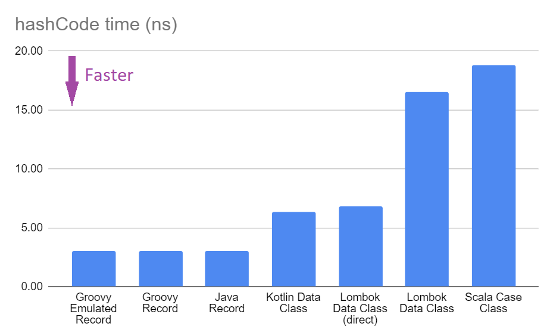
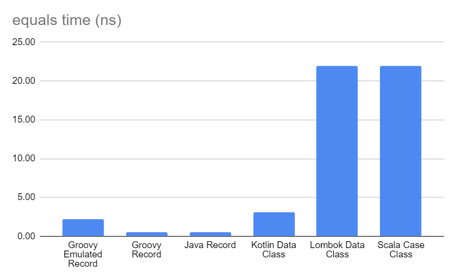

= Groovy Record Performance
Paul King
:revdate: 2023-05-09T23:39:00+00:00
:updated: 2023-05-10T19:57:00+00:00
:description: This post looks at the performance of some of the generated methods in Groovy records.
:keywords: groovy, records, java, scala, kotlin, lombok

We highly recommend the excellent
https://www.youtube.com/results?search_query=%23jepcafe[JEP Café]
series on the
https://www.youtube.com/@java[@java] YouTube channel.
Features arriving on the JDK are likely to be features you will
be able to use in Groovy soon too!

In JEP Café https://www.youtube.com/watch?v=1oC9ESbyvqs[Episode 8],
https://twitter.com/JosePaumard[José Paumard] looks at a number of topics related to Records including the performance
of some of the generated methods like `hashCode` and `equals`.
It compares the performance of those methods for Java, Kotlin
data classes and Lombok's @Data classes.

Let's do a similar comparison adding in Scala case classes
and Groovy records. For Groovy, we'll cover native records
and emulated records (which you can use on JDK8 and above
if you are still stuck on older JDK versions).

== Our domain

We'll use the example about 7½ minutes into the JEP Café episode.
It is an aggregate of five Strings
which together form a kind of aggregate label.

=== Java record

Here is the Java version:

[source,java]
----
public record JavaRecordLabel(String x0, String x1, String x2, String x3, String x4) { }
----

=== Java class with Lombok's @Data

For Lombok, the default equivalent will look like this:

[source,java]
----
@Data
public class LombokDataLabel {
    final String x0, x1, x2, x3, x4;
}
----

But to get behavior closer to records, we can configure Lombok in a different way like this:

[source,java]
----
@Data
@EqualsAndHashCode(doNotUseGetters = true)
public class LombokDirectDataLabel {
    final String x0, x1, x2, x3, x4;
}
----

We'll discuss this in more detail later.

=== Kotlin data class

Here is the Kotlin equivalent:

[source,kotlin]
----
data class KotlinDataLabel (
    val x0: String, val x1: String, val x2: String, val x3: String, val x4: String)
----

=== Scala case class

Here is the Scala equivalent:

[source,scala]
----
case class ScalaCaseLabel(x0: String, x1: String, x2: String, x3: String, x4: String)
----

=== Groovy record

Here is the Groovy equivalent:

[source,groovy]
----
record GroovyRecordLabel(String x0, String x1, String x2, String x3, String x4) { }
----

This will produce bytecode similar to a native Java record
when run on a version of the JDK supporting records.
On earlier JDK versions, it will produce an emulated record.
We are going to use JDK17 for our examples. We can force the
Groovy compiler to produce emulated code with JDK17 by
applying a record option annotation as shown here:

[source,groovy]
----
@RecordOptions(mode = RecordTypeMode.EMULATE)
record GroovyEmulatedRecordLabel(String x0, String x1, String x2, String x3, String x4) { }
----

== Performance of `hashCode`

Our benchmark code was written in Java for all cases
and used https://github.com/openjdk/jmh[JMH].
It called the `hashCode` method of a static instance
for each of the different cases.
The full source code is in a `record-performance` https://github.com/paulk-asert/record-performance/[repo] on GitHub.

Here is an example of setting up the static instance (`X0` .. `X4` are String constants):

[source,java]
----
private static final JavaRecordLabel JAVA_RECORD_LABEL = new JavaRecordLabel(X0, X1, X2, X3, X4);
----

Here is an example of the benchmark test:

[source,java]
----
@Benchmark
public void hashcodeJavaRecord(Blackhole bh) {
    bh.consume(JAVA_RECORD_LABEL.hashCode());
}
----

We used 3 warmup iterations and 10 benchmark iterations:

[source,groovy]
----
jmh {
    warmupIterations = 3
    iterations = 10
    fork = 1
    timeUnit = 'ns'
    benchmarkMode = ['avgt']
}
----

=== Results

The tests were run using GitHub actions on various platforms.
The results show average time taken in nanoseconds, so a smaller _Score_ means faster.

==== Using ubuntu-latest

----
Benchmark                                         Mode  Cnt   Score   Error  Units
HashCodeBenchmark.hashcodeGroovyEmulatedRecord      avgt   10   3.130 ±  0.015  ns/op
HashCodeBenchmark.hashcodeGroovyRecord              avgt   10   2.814 ±  0.003  ns/op
HashCodeBenchmark.hashcodeJavaRecord                avgt   10   2.813 ±  0.001  ns/op
HashCodeBenchmark.hashcodeKotlinDataLabel           avgt   10   5.213 ±  0.016  ns/op
HashCodeBenchmark.hashcodeLombokDirectDataLabel     avgt   10   5.427 ±  0.071  ns/op
HashCodeBenchmark.hashcodeLombokDataLabel           avgt   10  18.328 ±  0.006  ns/op
HashCodeBenchmark.hashcodeScalaCaseLabel            avgt   10  16.901 ±  0.007  ns/op
----

==== Using windows-latest

----
Benchmark                                         Mode  Cnt   Score   Error  Units
HashCodeBenchmark.hashcodeGroovyEmulatedRecord      avgt   10   2.948 ± 0.005  ns/op
HashCodeBenchmark.hashcodeGroovyRecord              avgt   10   3.410 ± 0.005  ns/op
HashCodeBenchmark.hashcodeJavaRecord                avgt   10   3.407 ± 0.004  ns/op
HashCodeBenchmark.hashcodeKotlinDataLabel           avgt   10   6.635 ± 0.005  ns/op
HashCodeBenchmark.hashcodeLombokDirectDataLabel     avgt   10   8.520 ± 0.017  ns/op
HashCodeBenchmark.hashcodeLombokDataLabel           avgt   10  16.172 ± 0.026  ns/op
HashCodeBenchmark.hashcodeScalaCaseLabel            avgt   10  19.150 ± 0.048  ns/op
----

==== Using macos-latest

----
Benchmark                                         Mode  Cnt   Score   Error  Units
HashCodeBenchmark.hashcodeGroovyEmulatedRecord      avgt   10   2.999 ± 0.194  ns/op
HashCodeBenchmark.hashcodeGroovyRecord              avgt   10   2.765 ± 0.741  ns/op
HashCodeBenchmark.hashcodeJavaRecord                avgt   10   2.990 ± 0.280  ns/op
HashCodeBenchmark.hashcodeKotlinDataLabel           avgt   10   7.103 ± 0.123  ns/op
HashCodeBenchmark.hashcodeLombokDirectDataLabel     avgt   10   6.494 ± 0.063  ns/op
HashCodeBenchmark.hashcodeLombokDataLabel           avgt   10  15.100 ± 0.108  ns/op
HashCodeBenchmark.hashcodeScalaCaseLabel            avgt   10  20.327 ± 0.085  ns/op
----

==== Graphing the results

We can already see some variance in the results across platforms.
So, let's average the results across the three platforms, which
gives us the following chart:

Next we'll look at some of the reasons behind these differences
and some other considerations which can help you speed up `hashCode`
or justify why you might want to choose a slower version as a
trade-off for other useful properties.

=== Discussion

It is always dangerous to draw too many conclusions from microbenchmarks.
We don't always know if we are comparing apples with apples, or what else
was running on the machine when the benchmarks were executed, or how changing
the benchmark slightly might alter the result. Certainly for `hashCode`,
the result is impacted by the number of and types of our record components.
Even the particular data instances (arbitrary Strings in our case) will
impact the speed of that method.

But what does this really tell us? For Groovy users, it is good to know
that the `hashCode` method is as good or better than Java records.
That isn't too surprising since the Groovy bytecode is almost identical
to the Java bytecode for most parts of records.

For Lombok and the other languages, the `hashCode` method is slower but only
by a few (or into the 10s of) nanoseconds.
Do we really care about how fast this particular method is?
Certainly if we are storing a lot of our label instances
into hashed collections, it could matter, but otherwise, not so much;
we'll rarely call this method directly.

But speed is only one of properties we'd like in a good `hashCode` method.
Another is minimal collisions. We can after all return the constant `0` or `-1`
from our `hashCode` and that would be very fast but hopeless in terms of collisions.

==== Hashing algorithm

For Scala case classes, the
https://en.wikipedia.org/wiki/MurmurHash[Murmur3] hashing algorithm is currently
used which is slightly slower that what Java uses but
https://stackoverflow.com/questions/40980193/scala-murmur-hash-vs-java-native-hash[claims]
to have improved collision resistance.
If you are using large collections or records with many components, this tradeoff
might be worth considering.

You can use Scala's algorithm directly in Groovy with a record definition like this:

[source,groovy]
----
record GroovyRecordScalaMurmur3Label(String x0, String x1, String x2, String x3, String x4) {
    int hashCode() {
        ScalaRunTime._hashCode(new Tuple5<>(x0, x1, x2, x3, x4))
    }
}
----

And this has almost identical performance to the native Scala example from our earlier bar chart.

If you want a smaller dependency than the Scala runtime jar, you could use
the https://guava.dev/releases/31.0-jre/api/docs/src-html/com/google/common/hash/Hashing.html#line.158[32-bit Murmur3] algorithm from https://github.com/google/guava[Guava]
or write your own combiner to combine hashes produced by Apache Commons Codec's
https://commons.apache.org/proper/commons-codec/apidocs/org/apache/commons/codec/digest/MurmurHash3.html#hash32x86-byte:A-[Murmur3 algorithm] on the bytes of each String component.
In my tests, both of these alternatives ended up being slower than borrowing Scala's algorithm,
but I didn't try to optimise my implementation.

If you want to diver deeper on this topic, check out:

* this great overview article about https://www.baeldung.com/java-hashmap-optimize-performance[Optimizing HashMap’s Performance],
* and this article on
https://www.javacodegeeks.com/2015/09/an-introduction-to-optimising-a-hashing-strategy.html[optimising a hashing strategy] and its impact on collisions,
* the original
https://github.com/aappleby/smhasher/wiki/MurmurHash3[C++ implementation] of the Murmur3 algorithm.

==== JDK version support

One difference worth pointing out is that the Groovy, Lombok and other
languages work on earlier JDKs. As the GitHub action workflow configuration
shows, the example in this blog post are tested on JDK 8, 11 and 17.

[source,yaml]
----
matrix:
  java: [8,11,17]
----

The Java record examples are tested in JDK 17 (technically requires 16+).
This is good to know if you are stuck on earlier versions but should become
less of an issue over time.

==== Caching

A nice Groovy feature provided by some of Groovy's transforms
is _caching_, which is exactly what you might want to do
for immutable classes (like records). In fact, in Groovy, caching is turned on
by default for the `hashCode` and `toString` methods for `@Immutable` classes,
but we leave it off by default for records for Java compatibility.

Let's turn on caching for the `hashCode` method with Groovy:

[source,groovy]
----
@EqualsAndHashCode(useGetters = false, cache = true)
record GroovyRecordWithCacheLabel(String x0, String x1, String x2, String x3, String x4) { }
----

By default, Groovy records behave like Java records.
By supplying the `@EqualsAndHashCode` annotation, we effectively get
the code for an emulated record instead of the normal record bytecode.
To be as close to records as possible but with caching turned on,
we enable `cache` and disable `useGetters`. We'll discuss the latter
in more detail in the next subsection.

Now, let's change our Java and Groovy benchmark code to simulate some code that
uses `hashCode` multiple times. For our purposes, we'll just sum 5 calls to `hashCode`:

[source,java]
----
@Benchmark
public void hashcodeJavaRecord(Blackhole bh) {
    bh.consume(JAVA_RECORD_LABEL.hashCode()
        + JAVA_RECORD_LABEL.hashCode()
        + JAVA_RECORD_LABEL.hashCode()
        + JAVA_RECORD_LABEL.hashCode()
        + JAVA_RECORD_LABEL.hashCode());
}
----

And we can do the same for Groovy. Here are the results of our new benchmark:

----
Benchmark                                         Mode  Cnt   Score   Error  Units
HashCodeCacheBenchmark.hashcodeGroovyCacheRecord  avgt   10   4.296 ± 0.108  ns/op  windows-latest
HashCodeCacheBenchmark.hashcodeGroovyCacheRecord  avgt   10   4.787 ± 0.151  ns/op  ubuntu-latest
HashCodeCacheBenchmark.hashcodeGroovyCacheRecord  avgt   10   5.465 ± 0.045  ns/op  macos-latest
HashCodeCacheBenchmark.hashcodeJavaRecord         avgt   10  21.956 ± 0.023  ns/op  windows-latest
HashCodeCacheBenchmark.hashcodeJavaRecord         avgt   10  33.820 ± 0.750  ns/op  ubuntu-latest
HashCodeCacheBenchmark.hashcodeJavaRecord         avgt   10  32.837 ± 1.136  ns/op  macos-latest
----

As expected, the effect of caching is clearly visible. We could certainly
write our own caching with an explicit `hashCode` method in Java and perhaps
call into `Objects.hash` or similar, but it's not as nice as having the option
of a declarative approach.

As a side note, we could add `@Memoized` to the `hashCode` method in our earlier
`GroovyRecordScalaMurmur3Label` example to turn on caching when using that algorithm.

==== Supporting JavaBean-like behavior

One other "feature" of Java (and Groovy) records is the ability to override the
record component "getters". You could for instance, write a 3-String label record in Java that
always returns its `x1` component in uppercase:

[source,java]
----
public record JavaRecordLabelUpper(String x0, String x1, String x2) {
    public String x1() { return x1.toUpperCase(); }
}
----

Now using the `x1()` getter method will give you the uppercase version.
Just be aware though that `hashCode` (and `equals`) don't use the getter
but access the field directly.

So, while all the components might be equal in the following example,
the hashcode (and the record as a whole) won't be equal:

[source,java]
----
private static final JavaRecordLabelUpper JAVA_UPPER_1
        = new JavaRecordLabelUpper("a", "b", "c");
private static final JavaRecordLabelUpper JAVA_UPPER_2
        = new JavaRecordLabelUpper("a", "B", "c");
...
assertEquals(JAVA_UPPER_1.x0(), JAVA_UPPER_2.x0());
assertEquals(JAVA_UPPER_1.x1(), JAVA_UPPER_2.x1());
assertEquals(JAVA_UPPER_1.x2(), JAVA_UPPER_2.x2());
assertNotEquals(JAVA_UPPER_1.hashCode(), JAVA_UPPER_2.hashCode());
assertNotEquals(JAVA_UPPER_1, JAVA_UPPER_2);
----

This is exactly as expected from the record-related parts of the JLS specification
and is a reasonable design decision given that records are handling the use case
of _"a simple aggregate of values"_.
Indeed, records step away from many of the JavaBean conventions, so we might expect
some differences, yet not using the getter might still seem strange to some folks.

The JLS specification elaborates further, stating that the above `JavaRecordLabelUpper`
class might be considered bad style. The rationale is in terms of a record `r2` derived
from the components of record `r1`:

[source,java]
----
R r2 = new R(r1.c1(), r1.c2(), ..., r1.cn());
----

For any well-behaved record class, `r1.equals(r2)` should be true, which
won't be the case for `JavaRecordLabelUpper`.

Accessing the component through its getter is slower but would preserve the above property.
Both the `LombokDataLabel` and `ScalaCaseLabel` implementations use the getter.
This accounts for some of the reduced speed of those implementations.

Groovy records default to Java behavior here but allow you to use the getters
for `hashCode` (and `equals` and `toString`) if you so desire. It will be slower
but now preserves traditional JavaBean-like getter behavior.

Here is what the code would look like:

[source,groovy]
----
@EqualsAndHashCode
record GroovyRecordUpperGetter(String x0, String x1, String x2) {
    String x1() { x1.toUpperCase() }
}
----

The explicit `@EqualsAndHashCode` annotation tells the compiler to provide
Groovy's default generated `hashCode` bytecode which does use getters rather
than the special record bytecode which doesn't. It ends up being the same hashing
algorithm but uses the getters to access the components.

And now our tests pass (with `assertEquals` instead of `assertNotEquals`):

[source,java]
----
private static final GroovyRecordUpperGetter GROOVY_UPPER_GETTER_1
        = new GroovyRecordUpperGetter("a", "b", "c");
private static final GroovyRecordUpperGetter GROOVY_UPPER_GETTER_2
        = new GroovyRecordUpperGetter("a", "B", "c");
...
assertEquals(GROOVY_UPPER_GETTER_1.hashCode(), GROOVY_UPPER_GETTER_2.hashCode());
----

==== Summary

Groovy records have good `hashCode` performance. There are times when you might want to
enable caching. On rare occasions, you might want to also consider swapping the hashing
algorithm or enabling getters, but if you need to, Groovy makes that easy too.

== Performance of `equals`

For this benchmark, the `equals` method of a static instance
was called passing in a second static instance.

Here is an example of our benchmark code:

[source,java]
----
@Benchmark
public void equalsGroovyRecord(Blackhole bh) {
    bh.consume(GROOVY_RECORD_LABEL.equals(GROOVY_RECORD_LABEL_2));
}
----

=== Results

As before, the tests were run using GitHub actions on various platforms.
The results show average time taken in nanoseconds, so a smaller _Score_ means faster.

==== Using ubuntu-latest

----
Benchmark                                           Mode  Cnt   Score   Error  Units
EqualsBenchmark.equalsGroovyEmulatedRecord          avgt   10   2.615 ±  0.005  ns/op
EqualsBenchmark.equalsGroovyRecord                  avgt   10   0.603 ±  0.001  ns/op
EqualsBenchmark.equalsJavaRecord                    avgt   10   0.686 ±  0.154  ns/op
EqualsBenchmark.equalsKotlinDataLabel               avgt   10   3.617 ±  0.002  ns/op
EqualsBenchmark.equalsLombokDirectDataLabel         avgt   10   3.617 ±  0.002  ns/op
EqualsBenchmark.equalsLombokDataLabel               avgt   10  24.115 ±  0.014  ns/op
EqualsBenchmark.equalsScalaCaseLabel                avgt   10  24.130 ±  0.045  ns/op
----

==== Using windows-latest

----
Benchmark                                           Mode  Cnt   Score   Error  Units
EqualsBenchmark.equalsGroovyEmulatedRecord          avgt   10   2.216 ± 0.004  ns/op
EqualsBenchmark.equalsGroovyRecord                  avgt   10   0.511 ± 0.002  ns/op
EqualsBenchmark.equalsJavaRecord                    avgt   10   0.511 ± 0.001  ns/op
EqualsBenchmark.equalsKotlinDataLabel               avgt   10   3.066 ± 0.004  ns/op
EqualsBenchmark.equalsLombokDirectDataLabel         avgt   10   3.068 ± 0.005  ns/op
EqualsBenchmark.equalsLombokDataLabel               avgt   10  21.451 ± 0.021  ns/op
EqualsBenchmark.equalsScalaCaseLabel                avgt   10  21.442 ± 0.024  ns/op
----

==== Using macos-latest

----
Benchmark                                           Mode  Cnt   Score   Error  Units
EqualsBenchmark.equalsGroovyEmulatedRecord          avgt   10   1.943 ± 0.116  ns/op
EqualsBenchmark.equalsGroovyRecord                  avgt   10   0.612 ± 0.013  ns/op
EqualsBenchmark.equalsJavaRecord                    avgt   10   0.579 ± 0.021  ns/op
EqualsBenchmark.equalsKotlinDataLabel               avgt   10   2.727 ± 0.068  ns/op
EqualsBenchmark.equalsLombokDirectDataLabel         avgt   10   2.734 ± 0.096  ns/op
EqualsBenchmark.equalsLombokDataLabel               avgt   10  21.206 ± 2.789  ns/op
EqualsBenchmark.equalsScalaCaseLabel                avgt   10  20.673 ± 0.766  ns/op
----

==== Graphing the results

Like before, we'll average the results across the three platforms:

=== Discussion

We saw for `hashCode`, that using getters retained JavaBean-like expectations
but with additional costs of calling that method. That impact is doubly worse
for `equals` since we call the getters for `this` and the instance we are comparing
against. This explains a significant part of the slowness for the `LombokDataLabel`
and `ScalaCaseLabel` implementations.

Like we discussed for `hashCode`, you would not normally modify the getters
for records and record-like classes. But for Java and Groovy which allow you to,
it might come as a surprise. Groovy follows Java behavior here by default but
allows you to enable access via getters if you desire.

The JLS has an example of a `SmallPoint` record in section
https://docs.oracle.com/javase/specs/jls/se20/html/jls-8.html#jls-8.10.3[8.10.3]
which is discussed as _bad style_ because with Java records the last statement prints `false`.
If we enable getters, the last statement now prints `true` as shown in this Groovy equivalent
of that example:

[source,java]
----
@EqualsAndHashCode
record SmallPoint(int x, int y) {
    int x() { this.x < 100 ? this.x : 100 }
    int y() { this.y < 100 ? this.y : 100 }

    static main(args) {
        var p1 = new SmallPoint(200, 300)
        var p2 = new SmallPoint(200, 300)
        println p1 == p2  // prints true

        var p3 = new SmallPoint(p1.x(), p1.y())
        println p1 == p3  // prints true
    }
}
----

Never-the-less, for this particular example, it might be better style to leave the
normal field access in place and provide something like a compact canonical
constructor to truncate the points during construction.

== Conclusion

We have looked at a few aspects of the performance of Groovy records and compared
them to other languages. Groovy's default behavior piggybacks directly on Java's
behavior but Groovy has many declarative options to tweak the generated code if needed.