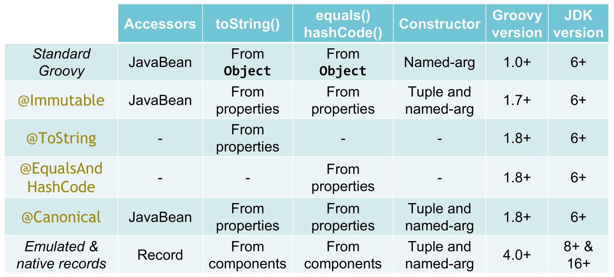

= Groovy Records
Paul King
:revdate: 2023-04-02T20:22:57+00:00
:keywords: groovy, records, AST transforms
:description: This blog looks at Groovy records.

A common scenario when programming is the need to group together a bunch
of related properties. You may be able to use arrays, some form of tuples, or maps
to group such properties. Some languages might support constructs like structs.
In Java, grouping such properties into a class is a natural fit.
Unfortunately, creating such classes, once you add in all the expected
methods and behaviors, can involve considerable boilerplate code.

Starting with JDK16 (with previews from JDK14), Java introduced _records_ as a compact
form for declaring "_data_" classes. Such classes hold "data" and (almost) nothing else.
Java chose the very common scenario of holding _immutable_ data.
With this context, and following a few restrictions, it becomes a relatively easy
task for the Java compiler to generate much of the boilerplate for such classes.

This blog looks at Groovy's record implementation. Groovy supports the
same features as Java but adds some additional enhancements and customisation.
Groovy's implementation builds upon existing techniques, like compile-time metaprogramming
(aka AST transforms), that are used to reduce boilerplate for other scenarios.

== Introduction

First, let's look at what creating a record looks like:

[source,groovy]
----
record Point(int x, int y, String color) { }
----

The properties we are grouping, are called _components_.
In this case two integers, `x` and `y`, and a string `color`.

Using it is similar to how we'd use a traditionally defined `Point` class
which had a constructor with the same parameters as our record definition:

[source,groovy]
----
var bluePointAtOrigin = new Point(0, 0, 'Blue')
----

We might want to check the value of one of our point's components:

[source,groovy]
----
assert bluePointAtOrigin.color() == 'Blue'
----

We can also print out the point (which calls its `toString()` method):

[source,groovy]
----
println bluePointAtOrigin
----

Which would have this output:

----
Point[x=0, y=0, color=Blue]
----

All the features of Java records are supported.
One example is compact constructors.
If we wanted the color to not be left blank, we could add a check using
the compact constructors form, giving an alternative definition such as:

[source,groovy]
----
record Point(int x, int y, String color) {
    Point { assert !color.blank }
}
----

More formally, a record is a class that:

* Is implicitly final (so can't be extended)
* Has a private final field for each component, e.g. `color`
* Has an accessor method for each component of the same name, e.g. `color()`
* Has a default `Point(int, int, String)` constructor
* Has a default serialVersionUID of `0L` and special serialization code
* Has implicit `toString()`, `equals()` and `hashCode()` methods
* Implicitly extends the `java.lang.Record` class (so can't extend
another class but may implement one or more interfaces)

== Optional enhancements

Groovy records by default have an additional named-argument style constructor:

[source,groovy]
----
var greenPointAtOrigin = new Point(x:0, y:0, color:'Green')
----

By default, Groovy records also have generated `getAt`, `size`, `toList`, and
`toMap` methods. The `getAt` method provides Groovy's normal array-like indexing.
The `size` method returns the number of components.
The `toList` method returns the component values.
The `toMap` method returns the component values along with the component name.
Here are examples:

[source,groovy]
----
assert bluePointAtOrigin.size() == 3
assert bluePointAtOrigin[2] == 'Blue'
assert bluePointAtOrigin.toList() == [0, 0, 'Blue']
assert bluePointAtOrigin.toMap() == [x:0, y:0, color:'Blue']
----

The `getAt` method also enables destructuring through the multi-assignment
statement as this example shows:

[source,groovy]
----
def (x, y, c) = bluePointAtOrigin
assert "$x $y $c" == '0 0 Blue'
----

Shortly, we'll look at `copyWith` which is useful for creating one record from another
record of the same type. The `toMap` can be handy when creating a record from a different type as shown here. In our example, we surmise that in the same month as realising a book,
we might want to release an article about the book for marketing purposes:

[source,groovy]
----
record Book(String name, String author, YearMonth published) {}

record Article(String name, String author, YearMonth published, String publisher) {}

def b = new Book('Groovy in Action', 'Dierk & Paul', YearMonth.of(2015, 06))
def a = new Article(*:b.toMap(), publisher: 'InfoQ')
----

These optional enhancements can be turned off if not required by setting
various annotation attributes of the same name to `false` on the `RecordOptions` annotation.

Two other methods, `copyWith` and `components`, aren't enabled by default
but can be enabled by setting the respectively named annotation attributes to `true`
as shown here:

[source,groovy]
----
@RecordOptions(components = true, copyWith = true)
record Point(int x, int y, String color) { }
----

The `copyWith` method can be used as follows:

[source,groovy]
----
var redPointAtOrigin = bluePointAtOrigin.copyWith(color: 'Red')
assert redPointAtOrigin.toString() == 'Point[x=0, y=0, color=Red]'
----

This is similar to Kotlin's `copy` method for data classes.

The `components` method returns a typed tuple. This is especially useful
when type checking is enabled like in this method:

[source,groovy]
----
@TypeChecked
String description(Point p) {
    p.components().with{ "${v3.toUpperCase()} point at ($v1,$v2)" }
}
----

Note that the 3rd element in the tuple has type `String`,
so we can call the `toUpperCase` method.

We can use this method as follows:

[source,groovy]
----
assert description(redPointAtOrigin) == 'RED point at (0,0)'
----

This is Groovy's equivalent to Kotlin's `componentN` methods for data classes.

== Internal details

Some of the details in this section aren't essential to know
but can be useful to understand how to customise record definitions.

When we write a record declaration like this:

[source,groovy]
----
record Point(int x, int y, String color) { }
----

It is equivalent to the following traditional declaration:

[source,groovy]
----
@RecordType
class Point {
    int x
    int y
    String color
}
----

You will almost never write records in this form but if you have some legacy tools
which don't yet understand record syntax, it might prove useful.

The `RecordType` annotation is what is known as a meta-annotation (also sometimes called
an annotation collector). This means that it is an annotation made of other annotations.
Without going into the details, essentially, the compiler expands the above annotation
into the following (and `RecordBase` further calls into `ToString` and `EqualsAndHashCode`):

[source,groovy]
----
@RecordBase
@RecordOptions
@TupleConstructor(namedVariant = true, force = true, defaultsMode = AUTO)
@PropertyOptions
@KnownImmutable
@POJO
@CompileStatic
class Point {
    int x
    int y
    String color
}
----

What this means is that if you don't like the generated code you would normally
get with a record, you have several places where you can change
the behavior in a declarative fashion. We'll cover that next.

Just be careful though, if you are creating a native record and try to change
something that would violate the JDKs assumptions about records,
you will likely get a compiler error.

== Declarative customisation of records

We looked earlier at ensuring that we don't provide an empty `color`
by using the compact constructor form. We have several other alternatives
we could use. If we want to check that `color` isn't null or the empty
string, we could use:

[source,groovy]
----
@TupleConstructor(pre={ assert color })
record Point(int x, int y, String color) { }
----

Or, to also rule out a color of only blank spaces, and also disable the
named-argument style constructor, we could use:

[source,groovy]
----
@TupleConstructor(pre={ assert color && !color.blank }, namedVariant=false)
record Point(int x, int y, String color) { }
----

We can also change the `toString()` method with a declarative style:

[source,groovy]
----
@ToString(excludes = 'color', cache = true)
record Point(int x, int y, String color) { }
assert new Point(0, 0, 'Gold').toString() == 'Point(0, 0)'
----

Here we are excluding the `color` component from the toString value
and also caching the result for subsequent calls to toString.

== Emulated records

Groovy also provides emulated records for JDK8+.
Emulated records are classes that don't include a record attribute in the class file,
nor offer special record serialization, nor extend the `java.lang.Record`
class, but will follow all the other record conventions. This means that
you can use the `record` shorthand even if you are still stuck on JDK8 or JDK11.

By default, emulated records are provided for JDK8-15 and
native records for JDK16+. You can force the compiler to
always target emulated or native records using the `mode`
annotation attribute of `RecordOptions`. If you specify the
`NATIVE` mode and are on an earlier JDK or are targeting
an earlier bytecode version, you will receive a compiler error.

== Using records with other AST transforms

We saw that we could customize the generated code by using variations of
the annotations which make up the `RecordType` meta-annotation.
We can also use most of the normal AST transforms available in Groovy.
Here are just a few examples:

We saw earlier a `description` method that took a `Point` as parameter.
While we generally want records to be data only, that's the kind of method that
makes sense to place inside the record. We can do so as follows and make use of
`Memoized` to cache the result:

[source,groovy]
----
record Point(int x, int y, String color) {
    @Memoized
    String description() {
        "${color.toUpperCase()} point at ($x,$y)"
    }
}

var pinkPointAtOrigin = new Point(x:0, y:0, color:'Pink')
assert pinkPointAtOrigin.description() == 'PINK point at (0,0)'
----

We have also yet another way to check for blank colors by using
the design-by-contract functionality of `groovy-contracts`:

[source,groovy]
----
@Requires({ color && !color.blank })
record Point(int x, int y, String color) { }
----

We can also make records which are easily sortable as follows:

[source,groovy]
----
@Sortable
record Point(int x, int y, String color) { }

var points = [
    new Point(0, 100, 'red'),
    new Point(10, 10, 'blue'),
    new Point(100, 0, 'green'),
]

println points.toSorted(Point.comparatorByX())
println points.toSorted(Point.comparatorByY())
println points.toSorted(Point.comparatorByColor())
----

Which has this output:

----
[Point[x=0, y=100, color=red], Point[x=10, y=10, color=blue], Point[x=100, y=0, color=green]]
[Point[x=100, y=0, color=green], Point[x=10, y=10, color=blue], Point[x=0, y=100, color=red]]
[Point[x=10, y=10, color=blue], Point[x=100, y=0, color=green], Point[x=0, y=100, color=red]]
----

== Related functionality for reducing boilerplate code

While records represent a big jump in reducing boilerplate in the Java world,
we should point out the Groovy has many features for reducing boilerplate
beyond just records. Groovy already has a feature very much like records,
the `@Immutable` transform. This offers much of the boilerplate reduction
of records but follows JavaBean conventions.

If you don't want immutability, you can use `@Canonical`, or you can just
mix in the appropriate transforms from `@ToString`, `@EqualsAndHashCode`,
`@TupleConstructor`, `@MapConstructor` and so forth.

Here is a summary of the main transforms and the provided functionality:

== Summary

Let's wrap up our introduction to records with a summary of functionality:

image:img/record_feature_summary.png[TodoScreenshot]
