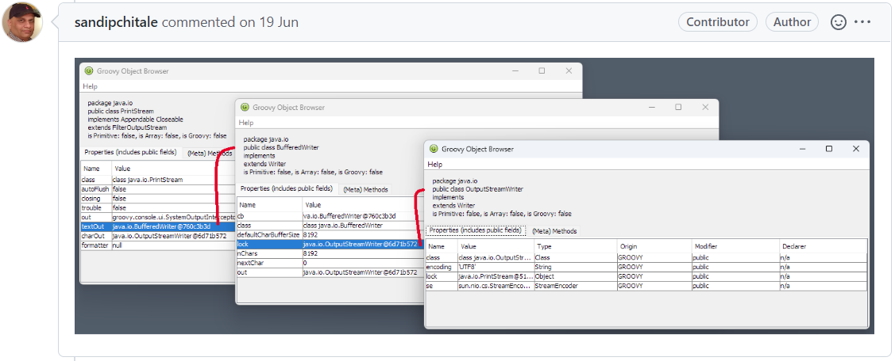

= Groovy release train: 4.0.4, 3.0.12, 2.5.18
Paul King
:revdate: 2022-07-24T12:55:23+00:00
:keywords: groovy, release, groovyConsole, hephaestus
:description: Groovy 4.0.4, 3.0.12 and 2.5.18 Release Announcement.

It's been a productive time for the Apache Groovy project recently. We recently released versions 4.0.4, 3.0.12 and 2.5.18 with 42, 21 and 15 fixes and improvements respectively. Two quick highlights for the 4.0.4 release before getting into more details about the release.

Eric Milles has been interacting for many months with the team from the https://github.com/hephaestus-compiler-project/hephaestu[hephaestus project] in particular Stefanos Chaliasos and Thodoris Sotiropoulos. You can think of hephaestus as a fuzzying tool for type checkers, and they have been putting Groovy's static compiler through its paces finding plenty of edge cases for us to assess. We still have some work to do, but we have made significant improvements and would welcome any feedback. If you're interested, consider diving further into the https://pldi22.sigplan.org/details/pldi-2022-pldi/2/Finding-Typing-Compiler-Bug[research behind hephaestus].

We've also had some great contributions from Sandip Chitale for Groovy's Object Browser. You can access this from a number of ways including the `:inspect` command in groovysh or in the GroovyConsole via the `Script->Inspect Last` or `Script->Inspect Variables` menu items. It's also hooked into the AST Browser if you're exploring code produced by the Groovy compiler.

Please find more details about the 4.0.4 release below.

'''

Dear community,

The Apache Groovy team is pleased to announce version 4.0.4 of Apache Groovy.
Apache Groovy is a multi-faceted programming language for the JVM.
Further details can be found at the https://groovy.apache.org website.

This release is a maintenance release of the GROOVY_4_0_X branch.
It is strongly encouraged that all users using prior
versions on this branch upgrade to this version.

This release includes 42 bug fixes/improvements as outlined in the changelog:
https://issues.apache.org/jira/secure/ReleaseNote.jspa?projectId=12318123&version=12351811

Sources, convenience binaries, downloadable documentation and an SDK
bundle can be found at: https://groovy.apache.org/download.html
We recommend you verify your installation using the information on that page.

Jars are also available within the major binary repositories.

We welcome your help and feedback and in particular want
to thank everyone who contributed to this release.

For more information on how to report problems, and to get involved,
visit the project website at https://groovy.apache.org/

Best regards,

The Apache Groovy team.