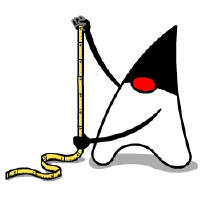

= Life on Mars: Units of Measurement systems, Groovy, and domain specific languages (DSLs)
Paul King
:revdate: 2022-08-13T06:31:47+00:00
:keywords: domain specific languages, groovy, jsr385, units of measurement
:description: This post looks at using the JSR 385 unit of measurement system and writing domain specific languages with examples including the Mars rover robot.

The Mars Climate Orbiter was launched in 1998 as part
of a multi-faceted Mars exploration program.
It was lost due to a trajectory calculation error when
nearing Mars. An http://scholar.google.com/scholar?hl=en&q=Stephenson+A%2C+LaPiana+L%2C+Mulville+D%2C+et+al.+Mars+climate+orbiter+mishap+investigation+board+phase+1+report%3B+1999[investigation] attributed the
failure to a measurement mismatch between two software systems:
metric units were used by NASA and https://en.wikipedia.org/wiki/United_States_customary_units[US customary] units were used by spacecraft builder Lockheed Martin.
image:https://upload.wikimedia.org/wikipedia/commons/thumb/1/19/Mars_Climate_Orbiter_2.jpg/1280px-Mars_Climate_Orbiter_2.jpg[Mars Climate Orbiter - image credit: wikipedia,500]

If the system in question had been developed using a units of
measurement system, perhaps the failure could have been avoided.

== Units of measurement systems

All programming languages have types for representing numbers.
As an example, we may have three integers, one representing a
height, one a weight and one a temperature. We can write code
to add those three integers together, but the result may have
no useful meaning. We could start writing our own class
hierarchies for each integer type, but it can quickly become
cumbersome to use the resulting classes. Units of measurement
systems attempt to provide a range of commonplace units, ways
to construct quantities from those units and ways to manipulate
them. Manipulation might involve performing numerical calculation
or conversions. Goals of such systems include the ability to
provide runtime and/or compile-time type safety. So, we should
fail early when trying to perform the earlier mentioned addition
of three unrelated quantities.

Units of measurement systems aren't new. There are existing
systems in F# and Swift and Java has had several versions
(and earlier attempts) around standardising such a system including:

* https://jcp.org/en/jsr/detail?id=275[JSR 275]: Units Specification (rejected earlier attempt)
* https://jcp.org/en/jsr/detail?id=363[JSR 363]: Units of Measurement API
* https://jcp.org/en/jsr/detail?id=385[JSR 385]: Units of Measurement API 2.0

There are also existing Java libraries like
http://jscience.org/[JScience] which have been developed, and
https://objectcomputing.com/resources/publications/sett/june-2006-units-and-measures-with-jscience[shown early promise],
but now don't seem to be actively maintained. While the
https://onlinelibrary.wiley.com/doi/10.1002/spe.2926[jury is still out]
about whether units of measurement systems will spread further into
mainstream programming, now seems like a great time to check the
status. The JSR 385 maintenance release was approved last year and
the latest version of the reference implementation was released
earlier this year.

== JSR 385: Units of Measurement API 2.0

The first thing we need to do is bring in our dependencies (shown for https://gradle.org/[Gradle] - https://mvnrepository.com/artifact/tech.units/indriya/2.1.3[other options]).
The main one is the reference implementation (it brings in the
`javax.measure` API transitively):

[source,groovy]
----
implementation 'tech.units:indriya:2.1.3'
----

JSR 385 is extensible. We'll also bring in some units from the
https://cldr.unicode.org/translation/units[Unicode CLDR] units,
e.g.&nbsp;`MILE`:

[source,groovy]
----
implementation 'systems.uom:systems-unicode:2.1'
implementation 'systems.uom:systems-quantity:2.1'
----

Let's follow on with the theme of visiting Mars. We can create
variables for the mass and diameter of Mars as follows:

[source,groovy]
----
var massₘ = Quantities.getQuantity(6.39E23, KILO(GRAM))
var diameterₘ = Quantities.getQuantity(6_779, KILOMETER)
println massₘ
println diameterₘ
----

JSR 385 has metric prefix qualifiers like `MICRO`,
`MILLI`, `CENTI`, `KILO`, `MEGA`, `GIGA` and many more.
The CLDR units also define some commonly used units like
`KILOMETER`. We could choose either here.

When we run this script, it has the following output:

----
639000000000000000000000 kg
6779 km
----

If we try to compare or add those two values, we'll see an error.
Groovy has both static and dynamic natures. Using dynamic code
like this:

[source,groovy]
----
println massₘ > diameterₘ
----

We'll see a runtime error like this:

[subs="quotes"]
----
[maroon]#javax.measure.IncommensurableException: km is not compatible with kg#
----

Or, with `TypeChecked` or `CompileStatic` in play for a statement like this:

[source,groovy]
----
println massₘ.add(diameterₘ)
----

We'd see a compile-time error like this:

[subs="quotes"]
----
[maroon]##[Static type checking] - Cannot call tech.units.indriya.ComparableQuantity#add(javax.measure.Quantity<javax.measure.quantity.Mass>)
with arguments [tech.units.indriya.ComparableQuantity<javax.measure.quantity.Length>]##
----

If for some strange reason we did want to compare or perform
calculations between incommensurable types, we can explicitly
get the value:

[source,groovy]
----
assert massₘ.value > diameterₘ.value
----

This escape hatch takes off a layer of type safety but requires
explicit work to do so. It is normally never the case that you
would want to do this.

JSR 385 also supports ranges and conversions. We can look at the
minimum and maximum temperatures on Mars:

[source,groovy]
----
var minTemp = Quantities.getQuantity(-128, CELSIUS)
var maxTemp = Quantities.getQuantity(70, FAHRENHEIT)
println minTemp
println minTemp.to(FAHRENHEIT)
println maxTemp
println maxTemp.to(CELSIUS)
println QuantityRange.of(minTemp, maxTemp)
----

It's quite a bit colder than Earth! When run,
this script has the following output:

----
-128 ℃
-198.400 ((K*5)/9)+459.67
70 ((K*5)/9)+459.67
21.1111111111111111111111111111111 ℃
min= -128 ℃, max= 70 ((K*5)/9)+459.67
----

In case you're wondering about the strange looking unit display
for Fahrenheit temperatures, the definition of that unit that
we are using, defines degrees Fahrenheit using a formula
calculated from the temperature in degrees Kelvin.

We'd see the same thing if using the `MILE` unit:

[source,groovy]
----
println diameterₘ.to(MILE)
----

Which shows us that the diameter of Mars is a little over 4200 miles:

----
4212.275312176886980036586335798934 (m*1609344)/1000
----

== Adding some metaprogramming

Groovy has various features which allow methods to be (apparently)
added to classes. We'll use extension methods. This technique
involves writing static methods in a helper class using certain
conventions. The first parameter in all such methods is the target
of the extension. Groovy code referencing instances of the target
class have code that can call such a method as if it existed on
the target class. In reality, the Groovy compiler or runtime
funnels the call through the helper class. For us, it means we
will have methods like `getMeters()` on the `Number` class which
using Groovy's shorthand's for property notation allows for very
compact quantity definitions like `5.meters`. We'll also add some
methods to allow Groovy's normal operator overloading syntax to
apply:

[source,groovy]
----
class UomExtensions {
    static Quantity<Length> getCentimeters(Number num) { Quantities.getQuantity(num, CENTI(METRE)) }

    static Quantity<Length> getMeters(Number num) { Quantities.getQuantity(num, METRE) }

    static Quantity<Length> getKilometers(Number num) { Quantities.getQuantity(num, KILO(METRE)) }

    static Quantity<Length> getCm(Number num) { getCentimeters(num) }

    static Quantity<Length> getM(Number num) { getMeters(num) }

    static Quantity<Length> getKm(Number num) { getKilometers(num) }

    static Quantity<Mass> getKilograms(Number num) { Quantities.getQuantity(num, KILO(GRAM)) }

    static Quantity<Mass> getKgs(Number num) { getKilograms(num) }

    static Quantity<Time> getHours(Number num) { Quantities.getQuantity(num, HOUR) }

    static Quantity<Time> getSeconds(Number num) { Quantities.getQuantity(num, SECOND) }

    static Quantity<Time> getHr(Number num) { getHours(num) }

    static Quantity<Time> getS(Number num) { getSeconds(num) }

    static Quantity<Speed> div(Quantity<Length> q, Quantity<Time> divisor) { q.divide(divisor) as Quantity<Speed> }

    static <Q> Quantity<Q> div(Quantity<Q> q, Number divisor) { q.divide(divisor) }

    static <Q> Quantity<Q> plus(Quantity<Q> q, Quantity<Q> divisor) { q.add(divisor) }

    static <Q> Quantity<Q> minus(Quantity<Q> q, Quantity<Q> divisor) { q.subtract(divisor) }
}
----

Note that we have longer and shorter versions of many of
the methods, e.g.&nbsp;`kg` and `kilogram`, `m` and `meter`.
We didn't need a method for `multiply` since it is
already using the name Groovy expects.

Now we can write very short definitions to declare
or compare times and lengths:

[source,groovy]
----
def s = 1.s
assert 1000.meters == 1.km && 1.m == 100.cm
----

We can also declare variables for acceleration due to
gravity on Earth and Mars. Gravity is a lot less on Mars:

[source,groovy]
----
var gₘ = 3.7.m/s/s
var gₑ = 9.8.m/s/s
assert gₑ.toString() == '9.8 m/s²'
assert gₑ > gₘ
----

We can also use the operator overloading in calculations
(here showing that the Earth has a diameter that is between
1.8 and 2 times bigger than that of Mars):

[source,groovy]
----
var diameterₑ = 12_742.kilometers
assert diameterₘ + diameterₘ > diameterₑ
assert diameterₑ - diameterₘ < diameterₘ
assert diameterₘ * 1.8 < diameterₑ
----

Even though we have more compact expressions, the same data
types are in play that we saw previously. They're just a
little nicer to type.

== A dynamic DSL for controlling a Mars Rover

Let's now look at how you could write a little
Domain-Specific-Language (DSL) to control a Mars rover robot.

image:img/mars_rover_selfie.jpg[Mars rover selfie,500]

First, we'll write a `Direction` enum as part of
our robot domain model:

[source,groovy]
----
enum Direction {
    left, right, forward, backward
}
----

There are many ways to write DSLs in Groovy. We'll use a little
trick where the verbs are represented as keys in a map.
Our DSL then looks like this:

[source,groovy]
----
def move(Direction dir) {
    [by: { Quantity<Length> dist ->
        [at: { Quantity<Speed> speed ->
            println "robot moved $dir by $dist at $speed"
        }]
    }]
}
----

Here the implementation is just going to print out a message
indicating all of the values it is processing. The real robot
would send signals to the rover's robotic subsystems.

Our script for controlling the rover now looks like this:

[source,groovy]
----
move right by 2.m at 5.cm/s
----

Which when run gives this output:

----
robot moved right by 2 m at 5 cm/s
----

As we saw earlier, this is backed by our JSR 385 types.
We'll certainly get fail-early runtime errors if there are
any calculations involving mismatched types.

If we enable static typing, some additional errors will be
detected at compile but because of the very dynamic style
of our DSL implementation, not all runtime errors are
reflected by typing information. If we want, we can change
our DSL implementation to use richer types and that will
support better static typing checking. We'll look at one
way to do that next.

== A type-rich DSL for the Rover

Now, instead of using our nested map style we saw previously,
we create several richly-typed helper classes and define our
`move` method in terms of those classes:

[source,groovy]
----
class MoveHolder {
    Direction dir
    ByHolder by(Quantity<Length> dist) {
        new ByHolder(dist: dist, dir: dir)
    }
}

class ByHolder {
    Quantity<Length> dist
    Direction dir
    void at(Quantity<Speed> speed) {
        println "robot moved $dir by $dist at $speed"
    }
}

static MoveHolder move(Direction dir) {
    new MoveHolder(dir: dir)
}
----

While our DSL implementation has changed, the robot scripts
remain the same:

[source,groovy]
----
move right by 2.m at 5.cm/s
----

Indeed, if we use Groovy dynamic nature, we can still run the same
script and will notice no change.

If however, we enable static checking and have a script with
an error like this:

[source,groovy]
----
move forward by 2.kgs
----

We'll now see a compile-time error:

[subs="quotes"]
----
[maroon]##[Static type checking] - Cannot call MoveHolder#by(javax.measure.Quantity<javax.measure.quantity.Length>) with arguments [javax.measure.Quantity<javax.measure.quantity.Mass>]##
----

It is great to get this additional earlier feedback on script
errors, so you may wonder why we don't write our DSL implementations
like this all of the time? Actually, both the dynamic and static
flavors of our DSL can be useful at different times. When
prototyping our script DSL, deciding on all the nouns and
verbs that we should be using to control our robot, the
dynamic flavored style can be much quicker to write especially
during early iterations which might evolve and change rapidly.
Once the DSL language has been locked down, we can invest in
adding the richer types. In the rover scenario, it might also
be the case that the rover itself has limited power and so may
not want to perform additional type checking steps. We might
run all scripts through a type checker back at mission control
before sending them through to the rover where they may be
enacted in dynamic mode.

== Adding custom type checking

There is one additional language feature of Groovy we haven't
mentioned. Groovy's type checking mechanism is extensible, so
we'll have a look at using that feature here. The rover's speed
is https://mars.nasa.gov/mars2020/spacecraft/rover/wheels/[rather limited], _"In the case of exploring Mars, however, speed isn't the most relevant quality. It's about the journey and the destinations along the way. The slow pace is energy-efficient…"_.
Let's look at limiting the speed to avoid unsafe or
energy wasting movement.

We could put early defensive checks in our DSL implementation to
detect undesirable manoeuvres, but we can also use type checking
extensions for certain kinds of errors. Groovy in fact has its
own DSL for writing such extensions. That's a topic for its own
blog but here's what the code looks like:

[source,groovy]
----
afterMethodCall { call ->
    def method = getTargetMethod(call)
    if (method.name != 'at') return
    if (call.arguments.size() != 1) return
    def arg = call.arguments[0]
    if (arg !instanceof BinaryExpression) return
    def left = arg.leftExpression
    if (left !instanceof PropertyExpression) return
    def obj = left.objectExpression
    if (obj !instanceof ConstantExpression) return
    if (obj.value > 5) {
        addStaticTypeError("Speed of $obj.value is too fast!",call)
        handled = true
    }
}
----

This is only a partial implementation, it makes numerous
assumptions. We could remove those assumptions by adding
more code, but for now we'll keep this simplified version.

So, now the following script (with the above type checking extension applied) compiles fine:

[source,groovy]
----
move right by 2.m at 5.cm/s
----

But this script fails:

[source,groovy]
----
move right by 2.m at 6.cm/s
----

The error message is:

[subs="quotes"]
----
[maroon]##[Static type checking] - Speed of 6 is too fast!##
----

== Further information

* https://www.jcp.org/en/jsr/detail?id=385[JSR 385: Units of Measurement API 2.0]
* https://unitsofmeasurement.github.io/2017/taste_of_indriya.html[A Taste of Indriya]
* https://betterprogramming.pub/unit-and-measurement-in-swift-7c6be4a25586[Unit and Measurement in Swift]
* https://docs.microsoft.com/en-us/archive/blogs/andrewkennedy/[Units of Measure in F#]
* https://varkor.github.io/blog/2018/07/30/types-for-units-of-measure.html[Types for units of measure]
* https://www.slideshare.net/keilw/how-jsr-385-could-have-saved-the-mars-climate-orbiter-jfokus-2020[How JSR 385 could have Saved the Mars Climate Orbiter - JFokus 2020] (slide deck)
* https://www.manning.com/books/groovy-in-action-second-edition[Groovy in Action] (in particular the DSL chapter)
* https://objectcomputing.com/resources/publications/sett/june-2006-units-and-measures-with-jscience[Units and Measures with JScience]
* https://onlinelibrary.wiley.com/doi/10.1002/spe.2926[Unit of measurement libraries, their popularity and suitability]
* https://speakerdeck.com/glaforge/groovy-domain-specific-languages-techniques[Groovy Domain-Specific Languages techniques] (slide deck)
* http://docs.groovy-lang.org/docs/latest/html/documentation/core-domain-specific-languages.html[Domain-Specific Languages] (Groovy documentation)
* https://www.baeldung.com/javax-measure[Introduction to javax.measure]
* https://github.com/paulk-asert/UomGroovy (repo)

== Conclusion

We have looked at using the JSR 385 `javax.measure` API using
Groovy and added some DSL examples to make using the API
a little nicer.