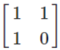
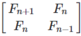
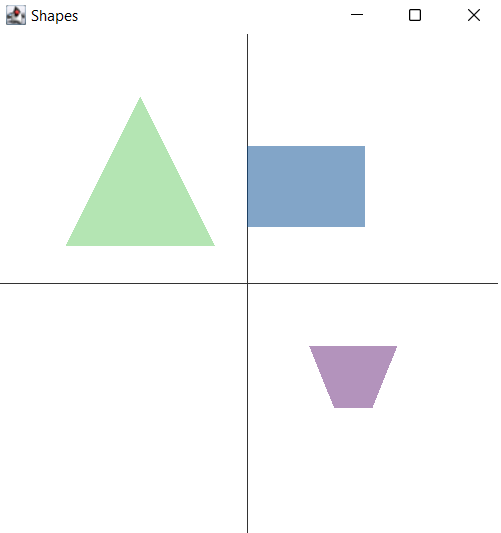
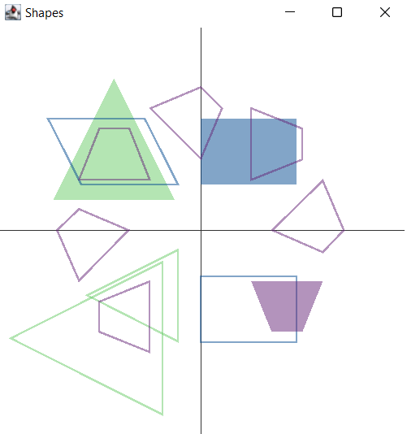
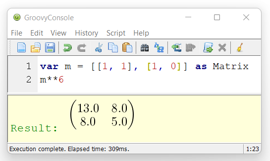

= Matrix calculations with Groovy, Apache Commons Math, ojAlgo, Nd4j and EJML
Paul King
:revdate: 2022-08-18T13:41:03+00:00
:keywords: data science, groovy, matrices, ojalgo, commons math, nd4j, ejml, vector api, eclipse deeplearning4j
:description: This post looks at using Groovy to write a number of applications involving matrices. It uses a number of open source matrix libraries.

This blogs looks at performing matrix calculations with Groovy
using various libraries:
https://commons.apache.org/[Apache Commons]
https://commons.apache.org/proper/commons-math/[Math],
https://www.ojalgo.org/[ojAlgo],
https://ejml.org/[EJML], and
https://deeplearning4j.konduit.ai/nd4j/tutorials/quickstart[Nd4j]
(part of Eclipse https://deeplearning4j.konduit.ai/[Deeplearning4j]).
We'll also take a quick
look at using the incubating Vector API for matrix calculations
(JEPs https://openjdk.org/jeps/338[338],
https://openjdk.org/jeps/414[414],
https://openjdk.org/jeps/417[417],
and https://openjdk.org/jeps/426[426]).

== Fibonacci

The Fibonacci sequence has origins in India centuries earlier but
is named after the Italian author of the publication,
https://en.wikipedia.org/wiki/Fibonacci_number[The Book of Calculation], published in 1202. In that publication, Fibonacci
proposed the sequence as a means to calculate the growth of
idealized (biologically unrealistic) rabbit populations.
He proposed that a newly born breeding pair of rabbits are
put in a field; each breeding pair mates at the age of one month,
and at the end of their second month they always produce another
pair of rabbits; and rabbits never die, but continue breeding
forever. Fibonacci posed the puzzle: how many pairs will there
be in one year? The sequence goes like this:

----
1, 1, 2, 3, 5, 8, 13, 21, 34, 55, 89, 144, 233
----

We can solve this problem using matrices. If we multiply the matrix  by itself n times we get .
This is an operation known as matrix exponentiation.
Let's explore this problem using four of the most popular
and maintained matrix libraries.

=== Apache Commons Math

Let's explore solving this problem using Apache Commons Math.
Apache Commons Math is a library of lightweight self-contained
mathematics and statics components. Matrices are part of the
linear algebra part of this library and for that context,
matrices of double values are relevant. So, we'll represent
our Fibonacci numbers as double values.

[source,groovy]
----
double[][] data = [[1d, 1d], [1d, 0d]]
def m = MatrixUtils.createRealMatrix(data)
println m * m * m
println m**6
----

Commons math has a factory method for creating matrixes from
double arrays. The names of the methods for multiplication and
exponentiation happen to align with Groovy's methods available
for operator overloading, namely `multiply` and `power`,
so we can use Groovy's convenient shorthands.

When we run the script, the output looks like this:

----
Array2DRowRealMatrix{{3.0,2.0},{2.0,1.0}}
Array2DRowRealMatrix{{13.0,8.0},{8.0,5.0}}
----

We could go a little further and print the values from the
matrix, but the result is clear enough. We see the values
in the Fibonacci sequence appearing in the output.

=== EJML

EJML (Efficient Java Matrix Library) is a linear algebra library
for manipulating real, complex, dense, and sparse matrices.
It is also a 100% Java solution. It has some novel features
including import from Matlab and support for semirings
(https://en.wikipedia.org/wiki/GraphBLAS[GraphBLAS]) which
can be used for graph algorithms where a sparse matrix may
be used to represent a graph as an adjacency matrix or
incidence matrix.

We can do the same calculation using EJML:

[source,groovy]
----
def m = new SimpleMatrix([[1d, 1d], [1d, 0d]] as double[][])
def ans = m.mult(m).mult(m)
println ans
6.times { ans = ans.mult(m) }
println ans
----

The name of the multiply method differs from the one where we
can use automatic operator overloading shorthands, so we just
call the method that EJML provides. See a little later under
language extensibility on how we could in fact add support to
use the same shorthands as we saw for Commons Math.

EJML doesn't have an exponentiation method but we just call
multiply the requisite number of times to achieve the same effect.
Note that we bumped the number of iterations called for the second
matrix, to reveal the next bunch of elements from the Fibonacci
sequence.

Running this script has this output:

----
Type = DDRM , rows = 2 , cols = 2
 3.0000E+00 2.0000E+00
 2.0000E+00 1.0000E+00 

Type = DDRM , rows = 2 , cols = 2
 5.5000E+01 3.4000E+01
 3.4000E+01 2.1000E+01
----

The first matrix has the same number as previously, and the second
reveals the next numbers in the Fibonacci sequence (21, 34, and 55).

=== Nd4j

Nd4j provides functionality available on Python to Java users.
It contains a mix of numpy operations and tensorflow/pytorch
operations. Nd4l makes use of native backends to allow it to
work on different platforms and provide efficient operation when
scaling up.

The code for our Fibonacci solution is very similar to EJML:

[source,groovy]
----
def m = Nd4j.create([[1, 1], [1, 0]] as int[][])
def ans = m.mmul(m).mmul(m)
println ans
9.times { ans = ans.mmul(m) }
println ans
----

One feature that is different to the previous two libraries is
that Nd4j supports _integer_ matrices (as well as doubles and
numerous other numerical and related types).

Running the script gives the following output:

[subs="quotes"]
----
[maroon]##...
[main] INFO org.nd4j.linalg.factory.Nd4jBackend - Loaded [CpuBackend] backend
...
[main] INFO org.nd4j.linalg.cpu.nativecpu.CpuNDArrayFactory - Binary level Generic x86 optimization level AVX/AVX2
[main] INFO org.nd4j.linalg.api.ops.executioner.DefaultOpExecutioner - Blas vendor: [OPENBLAS]
...##
[[         3,         2],
 [         2,         1]]
[[       233,       144],
 [       144,        89]]
----

Again, the first matrix is the same as we have seen previously,
the second has been bumped along the Fibonacci sequence by
three more elements.

=== ojAlgo

The next library we'll look at is ojAlgo (oj! Algorithms).
It is an open source all-Java offering for mathematics, linear
algebra and optimisation, supporting data science, machine
learning and scientific computing. It claims to be the fastest
pure-Java linear algebra library available and the project
website provide links to numerous benchmarks backing that claim.

Here is the code for our Fibonacci example:

[source,groovy]
----
def factory = Primitive64Matrix.FACTORY
def m = factory.rows([[1d, 1d], [1d, 0d]] as double[][])
println m * m * m
println m**15
----

We can see it supports the same operator overloading features we
saw for Commons Math.

When we run the script, it has the following output:

----
org.ojalgo.matrix.Primitive64Matrix < 2 x 2 >
{ { 3.0,	2.0 },
{ 2.0,	1.0 } }
org.ojalgo.matrix.Primitive64Matrix < 2 x 2 >
{ { 987.0,	610.0 },
{ 610.0,	377.0 } }
----

As expected, the first matrix is as we've seen before, while the
second reveals the next three numbers in the sequence.

=== Exploring the Vector API and EJML

From JDK16, various versions (JEPs
https://openjdk.org/jeps/338[338],
https://openjdk.org/jeps/414[414],
https://openjdk.org/jeps/417[417],
https://openjdk.org/jeps/426[426]) of the Vector API
have been available as an incubating preview feature.
The HotSpot compiler has previously already had some minimal
optimisations that can leverage vector hardware instructions
but the Vector API expands the scope of possible optimisations
considerably. We could look at writing our own code that might
make use of the Vector API and perhaps perform our matrix
multiplications ourselves. But, one of the libraries has already
done just that, so we'll explore that path.

The main contributor to the EJML library has published a
https://github.com/lessthanoptimal/VectorPerformance[repo]
for the purposes of very early prototyping and benchmarking.
We'll use the methods from one of its classes to explore use
of the vector API for our Fibonacci example. The
`MatrixMultiplication` class has three methods:
`mult_ikj_simple` is coded in the way any of us might write a
multiplication method as a first pass from its definition without
any attempts at optimisation, `mult_ikj` is coded in a
highly-optimised fashion and corresponds to the code EJML would
normally use, and `mult_ikj_vector` uses the Vector API. Note, you can think of these methods as "one layer down" from the `mult`
method we called in the previous example, i.e.&nbsp;the `mult` method
we used previously would be calling one of these under the covers.
That's why we pass the internal "matrix" representation instead
of our `SimpleMatrix` instance.

For our little calculations, the optimisations offered by the
Vector API would not be expected to be huge. However, we'll do
our calculation for generating the matrix we did as a first step
for all of the libraries and we'll do it in a loop with 1000
iterations for each of the three methods (`mult_ikj_simple`,
`mult_ikj`, and `mult_ikj_vector`). The code looks like this:

[source,groovy]
----
def m = new SimpleMatrix([[1, 1], [1, 0]] as double[][])
double[] expected = [3, 2, 2, 1]
def step1, result

long t0 = System.nanoTime()
1000.times {
    step1 = new SimpleMatrix(2, 2)
    result = new SimpleMatrix(2, 2)
    MatrixMultiplication.mult_ikj_simple(m.matrix, m.matrix, step1.matrix)
    MatrixMultiplication.mult_ikj_simple(step1.matrix, m.matrix, result.matrix)
    assert result.matrix.data == expected
}

long t1 = System.nanoTime()
1000.times {
    step1 = new SimpleMatrix(2, 2)
    result = new SimpleMatrix(2, 2)
    MatrixMultiplication.mult_ikj(m.matrix, m.matrix, step1.matrix)
    MatrixMultiplication.mult_ikj(step1.matrix, m.matrix, result.matrix)
    assert result.matrix.data == expected
}

long t2 = System.nanoTime()
1000.times {
    step1 = new SimpleMatrix(2, 2)
    result = new SimpleMatrix(2, 2)
    MatrixMultiplication.mult_ikj_vector(m.matrix, m.matrix, step1.matrix)
    MatrixMultiplication.mult_ikj_vector(step1.matrix, m.matrix, result.matrix)
    assert result.matrix.data == expected
}

long t3 = System.nanoTime()
printf "Simple:    %6.2f ms\n", (t1 - t0)/1000_000
printf "Optimized: %6.2f ms\n", (t2 - t1)/1000_000
printf "Vector:    %6.2f ms\n", (t3 - t2)/1000_000
----

This example was run on JDK16 with the following VM options:
`–enable-preview –add-modules jdk.incubator.vector`.

The output looks like this:

[subs="quotes"]
----
[maroon]##WARNING: Using incubator modules: jdk.incubator.vector##
Simple: 116.34 ms
Optimized: 34.91 ms
Vector: 21.94 ms
----

We can see here that we have some improvement even for our trivial
little calculation. Certainly, for biggest problems, the benefit
of using the Vector API could be quite substantial.

We should give a big disclaimer here. This little microbenchmark
using a loop of 1000 will give highly variable results and was
just done to give a very simple performance comparison.
For a more predictable comparison, consider running the
https://github.com/openjdk/jmh[jmh] benchmark in the aforementioned
https://github.com/lessthanoptimal/VectorPerformance[repo].
And you may wish to wait until the Vector API is out of preview
before relying on it for any production code - but by all means,
consider trying it out now.

== Leslie Matrices

Earlier, we described the Fibonacci sequence as being for
_unrealistic_ rabbit populations, where rabbits never died and
continued breeding forever. It turns out that Fibonacci matrices
are a special case of a more generalised model which can model
realistic rabbit populations (among other things). These are
https://en.wikipedia.org/wiki/Leslie_matrix[Leslie matrices].
For Leslie matrices, populations are divided into classes,
and we keep track of birth rates and survival rates over a
particular period for each class. We store this information
in a matrix in a special form. The populations for each class
for the next period can be calculated from those for the current
period through multiplication by the Leslie matrix.

This technique can be used for animal populations or human
population calculations. A Leslie matrix can help you find out
if there will be enough GenX, Millenials, and GenZ tax payers
to support an aging and soon retiring baby boomer population.
Sophisticated animal models might track populations for an animal
and for its predators or its prey. The survival and birth rates
might be adjusted based on such information. Given that only
females give birth, Leslie models will often be done only in
terms of the female population, with the total population
extrapolated from that.

We'll show an example for kangaroo population based on this
https://www.youtube.com/watch?v=I5WM2wdjr1M[video tutorial]
for Leslie matrices. It can help us find out if the kangaroo
population is under threat (perhaps drought, fires or floods
have impacted their feeding habitat) or if favorable conditions
are leading to overpopulation.

Following that example, we divide kangaroos into 3 population
classes: ages 0 to 3, 3 to 6, and 6 to 9. We are going to look
at the population every three years. The 0-3 year olds birthrate
(B1) is 0 since they are pre-fertile. The most fertile 3-6 year
olds birthrate (B2) is 2.3. The old roos (6-9) have a birthrate
(B3) of 0.4. We assume no kangaroos survive past 9 years old.
60% (S1) of the young kangaroos survive to move into the next age
group. 30% (S2) of the middle-aged kangaroos survive into old age.
Initially, we have 400 kangaroos in each age group.

Here is what the code looks like for this model:

[source,groovy]
----
double[] init = [400,   // 0..<3
                 400,   // 3..<6
                 400]   // 6..9
def p0 = MatrixUtils.createRealVector(init)
println "Initial populations: $p0"

double[][] data = [
        [0  , 2.3, 0.4],   // B1 B2 B3
        [0.6,   0, 0  ],   // S1  0  0
        [0  , 0.3, 0  ]    //  0 S2  0
]
def L = MatrixUtils.createRealMatrix(data)
def p1 = L.operate(p0)
println "Population after 1 round: $p1"

def p2 = L.operate(p1)
println "Population after 2 rounds: $p2"

def L10 = L ** 10
println "Population after 10 rounds: ${L10.operate(p0).toArray()*.round()}"
----

This code produces the following output:

----
Initial populations: {400; 400; 400}
Population after 1 round: {1,080; 240; 120}
Population after 2 rounds: {600; 648; 72}
Population after 10 rounds: [3019, 2558, 365]
----

After the first round, we see many young roos but a worrying drop
off in the older age groups. After the second round, only the
oldest age group looks worryingly small. However, with the healthy
numbers in the young generation, we can see that after 10
generations that indeed, the overall population is not at risk.
In fact, overpopulation might become a problem.

== Encryption with matrices

An early technique to encrypt a message was the
https://en.wikipedia.org/wiki/Caesar_cipher[Caesar cipher].
It substitutes letters in the alphabet by the letter shifted a
certain amount along in the alphabet, e.g.&nbsp;"IBM" becomes "HAL"
if shifting to the previous letter and "VMS" becomes "WNT" if
shifting one letter forward in the alphabet. This kind of cipher
can be broken by looking at frequency analysis of letters or
pattern words.

The https://en.wikipedia.org/wiki/Hill_cipher[Hill cipher]
improves upon the Caesar cipher by factoring multiple letters
into each letter of the encrypted text. Using matrices made it
practical to look at three or more symbols at once. In general,
an N-by-N matrix (the key) is multiplied by an encoding of the
message in matrix form. The result is a matrix representation
(encoded form) of the encrypted text. We use the inverse matrix
of our key to decrypt or message.

We need to have a way to convert our text message to and from
a matrix. A common scheme is to encode A as 1, B as 2, and so on.
We'll just use the ascii value for each character. We define
`encode` and `decode` methods to do this:

[source,groovy]
----
double[][] encode(String s) { s.bytes*.intValue().collate(3) as double[][] }
String decode(double[] data) { data*.round() as char[] }
----

We'll define a 2-by-2 matrix as our key and use it to encrypt.
We'll find the inverse of our key and use that to decrypt.
If we wanted to, we could use a 3-by-3 key for improved security
at the cost of more processing time.

Our code looks like this:

[source,groovy]
----
def message = 'GROOVY'
def m = new SimpleMatrix(encode(message))
println "Original: $message"

def enKey = new SimpleMatrix([[1, 3], [-1, 2]] as double[][])
def encrypted = enKey.mult(m)
println "Encrypted: ${decode(encrypted.matrix.data)}"

def deKey = enKey.invert()
def decrypted = deKey.mult(encrypted)
println "Decrypted: ${decode(decrypted.matrix.data)}"
----

When run, it has the following output:

----
Original: GROOVY
Encrypted: ĴŔŚWZc
Decrypted: GROOVY
----

This offers far more security than the Caesar cipher, however,
given today's computing availability, Hill ciphers can still
eventually be broken with sufficient brute force. For this reason,
Hill ciphers are seldom used on their own for encryption, but they
_are_ often used in combination with other techniques to add
diffusion - strengthening the security offered by the other
techniques.

== Shape manipulation

Our final example looks at geometrically transforming shapes.
To do this, we represent the points of the shape as vectors and
multiply them using transforms represented as matrices. We need
only worry about the corners, since we'll use Swing to draw our
shape, and it has a method for drawing a polygon by giving its
corners.

First we'll use Groovy's `SwingBuilder` to set up our frame:

[source,groovy]
----
new SwingBuilder().edt {
    def frame = frame(title: 'Shapes', size: [420, 440], show: true, defaultCloseOperation: DISPOSE_ON_CLOSE) {
        //contentPane.background = Color.WHITE
        widget(new CustomPaintComponent())
    }
    frame.contentPane.background = Color.WHITE
}
----

We aren't really use much of SwingBuilder's functionality here
but if we wanted to add more functionality, SwingBuilder would
make that task easier.

We will actually draw our shapes within a custom component.
We'll define a few color constants, a `drawPolygon` method which
given a matrix of points will draw those points as a polygon.
We'll also define a `vectors` method to convert a list of points
(the corners) into vectors, and a `transform` method which is a
factory method for creating a transform matrix.

Here is the code:

[source,groovy]
----
class CustomPaintComponent extends Component {
    static final Color violet = new Color(0x67, 0x27, 0x7A, 127)
    static final Color seaGreen = new Color(0x69, 0xCC, 0x67, 127)
    static final Color crystalBlue = new Color(0x06, 0x4B, 0x93, 127)
    static drawPolygon(Graphics g, List pts, boolean fill) {
        def poly = new Polygon().tap {
            pts.each {
                addPoint(*it.toRawCopy1D()*.round()*.intValue().collect { it + 200 })
            }
        }
        fill ? g.fillPolygon(poly) : g.drawPolygon(poly)
    }

    static List<Primitive64Matrix> vectors(List<Integer>... pts) {
        pts.collect{ factory.column(*it) }
    }

    static transform(List<Number>... lists) {
        factory.rows(lists as double[][])
    }

    void paint(Graphics g) {
        g.drawLine(0, 200, 400, 200)
        g.drawLine(200, 0, 200, 400)
        g.stroke = new BasicStroke(2)

        def triangle = vectors([-85, -150], [-145, -30], [-25, -30])
        g.color = seaGreen
        drawPolygon(g, triangle, true)
        // transform triangle
        ...

        def rectangle = vectors([0, -110], [0, -45], [95, -45], [95, -110])
        g.color = crystalBlue
        drawPolygon(g, rectangle, true)
        // transform rectangle
        ...

        def trapezoid = vectors([50, 50], [70, 100], [100, 100], [120, 50])
        g.color = violet
        drawPolygon(g, trapezoid, true)
        // transform trapezoid
        ...
    }
}
----

When we run this code we see our three shapes:

We can now add our transforms. We'll have one which rotate by 90
degrees anti-clockwise. Another which enlarges a shape by 25% and
one that shrinks a shape by 25%. We can combine transforms simply
by multiplying them together. We'll make two transformations of
our triangle. We'll rotate in both cases but we'll shrink one and
enlarge the other. We apply the transform simply by multiplying
each point by the transform matrix. Then we'll draw both
transformed shapes as an outline rather than filled (to make it
easier to distinguish the original and transformed versions).
Here is the code:

[source,groovy]
----
def rot90 = transform([0, 1], [-1, 0])
def bigger = transform([1.25, 0], [0, 1.25])
def smaller = transform([0.75, 0], [0, 0.75])
def triangle_ = triangle.collect{ rot90 * bigger * it }
drawPolygon(g, triangle_, false)
triangle_ = triangle.collect{ rot90 * smaller * it }
drawPolygon(g, triangle_, false)
----

For our rectangle, we'll have one simple transform which flips
the shape in the vertical axis. A second transform combines
multiple changes in one transform. We could have split this into
smaller transforms and the multiplied them together - but here
they are all in one. We flip in the horizontal access and then
apply a shear. We then draw the transformed shapes as outlines:

[source,groovy]
----
def flipV = transform([1, 0], [0, -1])
def rectangle_ = rectangle.collect{ flipV * it }
drawPolygon(g, rectangle_, false)
def flipH_shear = transform([-1, 0.5], [0, 1])
rectangle_ = rectangle.collect{ flipH_shear * it }
drawPolygon(g, rectangle_, false)
----

For our trapezoid, we create a transform which rotates 45 degrees
anti-clockwise (recall sin 45° = cos 45° = 0.707). Then we create
6 transforms rotating at 45, 90, 135 and so forth. We draw each
transformed shape as an outline:

[source,groovy]
----
def rot45 = transform([0.707, 0.707], [-0.707, 0.707])
def trapezoid_
(1..6).each { z ->
    trapezoid_ = trapezoid.collect{ rot45 ** z * it }
    drawPolygon(g, trapezoid_, false)
}
----

When we run the entire example, here is what the output looks
like:

We can see here that matrix transforms give us powerful ways to
manipulate images. We have used 2D images here, but the same
techniques would apply to 3D shapes.

== Language and tool extensibility

We saw earlier that some of the examples could make use of Groovy
operator shorthand syntax, while others couldn't. Here is a
summary of some common methods in the libraries:

[subs="quotes,macros",cols=5]
|===
| [blue]*_Groovy operator&nbsp;_*
| [blue]*_+_*
| [blue]*_-_*
| [blue]**_pass:v[*]_**
| [blue]**_pass:v[**]_**

| [blue]*_Groovy method_*
| [blue]*_plus_*
| [blue]*_minus_*
| [blue]*_multiply_*
| [blue]*_power_*

|[aqua]*_Commons math_*
|`add`
|`subtract`
|`multiply`
|`power`

|[aqua]*_EJML_*
|`plus`
|`minus`
|`mult`
|-

|[aqua]*_Nd4j_*
|`add`
|`sub`
|`mmul`
|-

|[aqua]*_ojAlgo_*
|`add`
|`subtract`
|`multiply`
|`power`
|===

Where the library used the same name as Groovy's method,
the shorthand could be used.

Groovy offers numerous extensibility features. We won't go into
all of the details but instead refer readers to the
https://dl.acm.org/doi/abs/10.1145/3386326[History of Groovy]
paper which gives more details.

In summary, that paper defined the following extensions for
Commons Math matrices:

[source,groovy]
----
RealMatrix.metaClass {
  plus << { RealMatrix ma -> delegate.add(ma) }
  plus << { double d -> delegate.scalarAdd(d) }
  multiply { double d -> delegate.scalarMultiply(d) }
  bitwiseNegate { -> new LUDecomposition(delegate).solver.inverse }
  constructor = { List l -> MatrixUtils.createRealMatrix(l as double[][]) }
}
----

This fixes some of the method name discrepancies in the above
table. We can now use the operator shorthand for matrix and
scalar addition as well as scalar multiply. We can also use
the ~ (`bitwiseNegate`) operator when finding the inverse.
The mention of `double[][]` during matrix construction is
now also gone.

The paper goes on to discuss how to automatically add the
necessary imports for a matrix library and provide aliases if
needed. The imports aren't shown for the code listings in this
blog but are in the listings in the sample code repo.
In any case, the imports can be "configured away" as the paper
discusses. The end result is our code in its entirety can look
like this:

[source,groovy]
----
var m = [[1, 1], [1, 0]] as Matrix
m**6
----

The paper also discusses tooling extensibility, in particular the
visualisation aspects of the GroovyConsole. It shows how to define
an output transform which renders any matrix result using a
jlatexmath library. So instead of seeing
`Array2DRowRealMatrix{{13.0,8.0},{8.0,5.0}}`, they will see
a graphical rendition of the matrix. So, the final end-user
experience when using the GroovyConsole looks like this:

When using in Jupyter style environments, other pretty output
styles may be supported.

== Further information

* Apache Commons Math https://commons.apache.org/proper/commons-math/userguide/linear.html[User Guide] and https://github.com/apache/commons-math[GitHub mirror]
* ojAlgo https://www.ojalgo.org/[website] and https://github.com/optimatika/ojAlgo/[GitHub repo]
* EJML http://ejml.org/[website] and https://github.com/lessthanoptimal/ejml[GitHub repo]
* Nd4j https://deeplearning4j.konduit.ai/nd4j/tutorials/quickstart[documentation] and https://github.com/eclipse/deeplearning4j/tree/master/nd4j[GitHub repo]
* https://github.com/paulk-asert/MatrixGroovy[Example code repo]
* https://www.youtube.com/watch?v=I5WM2wdjr1M[Leslie Matrices for population age distribution modelling] video
* https://dl.acm.org/doi/abs/10.1145/3386326[A history of the Groovy programming language] paper
* https://medium.com/@Styp/java-18-vector-api-do-we-get-free-speed-up-c4510eda50d2[Java 18: Vector API — Do we get free speed-up?] blog post

== Conclusion

We have examined a number of simple applications of matrices using
the Groovy programming language and the Apache Commons Math,
ojAlgo, Nd4j, and EJML libraries. You should be convinced that
using matrices on the JVM isn't hard, and you have numerous
options. We also saw a brief glimpse at the Vector API which
looks like an exciting addition to the JVM (hopefully arriving
soon in non-preview mode).
