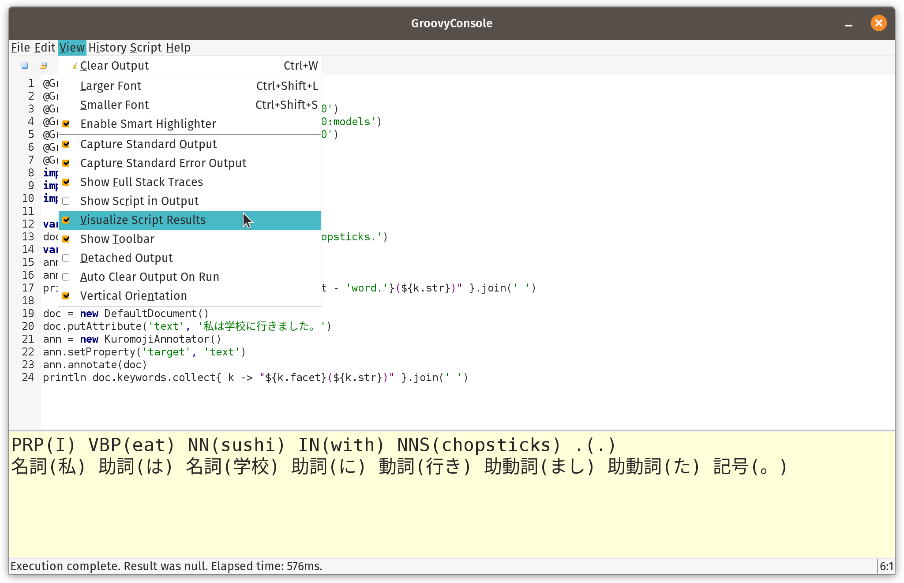
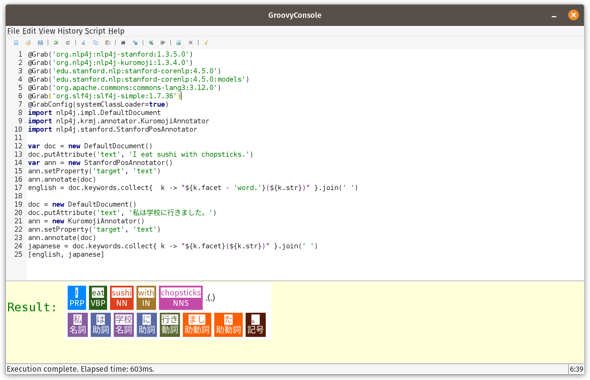
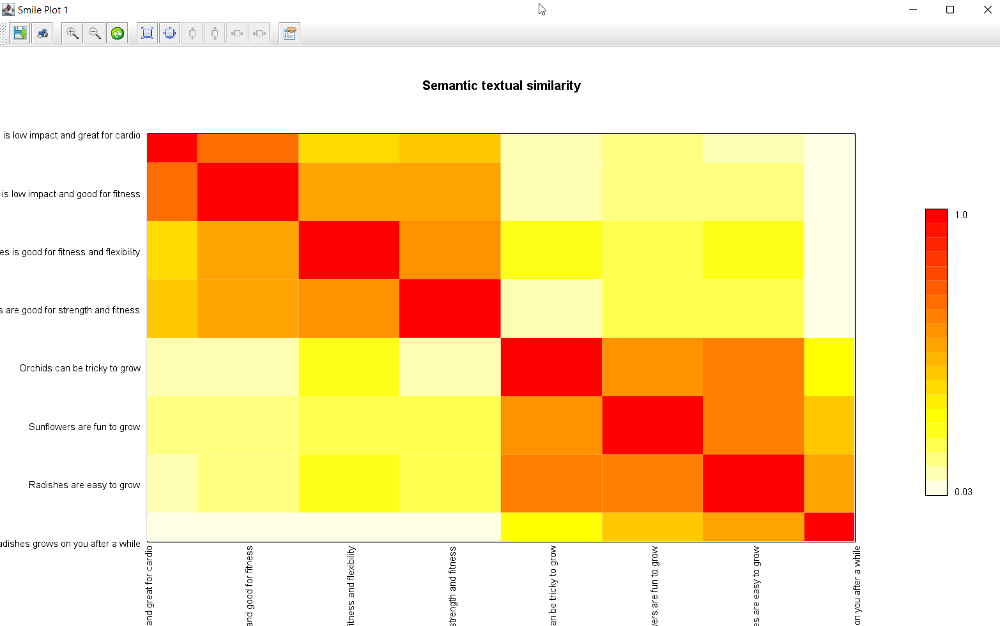

= Natural Language Processing with Groovy, OpenNLP, CoreNLP, Nlp4j, Datumbox, Smile, Spark NLP, DJL and TensorFlow
Paul King
:revdate: 2022-08-07T07:34:08+00:00
:keywords: groovy, natural language processing, spark nlp, apache opennlp, corenlp, nlp4j, tensorflow, djl, smile, datumbox
:description: This post looks at numerous common natural language processing tasks using Groovy and a range of NLP libraries.

Natural Language Processing is certainly a large and sometimes complex topic with
many aspects. Some of those aspects deserve entire blogs in their own right.
For this blog, we will briefly look at a few simple use cases illustrating
where you might be able to use NLP technology in your own project.

== Language Detection

Knowing what language some text represents can be a critical first step to subsequent
processing. Let's look at how to predict the language using a pre-built model and
https://opennlp.apache.org/[Apache OpenNLP]. Here, `ResourceHelper` is a utility class used to download and cache the model. The first run may take a little while as it downloads the model. Subsequent runs should be fast. Here we are using a well-known model referenced in the OpenNLP documentation.

[source,groovy]
----
def helper = new ResourceHelper('https://dlcdn.apache.org/opennlp/models/langdetect/1.8.3/')
def model = new LanguageDetectorModel(helper.load('langdetect-183'))
def detector = new LanguageDetectorME(model)

[ spa: 'Bienvenido a Madrid', fra: 'Bienvenue à Paris',
  dan: 'Velkommen til København', bul: 'Добре дошли в София'
].each { k, v ->
    assert detector.predictLanguage(v).lang == k
}
----

The `LanguageDetectorME` class lets us predict the language. In general, the predictor
may not be accurate on small samples of text, but it was good enough for our example.
We've used the language code as the key in our map, and we check that against the
predicted language.

A more complex scenario is training your own model. Let's look at how to do that with
https://www.datumbox.com/machine-learning-framework/[Datumbox].
Datumbox has a
https://github.com/datumbox/datumbox-framework-zoo[pre-trained models zoo]
but its language detection model didn't seem to work well for the small
snippets in the next example, so we'll train our own model.
First, we'll define our datasets:

[source,groovy]
----
def datasets = [
    English: getClass().classLoader.getResource("training.language.en.txt").toURI(),
    French: getClass().classLoader.getResource("training.language.fr.txt").toURI(),
    German: getClass().classLoader.getResource("training.language.de.txt").toURI(),
    Spanish: getClass().classLoader.getResource("training.language.es.txt").toURI(),
    Indonesian: getClass().classLoader.getResource("training.language.id.txt").toURI()
]
----

The `de` training dataset comes from the
https://github.com/datumbox/NaiveBayesClassifier/tree/master/resources/datasets/training.language.de.txt[Datumbox examples]. The training datasets for the other
languages are from https://www.kaggle.com/zarajamshaid/language-identification-datasst[Kaggle].

We set up the training parameters needed by our algorithm:

[source,groovy]
----
def trainingParams = new TextClassifier.TrainingParameters(
    numericalScalerTrainingParameters: null,
    featureSelectorTrainingParametersList: [new ChisquareSelect.TrainingParameters()],
    textExtractorParameters: new NgramsExtractor.Parameters(),
    modelerTrainingParameters: new MultinomialNaiveBayes.TrainingParameters()
)
----

We'll use a Naïve Bayes model with Chisquare feature selection.

Next we create our algorithm, train it with our training dataset, and then validate it
against the training dataset. We'd normally want to split the data into training and
testing datasets, to give us a more accurate statistic of the accuracy of our model.
But for simplicity, while still illustrating the API, we'll train and validate with
our entire dataset:

[source,groovy]
----
def config = Configuration.configuration
def classifier = MLBuilder.create(trainingParams, config)
classifier.fit(datasets)
def metrics = classifier.validate(datasets)
println "Classifier Accuracy (using training data): $metrics.accuracy"
----

When run, we see the following output:

----
Classifier Accuracy (using training data): 0.9975609756097561
----

Our test dataset will consist of some hard-coded illustrative phrases. Let's use our model to predict the language for each phrase:

[source,groovy]
----
[   'Bienvenido a Madrid', 'Bienvenue à Paris', 'Welcome to London',
    'Willkommen in Berlin', 'Selamat Datang di Jakarta'
].each { txt ->
    def r = classifier.predict(txt)
    def predicted = r.YPredicted
    def probability = sprintf '%4.2f', r.YPredictedProbabilities.get(predicted)
    println "Classifying: '$txt',  Predicted: $predicted,  Probability: $probability"
}
----

When run, it has this output:

----
Classifying: 'Bienvenido a Madrid',&nbsp; Predicted: Spanish,&nbsp; Probability: 0.83
Classifying: 'Bienvenue à Paris',&nbsp; Predicted: French,&nbsp; Probability: 0.71
Classifying: 'Welcome to London',&nbsp; Predicted: English,&nbsp; Probability: 1.00
Classifying: 'Willkommen in Berlin',&nbsp; Predicted: German,&nbsp; Probability: 0.84
Classifying: 'Selamat Datang di Jakarta',&nbsp; Predicted: Indonesian,&nbsp; Probability: 1.00
----

Given these phrases are very short, it is nice to get them all correct,
and the probabilities all seem reasonable for this scenario.

== Parts of Speech

Parts of speech (POS) analysers examine each part of a sentence (the words and
potentially punctuation) in terms of the role they play in a sentence. A typical
analyser will assign or annotate words with their role like identifying nouns,
verbs, adjectives and so forth. This can be a key early step for tools like the
voice assistants from Amazon, Apple and Google.

We'll start by looking at a perhaps lesser known library Nlp4j before looking at
some others. In fact, there are multiple Nlp4j libraries. We'll use the one from
https://nlp4j.org/[nlp4j.org], which seems to be the most active and recently updated.

This library uses the https://stanfordnlp.github.io/CoreNLP/[Stanford CoreNLP]
library under the covers for its English POS functionality. The library has the
concept of documents, and annotators that work on documents. Once annotated,
we can print out all of the discovered words and their annotations:

[source,groovy]
----
var doc = new DefaultDocument()
doc.putAttribute('text', 'I eat sushi with chopsticks.')
var ann = new StanfordPosAnnotator()
ann.setProperty('target', 'text')
ann.annotate(doc)
println doc.keywords.collect{  k -> "${k.facet - 'word.'}(${k.str})" }.join(' ')
----

When run, we see the following output:

----
PRP(I) VBP(eat) NN(sushi) IN(with) NNS(chopsticks) .(.)
----

The annotations, also known as tags or facets, for this example are as follows:

[stripes="even",cols="2"]
|===
|PRP |Personal pronoun
|VBP |Present tense verb
|NN |Noun, singular
|IN |Preposition
|NNS |Noun, plural
|===

The documentation for the libraries we are using give a more complete list of such
annotations.

A nice aspect of this library is support for other languages, in particular, Japanese.
The code is very similar but uses a different annotator:

[source,groovy]
----
doc = new DefaultDocument()
doc.putAttribute('text', '私は学校に行きました。')
ann = new KuromojiAnnotator()
ann.setProperty('target', 'text')
ann.annotate(doc)
println doc.keywords.collect{ k -> "${k.facet}(${k.str})" }.join(' ')
----

When run, we see the following output:

----
名詞(私) 助詞(は) 名詞(学校) 助詞(に) 動詞(行き) 助動詞(まし) 助動詞(た) 記号(。)
----

Before progressing, we'll highlight the result visualization capabilities of the
GroovyConsole. This feature lets us write a small Groovy script which converts
results to any swing component. In our case we'll convert lists of annotated strings
to a `JLabel` component containing HTML including colored annotation boxes.
The details aren't included here but can be found in the
https://github.com/paulk-asert/groovy-data-science/blob/master/subprojects/LanguageProcessing/src/main/resources/OutputTransforms.groovy[repo].
We need to copy that file into our `~/.groovy` folder and then enable script
visualization as shown here:

Then we should see the following when running the script:

The visualization is purely optional but adds a nice touch. If using Groovy in
notebook environments like Jupyter/BeakerX, there might be visualization tools
in those environments too.

Let's look at a larger example using the https://haifengl.github.io/[Smile] library.

First, the sentences that we'll examine:

[source,groovy]
----
def sentences = [
    'Paul has two sisters, Maree and Christine.',
    'No wise fish would go anywhere without a porpoise',
    'His bark was much worse than his bite',
    'Turn on the lights to the main bedroom',
    "Light 'em all up",
    'Make it dark downstairs'
]
----

A couple of those sentences might seem a little strange, but they are selected
to show off quite a few of the different POS tags.

Smile has a tokenizer class which splits a sentence into words. It handles numerous
cases like contractions and abbreviations ("e.g.", "'tis", "won't").
Smile also has a POS class based on the hidden Markov model and a built-in
model is used for that class. Here is our code using those classes:

[source,groovy]
----
def tokenizer = new SimpleTokenizer(true)
sentences.each {
    def tokens = Arrays.stream(tokenizer.split(it)).toArray(String[]::new)
    def tags = HMMPOSTagger.default.tag(tokens)*.toString()
    println tokens.indices.collect{tags[it] == tokens[it] ? tags[it] : "${tags[it]}(${tokens[it]})" }.join(' ')
}
----

We run the tokenizer for each sentence. Each token is then displayed directly
or with its tag if it has one.

Running the script gives this visualization:

++++
<table style="background-color: white; margin: 5px; border: 1px solid gray"><tbody><tr><td style="padding: 5px;">
 <table><tbody><tr><td style="padding: 5px; text-align: center; ">

 Paul 
 NNP
</td><td style="padding: 5px; text-align: center;">

 has 
 VBZ
</td><td style="text-align: center; padding: 5px;">

 two 
 CD
</td><td style="text-align: center; padding: 5px;">

 sisters 
 NNS
</td><td style="text-align: center; padding: 5px;">, </td><td style="padding: 5px;">

 Maree 
 NNP
</td><td style="text-align: center; padding: 5px;">

 and 
 CC
</td><td style="text-align: center; padding: 5px;">

 Christine 
 NNP
</td><td style="text-align: center; padding: 5px;">.</td></tr></tbody></table>
<table><tbody><tr><td style="text-align: center; padding: 5px;">

 No 
 DT
</td><td style="text-align: center; padding: 5px;">

 wise 
 JJ
</td><td style="text-align: center; padding: 5px;">

 fish 
 NN
</td><td style="text-align: center; padding: 5px;">

 would 
 MD
</td><td style="text-align: center; padding: 5px;">

 go 
 VB
</td><td style="text-align: center; padding: 5px;">

 anywhere 
 RB
</td><td style="text-align: center; padding: 5px;">

 without 
 IN
</td><td style="text-align: center; padding: 5px;">

 a 
 DT
</td><td style="text-align: center; padding: 5px;">

 porpoise 
 NN
</td><td style="text-align: center; padding: 5px;"></td></tr></tbody></table>
<table><tbody><tr><td style="text-align: center; padding: 5px;">

 His 
 PRP$
</td><td style="text-align: center; padding: 5px;">

 bark 
 NN
</td><td style="text-align: center; padding: 5px;">

 was 
 VBD
</td><td style="text-align: center; padding: 5px;">

 much 
 RB
</td><td style="text-align: center; padding: 5px;">

 worse 
 JJR
</td><td style="text-align: center; padding: 5px;">

 than 
 IN
</td><td style="text-align: center; padding: 5px;">

 his 
 PRP$
</td><td style="text-align: center; padding: 5px;">

 bite 
 NN
</td><td style="text-align: center; padding: 5px;"></td></tr></tbody></table>
<table><tbody><tr><td style="text-align: center; padding: 5px;">

 Turn 
 VB
</td><td style="text-align: center; padding: 5px;">

 on 
 IN
</td><td style="text-align: center; padding: 5px;">

 the 
 DT
</td><td style="text-align: center; padding: 5px;">

 lights 
 NNS
</td><td style="text-align: center; padding: 5px;">

 to 
 TO
</td><td style="text-align: center; padding: 5px;">

 the 
 DT
</td><td style="text-align: center; padding: 5px;">

 main 
 JJ
</td><td style="text-align: center; padding: 5px;">

 bedroom 
 NN
</td><td style="text-align: center; padding: 5px;"></td></tr></tbody></table>
<table><tbody><tr><td style="text-align: center; padding: 5px;">

 Light 
 NNP
</td><td style="text-align: center; padding: 5px;">

 'em 
 PRP
</td><td style="text-align: center; padding: 5px;">

 all 
 RB
</td><td style="text-align: center; padding: 5px;">

 up 
 RB
</td><td style="text-align: center; padding: 5px;"></td></tr></tbody></table>
<table><tbody><tr><td style="text-align: center; padding: 5px;">

 Make 
 VB
</td><td style="text-align: center; padding: 5px;">

 it 
 PRP
</td><td style="text-align: center; padding: 5px;">

 dark 
 JJ
</td><td style="text-align: center; padding: 5px;">

 downstairs 
 NN
</td><td style="text-align: center; padding: 5px;"></td></tr></tbody></table>
 </td></tr></tbody></table>
++++

[Note: the scripts in the repo just print to stdout which is perfect when using the
command-line or IDEs. The visualization in the GoovyConsole kicks in only for the
actual result. So, if you are following along at home and wanting to use the
GroovyConsole, you'd change the `each` to `collect` and remove the `println`,
and you should be good for visualization.]

The OpenNLP code is very similar:

[source,groovy]
----
def tokenizer = SimpleTokenizer.INSTANCE
sentences.each {
    String[] tokens = tokenizer.tokenize(it)
    def posTagger = new POSTaggerME('en')
    String[] tags = posTagger.tag(tokens)
    println tokens.indices.collect{tags[it] == tokens[it] ? tags[it] : "${tags[it]}(${tokens[it]})" }.join(' ')
}
----

OpenNLP allows you to supply your own POS model but downloads a default
one if none is specified.

When the script is run, it has this visualization:

++++
<table style="background-color: white; margin:5px; border: 1px solid gray;"><tbody><tr><td style="padding: 5px;">
 <table><tbody><tr><td style="text-align: center; padding: 5px;">

 Paul 
 PROPN
</td><td style="text-align: center; padding: 5px;">

 has 
 VERB
</td><td style="text-align: center; padding: 5px;">

 two 
 NUM
</td><td style="text-align: center; padding: 5px;">

 sisters 
 NOUN
</td><td style="text-align: center; padding: 5px;">

 , 
 PUNCT
</td><td style="text-align: center; padding: 5px;">

 Maree 
 PROPN
</td><td style="text-align: center; padding: 5px;">

 and 
 CCONJ
</td><td style="text-align: center; padding: 5px;">

 Christine 
 PROPN
</td><td style="text-align: center; padding: 5px;">

 . 
 PUNCT
</td><td style="text-align: center; padding: 5px;"></td></tr></tbody></table>
<table><tbody><tr><td style="text-align: center; padding: 5px;">

 No 
 DET
</td><td style="text-align: center; padding: 5px;">

 wise 
 ADJ
</td><td style="text-align: center; padding: 5px;">

 fish 
 NOUN
</td><td style="text-align: center; padding: 5px;">

 would 
 AUX
</td><td style="text-align: center; padding: 5px;">

 go 
 VERB
</td><td style="text-align: center; padding: 5px;">

 anywhere 
 ADV
</td><td style="text-align: center; padding: 5px;">

 without 
 ADP
</td><td style="text-align: center; padding: 5px;">

 a 
 DET
</td><td style="text-align: center; padding: 5px;">

 porpoise 
 NOUN
</td><td style="text-align: center; padding: 5px;"></td></tr></tbody></table>
<table><tbody><tr><td style="text-align: center; padding: 5px;">

 His 
 PRON
</td><td style="text-align: center; padding: 5px;">

 bark 
 NOUN
</td><td style="text-align: center; padding: 5px;">

 was 
 AUX
</td><td style="text-align: center; padding: 5px;">

 much 
 ADV
</td><td style="text-align: center; padding: 5px;">

 worse 
 ADJ
</td><td style="text-align: center; padding: 5px;">

 than 
 ADP
</td><td style="text-align: center; padding: 5px;">

 his 
 PRON
</td><td style="text-align: center; padding: 5px;">

 bite 
 NOUN
</td><td style="text-align: center; padding: 5px;"></td></tr></tbody></table>
<table><tbody><tr><td style="text-align: center; padding: 5px;">

 Turn 
 VERB
</td><td style="text-align: center; padding: 5px;">

 on 
 ADP
</td><td style="text-align: center; padding: 5px;">

 the 
 DET
</td><td style="text-align: center; padding: 5px;">

 lights 
 NOUN
</td><td style="text-align: center; padding: 5px;">

 to 
 ADP
</td><td style="text-align: center; padding: 5px;">

 the 
 DET
</td><td style="text-align: center; padding: 5px;">

 main 
 ADJ
</td><td style="text-align: center; padding: 5px;">

 bedroom 
 NOUN
</td><td style="text-align: center; padding: 5px;"></td></tr></tbody></table>
<table><tbody><tr><td style="text-align: center; padding: 5px;">

 Light 
 NOUN
</td><td style="text-align: center; padding: 5px;">

 ' 
 PUNCT
</td><td style="text-align: center; padding: 5px;">

 em 
 NOUN
</td><td style="text-align: center; padding: 5px;">

 all 
 ADV
</td><td style="text-align: center; padding: 5px;">

 up 
 ADP
</td><td style="text-align: center; padding: 5px;"></td></tr></tbody></table>
<table><tbody><tr><td style="padding: 5px;">

 Make 
 VERB
</td><td style="text-align: center; padding: 5px;">

 it 
 PRON
</td><td style="text-align: center; padding: 5px;">

 dark 
 ADJ
</td><td style="text-align: center; padding: 5px;">

 downstairs 
 NOUN
</td><td style="text-align: center; padding: 5px;"></td></tr></tbody></table>
 </td></tr></tbody></table>
++++

The observant reader may have noticed some slight differences in the tags used in
this library. They are essentially the same but using slightly different names.
This is something to be aware of when swapping between POS libraries or models.
Make sure you look up the documentation for the library/model you are using to
understand the available tag types.

== Entity Detection

Named entity recognition (NER), seeks to identity and classify named entities in text.
Categories of interest might be persons, organizations, locations dates, etc.
It is another technology used in many fields of NLP.

We'll start with our sentences to analyse:

[source,groovy]
----
String[] sentences = [
    "A commit by Daniel Sun on December 6, 2020 improved Groovy 4's language integrated query.",
    "A commit by Daniel on Sun., December 6, 2020 improved Groovy 4's language integrated query.",
    'The Groovy in Action book by Dierk Koenig et. al. is a bargain at $50, or indeed any price.',
    'The conference wrapped up yesterday at 5:30 p.m. in Copenhagen, Denmark.',
    'I saw Ms. May Smith waving to June Jones.',
    'The parcel was passed from May to June.',
    'The Mona Lisa by Leonardo da Vinci has been on display in the Louvre, Paris since 1797.'
]
----

We'll use some well-known models, we'll focus on the _person_, _money_, _date_, _time_, and _location_ models:

[source,groovy]
----
def base = 'http://opennlp.sourceforge.net/models-1.5'
def modelNames = ['person', 'money', 'date', 'time', 'location']
def finders = modelNames.collect { model ->
    new NameFinderME(DownloadUtil.downloadModel(new URL("$base/en-ner-${model}.bin"), TokenNameFinderModel))
}
----

We'll now tokenize our sentences:

[source,groovy]
----
def tokenizer = SimpleTokenizer.INSTANCE
sentences.each { sentence ->
    String[] tokens = tokenizer.tokenize(sentence)
    Span[] tokenSpans = tokenizer.tokenizePos(sentence)
    def entityText = [:]
    def entityPos = [:]
    finders.indices.each {fi ->
        // could be made smarter by looking at probabilities and overlapping spans
        Span[] spans = finders[fi].find(tokens)
        spans.each{span ->
            def se = span.start..<span.end
            def pos = (tokenSpans[se.from].start)..<(tokenSpans[se.to].end)
            entityPos[span.start] = pos
            entityText[span.start] = "$span.type(${sentence[pos]})"
        }
    }
    entityPos.keySet().sort().reverseEach {
        def pos = entityPos[it]
        def (from, to) = [pos.from, pos.to + 1]
        sentence = sentence[0..<from] + entityText[it] + sentence[to..-1]
    }
    println sentence
}
----

And when visualized, shows this:

++++
<table style="border:1px solid grey; margin:5px; background-color:white"><tbody><tr><td>
 <table style="margin:5px;"><tbody><tr><td style="padding:5px;">A commit by </td><td style="text-align:center;">

 Daniel Sun 
 person
</td><td style="text-align: center; padding:5px;">on </td><td style="text-align:center;">

 December 6, 2020 
 date
</td><td style="text-align: center; padding:5px;">improved Groovy 4's language integrated query.</td></tr></tbody></table>
<table style="margin:5px;"><tbody><tr><td style="text-align: center; padding:5px;">A commit by </td><td style="text-align: center;">

 Daniel 
 person
</td><td style="text-align:center; padding:5px;">on Sun., </td><td style="text-align:center;">

 December 6, 2020 
 date
</td><td style="text-align: center; padding:5px;">improved Groovy 4's language integrated query.</td></tr></tbody></table>
<table style="margin:5px;"><tbody><tr><td style="text-align: center; padding:5px;">The Groovy in Action book by </td><td style="text-align: center;">

 Dierk Koenig 
 person
</td><td style="text-align: center; padding:5px;">et. al. is a bargain at </td><td style="text-align:center;">

 $50 
 money
</td><td style="text-align: center; padding:5px;">, or indeed any price.</td></tr></tbody></table>
<table style="margin:5px;"><tbody><tr><td style="text-align: center; padding:5px;">The conference wrapped up </td><td style="text-align: center;">

 yesterday 
 date
</td><td style="text-align: center; padding:5px;">at </td><td style="text-align:center;">

 5:30 p.m. 
 time
</td><td style="text-align: center; padding:5px;">in </td><td style="text-align: center;">

 Copenhagen 
 location
</td><td style="padding:5px;">, </td><td style="text-align:center;">

 Denmark 
 location
</td><td style="padding:5px;">.</td></tr></tbody></table>
<table style="margin:5px;"><tbody><tr><td style="padding:5px;">I saw Ms. </td><td style="text-align:center;">

 May Smith 
 person
</td><td style="text-align: center; padding:5px;">waving to </td><td style="text-align:center;">

 June Jones 
 person
</td><td style="text-align: center; padding:5px;">.</td></tr></tbody></table>
<table style="margin:5px;"><tbody><tr><td style="padding:5px;">The parcel was passed from </td><td style="text-align:center;">

 May to June 
 date
</td><td style="padding:5px;">.</td></tr></tbody></table>
<table style="margin:5px;"><tbody><tr><td style="padding:5px;">The Mona Lisa by </td><td style="text-align:center;">

 Leonardo da Vinci 
 person
</td><td style="padding:5px;">has been on display in the Louvre, </td><td style="text-align:center;">

 Paris 
 location
</td><td style="text-align:center; padding:5px;">

 since 1797 
 date
</td><td>.</td></tr></tbody></table>
 </td></tr></tbody></table>
++++

We can see here that most examples have been categorized as we might expect.
We'd have to improve our model for it to do a better job on the _"May to June"_
example.

== Scaling Entity Detection

We can also run our named entity detection algorithms on platforms like
http://nlp.johnsnowlabs.com/[Spark NLP] which adds NLP functionality to
https://spark.apache.org/[Apache Spark]. We'll use
https://nlp.johnsnowlabs.com/2020/01/22/glove_100d.html[glove_100d]
embeddings and the
https://nlp.johnsnowlabs.com/2020/02/03/onto_100_en.html[onto_100] NER model.

[source,groovy]
----
var assembler = new DocumentAssembler(inputCol: 'text', outputCol: 'document', cleanupMode: 'disabled')

var tokenizer = new Tokenizer(inputCols: ['document'] as String[], outputCol: 'token')

var embeddings = WordEmbeddingsModel.pretrained('glove_100d').tap {
    inputCols = ['document', 'token'] as String[]
    outputCol = 'embeddings'
}

var model = NerDLModel.pretrained('onto_100', 'en').tap {
    inputCols = ['document', 'token', 'embeddings'] as String[]
    outputCol ='ner'
}

var converter = new NerConverter(inputCols: ['document', 'token', 'ner'] as String[], outputCol: 'ner_chunk')

var pipeline = new Pipeline(stages: [assembler, tokenizer, embeddings, model, converter] as PipelineStage[])

var spark = SparkNLP.start(false, false, '16G', '', '', '')

var text = [
    "The Mona Lisa is a 16th century oil painting created by Leonardo. It's held at the Louvre in Paris."
]
var data = spark.createDataset(text, Encoders.STRING()).toDF('text')

var pipelineModel = pipeline.fit(data)

var transformed = pipelineModel.transform(data)
transformed.show()

use(SparkCategory) {
    transformed.collectAsList().each { row ->
        def res =  row.text
        def chunks = row.ner_chunk.reverseIterator()
        while (chunks.hasNext()) {
            def chunk = chunks.next()
            int begin = chunk.begin
            int end = chunk.end
            def entity = chunk.metadata.get('entity').get()
            res = res[0..<begin] + "$entity($chunk.result)" + res[end<..-1]
        }
        println res
    }
}
----

We won't go into all of the details here. In summary, the code sets up a pipeline
that transforms our input sentences, via a series of steps, into chunks, where
each chunk corresponds to a detected entity. Each chunk has a start and ending
position, and an associated tag type.

This may not seem like it is much different to our earlier examples, but if we had
large volumes of data, and we were running in a large cluster, the work could be
spread across worker nodes within the cluster.

Here we have used a utility `SparkCategory` class which makes accessing the
information in Spark `Row` instances a little nicer in terms of Groovy shorthand
syntax. We can use `row.text` instead of `row.get(row.fieldIndex('text'))`.
Here is the code for this utility class:

[source,groovy]
----
class SparkCategory {
    static get(Row r, String field) { r.get(r.fieldIndex(field)) }
}
----

If doing more than this simple example, the use of `SparkCategory` could
be made implicit through various standard Groovy techniques.

When we run our script, we see the following output:

----
22/08/07 12:31:39 INFO SparkContext: Running Spark version 3.3.0
...
glove_100d download started this may take some time.
Approximate size to download 145.3 MB
...
onto_100 download started this may take some time.
Approximate size to download 13.5 MB
...
+--------------------+--------------------+--------------------+--------------------+--------------------+--------------------+
|                text|            document|               token|          embeddings|                 ner|           ner_chunk|
+--------------------+--------------------+--------------------+--------------------+--------------------+--------------------+
|The Mona Lisa is ...|[{document, 0, 98...|[{token, 0, 2, Th...|[{word_embeddings...|[{named_entity, 0...|[{chunk, 0, 12, T...|
+--------------------+--------------------+--------------------+--------------------+--------------------+--------------------+
PERSON(The Mona Lisa) is a DATE(16th century) oil painting created by PERSON(Leonardo). It's held at the FAC(Louvre) in GPE(Paris).
----

The result has the following visualization:

++++
<table style="border:1px solid grey; margin:5px; background-color:white;"><tbody><tr><td style="text-align: center; padding: 5px;">
 <table style="margin:5px;"><tbody><tr><td style="text-align: center; padding: 5px;">

 The Mona Lisa 
 PERSON
</td><td style="text-align: center; padding: 5px;">is a </td><td style="text-align: center; padding: 5px;">

 16th century 
 DATE
</td><td style="text-align: center; padding: 5px;">oil painting created by </td><td style="text-align: center; padding: 5px;">

 Leonardo 
 PERSON
</td><td style="text-align: center; padding: 5px;">. It's held at the </td><td style="text-align: center; padding: 5px;">

 Louvre 
 FAC
</td><td style="text-align: center; padding: 5px;">in </td><td style="text-align: center; padding: 5px;">

 Paris 
 GPE
</td><td style="text-align: center; padding: 5px;">.</td></tr></tbody></table>
 </td></tr></tbody></table>
++++

Here FAC is facility (buildings, airports, highways, bridges, etc.) and
GPE is Geo-Political Entity (countries, cities, states, etc.).

== Sentence Detection

Detecting sentences in text might seem a simple concept at first
but there are numerous special cases.

Consider the following text:

[source,groovy]
----
def text = '''
The most referenced scientific paper of all time is "Protein measurement with the
Folin phenol reagent" by Lowry, O. H., Rosebrough, N. J., Farr, A. L. & Randall,
R. J. and was published in the J. BioChem. in 1951. It describes a method for
measuring the amount of protein (even as small as 0.2 γ, were γ is the specific
weight) in solutions and has been cited over 300,000 times and can be found here:
https://www.jbc.org/content/193/1/265.full.pdf. Dr. Lowry completed
two doctoral degrees under an M.D.-Ph.D. program from the University of Chicago
before moving to Harvard under A. Baird Hastings. He was also the H.O.D of
Pharmacology at Washington University in St. Louis for 29 years.
'''
----

There are full stops at the end of each sentence (though in general, it could
also be other punctuation like exclamation marks and question marks). There are
also full stops and decimal points in abbreviations, URLs, decimal numbers and
so forth. Sentence detection algorithms might have some special hard-coded cases,
like "Dr.", "Ms.", or in an emoticon, and may also use some heuristics.
In general, they might also be trained with examples like above.

Here is some code for OpenNLP for detecting sentences in the above:

[source,groovy]
----
def helper = new ResourceHelper('http://opennlp.sourceforge.net/models-1.5')
def model = new SentenceModel(helper.load('en-sent'))
def detector = new SentenceDetectorME(model)
def sentences = detector.sentDetect(text)
assert text.count('.') == 28
assert sentences.size() == 4
println "Found ${sentences.size()} sentences:\n" + sentences.join('\n\n')
----

It has the following output:

[subs="quotes"]
----
[maroon]#Downloading en-sent#
Found 4 sentences:
The most referenced scientific paper of all time is "Protein measurement with the
Folin phenol reagent" by Lowry, O. H., Rosebrough, N. J., Farr, A. L. &amp; Randall,
R. J. and was published in the J. BioChem. in 1951.

It describes a method for
measuring the amount of protein (even as small as 0.2 γ, were γ is the specific
weight) in solutions and has been cited over 300,000 times and can be found here:
https://www.jbc.org/content/193/1/265.full.pdf.

Dr. Lowry completed
two doctoral degrees under an M.D.-Ph.D. program from the University of Chicago
before moving to Harvard under A. Baird Hastings.

He was also the H.O.D of
Pharmacology at Washington University in St. Louis for 29 years.
----

We can see here, it handled all of the tricky cases in the example.

== Relationship Extraction with Triples

The next step after detecting named entities and the various parts of speech
of certain words is to explore relationships between them. This is often done
in the form of _subject-predicate-object_ triplets. In our earlier NER example,
for the sentence _"The conference wrapped up yesterday at 5:30 p.m. in Copenhagen, Denmark."_, we found various date, time and location named entities.

We can extract triples using the https://github.com/uma-pi1/minie[MinIE library]
(which in turns uses the Standford CoreNLP library) with the following code:

[source,groovy]
----
def parser = CoreNLPUtils.StanfordDepNNParser()
sentences.each { sentence ->
    def minie = new MinIE(sentence, parser, MinIE.Mode.SAFE)

    println "\nInput sentence: $sentence"
    println '============================='
    println 'Extractions:'
    for (ap in minie.propositions) {
        println "\tTriple: $ap.tripleAsString"
        def attr = ap.attribution.attributionPhrase ? ap.attribution.toStringCompact() : 'NONE'
        println "\tFactuality: $ap.factualityAsString\tAttribution: $attr"
        println '\t----------'
    }
}
----

The output for the previously mentioned sentence is shown below:

----
Input sentence: The conference wrapped up yesterday at 5:30 p.m. in Copenhagen, Denmark.
=============================
Extractions:
        Triple: "conference"    "wrapped up yesterday at"       "5:30 p.m."
        Factuality: (+,CT)      Attribution: NONE
        ----------
        Triple: "conference"    "wrapped up yesterday in"       "Copenhagen"
        Factuality: (+,CT)      Attribution: NONE
        ----------
        Triple: "conference"    "wrapped up"    "yesterday"
        Factuality: (+,CT)      Attribution: NONE
----

We can now piece together the relationships between the earlier entities we detected.

There was also a problematic case amongst the earlier NER examples,
_"The parcel was passed from May to June."_.
Using the previous model, detected _"May to June"_ as a _date_.
Let's explore that using CoreNLP's triple extraction directly.
We won't show the source code here but CoreNLP supports
https://github.com/paulk-asert/groovy-data-science/blob/master/subprojects/LanguageProcessing/src/main/groovy/DetectTriplesPOS_CoreNLP.groovy[simple] and
https://github.com/paulk-asert/groovy-data-science/blob/master/subprojects/LanguageProcessing/src/main/groovy/DetectTriplesAnnotation_CoreNLP.groovy[more powerful]
approaches to solving this problem. The output for the sentence in
question using the more powerful technique is:

----
Sentence #7: The parcel was passed from May to June.
root(ROOT-0, passed-4)
det(parcel-2, The-1)
nsubj:pass(passed-4, parcel-2)
aux:pass(passed-4, was-3)
case(May-6, from-5)
obl:from(passed-4, May-6)
case(June-8, to-7)
obl:to(passed-4, June-8)
punct(passed-4, .-9)

Triples:
1.0 parcel was passed
1.0 parcel was passed to June
1.0 parcel was passed from May to June
1.0 parcel was passed from May
----

We can see that this has done a better job of piecing together what entities we have and their relationships.

== Sentiment Analysis

Sentiment analysis is a NLP technique used to determine whether data is positive,
negative, or neutral. Standford CoreNLP has default models it uses for this purpose:

[source,groovy]
----
def doc = new Document('''
StanfordNLP is fantastic!
Groovy is great fun!
Math can be hard!
''')
for (sent in doc.sentences()) {
    println "${sent.toString().padRight(40)} ${sent.sentiment()}"
}
----

Which has the following output:

[subs="quotes"]
----
[maroon]##[main] INFO edu.stanford.nlp.parser.common.ParserGrammar - Loading parser from serialized file edu/stanford/nlp/models/lexparser/englishPCFG.ser.gz ... done [0.6 sec].
[main] INFO edu.stanford.nlp.sentiment.SentimentModel - Loading sentiment model edu/stanford/nlp/models/sentiment/sentiment.ser.gz ... done [0.1 sec].##
StanfordNLP is fantastic!                POSITIVE
Groovy is great fun!                     VERY_POSITIVE
Math can be hard!                        NEUTRAL
----

We can also train our own. Let's start with two datasets:

[source,groovy]
----
def datasets = [
    positive: getClass().classLoader.getResource("rt-polarity.pos").toURI(),
    negative: getClass().classLoader.getResource("rt-polarity.neg").toURI()
]
----

We'll first use Datumbox which, as we saw earlier,
requires training parameters for our algorithm:

[source,groovy]
----
def trainingParams = new TextClassifier.TrainingParameters(
    numericalScalerTrainingParameters: null,
    featureSelectorTrainingParametersList: [new ChisquareSelect.TrainingParameters()],
    textExtractorParameters: new NgramsExtractor.Parameters(),
    modelerTrainingParameters: new MultinomialNaiveBayes.TrainingParameters()
)
----

We now create our algorithm, train it with or training dataset,
and for illustrative purposes validate against the training dataset:

[source,groovy]
----
def config = Configuration.configuration
TextClassifier classifier = MLBuilder.create(trainingParams, config)
classifier.fit(datasets)
def metrics = classifier.validate(datasets)
println "Classifier Accuracy (using training data): $metrics.accuracy"
----

The output is shown here:

[subs="quotes"]
----
[maroon]##[main] INFO com.datumbox.framework.core.common.dataobjects.Dataframe$Builder - Dataset Parsing positive class
[main] INFO com.datumbox.framework.core.common.dataobjects.Dataframe$Builder - Dataset Parsing negative class
...##
Classifier Accuracy (using training data): 0.8275959103273615
----

Now we can test our model against several sentences:

[source,groovy]
----
['Datumbox is divine!', 'Groovy is great fun!', 'Math can be hard!'].each {
    def r = classifier.predict(it)
    def predicted = r.YPredicted
    def probability = sprintf '%4.2f', r.YPredictedProbabilities.get(predicted)
    println "Classifing: '$it',  Predicted: $predicted,  Probability: $probability"
}
----

Which has this output:

[subs="quotes"]
----
[maroon]##...
[main] INFO com.datumbox.framework.applications.nlp.TextClassifier - predict()
...##
Classifing: 'Datumbox is divine!', Predicted: positive, Probability: 0.83
Classifing: 'Groovy is great fun!', Predicted: positive, Probability: 0.80
Classifing: 'Math can be hard!', Predicted: negative, Probability: 0.95
----

We can do the same thing but with OpenNLP. First, we collect our input data.
OpenNLP is expecting it in a single dataset with tagged examples:

[source,groovy]
----
def trainingCollection = datasets.collect { k, v ->
    new File(v).readLines().collect{"$k $it".toString() }
}.sum()
----

Now, we'll train two models. One uses _naïve bayes_, the other _maxent_.
We train up both variants.

[source,groovy]
----
def variants = [
        Maxent    : new TrainingParameters(),
        NaiveBayes: new TrainingParameters((CUTOFF_PARAM): '0', (ALGORITHM_PARAM): NAIVE_BAYES_VALUE)
]
def models = [:]
variants.each{ key, trainingParams ->
    def trainingStream = new CollectionObjectStream(trainingCollection)
    def sampleStream = new DocumentSampleStream(trainingStream)
    println "\nTraining using $key"
    models[key] = DocumentCategorizerME.train('en', sampleStream, trainingParams, new DoccatFactory())
}
----

Now we run sentiment predictions on our sample sentences using both variants:

[source,groovy]
----
def w = sentences*.size().max()

variants.each { key, params ->
    def categorizer = new DocumentCategorizerME(models[key])
    println "\nAnalyzing using $key"
    sentences.each {
        def result = categorizer.categorize(it.split('[ !]'))
        def category = categorizer.getBestCategory(result)
        def prob = sprintf '%4.2f', result[categorizer.getIndex(category)]
        println "${it.padRight(w)} $category ($prob)"
    }
}
----

When we run this we get:

----
Training using Maxent …done.
…

Training using NaiveBayes …done.
…

Analyzing using Maxent
OpenNLP is fantastic! positive (0.64)
Groovy is great fun! positive (0.74)
Math can be hard! negative (0.61)

Analyzing using NaiveBayes
OpenNLP is fantastic! positive (0.72)
Groovy is great fun! positive (0.81)
Math can be hard! negative (0.72)
----

The models here appear to have lower probability levels compared to the model we
trained for Datumbox. We could try tweaking the training parameters further if this
was a problem. We'd probably also need a bigger testing set to convince ourselves
of the relative merits of each model. Some models can be over-trained on small
datasets and perform very well with data similar to their training datasets but
perform much worse for other data.

This example is inspired from the https://github.com/deepjavalibrary/djl/blob/master/examples/src/main/java/ai/djl/examples/inference/UniversalSentenceEncoder.java[UniversalSentenceEncoder] example in the
https://github.com/deepjavalibrary/djl/tree/master/examples[DJL examples module].
It looks at using the universal sentence encoder model from
https://github.com/paulk-asert/groovy-data-science/tree/master/subprojects[TensorFlow Hub]
via the https://djl.ai/[DeepJavaLibrary] (DJL) api.

First we define a translator. The `Translator` interface allow us to specify pre-
and post-processing functionality.

[source,groovy]
----
class MyTranslator implements NoBatchifyTranslator<String[], double[][]> {
    @Override
    NDList processInput(TranslatorContext ctx, String[] raw) {
        var factory = ctx.NDManager
        var inputs = new NDList(raw.collect(factory::create))
        new NDList(NDArrays.stack(inputs))
    }

    @Override
    double[][] processOutput(TranslatorContext ctx, NDList list) {
        long numOutputs = list.singletonOrThrow().shape.get(0)
        NDList result = []
        for (i in 0..<numOutputs) {
            result << list.singletonOrThrow().get(i)
        }
        result*.toFloatArray() as double[][]
    }
}
----

Here, we manually pack our input sentences into the required n-dimensional data types,
and extract our output calculations into a 2D double array.

Next, we create our `predict` method by first defining the criteria for our prediction
algorithm. We are going to use our translator, use the TensorFlow engine, use a
predefined sentence encoder model from the TensorFlow Hub, and indicate that we
are creating a text embedding application:

[source,groovy]
----
def predict(String[] inputs) {
    String modelUrl = "https://storage.googleapis.com/tfhub-modules/google/universal-sentence-encoder/4.tar.gz"

    Criteria<String[], double[][]> criteria =
        Criteria.builder()
            .optApplication(Application.NLP.TEXT_EMBEDDING)
            .setTypes(String[], double[][])
            .optModelUrls(modelUrl)
            .optTranslator(new MyTranslator())
            .optEngine("TensorFlow")
            .optProgress(new ProgressBar())
            .build()
    try (var model = criteria.loadModel()
         var predictor = model.newPredictor()) {
        predictor.predict(inputs)
    }
}
----

Next, let's define our input strings:

[source,groovy]
----
String[] inputs = [
    "Cycling is low impact and great for cardio",
    "Swimming is low impact and good for fitness",
    "Palates is good for fitness and flexibility",
    "Weights are good for strength and fitness",
    "Orchids can be tricky to grow",
    "Sunflowers are fun to grow",
    "Radishes are easy to grow",
    "The taste of radishes grows on you after a while",
]
var k = inputs.size()
----

Now, we'll use our predictor method to calculate the embeddings for each sentence.
We'll print out the embeddings and also calculate the dot product of the embeddings.
The dot product (the same as the inner product for this case) reveals how related
the sentences are.

[source,groovy]
----
var embeddings = predict(inputs)

var z = new double[k][k]
for (i in 0..<k) {
    println "Embedding for: ${inputs[i]}\n${embeddings[i]}"
    for (j in 0..<k) {
        z[i][j] = dot(embeddings[i], embeddings[j])
    }
}
----

Finally, we'll use the `Heatmap` class from Smile to present a nice display
highlighting what the data reveals:

[source,groovy]
----
new Heatmap(inputs, inputs, z, Palette.heat(20).reverse()).canvas().with {
    title = 'Semantic textual similarity'
    setAxisLabels('', '')
    window()
}
----

The output shows us the embeddings:

[subs="quotes"]
----
Loading:     100% |========================================|
[maroon]##2022-08-07 17:10:43.212697: ... This TensorFlow binary is optimized with oneAPI Deep Neural Network Library (oneDNN) to use the following CPU instructions in performance-critical operations:  AVX2
...
2022-08-07 17:10:52.589396: ... SavedModel load for tags { serve }; Status: success: OK...
...##
Embedding for: Cycling is low impact and great for cardio
[-0.02865048497915268, 0.02069241739809513, 0.010843578726053238, -0.04450441896915436, ...]
...
Embedding for: The taste of radishes grows on you after a while
[0.015841705724596977, -0.03129228577017784, 0.01183396577835083, 0.022753292694687843, ...]
----

The embeddings are an indication of similarity.
Two sentences with similar meaning typically have similar embeddings.

The displayed graphic is shown below:

This graphic shows that our first four sentences are somewhat related, as are
the last four sentences, but that there is minimal relationship between those
two groups.

== More information

Further examples can be found in the related repos:

* https://github.com/paulk-asert/groovy-data-science/blob/master/subprojects/LanguageProcessing

* https://github.com/paulk-asert/groovy-data-science/tree/master/subprojects/LanguageProcessingSparkNLP

* https://github.com/paulk-asert/groovy-data-science/tree/master/subprojects/LanguageProcessingDjl

== Conclusion

We have look at a range of NLP examples using various NLP libraries.
Hopefully you can see some cases where you could use additional
NLP technologies in some of your own applications.
