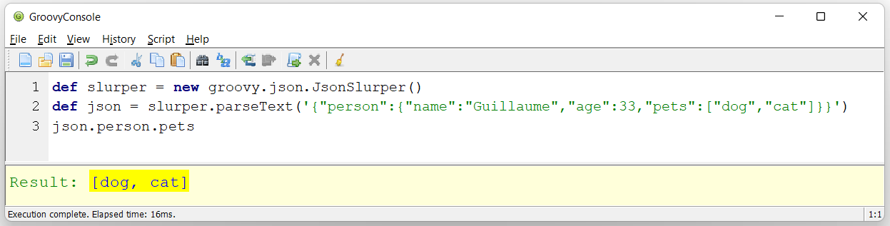
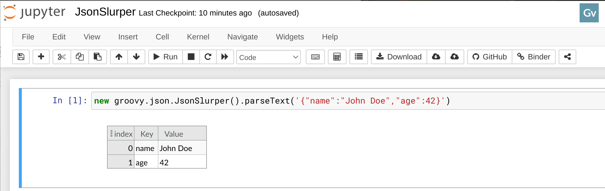
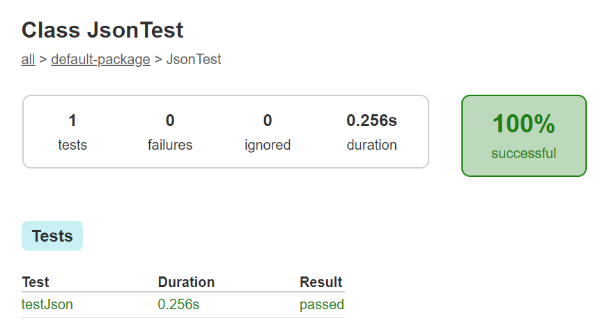

= Parsing JSON with Groovy
Paul King
:revdate: 2022-07-10T14:00:51+00:00
:keywords: groovy, json, scripting, ginq, gquery, gradle, graalvm, native
:description: This post looks at parsing JSON using Groovy's in-built capabilities as well as some other libraries.

image:img/json_logo.gif[json logo,120,float="right"]
Groovy has excellent support for processing a range of structured
data formats like JSON, TOML, YAML, etc. This blog post looks at
https://www.json.org/json-en.html[JSON].

There is quite good documentation on this topic as part of the
https://groovy-lang.org/processing-json.html[Groovy documentation].
There are also numerous online sources for more details including
https://www.tutorialspoint.com/groovy/groovy_json.htm[Groovy - JSON tutorial], https://www.baeldung.com/groovy-json[Working with JSON in Groovy], and https://blog.mrhaki.com/2014/08/groovy-goodness-relax-groovy-will-parse.html[Groovy Goodness: Relax… Groovy Will Parse Your Wicked JSON]
to name just a few. This post does a quick summary and provides
more setup information and details about various options.

== Batteries included experience

If you have installed the Groovy installation zip (or .msi on
windows), you will have the `groovy-json` module which
includes `JsonSlurper`, so the bulk of the examples shown here
and in the other mentioned links should work out of the box.

`JsonSlurper` is the main class for parsing JSON.

This example shows parsing JSON embedded in a string but there
are other methods for parsing files, URLs and other streams.

Another example using `groovysh`:

[source,console]
----
paulk@pop-os:~$ groovysh
Groovy Shell (4.0.3, JVM: 18.0.1)
Type ':help' or ':h' for help.
----------------------------------------------------------------------------------------
groovy:000> new groovy.json.JsonSlurper().parseText('{ "myList": [1, 3, 5] }').myList
===> [1, 3, 5]
----

Or using a Jupyter/BeakerX notebook:

== Gradle

If you are using a build tool like https://gradle.org/[Gradle],
you may prefer to reference your dependencies from a dependency
repository rather than having a locally installed distribution.

Suppose you have the following test using `JsonSlurper` in
the file `src/test/groovy/JsonTest.groovy`:

[source,groovy]
----
import groovy.json.JsonSlurper
import org.junit.Test

class JsonTest {
    @Test
    void testJson() {
        def text = '{"person":{"name":"Guillaume","age":33,"pets":["dog","cat"]}}'
        def json = new JsonSlurper().parseText(text)
        assert json.person.pets.size() == 2
    }
}
----

You can reference the relevant Groovy dependencies, in our case
`groovy-json` and `groovy-test`, in a `build.gradle` file like
below:

[source,groovy]
----
apply plugin: 'groovy'

repositories {
    mavenCentral()
}

dependencies {
    testImplementation "org.apache.groovy:groovy-json:4.0.3" // for JsonSlurper
    testImplementation "org.apache.groovy:groovy-test:4.0.3" // for tests
}
----

Both these artifacts bring in the core `groovy` artifact
transitively, so there's no need to reference that explicitly.

Running `gradle test` should run the tests and produce a report:

You can if you prefer, use the `groovy-all` artifact like this:

[source,groovy]
----
apply plugin: 'groovy'

repositories {
    mavenCentral()
}

dependencies {
    testImplementation "org.apache.groovy:groovy-all:4.0.3"
}
----

This artifact contains no jars but has all of the common
Groovy modules as transitive dependencies.

[*Note*: In early Groovy 4 versions you may have needed to reference Groovy as a platform, e.g.:
`testImplementation platform("org.apache.groovy:groovy-all:4.0.1")`. This is now only required when using the `groovy-bom` artifact.]

== Maven

When using the https://maven.apache.org/[Maven] build tool,
you would instead create a `pom.xml` like below and make
use of two plugins:

[source,xml]
----
<?xml version="1.0"?>
<project xmlns="http://maven.apache.org/POM/4.0.0" xmlns:xsi="http://www.w3.org/2001/XMLSchema-instance"
         xsi:schemaLocation="http://maven.apache.org/POM/4.0.0 http://maven.apache.org/maven-v4_0_0.xsd">
    <modelVersion>4.0.0</modelVersion>
    <groupId>myGroupId</groupId>
    <artifactId>groovy-json-maven</artifactId>
    <version>0.0.1-SNAPSHOT</version>
    <packaging>jar</packaging>
    <build>
        <plugins>
            <plugin>
                <groupId>org.codehaus.gmavenplus</groupId>
                <artifactId>gmavenplus-plugin</artifactId>
                <version>1.13.0</version>
                <executions>
                    <execution>
                        <goals>
                            <goal>compileTests</goal>
                        </goals>
                    </execution>
                </executions>
            </plugin>
            <plugin>
                <groupId>org.apache.maven.plugins</groupId>
                <artifactId>maven-surefire-plugin</artifactId>
                <version>3.0.0-M7</version>
            </plugin>
        </plugins>
    </build>
    <dependencies>
        <dependency>
            <groupId>org.apache.groovy</groupId>
            <artifactId>groovy-json</artifactId>
            <version>4.0.3</version>
        </dependency>
        <dependency>
            <groupId>org.apache.groovy</groupId>
            <artifactId>groovy-test</artifactId>
            <version>4.0.3</version>
        </dependency>
    </dependencies>
</project>
----

Alternatively, you could once again reference the `groovy-all`
artifact as per this alternate build file:

[source,xml]
----
<?xml version="1.0"?>
<project xmlns="http://maven.apache.org/POM/4.0.0" xmlns:xsi="http://www.w3.org/2001/XMLSchema-instance"
         xsi:schemaLocation="http://maven.apache.org/POM/4.0.0 http://maven.apache.org/maven-v4_0_0.xsd">
    <modelVersion>4.0.0</modelVersion>
    <groupId>myGroupId</groupId>
    <artifactId>groovy-json-maven</artifactId>
    <version>0.0.1-SNAPSHOT</version>
    <packaging>jar</packaging>
    <build>
        <plugins>
            <plugin>
                <groupId>org.codehaus.gmavenplus</groupId>
                <artifactId>gmavenplus-plugin</artifactId>
                <version>1.13.0</version>
                <executions>
                    <execution>
                        <goals>
                            <goal>compileTests</goal>
                        </goals>
                    </execution>
                </executions>
            </plugin>
            <plugin>
                <groupId>org.apache.maven.plugins</groupId>
                <artifactId>maven-surefire-plugin</artifactId>
                <version>3.0.0-M7</version>
                <dependencies>
                    <dependency>
                        <groupId>org.apache.maven.surefire</groupId>
                        <artifactId>surefire-junit47</artifactId>
                        <version>3.0.0-M7</version>
                    </dependency>
                </dependencies>
            </plugin>
        </plugins>
    </build>
    <dependencies>
        <dependency>
            <groupId>org.apache.groovy</groupId>
            <artifactId>groovy-all</artifactId>
            <type>pom</type>
            <version>4.0.3</version>
        </dependency>
    </dependencies>
</project>
----

When referencing the `groovy-all` artifact, we specify that it
is a pom artifact using `<type>pom</type>`.
We also needed to configure the surefire plugin to use JUnit4.
The `groovy-all` artifact also brings in JUnit5 support and the
surefire plugin will use that by default and not find our test.

Running the test should yield:

[subs="quotes,macros"]
----
pass:v[[][blue]#INFO#] ------------------------------------------------------
pass:v[[][blue]#INFO#]  T E S T S
pass:v[[][blue]#INFO#] ------------------------------------------------------
pass:v[[][blue]#INFO#] Running JsonTest
pass:v[[][blue]#INFO#] Tests run: 1, Failures: 0, Errors: 0, Skipped: 0, Time elapsed: 0.36 s - in JsonTest
----

== Advanced features

To cater for different scenarios, `JsonSlurper` is powered by
several internal implementation classes. You don't access these
classes directly but rather set a parser _type_ when
instantiating your slurper.

[cols="2,7"]
|===
|Type |When to use

|CHAR_BUFFER
|Default, least-surprise parser with eager parsing of ints, dates, etc.

|INDEX_OVERLAY
|For REST calls, WebSocket messages, AJAX, inter process communication. Fastest parser which uses indexes to some existing char buffer.

|CHARACTER_SOURCE
|For handling larger JSON files.

|LAX
|Allows comments and no quotes or single quotes in numerous situations.
|===

Here is an example:

[source,groovy]
----
import groovy.json.JsonSlurper
import static groovy.json.JsonParserType.*

def slurper = new JsonSlurper(type: LAX)
def json = slurper.parseText('''{person:{'name':"Guillaume","age":33,"pets":["dog" /* ,"cat" */]}}''')
assert json.person.pets == ['dog']
----

Note the missing quotes for the _person_ key, the single quotes
for the _name_ key and _"cat"_ has been commented out.
These changes wouldn't be allowed by a strict JSON parser.

== Other JSON libraries

Groovy doesn't require you to use the `groovy-json` classes.
You can use your favourite Java library with Groovy.
You'll still benefit from many of Groovy's short-hand notations.

Here's an example using Gson:

[source,groovy]
----
@Grab('com.google.code.gson:gson:2.9.0')
import com.google.gson.JsonParser

def parser = new JsonParser()
def json = parser.parse('{"person":{"name":"Guillaume","age":33,"pets":["dog","cat"]}}')
assert json.person.pets*.asString == ['dog', 'cat']
----

Here's an example using the Jackson JSON support:

[source,groovy]
----
@Grab('com.fasterxml.jackson.core:jackson-databind:2.13.3')
import com.fasterxml.jackson.databind.ObjectMapper

def text = '{"person":{"name":"Guillaume","age":33,"pets":["dog","cat"]}}'
def json = new ObjectMapper().readTree(text)
assert json.person.pets*.asText() == ['dog', 'cat']
----

== Integrated query

Groovy 4 also supports language integrated query syntax, known as
GINQ or GQuery. We can use that with JSON too.

Suppose we have information in JSON format about fruits, their
prices (per 100g) and the concentration of vitamin C (per 100g):

[source,json]
----
{
    "prices": [
        {"name": "Kakuda plum",      "price": 13},
        {"name": "Camu camu",        "price": 25},
        {"name": "Acerola cherries", "price": 39},
        {"name": "Guava",            "price": 2.5},
        {"name": "Kiwifruit",        "price": 0.4},
        {"name": "Orange",           "price": 0.4}
    ],
    "vitC": [
        {"name": "Kakuda plum",      "conc": 5300},
        {"name": "Camu camu",        "conc": 2800},
        {"name": "Acerola cherries", "conc": 1677},
        {"name": "Guava",            "conc": 228},
        {"name": "Kiwifruit",        "conc": 144},
        {"name": "Orange",           "conc": 53}
    ]
}
----

Now, suppose we are on a budget and want to select the most
cost-effective fruits to buy to help us achieve our daily
vitamin C requirements. We _join_ the _prices_ and _vitC_ information and order by most cost-effective fruit.
We’ll select the top 2 in case our first choice isn’t in stock
when we go shopping. Our GQuery processing looks like this:

[source,groovy]
----
def jsonFile = new File('fruit.json')
def json = new JsonSlurper().parse(jsonFile)
assert GQL {
    from p in json.prices
    join c in json.vitC on c.name == p.name
    orderby c.conc / p.price in desc
    limit 2
    select p.name
} == ['Kakuda plum', 'Kiwifruit']
----

We can see, for this data, Kakadu plums followed by Kiwifruit
are our best choices.

== Quick performance comparison

As a very crude measure of performance, `JsonSlurper` with all 4 parser types as well as Gson and Jackson were used to parse
the timezone values from
https://github.com/flowcommerce/json-reference and check that
the current timezone in Brisbane is the same as the timezone
in Sydney. The json file is by no means huge. It has just under
3000 lines and is under 60K in size. The best time taken
(including compilation time) after 4 runs was taken - definitely
a micro-benchmark which shouldn't be taken too seriously, but
might be a rough guide. Just for fun, a native version of the
Groovy JsonSlurper script with the type set to INDEX_OVERLAY
was made using GraalVM. It's timings are included too.

[source,shell]
----
$ time groovy GroovyJsonIndexOverlay.groovy
real    0m1.365s
user    0m4.157s
sys     0m0.145s

$ time groovy GroovyJsonCharacterSource.groovy
real    0m1.447s
user    0m4.472s
sys     0m0.174s

$ time groovy GroovyJsonLax.groovy
real    0m1.452s
user    0m4.338s
sys     0m0.171s

$ time groovy GroovyJson.groovy
real    0m1.383s
user    0m4.050s
sys     0m0.165s

$ time groovy Gson.groovy
real    0m1.814s
user    0m5.543s
sys     0m0.209s

$ time groovy Jackson.groovy
real    0m2.007s
user    0m6.332s
sys     0m0.208s

$ time ./groovyjsonindexoverlay
real    0m0.015s
user    0m0.011s
sys     0m0.004s
----

== Summary

We have seen the basics of setting up our projects to parse JSON
using Groovy and some of the numerous options available to use
depending on the scenario. We also saw how to use other JSON
libraries, utilize GQuery syntax during our processing, and
looked at some very crude performance figures.
