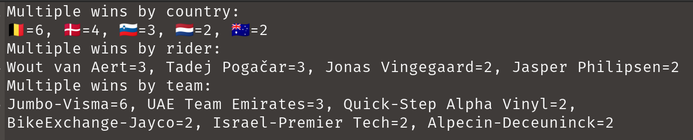
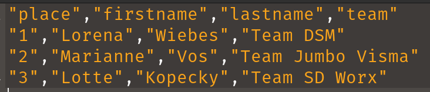

= Reading and Writing CSV files with Groovy
Paul King
:revdate: 2022-07-25T14:26:20+00:00
:keywords: csv, data, deserialization, files, groovy, reading, records, data science, serialization, writing, opencsv, commons csv, jackson databind, cycling
:description: This post looks at processing CSV files using OpenCSV, Commons CSV, and Jackson Databind libraries.

== Introduction

In this post, we'll look at reading and writing CSV
files using Groovy.

=== Aren't CSV files just text files?

For simple cases, we can treat CSV files no differently than we
would other text files. Suppose we have the following data that
we would like to write to a CSV file:

[source,groovy]
----
def data = [
        ['place', 'firstname', 'lastname', 'team'],
        ['1', 'Lorena', 'Wiebes', 'Team DSM'],
        ['2', 'Marianne', 'Vos', 'Team Jumbo Visma'],
        ['3', 'Lotte', 'Kopecky', 'Team SD Worx']
]
----

Groovy uses `File` or `Path` objects similar to Java.
We'll use a `File` object here and, for our purposes, we'll
just use a temporary file since we are just going to read it
back in and check it against our data. Here is how to create
a temporary file:

[source,groovy]
----
def file = File.createTempFile('FemmesStage1Podium', '.csv')
----

Writing our CSV (in this simple example) is as simple as joining
the data with commas and the lines with line separator character(s):

[source,groovy]
----
file.text = data*.join(',').join(System.lineSeparator())
----

Here we "wrote" the entire file contents in one go but there
are options for writing a line or character or byte at a time.

Reading the data in is just as simple. We read the lines and
split on commas:

[source,groovy]
----
assert file.readLines()*.split(',') == data
----

In general, we might want to further process the data.
Groovy provides nice options for this too. Suppose we have
the following existing CSV file:

image:img/HommesOverall.png[HommesOverall]

We can read in the file and select various columns of interest
with code like below:

[source,groovy]
----
def file = new File('HommesStageWinners.csv')
def rows = file.readLines().tail()*.split(',')
int total = rows.size()
Set names = rows.collect { it[1] + ' ' + it[2] }
Set teams = rows*.getAt(3)
Set countries = rows*.getAt(4)
String result = "Across $total stages, ${names.size()} riders from " +
        "${teams.size()} teams and ${countries.size()} countries won stages."
assert result == 'Across 21 stages, 15 riders from 10 teams and 9 countries won stages.'
----

Here, the `tail()` method skips over the header line.
Column 0 contains the stage number which we ignore.
Column 1 contains the first name, column 2 the last name,
column 3 the team, and column 4 the country of the rider.
We store away the full names, teams and countries in sets
to remove duplicates. We then create an overall result
message using the size of those sets.

While for this simple example, the coding was fairly simple,
it isn't recommended to hand process CSV files in this fashion.
The details for CSV can quickly get messy. What if the values
themselves contain commas or newlines? Perhaps we can surround in
double quotes but then what if the value contains a double quote?
And so forth. For this reason, CSV libraries are recommended.

We'll look at three shortly, but first let's summarise some of
the highlights of the tour by looking at multiple winners.
Here is some code which summarises our CSV data:

[source,groovy]
----
def byValueDesc = { -it.value }
def bySize = { k, v -> [k, v.size()] }
def isMultiple = { it.value > 1 }
def multipleWins = { Closure select -> rows
    .groupBy(select)
    .collectEntries(bySize)
    .findAll(isMultiple)
    .sort(byValueDesc)
    .entrySet()
    .join(', ')
}
println 'Multiple wins by country:\n' + multipleWins{ it[4] }
println 'Multiple wins by rider:\n' + multipleWins{ it[1] + ' ' + it[2] }
println 'Multiple wins by team:\n' + multipleWins{ it[3] }
----

This summary has nothing in particular to do with CSV files but
is summarised in honour of the great riding during the tour!
Here's the output:

Okay, now let's look at our three CSV libraries.

== Commons CSV

The https://commons.apache.org/proper/commons-csv/[Apache Commons CSV] library makes writing and parsing CSV files easier.
Here is the code for writing our CSV which makes use of the
`CSVPrinter` class:

[source,groovy]
----
file.withWriter { w ->
    new CSVPrinter(w, CSVFormat.DEFAULT).printRecords(data)
}
----

And here is the code for reading it back in which uses
the `RFC4180` parser factory singleton:

[source,groovy]
----
file.withReader { r ->
    assert RFC4180.parse(r).records*.toList() == data
}
----

There are other singleton factories for tab-separated values
and other common formats and builders to let you set a whole
variety of options like escape characters, quote options,
whether to use an enum to define header names, and whether
to ignore empty lines or nulls.

For our more elaborate example, we have a tiny bit more work
to do. We'll use the builder to tell the parser to skip the
header row. We could have chosen to use the `tail()` trick we
used earlier, but we decided to use the parser features instead.
The code would look like this:

[source,groovy]
----
file.withReader { r ->
    def rows = RFC4180.builder()
            .setHeader()
            .setSkipHeaderRecord(true)
            .build()
            .parse(r)
            .records
    assert rows.size() == 21
    assert rows.collect { it.firstname + ' ' + it.lastname }.toSet().size() == 15
    assert rows*.team.toSet().size() == 10
    assert rows*.country.toSet().size() == 9
}
----

You can see here that we have used column names rather than
column numbers during our processing. Using column names is
another advantage of using the CSV library; it would be quite
a lot of work to do that aspect by hand. Also note that,
for simplicity, we didn't create the entire _result_ message
as in the earlier example. Instead, we just checked the size
of all the relevant sets that we calculated previously.

== OpenCSV

The http://opencsv.sourceforge.net/[OpenCSV] library handles
the messy CSV details when needed but doesn't get in the way
for simple cases. For our first example, the `CSVReader` and
`CSVWriter` classes will be suitable. Here is the code for
writing our CSV file in the same way as earlier:

[source,groovy]
----
file.withWriter { w ->
    new CSVWriter(w).writeAll(data.collect{ it as String[] })
}
----

And here is the code for reading data:

[source,groovy]
----
file.withReader { r ->
    assert new CSVReader(r).readAll() == data
}
----

If we look at the produced file, it is already a little fancier
than earlier with double quotes around all data:

If we want to do more elaborate processing, the
`CSVReaderHeaderAware` class is aware of the initial header
row and its column names. Here is our more elaborate example
which processed some of the data further:

[source,groovy]
----
file.withReader { r ->
    def rows = []
    def reader = new CSVReaderHeaderAware(r)
    while ((next = reader.readMap())) rows << next
    assert rows.size() == 21
    assert rows.collect { it.firstname + ' ' + it.lastname }.toSet().size() == 15
    assert rows*.team.toSet().size() == 10
    assert rows*.country.toSet().size() == 9
}
----

You can see here that we have again used column names rather
than column numbers during our processing. For simplicity, we
followed the same style as in the Commons CSV example and just
checked the size of all the relevant sets that we calculated
previously.

OpenCSV also supports transforming CSV files into JavaBean
instances. First, we define our target class (or annotate
an existing domain class):

[source,groovy]
----
class Cyclist {
    @CsvBindByName(column = 'firstname')
    String first
    @CsvBindByName(column = 'lastname')
    String last
    @CsvBindByName
    String team
    @CsvBindByName
    String country
}
----

For two of the columns, we've indicated that the column name in
the CSV file doesn't match our class property. The annotation
attribute caters for that scenario.

Then, we can use this code to convert our CSV file into a list
of domain objects:

[source,groovy]
----
file.withReader { r ->
    List<Cyclist> rows = new CsvToBeanBuilder(r).withType(Cyclist).build().parse()
    assert rows.size() == 21
    assert rows.collect { it.first + ' ' + it.last }.toSet().size() == 15
    assert rows*.team.toSet().size() == 10
    assert rows*.country.toSet().size() == 9
}
----

OpenCSV has many options we didn't show. When writing files you
can specify the separator and quote characters, when reading CSV
you can specify column positions, types, and validate data.

== Jackson Databind CSV

The https://github.com/FasterXML/jackson-databind[Jackson Databind] library supports the https://github.com/FasterXML/jackson-dataformats-text/tree/master/csv[CSV]
format (as well as many others).

Writing CSV files from existing data is simple as shown here
for running example:

[source,groovy]
----
file.withWriter { w ->
    new CsvMapper().writeValue(w, data)
}
----

This writes the data into our temporary file as we saw with
previous examples. One minor difference is that by default,
just the values containing spaces will be double quoted but
like the other libraries, there are many configuration options
to tweak such settings.

Reading the data can be achieved using the following code:

[source,groovy]
----
def mapper = new CsvMapper().readerForListOf(String).with(CsvParser.Feature.WRAP_AS_ARRAY)
file.withReader { r ->
    assert mapper.readValues(r).readAll() == data
}
----

Our more elaborate example is done in a similar way:

[source,groovy]
----
def schema = CsvSchema.emptySchema().withHeader()
def mapper = new CsvMapper().readerForMapOf(String).with(schema)
file.withReader { r ->
    def rows = mapper.readValues(r).readAll()
    assert rows.size() == 21
    assert rows.collect { it.firstname + ' ' + it.lastname }.toSet().size() == 15
    assert rows*.team.toSet().size() == 10
    assert rows*.country.toSet().size() == 9
}
----

Here, we tell the library to make use of our header row and
store each row of data in a map.

Jackson Databind also supports writing to classes including
JavaBeans as well as records. Let's create a record to hold
our cyclist information:

[source,groovy]
----
@JsonCreator
record Cyclist(
        @JsonProperty('stage') int stage,
        @JsonProperty('firstname') String first,
        @JsonProperty('lastname') String last,
        @JsonProperty('team') String team,
        @JsonProperty('country') String country) {
    String full() { "$first $last" }
}
----

Note that again we can indicate where our record component names
may not match the names used in the CSV file, we simply supply
the alternate name when specifying the property. There are other
options like indicating that a field is required or giving its
column position, but we don't need those options for our example.
We've also added a `full()` helper method to return the full
name of the cyclist.

Groovy will use native records on platforms that support it
(JDK16+) or emulated records on earlier platforms.

Now we can write our code for record deserialization:

[source,groovy]
----
def schema = CsvSchema.emptySchema().withHeader()
def mapper = new CsvMapper().readerFor(Cyclist).with(schema)
file.withReader { r ->
    List<Cyclist> records = mapper.readValues(r).readAll()
    assert records.size() == 21
    assert records*.full().toSet().size() == 15
    assert records*.team.toSet().size() == 10
    assert records*.country.toSet().size() == 9
}
----

== Conclusion

We have looked at writing and reading CSV files to Strings and
domain classes and records. We had a look at handling simple
cases by hand and also looked at the OpenCSV, Commons CSV and
Jackson Databind CSV libraries.

Code for these examples: +
https://github.com/paulk-asert/CsvGroovy

Code for other examples of using Groovy for Data Science: +
https://github.com/paulk-asert/groovy-data-science