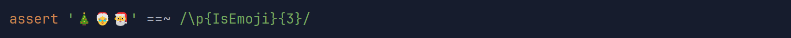
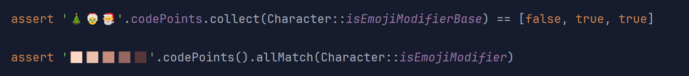
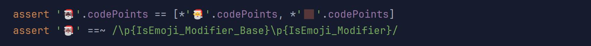
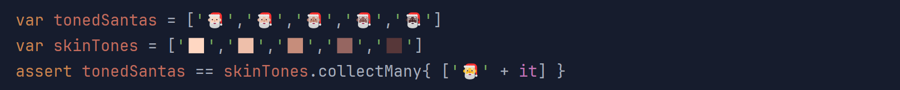
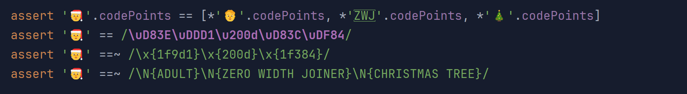
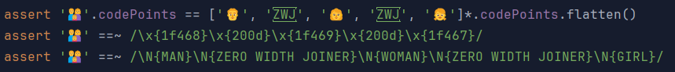
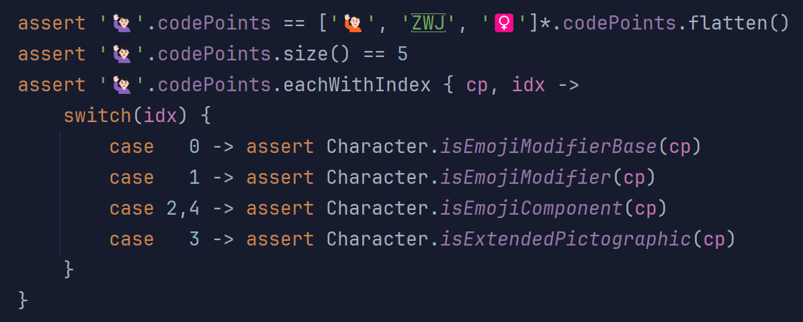
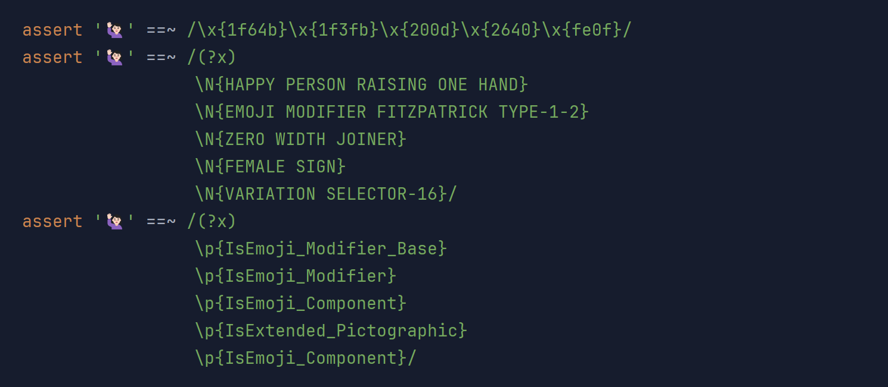

= Season's Greetings with Emojis
Paul King
:revdate: 2023-12-23T12:24:07+00:00
:updated: 2024-01-19T22:15:00+00:00
:keywords: groovy, emoji
:description: Season's greetings with some emoji fun.

In a https://groovy.apache.org/blog/helloworldemoji[previous blog post]
we looked at a fun way to write a _hello world_ script using Groovy and Emojis.

Let's look at some of the additional emoji API calls
available in JDK 21. We're using Groovy 5.0.0-alpha-5,
but most of the examples work as is with recent Groovy 4 versions.
Groovy 5, adds one shortcut for making it easier to get to code points
as an array.

== JDK 21 New Features

As part of https://bugs.openjdk.org/browse/JDK-8303018[JDK-8303018], JDK 21 adds the following API calls to `java.lang.Character`:

[source,java]
----
public static boolean isEmoji(int codePoint)
public static boolean isEmojiPresentation(int codePoint)
public static boolean isEmojiModifier(int codePoint)
public static boolean isEmojiModifierBase(int codePoint)
public static boolean isEmojiComponent(int codePoint)
public static boolean isExtendedPictographic(int codePoint)
----

Also added was equivalent functionality when performing regex matches
using the following special binary properties:

* `\p{IsEmoji}`
* `\p{IsEmoji_Presentation}`
* `\p{IsEmoji_Modifier}`
* `\p{IsEmoji_Modifier_Base}`
* `\p{IsEmoji_Component}`
* `\p{IsExtended_Pictographic}`

Let's have a look at using these features from Groovy.

== Playing with Emojis with Groovy

First, we'll have a look at a String containing 3 emojis:
a Christmas tree, Mrs Claus, and Santa Claus.
We'll check that the 3 Unicode code points for that String
all correspond to emojis using one of the new API calls:

image:img/emoji1.png[using isEmoji]

We can check using the newly added regex binary properties as well.
The Groovy regex operator (`==~`) ensures that the String exactly matches 3 emojis:

Unicode supports various forms of modification by sequencing Unicode characters.
One of the simplest examples is when some "base" emoji character is followed
by a skin-tone emoji modifier. The two consecutive characters are re-interpreted,
resulting in a single emoji with skin tone.

We'll see that the Christmas tree cannot be used as an emoji modifier
base, but the two Claus emojis can. Also, we can see that all 5 skin
tone emoji characters can be used as emoji modifiers:

Let's try some combinations. We'll combine the Santa emoji with
some of the skin tones. Depending on your IDE/editor, you'll probably
see a single emoji, but it is made up of multiple Unicode code points.

If we look at the code points from the "single" emoji,
it will be the same as the "bare" Santa emoji plus the code points
from the skin tone emoji:

We are also checking the emoji roles using a regex.
We can see the base followed by the modifier.

We can put all this together to check all five toned Santas as follows:

Another sequencing trick offered by Unicode is to combine related
emojis to form new ones with an intervening _zero width joiner_ (ZWJ).
For example, you might combine the woman emoji, "👩", possibly with
an additional skin tone emoji, then a ZWJ character (Unicode 200D in hex),
followed by the rocket emoji "🚀", which combined gives
a female astronaut emoji "👩🏽‍🚀".

Unicode has a special Mx Claus emoji which can be used to represent
a gender-neutral alternative to Mrs Claus or Santa Claus, or to indicate
a person with strong Christmas spirit. It combines the adult emoji, "🧑",
the ZWJ character, and the Christmas tree emoji.

Again if we look at the code points, the code points for the "combined" emoji
is just the code points of the individual components one after the other,
as we see on the first line. The second line shows how to enter the combined
emoji using Unicode. The first and last parts are represented as surrogate
pairs which are combined into the correct code points automatically.

The last two lines show checking the combined emoji with regex.
We can check the exact Unicode characters using regex's `\x{...}` notation,
noting that we don't use surrogate pairs. We can also check the
emoji names using the `\N{...}` notation.

Combinations aren't limited to size two. One of the possible "family" emoji combinations
combines 3 emojis, with interleaved ZWJ characters.

We can do similar regex checks as previously, checking the
exact Unicode values or the names.

As a final example, let's look at the "🙋🏻‍♀️" emoji.
Looking at the first line of code below might lead us to think we have combined
three characters, but checking the size shows there are 5 parts to the
combined emoji. The first and last emojis are already combinations.
The "🙋🏻" emoji combines a base emoji with a skin tone.
The "♀️" emoji combines the female sign character "♀" with a special
_variation selector_ character, which indicates that the previous character
should be treated as an emoji rather than a character.

We can put the new emoji API calls through their paces by checking
various properties for each part of the combined emoji.

We can do similar checks using regex.
We can check for an exact match of the Unicode characters exactly,
by their emoji names, or by role each part plays as shown below:

We hope you have enjoyed this little exploration of the
new JDK 21 emoji features.

Oh yes, and Season's greetings everyone 🎄🎅☃️🎁🌟🎉!

== More Information

* https://github.com/paulk-asert/groovy-seasonsgreetings[Source code]
* https://docs.oracle.com/en/java/javase/21/docs/api/java.base/java/lang/Character.html[JDK 21 JavaDoc for java.lang.Character]
* https://www.youtube.com/watch?v=O1oq1sbUnmU[Java 21 Improved Emoji Support 💪 Video]
* https://inside.java/2023/11/20/sip089/[Improved Emoji Support in Java 21 - Sip of Java]

.Update history
****
*19/Jan/2024*: Bumped Groovy from 5.0.0-alpha-4 to 5.0.0-alpha-5.
****
