= Solving cryptarithmetic puzzles with Groovy and constraint programming using Choco, JaCoP, and OR-Tools
Paul King
:revdate: 2022-09-05T13:43:31+00:00
:keywords: groovy, constraint programming, jacop, or-tools, choco, jsr331
:description: This post looks at solving cryptarithmetic puzzles using Groovy.

== Introduction

When writing solutions to problems, we frequently strive to hide
away implementation details. In Object-oriented (OO) programming,
we might build a rich hierarchy of classes with carefully
thought-out methods so that our final solution can be expressed
in terms of simple nouns and verbs (methods and class instances)
in our domain model. When applying functional programming idioms,
we will strive to emphasise the relationship between inputs and
outputs and hide away side effects and iterative steps.

https://en.wikipedia.org/wiki/Constraint_programming[Constraint programming] (within the same family as logic programming) also
strives to hide away details. Instead of expressing an iterative
implementation, it focuses on expressing declarative properties
of a solution. A solver is responsible for working out the exact
implementation steps.

When using constraint programming, we develop a model consisting
of _variables_, the _domain_ of values each variable may hold,
and additional _constraints_ between the variables. A solver does
all the work. It may employ heuristic searching, inference,
propagation, symmetry and backtracking to find possible solutions.
We may be able to (or want to, or need to) guide the solver as to
which techniques and strategies it should use. Constraint
programming has been used to solve various kinds of problems
including scheduling problems, and excels at problems with
combinatorial possibilities that are too irregular for other
mathematical optimisations. Frequently used illustrative problems
are Sudoku and Wordle solvers, https://en.wikipedia.org/wiki/Eight_queens_puzzle[N-Queen problems], and other
kinds of puzzles. We'll just look at cryptarithmetic puzzles.

== Cryptarithmetic Problems

Cryptarithmetic problems (also known as alphametics, verbal
arithmetic, cryptarithm, and word addition) are a type of
mathematical game where a mathematical equation is presented
where digits in the equation are replaced by letters.
Traditionally, each letter usually represents a unique number,
and numbers don't start with the digit zero. If we look at one
https://en.wikipedia.org/wiki/Verbal_arithmetic[sample problem]:

[grid=rows,width=30,frame=none]
|===
|   |   | T | O
| + |   | G | O
| = | O | U | T
|===

We can reason about what the solution can be by hand:

* T, O, U, and G must be all different (game rule)
* T, G, and O will be between 1 and 9, and U is between 0 and 9 (game rule)
* If we added the two biggest 2-digit numbers, (99 + 99) we'd get 198, so _O must be 1_
* Looking at the right-most "units" column, 1 + 1 equals 2, so _T must be 2_
* Looking at the "tens" column, we know there is a carry of 1 (since O is 1), and we know T is 2, so G must be 8 or 9. If G was 9, U would be 1, but it can't be the same as O, so _G must be 8_ and _U must be 0_.

When solving by hand, we typically reason about
individual columns and account for the "carry"to the
next column. We'll come back to this point later but
first, let's look at a slightly bigger problem:

[grid=rows,width=40,frame=none]
|===
|   |   | S | E | N | D
| + |   | M | O | R | E
| = | M | O | N | E | Y
|===

== Solving with Brute Force

This problem isn't huge, so we can solve with brute force.
We simply try all possible values for the letters in the puzzle:

[source,groovy]
----
for (s in 1..9)
  for (e in 0..9)
    for (n in 0..9)
      for (d in 0..9)
        for (m in 1..9)
          for (o in 0..9)
            for (r in 0..9)
              for (y in 0..9)
                if ([s, e, n, d, m, o, r, y].toSet().size() == 8) {
                  def send = 1000 * s + 100 * e + 10 * n + d
                  def more = 1000 * m + 100 * o + 10 * r + e
                  def money = 10000 * m + 1000 * o + 100 * n + 10 * e + y
                  if (send + more == money) {
                    println "s = $s, e = $e, n = $n, d = $d"
                    println "m = $m, o = $o, r = $r, y = $y"
                  }
                }
----

This isn't very efficient though. It calculates 81 million
combinations for the variables before skipping all but 1.5
million of them (since most won't be unique). All up it might
execute in the low tens of seconds.

Alternatively, Groovy supports calculating permutations, so we
can simplify our solution to a single for loop (with some tests
to eliminate unhelpful iterations):

[source,groovy]
----
def digits = 0..9
for (p in digits.permutations()) {
    if (p[-1] < p[-2]) continue
    def (s, e, n, d, m, o, r, y) = p
    if (s == 0 || m == 0) continue
    def send = 1000 * s + 100 * e + 10 * n + d
    def more = 1000 * m + 100 * o + 10 * r + e
    def money = 10000 * m + 1000 * o + 100 * n + 10 * e + y
    if (send + more == money) {
        println "s = $s, e = $e, n = $n, d = $d"
        println "m = $m, o = $o, r = $r, y = $y"
    }
}
----

This has the advantage of only generating unique combinations.
It will execute in seconds.

Running either of these solutions yields:
----
s = 9, e = 5, n = 6, d = 7
m = 1, o = 0, r = 8, y = 2
----

== Using Constraint Programming

For the brute force approaches, we had a condition which checked any
potential candidate answer to see if it was a correct solution. We had
to be very explicit in how we wanted the potential candidates to be
created. For constraint programming, we instead define variables to
represent the problem, any known bounds on those variables, and we
specify any other known properties of the solution, which in our case
will be something similar to the condition we had to check if the
answer was correct previously. Let's examine how to do that with
three libraries, one with a variation.

== Choco

Here is the code using the https://choco-solver.org/[Choco]
library:

[source,groovy]
----
new Model("SEND+MORE=MONEY").with {
    def (S, M) = ['S', 'M'].collect { intVar(it, 1, 9) }
    def (E, N, D, O, R, Y) = ['E', 'N', 'D', 'O', 'R', 'Y'].collect { intVar(it, 0, 9) }

    allDifferent(S, E, N, D, M, O, R, Y).post()

    IntVar[] ALL = [
            S, E, N, D,
            M, O, R, E,
         M, O, N, E, Y ]
    int[] COEFFS = [
            1000,  100,  10,  1,
            1000,  100,  10,  1,
   -10000, -1000, -100, -10, -1 ]

    scalar(ALL, COEFFS, "=", 0).post()

    println solver.findSolution()
}
----

We define our variables and their bounds (domain).
We use an `allDifferent` global constraint to specify the
uniqueness requirement and a `scalar` constraint that
ensures that our variables multiplied by their respective
scalar coefficients equal 0. This lets us factor in whether
the particular variable is representing the "units" column,
the "10s" column, the "100s" column etc. This captures the
"puzzle addition" constraint. We then ask the solver to find
the solution. We could just as easily have asked for all
solutions (if more than one existed).

This is typical of how we solve such problems. We either
define constraints directly between one or more variables
or use whatever global constraints our library might support.
If our library doesn't support the constraint we need,
we find a way to express it using multiple simpler constraints.

The end result is that our code is more declarative than our
brute force approaches, and the solution is found in tens of
milliseconds. The solver has very efficient strategies for
solving such puzzles.

== JaCoP

We can solve the same problem using https://github.com/radsz/jacop[JaCoP]:

[source,groovy]
----
def store = new Store()
def (S, M) = ['S', 'M'].collect { new IntVar(store, it, 1, 9) }
def (E, N, D, O, R, Y) = ['E', 'N', 'D', 'O', 'R', 'Y'].collect { new IntVar(store, it, 0, 9) }
var ctr = new Alldifferent(S, E, N, D, M, O, R, Y)
store.impose(ctr)

IntVar[] ALL = [
                S,   E,   N,   D,
                M,   O,   R,   E,
           M,   O,   N,   E,   Y ]
int[] COEFFS = [
             1000,  100,  10,  1,
             1000,  100,  10,  1,
    -10000, -1000, -100, -10, -1 ]
var lin = new LinearInt(ALL, COEFFS, "==", 0)
store.impose(lin)

var label = new DepthFirstSearch()
var select = new InputOrderSelect(store, ALL, new IndomainMin())
label.labeling(store, select)
----

There are some slight differences in this API, but nearly
everything has a one-to-one correspondence to what we saw earlier.
We are explicitly selecting search strategies and selection
strategies here whereas with Choco, defaults were chosen for us.
In both cases, explicit creation of such classes allows the
strategies to be altered for particular scenarios if needed.

When run, the output looks like this:

----
Labeling has finished with return value of true
DFS1: DFS([S = 9, E = 5, N = 6, D = 7, M = 1, O = 0, R = 8, Y = 2], InputOrder, (org.jacop.search.IndomainMin@45394b31))
----

We can see here the code is very similar as is the execution time.

== OR-Tools

We can repeat the solution using
https://developers.google.com/optimization/cp[OR-Tools].
Here is the code:

[source,groovy]
----
Loader.loadNativeLibraries()

new Solver('Send+More=Money').with {
    def s = makeIntVar(1, 9, 's')
    def e = makeIntVar(0, 9, 'e')
    def n = makeIntVar(0, 9, 'n')
    def d = makeIntVar(0, 9, 'd')
    def m = makeIntVar(1, 9, 'm')
    def o = makeIntVar(0, 9, 'o')
    def r = makeIntVar(0, 9, 'r')
    def y = makeIntVar(0, 9, 'y')

    IntVar[] all = [s, e, n, d, m, o, r, y]
    IntVar[] scalar = [s, e, n, d, m, o, r, e, m, o, n, e, y]
    int[] coeffs = [
                 1000,  100,  10,  1,  //  S E N D +
                 1000,  100,  10,  1,  //  M O R E =
        -10000, -1000, -100, -10, -1   //  M O N E Y
    ]

    addConstraint(makeScalProdEquality(scalar, coeffs, 0))
    addConstraint(makeAllDifferent(all))

    def db = makePhase(all, INT_VAR_DEFAULT, INT_VALUE_DEFAULT)
    newSearch(db)
    while (nextSolution()) {
        println all.join(' ')
    }
    endSearch()

    // Statistics
    println "Solutions: ${solutions()}"
    println "Failures: ${failures()}"
    println "Branches: ${branches()}"
    println "Wall time: ${wallTime()}ms"
}
----

It has this output when run:

----
s(9) e(5) n(6) d(7) m(1) o(0) r(8) y(2)
Solutions: 1
Failures: 5
Branches: 10
Wall time: 60ms
----

OR-Tools is written in C++ but has interfaces for numerous
languages including Java - which is perfect for Groovy use.

== Choco with JSR331

It is great to have multiple libraries to pick from but having a
standard API can help switching between such libraries. This is
where JSR331 comes in. It defines a standard API for interacting
with constraint solvers and linear solves. Here we use a
https://openrules.com/jsr331/JSR331.UserManual.pdf[JSR331 implementation] backed by an earlier version of the Choco library. The code looks like this:

[source,groovy]
----
import javax.constraints.*

ProblemFactory.newProblem('SEND+MORE=MONEY').with {
    def (S, M) = ['S', 'M'].collect { variable(it, 1, 9) }
    def (E, N, D, O, R, Y) = ['E', 'N', 'D', 'O', 'R', 'Y'].collect { variable(it, 0, 9) }

    postAllDifferent(S, E, N, D, M, O, R, Y)

    Var[] ALL = [
            S, E, N, D,
            M, O, R, E,
            M, O, N, E, Y]
    int[] COEFFS = [
            1000, 100, 10, 1,
            1000, 100, 10, 1,
            -10000, -1000, -100, -10, -1]

    post(COEFFS, ALL, '=', 0)

    def solver = getSolver()
    def solution = solver.findSolution()
    println solution ?: 'No solution'
    solver.logStats()
}
----

It is quite similar to earlier examples but now exclusively uses
the JSR331 classes in the javax.constraint package. There are
implementations of those classes backed by several implementations.
So, indeed it would be possible to swap between them. When run,
the output is:

----
Solution #1:
 S[9] M[1] E[5] N[6] D[7] O[0] R[8] Y[2]
----

Having said that, at the time of writing, JSR331 popularity
doesn't appear to be on the rise. Most folks using constraint
programming libraries seem to be using the direct library classes.
Indeed, the version of the Choco implementation used by the JSR331
implementation is over 10 years old.

=== Incorporating Carry

The scalar product global constraint we have used in the previous
examples is very powerful and probably would be our first choice
for this problem. We can, however, model constraint programming
problems in multiple ways, so let's look at a solution that avoids
that global constraint.

Instead, we will develop a model that mirrors how we reasoned
about the original `TO + GO = OUT` problem that we
solved by hand. For that, we just considered a column at a time
and accounted for the carry. We'll explicitly introduce variables
to hold the carry (0 if no carry, or 1 if there is a carry) into
our model. Then we'll express the mathematical constraints that
are applicable for each column.

Here is the code:

[source,groovy]
----
new Model("SEND+MORE=MONEY").with {
    def (S, M) = ['S', 'M'].collect { intVar(it, 1, 9) }
    def (E, N, D, O, R, Y) = ['E', 'N', 'D', 'O', 'R', 'Y'].collect { intVar(it, 0, 9) }
    def C = (0..3).collect{ intVar("C$it", 0, 9) }

    allDifferent(S, E, N, D, M, O, R, Y).post()
    C[3]              .eq(M).post()                         //  C3 C2 C1 C0
    C[2].add(S).add(M).eq(O.add(C[3].mul(10))).post()       //      S  E  N  D
    C[1].add(E).add(O).eq(N.add(C[2].mul(10))).post()       //      M  O  R  E
    C[0].add(N).add(R).eq(E.add(C[1].mul(10))).post()       //   -------------
             D .add(E).eq(Y.add(C[0].mul(10))).post()       //   M  O  N  E  Y

    println solver.findSolution()
}
----

We can see that there is now no scalar product global constraint
any more but instead the constraints for each column.

When run, the output looks like this:

----
Solution: S=9, M=1, E=5, N=6, D=7, O=0, R=8, Y=2, C0=1, C1=1, C2=0, C3=1, sum_exp_1=9,
sum_exp_2=10, (C3*10)=10, sum_exp_3=10, sum_exp_4=6, sum_exp_5=6, (C2*10)=0, sum_exp_6=6,
sum_exp_7=7, sum_exp_8=15, (C1*10)=10, sum_exp_9=15, sum_exp_10=12, (C0*10)=10, sum_exp_11=12,
----

We can see that as we were defining our constraints for each
column, subexpressions were being created in the model which
are reflected in the solution. They are if you like, temporary
calculations along the way to getting the answer - or more
accurately a snapshot of ever-changing temporary calculations.
They don't form part of the answer that interests us, so we would
be free to just print out the part of the solution which interests
us if we wanted.

=== Creating a DSL

The previous example has lots of calls to `add` and `mul` methods.
We can create a little bit of a DSL to provide some syntactic
sugar to our previous examples to allow use of Groovy's operator
overloading, support ranges when specifying the domain of a
variable, and a few other niceties. Our code becomes:

[source,groovy]
----
model("SEND+MORE=MONEY") {
    def (S, M) = ['S', 'M'].collect { intVar(it, 1..9) }
    def (E, N, D, O, R, Y) = ['E', 'N', 'D', 'O', 'R', 'Y'].collect { intVar(it, 0..9) }
    def C = intVarArray(4, 0..1)

    [allDifferent(S, E, N, D, M, O, R, Y),      //  C3 C2 C1 C0
     C[3]         .eq(M),                       //      S  E  N  D
    (C[2] + S + M).eq(O + C[3] * 10),           //      M  O  R  E
    (C[1] + E + O).eq(N + C[2] * 10),           //   -------------
    (C[0] + N + R).eq(E + C[1] * 10),           //   M  O  N  E  Y
           (D + E).eq(Y + C[0] * 10)]*.post()

    println solver.findSolution()
}
----

It has the same output as previously.

You might wonder how the solver finds the solution.
You can watch the variables in the debugger and use
tools like https://github.com/chocoteam/choco-cpviz[choco-cpviz]
but it is a quite convoluted process until you are used to it.
We'll try to give you a flavor of what is going on here.
Basically, there will be various steps of pruning wherever
possible and branching with possible backtracking. Below are
some snapshots for our example above.

To start with, we have nearly 90 light green squares which
represents our problem search space. We walk our way through
the rules looking for ways to prune the search space:

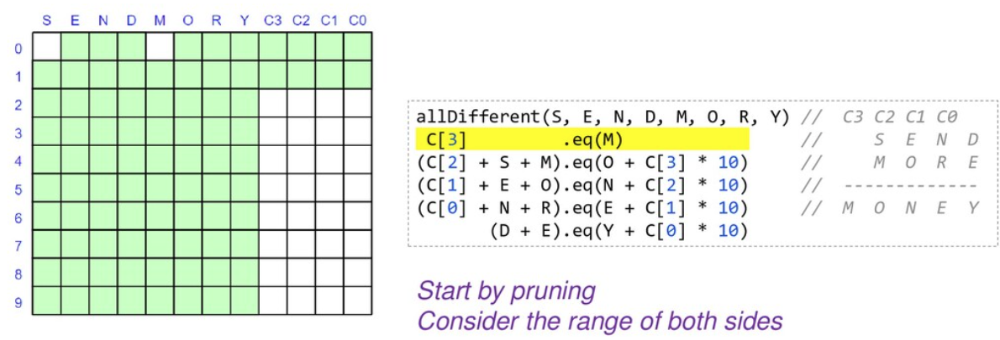

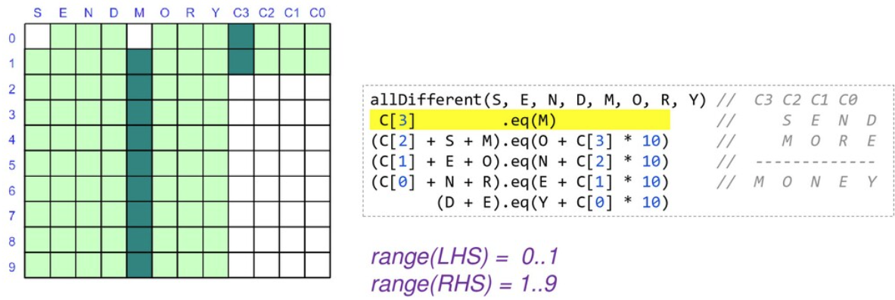

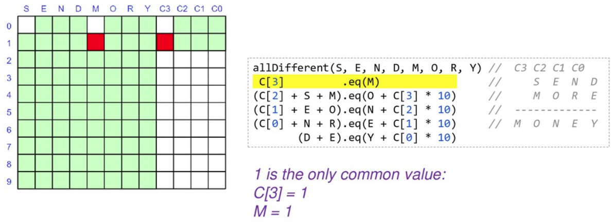

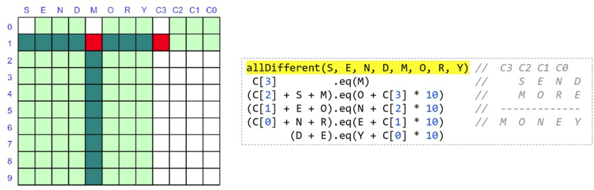

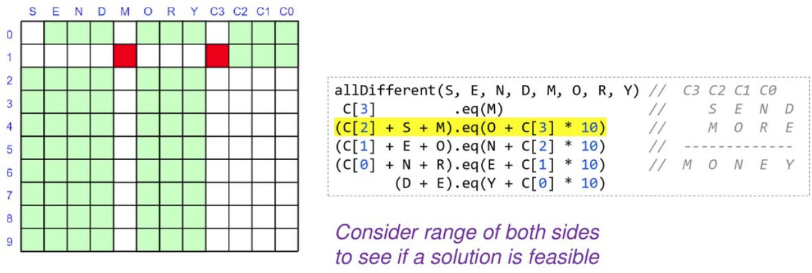

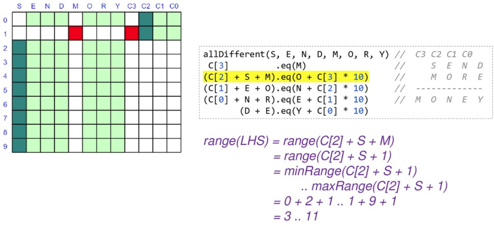

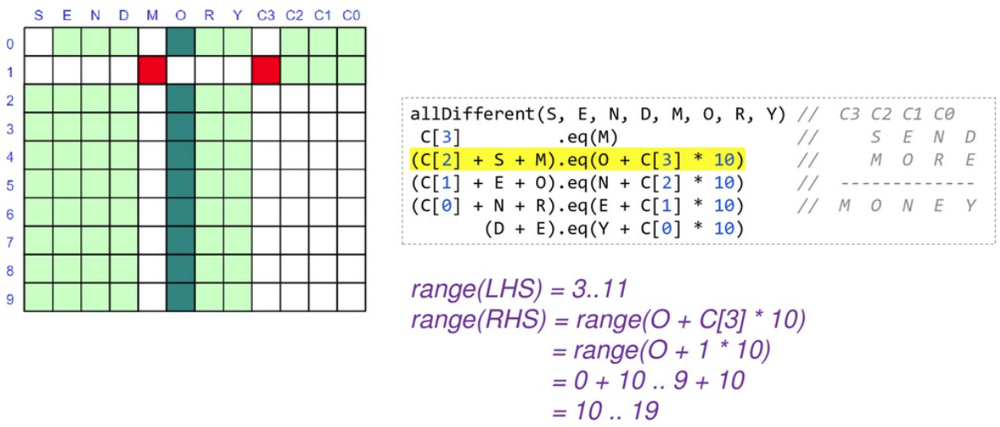

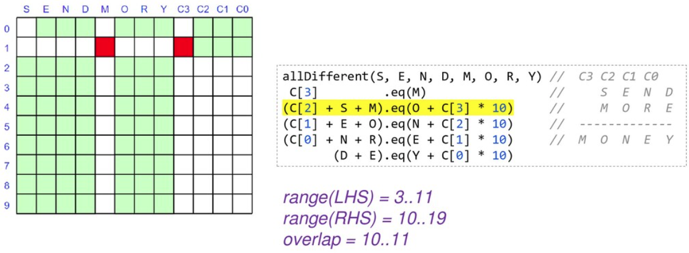

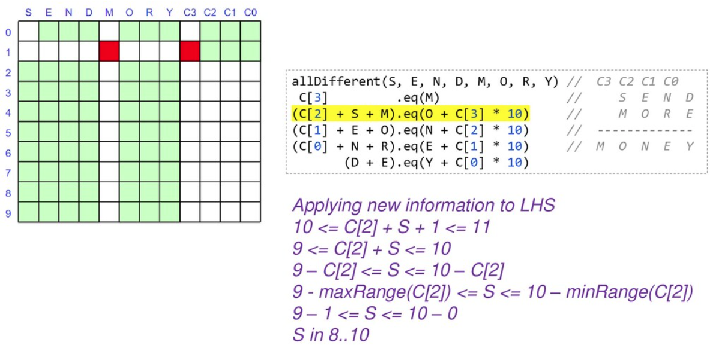

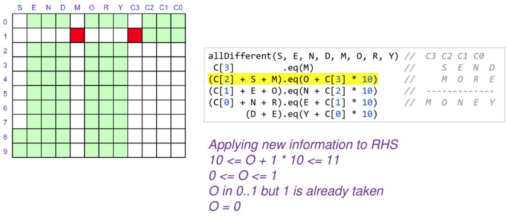

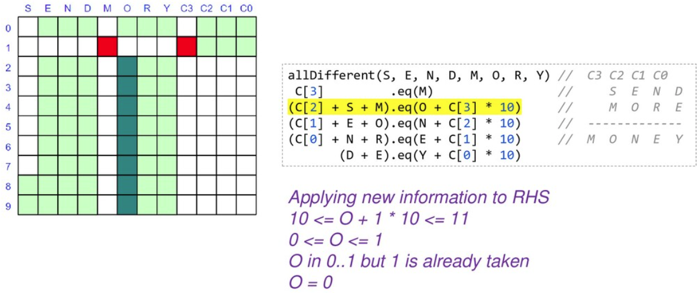

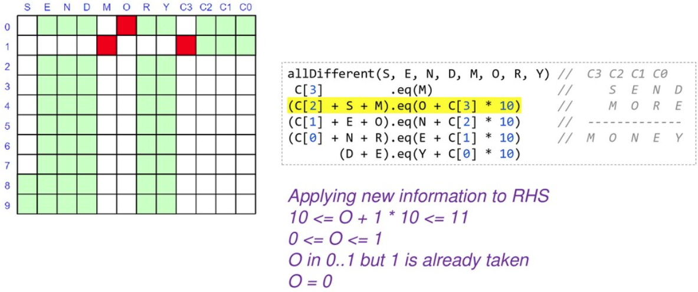

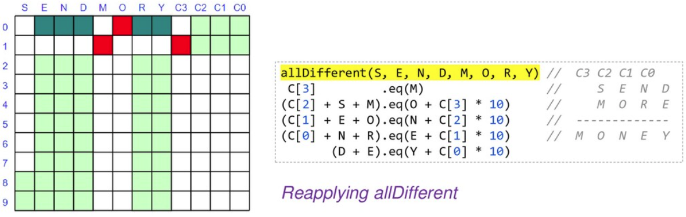

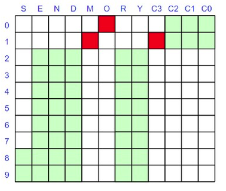

As we are locking in the value of variables, we can substitute
them into and simplify our constraints. When we reapply them,
they will be quicker to evaluate and may reveal more information.

At this point we only have 2 of our variables locked down but our
search space is nearly half what we started with, and we have
simplified some of our constraints. We would continue branching
and solving at this point until we find our solution or determine
that no solution is possible.

== Looking at other languages

The https://github.com/paulk-asert/groovy-constraint-programming[example repo] also contains solutions for this problem in other
languages, so you can compare and contrast, including
https://clojure.org/[Clojure],
Haskell (https://github.com/Frege/frege[Frege]),
https://www.java.com/[Java],
JavaScript (https://docs.oracle.com/javase/10/nashorn/[Nashorn]),
Ruby (https://www.jruby.org/[JRuby]),
Python (https://www.jython.org/[Jython]),
https://kotlinlang.org/[Kotlin],
Lua (https://github.com/luaj/luaj[Luaj]),
Prolog (http://apice.unibo.it/xwiki/bin/view/Tuprolog/[tuprolog]),
and https://www.scala-lang.org/[Scala].

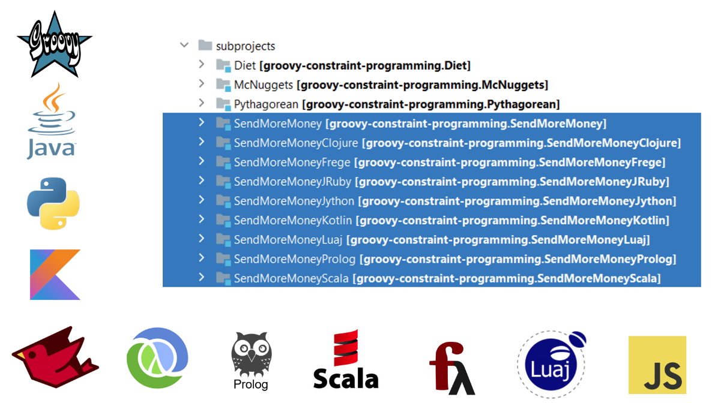

To wrap up, let's look at solving a few more examples (using
Choco). We'll solve some of the examples from an interesting
blog on the https://pballew.blogspot.com/2015/02/some-history-notes-about-alphametrics.html[history of Cryptarithmetic problems]:

* `ABCD * 4 = DCBA`
* `AA + BB + CC = ABC`
* `HALF + HALF = WHOLE`
* `HALF + FIFTH + TENTH + TENTH + TENTH = WHOLE`

Here is the code:

[source,groovy]
----
new Model("ABCD*4=DCBA").with {
    def (A, D) = ['A', 'D'].collect { intVar(it, 1, 9) }
    def (B, C) = ['B', 'C'].collect { intVar(it, 0, 9) }
    def R = (0..2).collect { intVar(0, 9) }

    allDifferent(A, B, C, D).post()
    R[2].add(A.mul(4)).eq(D).post()
    R[1].add(B.mul(4)).eq(C.add(R[2].mul(10))).post()
    R[0].add(C.mul(4)).eq(B.add(R[1].mul(10))).post()
    D.mul(4).eq(A.add(R[0].mul(10))).post()
    solver.findAllSolutions().each {
        println "$name: ${pretty(it, [A, B, C, D, ' * 4 = ', D, C, B, A])}\n$it\n"
    }
}

new Model("AA+BB+CC=ABC").with {
    def (A, B, C) = ['A', 'B', 'C'].collect { intVar(it, 1, 9) }
    allDifferent(A, B, C).post()
    A.mul(11).add(B.mul(11).add(C.mul(11))).eq(A.mul(100).add(B.mul(10)).add(C)).post()
    solver.findAllSolutions().each {
        println "$name: ${pretty(it, [A, A, ' + ', B, B, ' + ', C, C, ' = ', A, B, C])}\n$it\n"
    }
}

new Model("HALF+HALF=WHOLE").with {
    def (H, W) = ['H', 'W'].collect { intVar(it, 1, 9) }
    def (A, E, F, L, O) = ['A', 'E', 'F', 'L', 'O'].collect { intVar(it, 0, 9) }
    allDifferent(H, W, A, E, F, L, O).post()
    IntVar[] ALL = [
            H, A, L, F,
            W, H, O, L, E]
    int[] COEFFS = [
            2000, 200, 20, 2,
            -10000, -1000, -100, -10, -1]
    scalar(ALL, COEFFS, "=", 0).post()
    solver.findAllSolutions().each {
        println "$name: ${pretty(it, [H, A, L, F, ' + ', H, A, L, F, ' = ', W, H, O, L, E])}\n$it\n"
    }
}

new Model("HALF+FIFTH+TENTH+TENTH+TENTH=WHOLE").with {
    def (H, F, T, W) = ['H', 'F', 'T', 'W'].collect { intVar(it, 1, 9) }
    def (A, L, I, E, N, O) = ['A', 'L', 'I', 'E', 'N', 'O'].collect { intVar(it, 0, 9) }
    allDifferent(H, F, T, W, A, L, I, E, N, O).post()
    IntVar[] ALL = [
            H, A, L, F,
            F, I, F, T, H,
            T, E, N, T, H,
            T, E, N, T, H,
            T, E, N, T, H,
            W, H, O, L, E]
    int[] COEFFS = [
            1000, 100, 10, 1,
            10000, 1000, 100, 10, 1,
            10000, 1000, 100, 10, 1,
            10000, 1000, 100, 10, 1,
            10000, 1000, 100, 10, 1,
            -10000, -1000, -100, -10, -1]
    scalar(ALL, COEFFS, "=", 0).post()
    solver.findAllSolutions().each {
        def parts = [H, A, L, F, '+', F, I, F, T, H, '+', T, E, N, T, H, '+',
                     T, E, N, T, H, '+', T, E, N, T, H, '=', W, H, O, L, E]
        println "$name: ${pretty(it, parts)}\n$it\n"
    }
}

// helper method to print solutions
def pretty(model, parts) {
    parts.collect { p -> p instanceof IntVar ? model.getIntVal(p) : p }.join()
}
----

which has this output:

----
ABCD*4=DCBA: 2178 * 4 = 8712
Solution: A=2, D=8, B=1, C=7, IV_1=3, IV_2=3, IV_3=0, (A*4)=8, sum_exp_4=8, (B*4)=4, …, 

AA+BB+CC=ABC: 11 + 99 + 88 = 198
Solution: A=1, B=9, C=8, (A*11)=11, (B*11)=99, (C*11)=88, …, 

HALF+HALF=WHOLE: 9604 + 9604 = 19208
Solution: H=9, W=1, A=6, E=8, F=4, L=0, O=2, 

HALF+HALF=WHOLE: 9703 + 9703 = 19406
Solution: H=9, W=1, A=7, E=6, F=3, L=0, O=4, 

HALF+HALF=WHOLE: 9802 + 9802 = 19604
Solution: H=9, W=1, A=8, E=4, F=2, L=0, O=6, 

HALF+FIFTH+TENTH+TENTH+TENTH=WHOLE: 6701+14126+25326+25326+25326=96805
Solution: H=6, F=1, T=2, W=9, A=7, L=0, I=4, E=5, N=3, O=8,
----

You should see the common patterns used for solving these puzzles.

== Further Information

* https://github.com/radsz/jacop[JaCoP] Java Constraint Programming solver
* https://choco-solver.org/[Choco] open source library for constraint programming
* https://developers.google.com/optimization/cp[OR-Tools] constraint optimization
* https://en.wikipedia.org/wiki/Verbal_arithmetic[Verbal arithmetic] problems described (wikipedia)
* https://www.jcp.org/en/jsr/detail?id=331[JSR331] Constraint Programming API
* https://github.com/paulk-asert/groovy-constraint-programming/tree/master/subprojects/SendMoreMoney[Github repo] containing sample code

== Conclusion

We have looked at using Groovy and a few constraint programming
libraries to solve a cryptarithmetic puzzles. Why not try solving
some of your own puzzles.
