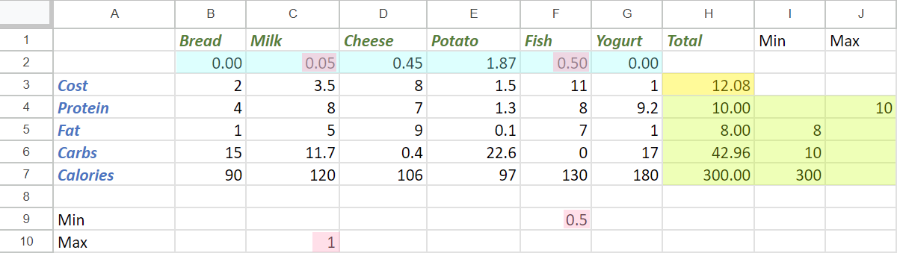
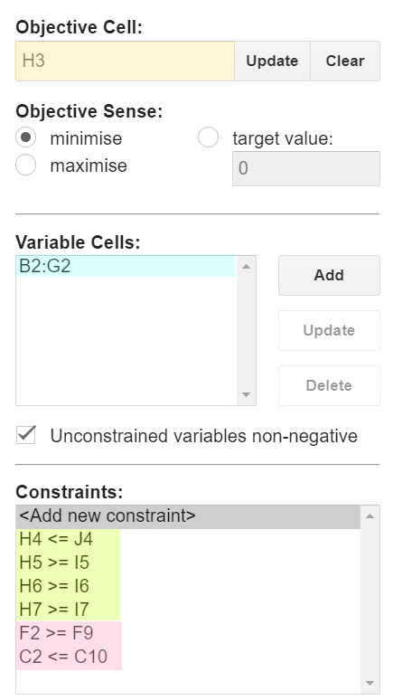

= Solving simple optimization problems with Groovy using Commons Math, Hipparchus, OptaPlanner, and Timefold
Paul King
:revdate: 2024-03-14T22:22:00+00:00
:keywords: groovy, optaplanner, timefold, ojalgo, jacop, or-tools, choco, commons math, hipparchus, linear programming
:description: This post looks at solving simple optimization problems using Groovy.

== Introduction

There are many problems involving optimization.
We'll explore a case study which can be solved using linear optimization,
also known as
https://en.wikipedia.org/wiki/Linear_programming[linear programming].
Linear programming problems optimize a particular linear objective
function subject to one or more linear equality and inequality constraints.

We'll look at such a problem and some libraries
and tools which can be used to solve them.

== Case Study: Diet Optimization

Let's look at a case study where we try to minimize the cost of food
items in our diet, while still maintaining some overall constraints
which we might set for health or dietary preference reasons.
The example is inspired by
https://documentation.sas.com/doc/en/orcdc/14.2/ormpug/ormpug_lpsolver_examples01.htm[this SAS example],
but see the <<Further Information>> section for a more elaborate linear programming example,
the classic Stigler diet problem, solved using Google OR-Tools.

First, here are six foods with their costs and nutritional
values that make up our diet:

[width=300]
|===
|                   | Bread 🍞 | Milk 🥛 | Cheese 🧀 | Potato 🥔 | Fish 🐟 | Yogurt 🍶
| Cost              | 2.0   | 3.5  | 8.0    | 1.5    | 11.0 | 1.0
| Protein (g)       | 4.0   | 8.0  | 7.0    | 1.3    | 8.0  | 9.2
| Fat (g)           | 1.0   | 5.0  | 9.0    | 0.1    | 7.0  | 1.0
| Carbohydrates (g) | 15.0  | 11.7 | 0.4    | 22.6   | 0.0  | 17.0
| Calories          | 90    | 120  | 106    | 97     | 130  | 180
|===

We want to minimize cost, while maintaining optimal nutrition,
where optimal will be defined as meeting the following criteria:

* Must be at least 300 calories
* Not more than 10 grams of fat
* Not less than 10 grams of carbohydrates
* Not less than 8 grams of fat
* At least 0.5 units of fish
* No more than 1 unit of milk

Note, we don't recommend this simplified set of constraints
as a real diet, it is only for illustrative purposes for our case study.

Relating this back to our earlier definition of linear programming,
our list above represent our linear constraints. Our object function
is cost which is determined by the amount of each food multiplied
by its cost.

== Solving with a spreadsheet solver

This kind of problem is so common that solvers exist even within spreadsheet applications. We'll show a solution using the
https://opensolver.org/opensolver-for-google-sheets/[OpenSolver Add-on] for
https://www.google.com.au/sheets/about/[Google Sheets].
But you can do the same thing using
https://speakerdeck.com/paulk/groovy-constraint-programming?slide=77[Microsoft Excel] if you prefer.

First, we fill in the data for our problem.
It will be similar to the figure shown below, but initially,
the variable cells (blue) and objective cell (yellow) will be blank.

Then, using the OpenSolver extension, we identify by way
of cell ranges, our data (blue) and objective (yellow) cells,
as well as the constraints.

Then we click "Solve" and it calculates our optimized value.

Let's look at solving this programmatically using Groovy.
Groovy provides a particularly nice environment for
scripting solutions to such problems, but for
the libraries we are using, it should be possible to use
most JVM languages.

== Using Apache Commons Math or Hipparchus

Let's now look at solving this problem using a simplex solver.
We'll use the `SimplexSolver` class from Apache Commons
Math which is essentially the same as the one from Hipparchus
(a commons math fork).

We'll start with a little helper method for defining our constraints:

[source,groovy]
----
static scalar(coeffs, rel, double val) {
    new LinearConstraint(coeffs as double[], rel, val)
}
----

Next we define our individual constraints and the combined set:

[source,groovy]
----
var milk_max   = scalar([0, 1, 0, 0, 0, 0], LEQ, 1)
var fish_min   = scalar([0, 0, 0, 0, 1, 0], GEQ, 0.5)
var protein    = scalar([4.0, 8.0, 7.0, 1.3, 8.0, 9.2],     LEQ, 10)
var fat        = scalar([1.0, 5.0, 9.0, 0.1, 7.0, 1.0],     GEQ, 8)
var carbs      = scalar([15.0, 11.7, 0.4, 22.6, 0.0, 17.0], GEQ, 10)
var calories   = scalar([90, 120, 106, 97, 130, 180],       GEQ, 300)

LinearConstraintSet constraints = [milk_max, fish_min, protein, fat, carbs, calories]
----

Each individual constraint has a coefficient for each food,
a relationship, and a value.

Next, we define our cost function, and an additional constraint
to indicate that we can't buy a negative amount of any food.
The `zeroOrMore` constraint saves us from doing the long-hand
equivalent, like `fish_min` but with a minimum of `0`, for each food.

[source,groovy]
----
var cost = new LinearObjectiveFunction([2.0, 3.5, 8.0, 1.5, 11.0, 1.0] as double[], 0)

var zeroOrMore = new NonNegativeConstraint(true)
----

Now, our solution is found by creating a new solver, and asking
it to optimize using our cost function and the constraints.
We then print our solution out:

[source,groovy]
----
var solution = new SimplexSolver().optimize(cost, constraints, zeroOrMore)

static pretty(int idx, double d) {
    d ? [sprintf('%s %.2f', ['🍞', '🥛', '🧀', '🥔', '🐟', '🍶'][idx], d)] : []
}

if (solution != null) {
    printf "Cost: %.2f%n", solution.value
    println solution.point.indexed().collectMany(this::pretty).join(', ')
}
----

When run, it gives the following output:

----
Cost: 12.08
🥛 0.05, 🧀 0.45, 🥔 1.87, 🐟 0.50
----

This is the same solution as what we saw when using the spreadsheet.

You can currently swap between Apache Commons Math and Hipparchus
by switching the Maven coordinates of the jar being used on the classpath
and changing a few import statements. This may change in future versions,
but for now:

* Using `org.apache.commons:commons-math3:3.6.1` gives an older stable version
of Commons Math, starting to show its age at 8 years old.
* Using `org.apache.commons:commons-math4-legacy:4.0-beta1`
gives the latest version of these classes from Apache Commons Math.
The naming possibly deserves some explanation. There has been ongoing
effort to modularise Commons Math and there are numerous components
delivered as a result. The optimisation classes haven't
been worked on yet and are available in the aforementioned artifact.
* Using `org.hipparchus:hipparchus-optim:3.0` gives classes from the forked
project. For the classes we are using, there is essentially no difference
in the fork, but other parts of the library have seen useful updates
if you don't mind having a dependency that isn't backed by the ASF.

If you don't like those options, there are many more, here are a few
with Groovy solutions in the same repo as the above examples:

* For a solution using the SCIP simplex solver in Google https://developers.google.com/optimization/lp[OR-Tools], see https://github.com/paulk-asert/groovy-constraint-programming/blob/master/subprojects/Diet/src/main/groovy/DietOrTools.groovy[DietOrTools.groovy]
* For a solution showing Groovy support within https://documentation.sas.com/doc/en/pgmsascdc/9.4_3.5/proc/p1x8agymll9gten1ocziihptcjzj.htm[SAS], see https://github.com/paulk-asert/groovy-constraint-programming/blob/master/subprojects/Diet/src/main/groovy/DietGroovy.sas[DietGroovy.sas]
* For a solution using the LP solver in https://www.ojalgo.org/[ojAlgo], see https://github.com/paulk-asert/groovy-constraint-programming/blob/master/subprojects/Diet/src/main/groovy/DietOjalgo.groovy[DietOjalgo.groovy]
* For a solution using the https://choco-solver.org/[Choco] constraint programming solver, see https://github.com/paulk-asert/groovy-constraint-programming/blob/master/subprojects/Diet/src/main/groovy/DietChocoInt.groovy[DietChocoInt.groovy] for a solution using scaled integers, and https://github.com/paulk-asert/groovy-constraint-programming/blob/master/subprojects/Diet/src/main/groovy/DietChocoReal.groovy[DietChocoReal.groovy] for a solution with real numbers using Ibex integration
* For a solution using the https://github.com/radsz/jacop[JaCoP] constraint programming solver, see https://github.com/paulk-asert/groovy-constraint-programming/blob/master/subprojects/Diet/src/main/groovy/DietJacopInt.groovy[DietJacopInt.groovy] for a solution using scaled integers, and https://github.com/paulk-asert/groovy-constraint-programming/blob/master/subprojects/Diet/src/main/groovy/DietJacopIntKnapsack.groovy[DietJacopIntKnapsack.groovy] for a solution utilizing a Knapsack constraint

For simple optimization problems, like our case study,
which can be solved using a simplex solver, you generally
need look no further. It is a very efficient approach
to solving such problems. For an additional class of slightly
more complex problems, they can be mapped to linear programming
problems with a little ingenuity.

For more complex problems,
there are generally no super efficient solution approaches.
You need to bring to bear a range of techniques for managing
the potentially huge search space which is inherent in
such problems. That is where optimization libraries like
OptaPlanner (and Timefold) come into play.

== Using OptaPlanner or Timefold

OptaPlanner is an optimization library combining optimization algorithms with constraint solving.
For most of the last 10 years the library was developed under Red Hat's guidance.
In the last 12 months, the project and other related projects
were donated to the https://www.apache.org/[ASF] as part of https://kie.apache.org/[Apache KIE].
More recently, the library was forked as
https://timefold.ai/[Timefold].

In this blog, we'll use Timefold, but the code in the examples remains the same for both libraries as you can see in the
referenced repositories.
Just the Maven coordinate of the library changes along with the associated class imports.
At this stage, it isn't clear how the two projects will evolve over time.

One of the claims of the Timefold project is that it has a lighter dependency footprint.
This can be confirmed by running the `printRuntimeClasspath` task in the associated builds.
Timefold has 20 dependant jars compared with OptaPlanner's 55 jars.

While Timefold's power isn't needed for our simple problem,
let's examine how you would use it for the same case study.

First, we'll create a planning entity.
This is a class which the solver knows will change
over time and will contain one or more planning
variables.

In our case, we have just one planning variable,
the `amount` property, which the solver will adjust while trying
to find an optimal solution.

[source,groovy]
----
@PlanningEntity
@TupleConstructor(includeFields = true)
class Food {
    final String name, emoji
    final double cost, protein, fat, carbs, calories
    @PlanningVariable(valueRangeProviderRefs = "amount")
    Integer amount // times 100
}
----

We are using an Integer as the type for `amount`, since
Integers are much easier for a solver to work with.
We'll actually store the amount (as seen in the earlier example)
multiplied by 100, but we'll divide by 100 when displaying the result.

The other fields of our class are constants once defined
during instance construction.

Next, we define a planning solution class. This has all the
information needed about any given solution including a `score`.
The score lets us determine whether one solution is more optimal
than another, and also whether a given solution meets all hard
and soft constraints (explained shortly).

[source,groovy]
----
@PlanningSolution
class DietSolution {
    @PlanningEntityCollectionProperty
    List<Food> foods

    @ValueRangeProvider(id = "amount")
    CountableValueRange<Integer> getAmount() {
        ValueRangeFactory.createIntValueRange(0, 200, 5)
    }

    @PlanningScore
    HardSoftScore score

    String toString() {
        var sb = new StringBuilder()
        foods.eachWithIndex { f, idx ->
            sb << "$f.emoji $f.name: ${f.amount / 100}\n"
        }
        for (name in ['fat', 'carbs', 'protein', 'calories', 'cost']) {
            var total = foods.sum{ f -> f."$name" * f.amount / 100 }
            sb << sprintf("Total %s: %.2f%n", name, total)
        }
        sb << "Score: $score"
        sb
    }
}
----

Next we want to define some constraints. In general, we have hard
constraints which must be met and soft constraints which should
be met if possible. In our case, we'll have constraints like minimum
and maximum values for various foods and various nutritional measures.

[source,groovy]
----
class DietConstraintProvider implements ConstraintProvider {
    @Override
    Constraint[] defineConstraints(ConstraintFactory factory) {
        new Constraint[]{
                maxField(factory, 'protein', 10),
                minField(factory, 'fat', 8),
                minField(factory, 'carbs', 10),
                minField(factory, 'calories', 300),
                minFood(factory, 'Fish', 50),
                maxFood(factory, 'Milk', 100),
                minCost(factory),
        }
    }

    private static int amountOf(Food f, String name) {
        (f."$name" * f.amount).toInteger()
    }

    private static Constraint minField(ConstraintFactory factory, String fieldName, double minAmount) {
        ToIntFunction<Food> amount = f -> amountOf(f, fieldName)
        factory.forEach(Food)
                .groupBy(sum(amount))
                .filter(fs -> fs < minAmount * 100)
                .penalize(ONE_HARD)
                .asConstraint("Min $fieldName")
    }

    private static Constraint maxField(ConstraintFactory factory, String fieldName, double maxAmount) {
        ToIntFunction<Food> amount = f -> amountOf(f, fieldName)
        factory.forEach(Food)
                .groupBy(sum(amount))
                .filter(fs -> fs > maxAmount * 100)
                .penalize(ONE_HARD)
                .asConstraint("Max $fieldName")
    }

    private static Constraint minFood(ConstraintFactory factory, String foodName, double minAmount) {
        factory.forEach(Food)
                .filter(f -> f.name == foodName && f.amount < minAmount)
                .penalize(ONE_HARD)
                .asConstraint("Min $foodName")
    }

    private static Constraint maxFood(ConstraintFactory factory, String foodName, double maxAmount) {
        factory.forEach(Food)
                .filter(f -> f.name == foodName && f.amount > maxAmount)
                .penalize(ONE_HARD)
                .asConstraint("Max $foodName")
    }

    private static ToIntFunction<Food> totalCost = f -> (f.cost * f.amount).toInteger()

    private static Constraint minCost(ConstraintFactory factory) {
        factory.forEach(Food)
                .filter(f -> f.amount > 0)
                .groupBy(sum(totalCost))
                .penalize(ONE_SOFT, fs -> fs >> 2)
                .asConstraint('Min cost')
    }
}
----

With these helper classes in place, we are now ready to

[source,groovy]
----
def unsolved = new DietSolution(foods: [
        new Food('Bread' , '🍞',  2.0, 4.0, 1.0, 15.0,  90),
        new Food('Milk'  , '🥛',  3.5, 8.0, 5.0, 11.7, 120),
        new Food('Cheese', '🧀',  8.0, 7.0, 9.0,  0.4, 106),
        new Food('Potato', '🥔',  1.5, 1.3, 0.1, 22.6,  97),
        new Food('Fish'  , '🐟', 11.0, 8.0, 7.0,  0.0, 130),
        new Food('Yogurt', '🍶',  1.0, 9.2, 1.0, 17.0, 180)
])

def config = new SolverConfig()
        .withSolutionClass(DietSolution)
        .withEntityClasses(Food)
        .withConstraintProviderClass(DietConstraintProvider)
        .withTerminationSpentLimit(Duration.ofSeconds(10))

def factory = SolverFactory.create(config)
def solver = factory.buildSolver()
println solver.solve(unsolved)
----

It has this output when run:

----
08:17:05.202 [main] INFO  a.t.s.core.impl.solver.DefaultSolver - Solving started: time spent (25), best score (-6init/0hard/0soft), environment mode (REPRODUCIBLE), move thread count (NONE), random (JDK with seed 0).
08:17:05.385 [main] INFO  a.t.s.c.i.c.DefaultConstructionHeuristicPhase - Construction Heuristic phase (0) ended: time spent (210), best score (-1hard/-521soft), score calculation speed (1355/sec), step total (6).
08:17:15.175 [main] INFO  a.t.s.c.i.l.DefaultLocalSearchPhase - Local Search phase (1) ended: time spent (10000), best score (-1hard/-261soft), score calculation speed (155967/sec), step total (1030).
08:17:15.176 [main] INFO  a.t.s.core.impl.solver.DefaultSolver - Solving ended: time spent (10000), best score (-1hard/-261soft), score calculation speed (152685/sec), phase total (2), environment mode (REPRODUCIBLE), move thread count (NONE).
🍞 Bread: 0.6
🥛 Milk: 0.6
🧀 Cheese: 0
🥔 Potato: 0.4
🐟 Fish: 0.5
🍶 Yogurt: 1.05
Total fat: 8.19
Total carbs: 42.91
Total protein: 21.38
Total calories: 418.80
Total cost: 10.45
Score: -1hard/-261soft
----

Given the amount of time we gave the solver, and using the
default search algorithms, we couldn't even meet all hard constraints.
The search space was so vast, that we never reached an area in the
search space where all constraints were met.

The good news is that we can provide additional guidance, so that
the solver heads in better directions during its searching.
Here is one possible additional configuration that we could supply,
along with the updated `config` definition:

[source,groovy]
----
def construction = new ConstructionHeuristicPhaseConfig(constructionHeuristicType: FIRST_FIT)
def moveSelector = new UnionMoveSelectorConfig([
        new ChangeMoveSelectorConfig(),
        new SwapMoveSelectorConfig()
])
def localSearch = new LocalSearchPhaseConfig(localSearchType: VARIABLE_NEIGHBORHOOD_DESCENT,
        moveSelectorConfig: moveSelector)
def config = new SolverConfig()
        .withSolutionClass(DietSolution)
        .withEntityClasses(Food)
        .withConstraintProviderClass(DietConstraintProvider)
        .withPhases(construction, localSearch) // additional solution guidance
        .withTerminationSpentLimit(Duration.ofSeconds(10))
----

It now has this output when run:

----
🍞 Bread: 0
🥛 Milk: 0
🧀 Cheese: 0.5
🥔 Potato: 1.9
🐟 Fish: 0.5
🍶 Yogurt: 0
Total fat: 8.19
Total carbs: 43.14
Total protein: 9.97
Total calories: 302.30
Total cost: 12.35
Score: 0hard/-308soft
----

We can see here that it is now close to what linear programming would give us.

== Further Information

* https://developers.google.com/optimization/lp[OR-Tools] linear optimization
* A related but more elaborate example based on the https://developers.google.com/optimization/lp/stigler_diet[Stigler Diet] problem using Google OR-Tools
* A Python https://www.kaggle.com/code/nbuhagiar/diet-optimization-with-or-tools[Diet example] also using Google OR-Tools
* GitHub repos containing sample code: https://github.com/paulk-asert/groovy-constraint-programming/tree/master/subprojects/Diet[Diet] https://github.com/paulk-asert/groovy-constraint-programming/tree/master/subprojects/DietOptaPlanner[DietOptaPlanner] https://github.com/paulk-asert/groovy-constraint-programming/tree/master/subprojects/DietTimeflow[DietTimeflow]

== Conclusion

We have looked at using Groovy and a few linear optimization
libraries to solve a diet case study. Our main focus was the
Apache Commons Math and Hipparchus libraries.
We also explored using the more powerful Timeflow and OptaPlanner
libraries.
