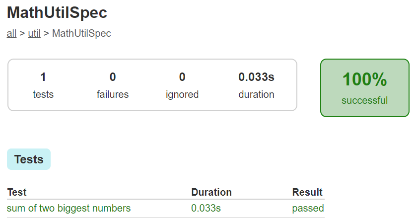
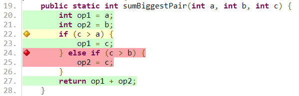
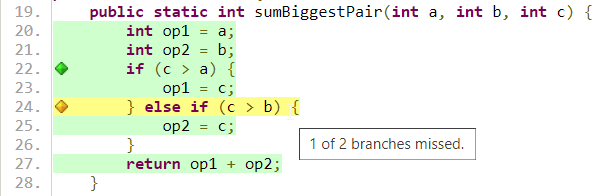
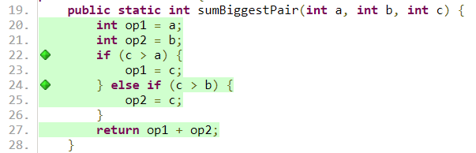
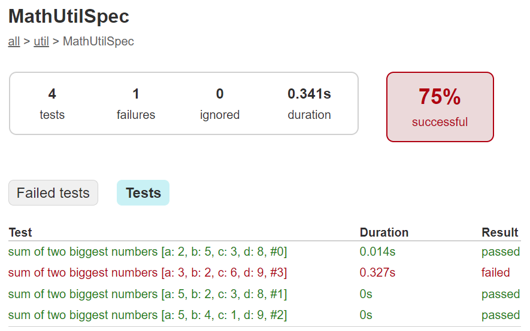
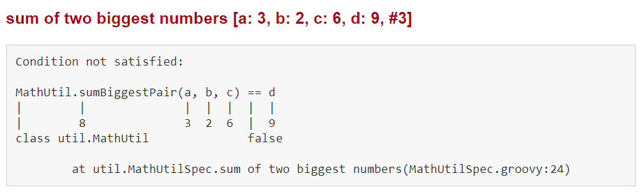
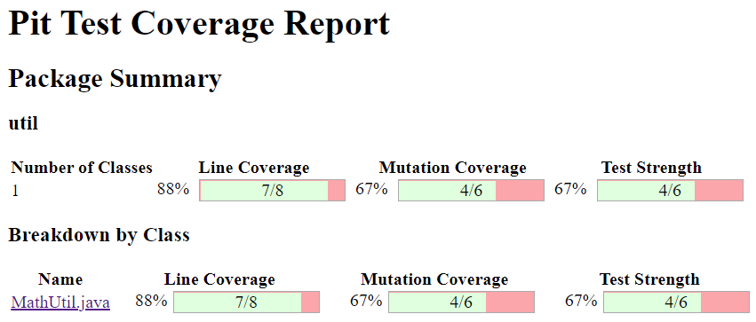
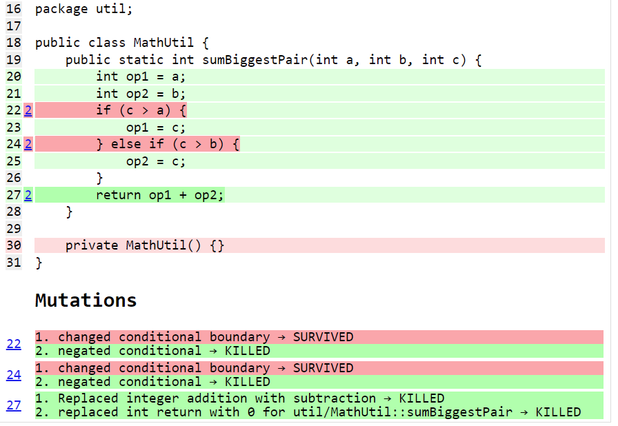

= Testing your Java with Groovy, Spock, JUnit5, Jacoco, Jqwik and Pitest
Paul King
:revdate: 2022-07-15T08:26:15+00:00
:keywords: groovy, java, spock, testing, jqwik, pitest, junit, jacoco
:description: This post looks at testing Java using Groovy, Spock, JUnit5, Jacoco, Jqwik and Pitest

image:img/spock_logo.png[spock logo,100,float="right"]
This blog post covers a common scenario seen in the Groovy community which is
projects which use Java for their production code and Groovy for their tests.
This can be a low risk way for Java shops to try out and become more familiar
with Groovy. We'll write our initial tests using the
https://spockframework.org/[Spock testing framework], and we'll use
https://junit.org/junit5/[JUnit5] later with our jqwik tests.
You can usually use your favorite Java testing libraries if you switch to Groovy.

== The system under test

For illustrative purposes, we will test a Java mathematics utility function
`sumBiggestPair`. Given three numbers, it finds the two biggest and then adds them up.
An initial stab at the code for this might look something like this:

[source,java]
----
public class MathUtil {                       // Java

    public static int sumBiggestPair(int a, int b, int c) {
        int op1 = a;
        int op2 = b;
        if (c > a) {
            op1 = c;
        } else if (c > b) {
            op2 = c;
        }
        return op1 + op2;
    }

    private MathUtil(){}
}
----

== Testing with Spock

An initial test could look like this:

[source,groovy]
----
class MathUtilSpec extends Specification {
    def "sum of two biggest numbers"() {
        expect:
        MathUtil.sumBiggestPair(2, 5, 3) == 8
    }
}
----

When we run this test, all tests pass:

But if we look at the coverage report, generated with
https://github.com/jacoco/jacoco[Jacoco], we see that our test
hasn't covered all lines of code:

We'll swap to use Spock's data-driven feature and include an additional testcase:

[source,groovy,subs="quotes"]
----
def "sum of two biggest numbers"(int a, int b, int c, int d) {
    expect:
    MathUtil.sumBiggestPair(a, b, c) == d

    where:
    a | b | c | d
    2 | 5 | 3 | 8
    **5 | 2 | 3 | 8**
}
----

We can check our coverage again:

That is a little better. We now have 100% line coverage but not 100% branch coverage.
Let's add one more testcase:

[source,groovy,subs="quotes"]
----
def "sum of two biggest numbers"(int a, int b, int c, int d) {
    expect:
    MathUtil.sumBiggestPair(a, b, c) == d

    where:
    a | b | c | d
    2 | 5 | 3 | 8
    5 | 2 | 3 | 8
    **5 | 4 | 1 | 9**
}
----

And now we can see that we have reached 100% line coverage and 100% branch coverage:

At this point, we might be very confident in our code and ready to ship it to production.
Before we do, we'll add one more testcase:

[source,groovy,subs="quotes"]
----
def "sum of two biggest numbers"(int a, int b, int c, int d) {
    expect:
    MathUtil.sumBiggestPair(a, b, c) == d

    where:
    a | b | c | d
    2 | 5 | 3 | 8
    5 | 2 | 3 | 8
    5 | 4 | 1 | 9
    **3 | 2 | 6 | 9**
}
----

When we re-run our tests, we discover that the last testcase failed!:

And examining the testcase, we can indeed see that there is a flaw in our algorithm.
Basically, having the `else` logic doesn't cater for when `c` is
greater than both `a` and `b`!

We succumbed to faulty expectations of what 100% coverage would give us.

The good news is that we can fix this. Here is an updated algorithm:

[source,java]
----
public static int sumBiggestPair(int a, int b, int c) {                // Java
    int op1 = a;
    int op2 = b;
    if (c > Math.min(a, b)) {
        op1 = c;
        op2 = Math.max(a, b);
    }
    return op1 + op2;
}
----

With this new algorithm, all 4 testcases now pass,
and we again have 100% line and branch coverage.

[subs="quotes,macros"]
----
> Task :SumBiggestPairPitest:test
[lime]*✔* Test sum of two biggest numbers pass:v[[]Tests: 4/[lime]*4*/[red]*0*/[gold]*0*] [Time: 0.317 s]
[lime]*✔* Test util.MathUtilSpec pass:v[[]Tests: 4/[lime]*4*/[red]*0*/[gold]*0*] [Time: 0.320 s]
[lime]*✔* Test Gradle Test Run :SumBiggestPairPitest:test pass:v[[]Tests: 4/[lime]*4*/[red]*0*/[gold]*0*]
----

But haven't we been here before? How can we be sure there isn't some additional test
cases that might reveal another flaw in our algorithm? We could keep writing lots more
testcases, but we'll look at two other techniques that can help.

== Mutation testing with Pitest

An interesting but not widely used technique is mutation testing. It probably deserves
to be more widely used. It can test the quality of a testsuite but has the drawback of
sometimes being quite resource intensive. It modifies (mutates) production code and
re-runs your testsuite. If your test suite still passes with modified code, it possibly
indicates that your testsuite is lacking sufficient coverage. Earlier, we had an algorithm
with a flaw and our testsuite didn't initially pick it up. You can think of mutation
testing as adding a deliberate flaw and seeing whether your testsuite is good enough
to detect that flaw.

If you're a fan of test-driven development (TDD), it espouses a rule that not a single
line of production code should be added unless a failing test forces that line to be
added. A corollary is that if you change a single line of production code in any
meaningful way, that some test should fail.

So, let's have a look at what mutation testing says about our initial flawed algorithm.
We'll use Pitest (also known as PIT). We'll go back to our initial algorithm and the point
where we erroneously thought we had 100% coverage. When we run Pitest, we get the
following result:

And looking at the code we see:

With output including some statistics:

----
======================================================================
- Statistics
======================================================================
>> Line Coverage: 7/8 (88%)
>> Generated 6 mutations Killed 4 (67%)
>> Mutations with no coverage 0. Test strength 67%
>> Ran 26 tests (4.33 tests per mutation)
----

What is this telling us? Pitest mutated our code in ways that you might expect to break
it but our testsuite passed (survived) in a couple of instances. That means one of two
things. Either, there are multiple valid implementations of our algorithm and Pitest
found one of those equivalent solutions, or our testsuite is lacking some key testcases.
In our case, we know that the testsuite was insufficient.

Let's run it again but this time with all of our tests and the corrected algorithm.

image:img/PitestCoverage2.png[Pitest coverage report]

The output when running the test has also changed slightly:

----
======================================================================
- Statistics
======================================================================
>> Line Coverage: 6/7 (86%)
>> Generated 4 mutations Killed 3 (75%)
>> Mutations with no coverage 0. Test strength 75%
>> Ran 25 tests (6.25 tests per mutation)
----

Our warnings from Pitest have reduced but not gone completely away and our test strength
has gone up but is still not 100%. It does mean that we are in better shape than before.
But should we be concerned?

It turns out in this case, we don't need to worry (too much). As an example, an equally
valid algorithm for our function under test would be to replace the conditional with
`c >= Math.min(a, b)`. Note the greater-than-equals operator rather than just greater-than. For this algorithm, a different path would be taken for the case when `c` equals `a` or `b`, but the end result would be the same. So, that would be an inconsequential or equivalent mutation. In such a case, there may be no additional testcase that we can write to keep Pitest happy. We have to be aware of this possible outcome when using this technique.

Finally, let's look at our build file that ran Spock, Jacoco and Pitest:

[source,groovy]
----
plugins {
    id 'info.solidsoft.pitest' version '1.7.4'
}
apply plugin: 'groovy'

repositories {
    mavenCentral()
}

dependencies {
    implementation "org.apache.groovy:groovy-test-junit5:4.0.3"
    testImplementation("org.spockframework:spock-core:2.2-M3-groovy-4.0") {
        transitive = false
    }
}

pitest {
    junit5PluginVersion = '1.0.0'
    pitestVersion = '1.9.2'
    timestampedReports = false
    targetClasses = ['util.*']
}

tasks.named('test') {
    useJUnitPlatform()
}
----

The astute reader might note some subtle hints which show that the latest Spock versions
run on top of the JUnit 5 platform.

== Using Property-based Testing

Property-based testing is another technology which probably deserves much more attention.
Here we'll use https://jqwik.net/[jqwik] which runs on top of JUnit5,
but you might also like to consider
https://github.com/Bijnagte/spock-genesis[Genesis]
which provides random generators and especially targets Spock.

Earlier, we looked at writing _more_ tests to make our coverage stronger. Property-based
testing can often lead to writing _less_ tests. Instead, we generate many random tests
automatically and see whether certain properties hold.

Previously, we fed in the inputs and the expected output. For property-based testing,
the inputs are typically randomly-generated values, we don't know the output.
So, instead of testing directly against some known output, we'll just check various
properties of the answer.

As an example, here is a test we could use:

[source,groovy]
----
@Property
void "result should be bigger than any individual and smaller than sum of all"(
        @ForAll @IntRange(min = 0, max = 1000) Integer a,
        @ForAll @IntRange(min = 0, max = 1000) Integer b,
        @ForAll @IntRange(min = 0, max = 1000) Integer c) {
    def result = sumBiggestPair(a, b, c)
    assert [a, b, c].every { individual -> result >= individual }
    assert result <= a + b + c
}
----

The `@ForAll` annotations indicate places where jqwik will insert random values.
The `@IntRange` annotation indicates that we want the random values to be contained
between 0 and 1000.

Here we are checking that (at least for small positive numbers) adding the two biggest
numbers should be greater than or equal to any individual number and should be less than
or equal to adding all three of the numbers. These are necessary but insufficient
properties to ensure our system works.

When we run this we see the following output in the logs:

----
                              |--------------------jqwik--------------------
tries = 1000                  | # of calls to property
checks = 1000                 | # of not rejected calls
generation = RANDOMIZED       | parameters are randomly generated
after-failure = PREVIOUS_SEED | use the previous seed
when-fixed-seed = ALLOW       | fixing the random seed is allowed
edge-cases#mode = MIXIN       | edge cases are mixed in
edge-cases#total = 125        | # of all combined edge cases
edge-cases#tried = 117        | # of edge cases tried in current run
seed = -311315135281003183    | random seed to reproduce generated values
----

So, we wrote 1 test and 1000 testcases were executed. The number of tests run is
configurable. We won't go into the details here. This looks great at first glance.
It turns out however, that this particular property is not very discriminating in
terms of the bugs it can find. This test passes for both our original flawed algorithm
as well as the fixed one. Let's try a different property:

[source,groovy]
----
@Property
void "sum of any pair should not be greater than result"(
        @ForAll @IntRange(min = 0, max = 1000) Integer a,
        @ForAll @IntRange(min = 0, max = 1000) Integer b,
        @ForAll @IntRange(min = 0, max = 1000) Integer c) {
    def result = sumBiggestPair(a, b, c)
    assert [a + b, b + c, c + a].every { sumOfPair -> result >= sumOfPair }
}
----

If we calculate the biggest pair, then surely it must be greater than or equal to any
arbitrary pair. Trying this on our flawed algorithm gives:

----
org.codehaus.groovy.runtime.powerassert.PowerAssertionError:
    assert [a + b, b + c, c + a].every { sumOfPair -> result >= sumOfPair }
            | | |  | | |  | | |  |
            1 1 0  0 2 2  2 3 1  false
                              |--------------------jqwik--------------------
tries = 12                    | # of calls to property
checks = 12                   | # of not rejected calls
generation = RANDOMIZED       | parameters are randomly generated
after-failure = PREVIOUS_SEED | use the previous seed
when-fixed-seed = ALLOW       | fixing the random seed is allowed
edge-cases#mode = MIXIN       | edge cases are mixed in
edge-cases#total = 125        | # of all combined edge cases
edge-cases#tried = 2          | # of edge cases tried in current run
seed = 4830696361996686755    | random seed to reproduce generated values

Shrunk Sample (6 steps)
-----------------------
  arg0: 1
  arg1: 0
  arg2: 2

Original Sample
---------------
  arg0: 247
  arg1: 32
  arg2: 267

  Original Error
  --------------
  org.codehaus.groovy.runtime.powerassert.PowerAssertionError:
    assert [a + b, b + c, c + a].every { sumOfPair -> result >= sumOfPair }
            | | |  | | |  | | |  |
            | | 32 32| 267| | |  false
            | 279    299  | | 247
            247           | 514
                          267
----

Not only did it find a case which highlighted the flaw, but it shrunk it down to a very
simple example. On our fixed algorithm, the 1000 tests pass!

The previous property can be refactored a little to not only calculate all three pairs
but then find the maximum of those. This simplifies the condition somewhat:

[source,groovy]
----
@Property
void "result should be the same as alternative oracle implementation"(
        @ForAll @IntRange(min = 0, max = 1000) Integer a,
        @ForAll @IntRange(min = 0, max = 1000) Integer b,
        @ForAll @IntRange(min = 0, max = 1000) Integer c) {
    assert sumBiggestPair(a, b, c) == [a+b, a+c, b+c].max()
}
----

This approach, where an alternative implementation is used, is known as a test oracle.
The alternative implementation might be less efficient, so not ideal for production code,
but fine for testing. When revamping or replacing some software, the oracle might be the
existing system. When run on our fixed algorithm, we again have 1000 testcases passing.

Let's go one step further and remove our `@IntRange` boundaries on the Integers:

[source,groovy]
----
@Property
void "result should be the same as alternative oracle implementation"(@ForAll Integer a, @ForAll Integer b, @ForAll Integer c) {
    assert sumBiggestPair(a, b, c) == [a+b, a+c, b+c].max()
}
----

When we run the test now, we might be surprised:

----
  org.codehaus.groovy.runtime.powerassert.PowerAssertionError:
    assert sumBiggestPair(a, b, c) == [a+b, a+c, b+c].max()
           |              |  |  |  |   |||  |||  |||  |
           -2147483648    0  1  |  |   0|1  0||  1||  2147483647
                                |  |    1    ||   |2147483647
                                |  false     ||   -2147483648
                                2147483647   |2147483647
                                             2147483647
Shrunk Sample (13 steps)
------------------------
  arg0: 0
  arg1: 1
  arg2: 2147483647
----

It fails! Is this another bug in our algorithm? Possibly? But it could equally be
a bug in our property test. Further investigation is warranted.

It turns out that our algorithm suffers from Integer overflow when trying to add `1` to
`Integer.MAX_VALUE`. Our test partially suffers from the same problem but when we call
`max()`, the negative value will be discarded. There is no always correct answer as to
what should happen in this scenario. We go back to the customer and check the real
requirement. In this case, let's assume the customer was happy for the overflow to
occur - since that is what would happen if performing the operation long-hand in Java.
With that knowledge we should fix our test to at least pass correctly when overflow occurs.

We have a number of options to fix this. We already saw previously we can use `@IntRange`.
This is one way to "avoid" the problem and we have a few similar approaches which do the
same. We could use a more confined data type, e.g. `Short`:

[source,groovy]
----
@Property
void checkShort(@ForAll Short a, @ForAll Short b, @ForAll Short c) {
    assert sumBiggestPair(a, b, c) == [a+b, a+c, b+c].max()
}
----

Or we could use a customised provider method:

[source,groovy]
----
@Property
void checkIntegerConstrainedProvider(@ForAll('halfMax') Integer a,
                                     @ForAll('halfMax') Integer b,
                                     @ForAll('halfMax') Integer c) {
    assert sumBiggestPair(a, b, c) == [a+b, a+c, b+c].max()
}

@Provide
Arbitrary<Integer> halfMax() {
    int halfMax = Integer.MAX_VALUE >> 1
    return Arbitraries.integers().between(-halfMax, halfMax)
}
----

But rather than avoiding the problem, we could change our test so that it allowed for
the possibility of overflow within `sumBiggestPair` but didn't compound the problem with
its own overflow. E.g.&nbsp;we could use Long's to do our calculations within our test:

[source,groovy]
----
@Property
void checkIntegerWithLongCalculations(@ForAll Integer a, @ForAll Integer b, @ForAll Integer c) {
    def (al, bl, cl) = [a, b, c]*.toLong()
    assert sumBiggestPair(a, b, c) == [al+bl, al+cl, bl+cl].max().toInteger()
}
----

Finally, let's again look at our Gradle build file:

[source,groovy]
----
apply plugin: 'groovy'

repositories {
    mavenCentral()
}

dependencies {
    testImplementation project(':SumBiggestPair')
    testImplementation "org.apache.groovy:groovy-test-junit5:4.0.3"
    testImplementation "net.jqwik:jqwik:1.6.5"
}

test {
    useJUnitPlatform {
        includeEngines 'jqwik'
    }
}
----

== More information

The examples in this blog post are excerpts from the following repo: +
https://github.com/paulk-asert/property-based-testing

Library versions used: +
Gradle 7.5, Groovy 4.0.3, jqwik 1.6.5, pitest 1.9.2, Spock 2.2-M3-groovy-4.0, Jacoco 0.8.8. +
Tested with JDK 8, 11, 17, 18.

There are many sites with valuable information about the technologies covered here. There are also some great books. Books on Spock include https://www.oreilly.com/library/view/spock-up-and/9781491923283/[Spock: Up and Running], https://www.manning.com/books/java-testing-with-spock[Java Testing with Spock], and
https://leanpub.com/spockframeworknotebook[Spocklight Notebook].
Books on Groovy include:
https://www.manning.com/books/groovy-in-action-second-edition[Groovy in Action]
and https://link.springer.com/book/10.1007/978-1-4842-5058-7[Learning Groovy 3].
If you want general information about using Java and Groovy together, consider
https://www.manning.com/books/making-java-groovy[Making Java Groovy].
And there's a section on mutation testing in http://kaczanowscy.pl/books/practical_unit_testing_junit_testng_mockito.html[Practical Unit Testing With Testng And Mockito]. The most recent book for property testing is for the https://pragprog.com/titles/fhproper/property-based-testing-with-proper-erlang-and-elixir/[Erlang and Elixir languages].

== Conclusion

We have looked at testing Java code using Groovy and Spock with some additional
tools like Jacoco, jqwik and Pitest. Generally using Groovy to test Java is a
straight-forward experience. Groovy also lends itself to writing testing DSLs
which allow non-hard-core programmers to write very simple looking tests;
but that's a topic for another blog!
