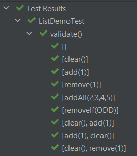
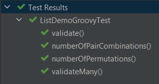
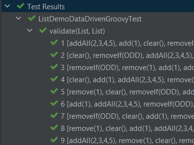
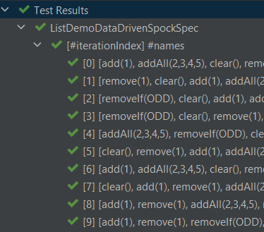

= Groovy Testing with Combinations and Permutations
Paul King
:revdate: 2023-03-19T17:23:00+00:00
:keywords: groovy, combinations, permutations, testing, junit, spock, jqwik, allpairs
:description: This blog looks at testing with Groovy using Combinations and Permutations.

This post is inspired by the recent https://foojay.io/today/[foojay.io] post
https://foojay.io/today/exhaustive-junit5-testing-with-combinations-permutations-and-products/[Exhaustive JUnit5 Testing with Combinations, Permutations and Products]
by
https://foojay.io/today/author/per-minborg/[Per Minborg]
which looks at how we might do more exhaustive testing with a focus on using the
https://github.com/OpenHFT/Chronicle-Test-Framework[Chronicle Test Framework].
Let's look at using that framework, and others, with Groovy. For fun, we'll throw in
a bit of https://www.pairwise.org/[pairwise testing] and
https://jqwik.net/property-based-testing.html[property-based testing].

== Chronicle Test Framework

The
https://github.com/OpenHFT/Chronicle-Test-Framework[Chronicle Test Framework]
is a library for use with JUnit
which supports easy testing of combinations and permutations of
data or actions. It is probably easiest to explain how it might work using an example.
The previously mentioned blog has an example showing how to count the permutations:

[source,groovy]
----
@Test
void numberOfPermutations() {
    assert Combination.of(1, 2, 3, 4, 5, 6)
        .flatMap(Permutation::of)
        .peek{ println it }
        .count() == 1957
}
----

We tweaked it slightly with the `peek` to print out the permutations.
The output looks like this (with a couple of sections elided for brevity):

----
[]
[1]
[2]
[3]
[4]
[5]
[6]
[1, 2]
[2, 1]
[1, 3]
...
[5, 6]
[6, 5]
[1, 2, 3]
[1, 3, 2]
...
[6, 5, 4, 3, 1, 2]
[6, 5, 4, 3, 2, 1]
----

If we have a testing scenario needing lists of numbers, the above generated
lists might be perfect, and we don't need to create 1957 individual manual tests,
which would be a laborious and fragile alternative!

We should note that Groovy has some nice combination and permutation capabilities built in.
Groovy, doesn't by default include the empty case in its permutations, but it's easy enough to add in
ourselves. Here is one way to write the above test in Groovy without requiring any additional dependencies:

[source,groovy]
----
@Test
void numberOfPermutations() {
    var perms = (1..6).subsequences()*.permutations().sum() << []
    assert perms.size() == 1957
}
----

We'll see more examples of the Chronicle Test Framework and Groovy's in-built capabilities later.

== Scenarios for testing

For further background, we encourage you to read the
https://foojay.io/today/exhaustive-junit5-testing-with-combinations-permutations-and-products/[original post].
We'll use the same two scenarios involving testing sequences of
operations on lists to ensure that the lists behave in the same way.
The two scenarios (though we'll mainly focus on the first one) are:

. We'll compare the `LinkedList` and `ArrayList` classes, performing
a series of mutating operations like `clear`, `add` and `remove` on both classes
and check we get the same result.

. We'll expand the first scenario to cover a wider range of lists
also including `CopyOnWriteArrayList`, `Stack`, and `Vector`.

== Scenario 1 with the Chronicle Test Framework

We start by creating a predicate to test for _odd_ numbers,
since one of our operations requires it.
Then we create a list of the operations we want to perform on our lists.

[source,groovy]
----
final Predicate<Integer> ODD = n -> n % 2 == 1

final OPERATIONS = [
    NamedConsumer.of(List::clear, "clear()"),
    NamedConsumer.of(list -> list.add(1), "add(1)"),
    NamedConsumer.of(list -> list.removeElement(1), "remove(1)"),
    NamedConsumer.of(list -> list.addAll(Arrays.asList(2, 3, 4, 5)), "addAll(2,3,4,5)"),
    NamedConsumer.of(list -> list.removeIf(ODD), "removeIf(ODD)")
]
----

This is very similar to the Java versions shown in the previous blog but
has one minor change. We used Groovy's `removeElement` method which is
an alias for `remove`.

NOTE: Java has two overloaded `remove` methods, one for
removing the first element (if found) from a list, the other removing the
element at a particular index. When dealing with lists of integers, you sometimes (as the original blog shows)
need to use casting to disambiguate between these two variants.
Groovy also works with the same casting trick but also provides `removeElement` and
`remoteAt` aliases as an alternative choice to remove the ambiguity. We'll see
examples of `removeAt` a little later.

Now we can define our test:

[source,groovy]
----
@TestFactory
Stream<DynamicTest> validate() {
    DynamicTest.stream(Combination.of(OPERATIONS)
        .flatMap(Permutation::of),
        FormatHelper::toString,
        operations -> {
            ArrayList first = []
            LinkedList second = []
            operations.forEach { op ->
                op.accept(first)
                op.accept(second)
            }
            assert first == second
        })
}
----

This generates test cases for all permutations of our operations.
For each test case, we check that once we have applied all operations in the current permutation,
that the two lists have the same contents.

If you were wondering why we used `NamedConsumer` when defining the `OPERATIONS` earlier,
it is to do with supporting friendly test names when the test is run with various JUnit5-aware test runners.
Here are the first 9 of the 326 tests shown when run in https://www.jetbrains.com/idea/[Intellij IDEA]:

== Scenario 2 with the Chronicle Test Framework

For this scenario, we want to compare results between more list types.
Again, we could manually create additional variants of the above tests
to cater for the comparison between additional list types, but why not
generate those variants without extra manual work.

To do this, we create a list of factories for generating our lists of interest:

[source,groovy]
----
final CONSTRUCTORS = [
    ArrayList, LinkedList, CopyOnWriteArrayList, Stack, Vector
].collect(clazz -> clazz::new as Supplier)
----

We can now create a test just like the original blog which runs
all permutations of the operations on all lists and then checks for each list combination
that the resulting lists are equal:

[source,groovy]
----
@TestFactory
Stream<DynamicTest> validateMany() {
    DynamicTest.stream(Combination.of(OPERATIONS)
        .flatMap(Permutation::of),
        FormatHelper::toString,
        operations -> {
            var lists = CONSTRUCTORS.stream()
                .map(Supplier::get)
                .toList()

            operations.forEach(lists::forEach)

            Combination.of(lists)
                .filter(set -> set.size() == 2)
                .map(ArrayList::new)
                .forEach { p1, p2 -> assert p1 == p2 }
        })
}
----

We can check that our different list combinations are being correctly produced with a test like this:

[source,groovy]
----
@Test
void numberOfPairCombinations() {
    assert Combination.of(CONSTRUCTORS)
        .filter(l -> l.size() == 2)
        .peek { println it*.get()*.class*.simpleName }
        .count() == 10
}
----

We can see that there are 10 pairs with the following types:

----
[ArrayList, LinkedList]
[ArrayList, CopyOnWriteArrayList]
[ArrayList, Stack]
[ArrayList, Vector]
[LinkedList, CopyOnWriteArrayList]
[LinkedList, Stack]
[LinkedList, Vector]
[CopyOnWriteArrayList, Stack]
[CopyOnWriteArrayList, Vector]
[Stack, Vector]
----

At this point, the original blog goes on to warn about the problem of potentially exponentially
large numbers of test cases when calculating permutations across many dimensions or cases.
We'll come back to that shortly, but let's first look at similar tests for these two scenarios
using vanilla Groovy.

== Scenario 1 with vanilla Groovy and JUnit5

We create our list of operations:

[source,groovy]
----
final OPERATIONS = [
    List::clear,
    { list -> list.add(1) },
    { list -> list.removeElement(1) },
    { list -> list.addAll(Arrays.asList(2, 3, 4, 5)) },
    { list -> list.removeIf(ODD) }
]
----

Now we use Groovy's `eachPermutation` method to go through the different permutations:

[source,groovy]
----
@Test
void validate() {
    OPERATIONS.eachPermutation { opList ->
        ArrayList first = []
        LinkedList second = []
        opList.each { op ->
            op(first)
            op(second)
        }
        assert first == second
    }
}
----

== Scenario 2 with vanilla Groovy and JUnit5

Using the same definition for `OPERATIONS` and `CONSTRUCTORS` as previously,
we can write our test as follows:

[source,groovy]
----
@Test
void validateMany() {
    OPERATIONS.eachPermutation { opList ->
        def pairs = CONSTRUCTORS*.get().subsequences().findAll { it.size() == 2 }
        pairs.each { first, second ->
            opList.each { op ->
                op(first)
                op(second)
            }
            assert first == second
        }
    }
}
----

We can double-check the list types in a similar way to before:

[source,groovy]
----
@Test
void numberOfPairCombinations() {
    assert (1..5).subsequences()
        .findAll(l -> l.size() == 2)
        .size() == 10
}
----

Again, there are 10 pair combinations.

The Groovy versions require no additional dependencies but there is one difference.
The pretty formatting of nested results is missing. The JUnit5 run in Intellij
will look like the following:

We can't drill down into the different test subcases within the `validate` and `validateMany` tests.
Let's incorporate that capability with vanilla Groovy and Spock. We'll just show the approach for
Scenario 1, but the same technique could be used for Scenario 2 if we wanted.

== Scenario 1 with Data-driven testing and JUnit5

First, we'll change our list of operations to a map with the key being the
_name_ we saw earlier when we used `NamedConsumer`:

[source,groovy]
----
final OPERATIONS = [
    'clear()'        : List::clear,
    'add(1)'         : { list -> list.add(1) },
    'remove(1)'      : { list -> list.removeElement(1) },
    'addAll(2,3,4,5)': { list -> list.addAll(Arrays.asList(2, 3, 4, 5)) },
    'removeIf(ODD)'  : { list -> list.removeIf(ODD) }
]
----

Now, we'll create a helper method to generate our permutations
including both the friendly name and the operation:

[source,groovy]
----
Stream<Arguments> operationPermutations() {
    OPERATIONS.entrySet().permutations().collect(e -> Arguments.of(e.key, e.value)).stream()
}
----

With these in place, we can change the test to use JUnit5's data-driven
`ParameterizedTest` capability:

[source,groovy]
----
@ParameterizedTest(name = "{index} {0}")
@MethodSource("operationPermutations")
void validate(List<String> names, List<Closure> operations) {
    ArrayList first = []
    LinkedList second = []
    operations.each { op ->
        op(first)
        op(second)
    }
    assert first == second
}
----

Which has this output:

== Scenario 1 with Spock

We also want to illustrate another useful framework, the
https://spockframework.org/[Spock testing framework], which
also supports
https://spockframework.org/spock/docs/2.3/data_driven_testing.html[Data driven testing].

Spock supports a number of different test styles.
Here we are using the _given_, _when_, _then_ style
with the _where_ clause for data-driven testing:

[source,groovy]
----
def "[#iterationIndex] #names"(List<String> names, List<Closure> operations) {
    given:
    ArrayList first = []
    LinkedList second = []

    when:
    operations.each { op ->
        op(first)
        op(second)
    }

    then:
    first == second

    where:
    entries << OPERATIONS.entrySet().permutations()
    (names, operations) = entries.collect{ [it.key, it.value] }.transpose()
}
----

When run, it has this output:

Let's now cover some additional topics.

== AllPairs

The "final warning" in the original post was to be wary of the potential explosion in test
cases that might come about when using combinations and permutations.

The concept of https://www.pairwise.org/[pairwise testing] is a technique designed to
help limit this explosion in cases. It relies on the fact that many bugs surface when
two features interact badly. If we have a test involving five features, then perhaps
we don't need every combination of all five features. It is perhaps easier to see with an example.

Let's add a few more operations and then split them into three groups:
_grow_, _shrink_ and _read_ operations.

[source,groovy]
----
final GROW_OPS = [
    'add(1)': { list -> list.add(1) },
    'addAll([2, 3, 4, 5])': { list -> list.addAll([2, 3, 4, 5]) },
    'maybe add(1)': { list -> if (new Random().nextBoolean()) list.add(1) },
].entrySet().toList()

final SHRINK_OPS = [
    'clear()': List::clear,
    'remove(1)': { list -> list.removeElement(1) },
    'removeIf(ODD)': { list -> list.removeIf(ODD) }
].entrySet().toList()

final READ_OPS = [
    'isEmpty()': List::isEmpty,
    'size()': List::size,
    'contains(1)': { list -> list.contains(1) },
].entrySet().toList()
----

We want test cases which perform a _grow_ operation, followed by a _shrink_ operation,
and then a _read_ operation.
If we wanted to cover all possible combinations, we'd need 27 test cases:

[source,groovy]
----
assert [ADD_OPS, REMOVE_OPS, READ_OPS].combinations().size() == 27
----

Numerous all-pairs libraries exist for numerous languages.
We'll use the
https://github.com/pavelicii/allpairs4j[AllPairs4J] library for Java.

This library has a builder where we specify the parameters of interest
and it then generates the pair-wise combinations. We do a similar test
as before for each of the combinations:

[source,groovy]
----
@Test
void validate() {
    var allPairs = new AllPairs.AllPairsBuilder()
        .withTestCombinationSize(2)
        .withParameter(new Parameter("Add op", ADD_OPS))
        .withParameter(new Parameter("Remove op", REMOVE_OPS))
        .withParameter(new Parameter("Read op", READ_OPS))
        .build()
    allPairs.eachWithIndex { namedOps, index ->
        print "$index: "
        ArrayList first = []
        LinkedList second = []
        var log = []
        namedOps.each{ k, v ->
            log << "$k=$v.key"
            var op = v.value
            op(first)
            op(second)
        }
        println log.join(', ')
        assert first == second
    }
}
----

We used `withTestCombinationSize(2)` to create pair-wise combinations
but the library supports n-wise if we need it. We also used a simple
hand-built log to make it easier to understand what is going on,
but we could have hooked into the data-driven integration points
we saw earlier with JUnit5 and Spock if we wanted.

When we run this test, it has the following output:

----
1: Add op=add(1), Remove op=clear(), Read op=isEmpty()
2: Add op=maybe add(1), Remove op=remove(1), Read op=isEmpty()
3: Add op=addAll([2, 3, 4, 5]), Remove op=removeIf(ODD), Read op=isEmpty()
4: Add op=addAll([2, 3, 4, 5]), Remove op=remove(1), Read op=size()
5: Add op=maybe add(1), Remove op=clear(), Read op=size()
6: Add op=add(1), Remove op=removeIf(ODD), Read op=size()
7: Add op=add(1), Remove op=remove(1), Read op=contains(1)
8: Add op=maybe add(1), Remove op=removeIf(ODD), Read op=contains(1)
9: Add op=addAll([2, 3, 4, 5]), Remove op=clear(), Read op=contains(1)
----

You can see that only 9 tests were produced instead of the 27 combinations needed
for exhaustive testing. To understand what is going on, we need to examine
the output further.

If we look only at the `add(1)` _Add operation_,
we'll see that all three _Remove operations_,
and all three _Read operations_ are covered in tests:

[subs="quotes"]
----
1: [lime]*Add op=add(1)*, [red]*Remove op=clear()*, [blue]*Read op=isEmpty()*
2: Add op=maybe add(1), Remove op=remove(1), Read op=isEmpty()
3: Add op=addAll([2, 3, 4, 5]), Remove op=removeIf(ODD), Read op=isEmpty()
4: Add op=addAll([2, 3, 4, 5]), Remove op=remove(1), Read op=size()
5: Add op=maybe add(1), Remove op=clear(), Read op=size()
6: [lime]*Add op=add(1)*, [red]*Remove op=removeIf(ODD)*, [blue]*Read op=size()*
7: [lime]*Add op=add(1)*, [red]*Remove op=remove(1)*, [blue]*Read op=contains(1)*
8: Add op=maybe add(1), Remove op=removeIf(ODD), Read op=contains(1)
9: Add op=addAll([2, 3, 4, 5]), Remove op=clear(), Read op=contains(1)
----

If we look only at the `maybe add(1)` _Add operation_,
we'll see that all three _Remove operations_,
and all three _Read operations_ are covered:

[subs="quotes"]
----
1: Add op=add(1), Remove op=clear(), Read op=isEmpty()
2: [lime]*Add op=maybe add(1)*, [red]*Remove op=remove(1)*, [blue]*Read op=isEmpty()*
3: Add op=addAll([2, 3, 4, 5]), Remove op=removeIf(ODD), Read op=isEmpty()
4: Add op=addAll([2, 3, 4, 5]), Remove op=remove(1), Read op=size()
5: [lime]*Add op=maybe add(1)*, [red]*Remove op=clear()*, [blue]*Read op=size()*
6: Add op=add(1), Remove op=removeIf(ODD), Read op=size()
7: Add op=add(1), Remove op=remove(1), Read op=contains(1)
8: [lime]*Add op=maybe add(1)*, [red]*Remove op=removeIf(ODD)*, [blue]*Read op=contains(1)*
9: Add op=addAll([2, 3, 4, 5]), Remove op=clear(), Read op=contains(1)
----

If we look only at the `addAll([2, 3, 4, 5])` _Add operation_,
we'll again see that all three _Remove operations_,
and all three _Read operations_ are covered:

[subs="quotes"]
----
1: Add op=add(1), Remove op=clear(), Read op=isEmpty()
2: Add op=maybe add(1), Remove op=remove(1), Read op=isEmpty()
3: [lime]*Add op=addAll([2, 3, 4, 5])*, [red]*Remove op=removeIf(ODD)*, [blue]*Read op=isEmpty()*
4: [lime]*Add op=addAll([2, 3, 4, 5])*, [red]*Remove op=remove(1)*, [blue]*Read op=size()*
5: Add op=maybe add(1), Remove op=clear(), Read op=size()
6: Add op=add(1), Remove op=removeIf(ODD), Read op=size()
7: Add op=add(1), Remove op=remove(1), Read op=contains(1)
8: Add op=maybe add(1), Remove op=removeIf(ODD), Read op=contains(1)
9: [lime]*Add op=addAll([2, 3, 4, 5])*, [red]*Remove op=clear()*, [blue]*Read op=contains(1)*
----

You might wonder, have we reduced our chances of finding bugs by reducing our number of tests
from 27 to 9? If a bug is due to the bad interaction of two features, then no, we still have
all the cases covered. That won't always be true, since obscure bugs might be the result of
more than two features interacting. Hence why the library supports n-wise testing.
In essence, this technique lets you balance the explosion of combinatorial testing
versus the chance of discovering more obscure bugs.

Let's do a quick cross-check to gain some confidence in our 9 test cases.

First, we'll tweak the test to capture exceptions and print out our hand-crafted log at that point.
This is just one way we could handle such exceptions occurring:

[source,groovy]
----
namedOps.each{ k, v ->
    try {
        log << "$k=$v.key"
        var op = v.value
        op(first)
        op(second)
    } catch(ex) {
        println 'Failed on last op of: ' + log.join(', ')
        throw ex
    }
}
----

Now, let's deliberately introduce a bug. We'll replace our second _shrink_ operation
with one that tries to remove the element at index 0 (assuming there is at least one element):

[source,groovy]
----
final SHRINK_OPS = [
    'clear()': List::clear,
//    'remove(1)': { list -> list.removeElement(1) },  // <1>
    'removeAt(0)': { list -> list.removeAt(0) },       // <2>
    'removeIf(ODD)': { list -> list.removeIf(ODD) }
].entrySet().toList()
----
<1> Comment out this operation
<2> Add in this problematic operation

Now, when we run the test we see:

----
> Task :test FAILED
0: Grow op=add(1), Shrink op=clear(), Read op=isEmpty()
1: Grow op=addAll([2, 3, 4, 5]), Shrink op=removeAt(0), Read op=isEmpty()
2: Grow op=maybe add(1), Shrink op=removeIf(ODD), Read op=isEmpty()
3: Failed on last op of: Grow op=maybe add(1), Shrink op=removeAt(0)
----

Here we can see that cases 0, 1 and 2 succeeded.
For case 3, the grow operation, which adds an element randomly half the time, must not have
added anything, and the subsequent attempt to remove the first element failed.
So, even with our small number of test cases, this "bug" was detected.

== Jqwik

Our final example looks at
https://jqwik.net/property-based-testing.html[property-based testing]
and the
https://jqwik.net/[jqwik]
library.

Property-based testing tools also try to do more testing than what can
be easily done (and maintained) with manual tests,
but they don't focus on fully-exhaustive testing per se.
Instead, they focus on generating random test inputs and then checking that certain properties hold.

Frameworks which support _stateful_ property-based testing also allow you to
generate random commands that we can issue on a stateful system
and then check that certain properties hold.

We are going to use jqwik's
https://jqwik.net/docs/current/user-guide.html#stateful-testing[stateful testing]
capabilities in this way.

We start with a similar map of operations (and friendly names) as we've seen before:

[source,groovy]
----
 final OPERATIONS = [
    'clear()'        : List::clear,
    'add(1)'         : { list -> list.add(1) },
    'remove(1)'      : { list -> list.removeElement(1) },
    'addAll(2,3,4,5)': { list -> list.addAll(Arrays.asList(2, 3, 4, 5)) },
    'removeIf(ODD)'  : { list -> list.removeIf(ODD) }
].entrySet().toList()
----

The stateful testing functionality in jqwik
has the concept of action chains which describe how stateful objects
are transformed. In our case, we randomly select one of our operations,
then apply the selected operation
to two lists, and check that the lists contain the same values:

[source,groovy]
----
class MutateAction implements Action.Independent<Tuple2<List, List>> {
    Arbitrary<Transformer<Tuple2<List, List>>> transformer() {
        Arbitraries.of(OPERATIONS).map(operation ->
            Transformer.mutate(operation.key) { list1, list2 ->
                var op = operation.value
                op(list1)
                op(list2)
                assert list1 == list2
            })
    }
}
----

We now specify that we want up to 6 operations in our action chain,
and that we'll start with an ArrayList and a LinkedList
both containing a single element, the Integer 1:

[source,groovy]
----
@Provide
Arbitrary<ActionChain> myListActions() {
    ActionChain.startWith{ Tuple2.tuple([1] as ArrayList, [1] as LinkedList) }
        .withAction(new MutateAction())
        .withMaxTransformations(6)
}
----

The `@Provide` annotation indicates that this method can be used to provide inputs
to tests needing a chain of actions.

Finally, we add our test. For jqwik, this is done using the `@Property` annotation:

[source,groovy]
----
@Property(seed='100001')
void confirmSimilarListBehavior(@ForAll("myListActions") ActionChain chain) {
    chain.run()
}
----

The _seed_ annotation attribute is optional and can be used to obtain repeatable tests.

When we run this test, we'll see that jqwik produced 1000 different sequences of operations
and they all passed:

----
                              |-----------------------jqwik-----------------------
tries = 1000                  | # of calls to property
checks = 1000                 | # of not rejected calls
generation = RANDOMIZED       | parameters are randomly generated
after-failure = SAMPLE_FIRST  | try previously failed sample, then previous seed
when-fixed-seed = ALLOW       | fixing the random seed is allowed
edge-cases#mode = MIXIN       | edge cases are mixed in
edge-cases#total = 0          | # of all combined edge cases
edge-cases#tried = 0          | # of edge cases tried in current run
seed = 100001                 | random seed to reproduce generated values
----

Like before, we can deliberately break our code to convince ourselves
that our tests are doing their job. Let's re-introduce the problematic `removeAt`
operation that we used with all-pairs testing:

[source,groovy]
----
final OPERATIONS = [
        'clear()'        : List::clear,
        'add(1)'         : { list -> list.add(1) },
//        'remove(1)'      : { list -> list.removeElement(1) }, // <1>
        'removeAt(0)'    : { list -> list.removeAt(0) },        // <2>
        'addAll(2,3,4,5)': { list -> list.addAll(Arrays.asList(2, 3, 4, 5)) },
        'removeIf(ODD)'  : { list -> list.removeIf(ODD) }
----
<1> Commented out
<2> Added operation which can potentially break

When we re-run our tests we see:

----
ListDemoDataDrivenJqwikTest:confirmSimilarListBehavior =
  org.opentest4j.AssertionFailedError:
    Run failed after the following actions: [
        clear()
        removeAt(0)
    ]
    final state: [[], []]
    Index 0 out of bounds for length 0

                              |-----------------------jqwik-----------------------
tries = 4                     | # of calls to property
checks = 4                    | # of not rejected calls
generation = RANDOMIZED       | parameters are randomly generated
after-failure = SAMPLE_FIRST  | try previously failed sample, then previous seed
when-fixed-seed = ALLOW       | fixing the random seed is allowed
edge-cases#mode = MIXIN       | edge cases are mixed in
edge-cases#total = 0          | # of all combined edge cases
edge-cases#tried = 0          | # of edge cases tried in current run
seed = 100001                 | random seed to reproduce generated values
...

  Original Error
  --------------
  org.opentest4j.AssertionFailedError:
    Run failed after the following actions: [
        addAll(2,3,4,5)
        add(1)
        clear()
        removeAt(0)
    ]
    final state: [[], []]
    Index 0 out of bounds for length 0
----

There are a few pieces to unpack in this output:

* It produced a "shrunk" sequence exhibiting the error, consisting of the `clear()` and `removeAt(0)` operations. This is an expected error.
* It ran 3 successful other random sequences before failing during the 4th check.
* The generated sequence before shrinking was `addAll(2,3,4,5)`, `add(1)`, `clear()`, and `removeAt(0)`.

== Usage from Java

You can also use Groovy's permutation and combination functionality from Java as the following tests show:

[source,java]
----
@Test                                                         // Java
public void combinations() {
    String[] letters = {"A", "B"};
    Integer[] numbers = {1, 2};
    Object[] collections = {letters, numbers};
    var expected = List.of(
        List.of("A", 1),
        List.of("B", 1),
        List.of("A", 2),
        List.of("B", 2)
    );
    var combos = GroovyCollections.combinations(collections);
    assertEquals(expected, combos);
}

@Test
public void subsequences() {
    var numbers = List.of(1, 2, 3);
    var expected = Set.of(
        List.of(1), List.of(2), List.of(3),
        List.of(1, 2), List.of(1, 3), List.of(2, 3),
        List.of(1, 2, 3)
    );
    var result = GroovyCollections.subsequences(numbers);
    assertEquals(expected, result);
}

@Test
public void permutations() {
    var numbers = List.of(1, 2, 3);
    var gen = new PermutationGenerator<>(numbers);
    var result = new HashSet<>();
    while (gen.hasNext()) {
        List<Integer> next = gen.next();
        result.add(next);
    }
    var expected = Set.of(
        List.of(1, 2, 3), List.of(1, 3, 2),
        List.of(2, 1, 3), List.of(2, 3, 1),
        List.of(3, 1, 2), List.of(3, 2, 1)
    );
    assertEquals(expected, result);
}
----

== Further information

* Sourcecode for this blog post (https://github.com/paulk-asert/groovy-combinations-permutations[GitHub])
* Original blog (https://foojay.io/today/exhaustive-junit5-testing-with-combinations-permutations-and-products/[foojay.io])
* Chronicle Test Framework (https://github.com/OpenHFT/Chronicle-Test-Framework[GitHub])
* AllPairs4J (https://github.com/pavelicii/allpairs4j[GitHub])
* Spock testing framework (https://spockframework.org/[website])
* jqwik (https://jqwik.net/[website])
* Testing With Groovy Slides:
** https://speakerdeck.com/paulk/make-your-testing-groovy?slide=87[All Combinations]
** https://speakerdeck.com/paulk/make-your-testing-groovy?slide=89[All Pairs]
** https://speakerdeck.com/paulk/property-based-testing[Property-based testing]
