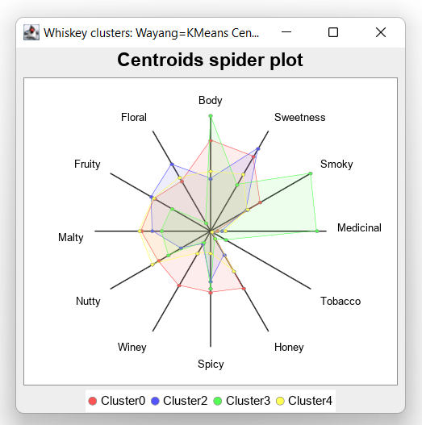

= Using Groovy with Apache Wayang and Apache Spark
Paul King
:source-highlighter: pygments
:pygments-style: emacs
:icons: font
:revdate: 2022-06-19T13:01:07+00:00
:keywords: centroids, data science, groovy, kmeans, records, apache spark, apache wayang
:description: This post looks at using Apache Wayang and Apache Spark with Apache Groovy to cluster various Whiskies.

image:https://www.apache.org/logos/res/wayang/default.png[wayang logo,100,float="right"]
https://wayang.apache.org/[Apache Wayang] (incubating) is an API
for big data cross-platform processing. It provides an abstraction
over other platforms like https://spark.apache.org/[Apache Spark]
and https://flink.apache.org/[Apache Flink] as well as a default
built-in stream-based "platform". The goal is to provide a
consistent developer experience when writing code regardless of
whether a light-weight or highly-scalable platform may eventually
be required. Execution of the application is specified in a logical
plan which is again platform agnostic. Wayang will transform the
logical plan into a set of physical operators to be executed by
specific underlying processing platforms.

== Whiskey Clustering

image:img/groovy_logo.png[groovy logo,140,float="right"]
We'll take a look at using Apache Wayang with Groovy to help us in
the quest to find the perfect single-malt Scotch whiskey.
The whiskies produced from
https://www.niss.org/sites/default/files/ScotchWhisky01.txt[86 distilleries]
have been ranked by expert tasters according to 12 criteria
(Body, Sweetness, Malty, Smoky, Fruity, etc.).
We'll use a KMeans algorithm to calculate the centroids.
This is similar to the
https://github.com/apache/incubator-wayang/blob/main/README.md#k-means[KMeans example in the Wayang documentation]
but instead of 2 dimensions (x and y coordinates), we have 12
dimensions corresponding to our criteria. The main point is that
it is illustrative of typical data science and machine learning
algorithms involving iteration (the typical map, filter, reduce
style of processing).

KMeans is a standard data-science clustering technique. In our
case, it groups whiskies with similar characteristics (according
to the 12 criteria) into clusters. If we have a favourite whiskey,
chances are we can find something similar by looking at other
instances in the same cluster. If we are feeling like a change,
we can look for a whiskey in some other cluster. The centroid
is the notional "point" in the middle of the cluster. For us,
it reflects the typical measure of each criteria for a whiskey
in that cluster.

== Implementation Details

We'll start with defining a Point record:

[source,groovy]
----
record Point(double[] pts) implements Serializable {
    static Point fromLine(String line) { new Point(line.split(',')[2..-1]*.toDouble() as double[]) }
}
----

We've made it `Serializable` (more on that later) and included
a `fromLine` factory method to help us make points from a CSV
file. We'll do that ourselves rather than rely on other libraries
which could assist. It's not a 2D or 3D point for us but 12D
corresponding to the 12 criteria. We just use a `double` array,
so any dimension would be supported but the 12 comes from the
number of columns in our data file.

We'll define a related `TaggedPointCounter` record. It's like
`Point` but tracks an `int` cluster id and `long` count used
when clustering the points:

[source,groovy]
----
record TaggedPointCounter(double[] pts, int cluster, long count) implements Serializable {
    TaggedPointCounter plus(TaggedPointCounter that) {
        new TaggedPointCounter((0..<pts.size()).collect{ pts[it] + that.pts[it] } as double[], cluster, count + that.count)
    }

    TaggedPointCounter average() {
        new TaggedPointCounter(pts.collect{ double d -> d/count } as double[], cluster, 0)
    }
}
----

We have `plus` and `average` methods which will be helpful
later in the map/reduce parts of the algorithm.

Another aspect of the KMeans algorithm is assigning points to the
cluster associated with their nearest centroid. For 2 dimensions,
recalling pythagoras' theorem, this would be the square root of x
squared plus y squared, where x and y are the distance of a point
from the centroid in the x and y dimensions respectively. We'll do
the same across all dimensions and define the following helper
class to capture this part of the algorithm:

[source,groovy]
----
class SelectNearestCentroid implements ExtendedSerializableFunction<Point, TaggedPointCounter> {
    Iterable<TaggedPointCounter> centroids

    void open(ExecutionContext context) {
        centroids = context.getBroadcast("centroids")
    }

    TaggedPointCounter apply(Point p) {
        def minDistance = Double.POSITIVE_INFINITY
        def nearestCentroidId = -1
        for (c in centroids) {
            def distance = sqrt((0..<p.pts.size()).collect{ p.pts[it] - c.pts[it] }.sum{ it ** 2 } as double)
            if (distance < minDistance) {
                minDistance = distance
                nearestCentroidId = c.cluster
            }
        }
        new TaggedPointCounter(p.pts, nearestCentroidId, 1)
    }
}
----

In Wayang parlance, the `SelectNearestCentroid` class is a
_UDF_, a User-Defined Function. It represents some chunk of
functionality where an optimization decision can be made about
where to run the operation.

Once we get to using Spark, the classes in the map/reduce part
of our algorithm will need to be serializable. Method closures
in dynamic Groovy aren't serializable. We have a few options to
avoid using them. I'll show one approach here which is to use
some helper classes in places where we might typically use method
references. Here are the helper classes:

[source,groovy]
----
class Cluster implements SerializableFunction<TaggedPointCounter, Integer> {
    Integer apply(TaggedPointCounter tpc) { tpc.cluster() }
}

class Average implements SerializableFunction<TaggedPointCounter, TaggedPointCounter> {
    TaggedPointCounter apply(TaggedPointCounter tpc) { tpc.average() }
}

class Plus implements SerializableBinaryOperator<TaggedPointCounter> {
    TaggedPointCounter apply(TaggedPointCounter tpc1, TaggedPointCounter tpc2) { tpc1.plus(tpc2) }
}
----

Now we are ready for our KMeans script:

[source,groovy]
----
int k = 5
int iterations = 20

// read in data from our file
def url = WhiskeyWayang.classLoader.getResource('whiskey.csv').file
def pointsData = new File(url).readLines()[1..-1].collect{ Point.fromLine(it) }
def dims = pointsData[0].pts().size()

// create some random points as initial centroids
def r = new Random()
def initPts = (1..k).collect { (0..<dims).collect { r.nextGaussian() + 2 } as double[] }

// create planbuilder with Java and Spark enabled
def configuration = new Configuration()
def context = new WayangContext(configuration)
    .withPlugin(Java.basicPlugin())
    .withPlugin(Spark.basicPlugin())
def planBuilder = new JavaPlanBuilder(context, "KMeans ($url, k=$k, iterations=$iterations)")

def points = planBuilder
    .loadCollection(pointsData).withName('Load points')

def initialCentroids = planBuilder
    .loadCollection((0..<k).collect{ idx -> new TaggedPointCounter(initPts[idx], idx, 0) })
    .withName("Load random centroids")

def finalCentroids = initialCentroids
    .repeat(iterations, currentCentroids ->
        points.map(new SelectNearestCentroid())
            .withBroadcast(currentCentroids, "centroids").withName("Find nearest centroid")
            .reduceByKey(new Cluster(), new Plus()).withName("Add up points")
            .map(new Average()).withName("Average points")
            .withOutputClass(TaggedPointCounter)).withName("Loop").collect()

println 'Centroids:'
finalCentroids.each { c ->
    println "Cluster$c.cluster: ${c.pts.collect{ sprintf('%.3f', it) }.join(', ')}"
}
----

Here, `k` is the desired number of clusters, and `iterations`
is the number of times to iterate through the KMeans loop.
The `pointsData` variable is a list of `Point` instances loaded
from our data file. We'd use the `readTextFile` method instead
of `loadCollection` if our data set was large.
The `initPts` variable is some random starting positions for our
initial centroids. Being random, and given the way the KMeans
algorithm works, it is possible that some of our clusters may
have no points assigned.Our algorithm works by assigning,
at each iteration, all the points to their closest current
centroid and then calculating the new centroids given those
assignments. Finally, we output the results.

== Running with the Java streams-backed platform

As we mentioned earlier, Wayang selects which platform(s) will
run our application. It has numerous capabilities whereby cost
functions and load estimators can be used to influence and
optimize how the application is run. For our simple example,
it is enough to know that even though we specified Java or
Spark as options, Wayang knows that for our small data set,
the Java streams option is the way to go.

Since we prime the algorithm with random data, we
expect the results to be slightly different each time
the script is run, but here is one output:

[source,shell]
----
> Task :WhiskeyWayang:run
Centroids:
Cluster0: 2.548, 2.419, 1.613, 0.194, 0.097, 1.871, 1.742, 1.774, 1.677, 1.935, 1.806, 1.613
Cluster2: 1.464, 2.679, 1.179, 0.321, 0.071, 0.786, 1.429, 0.429, 0.964, 1.643, 1.929, 2.179
Cluster3: 3.250, 1.500, 3.250, 3.000, 0.500, 0.250, 1.625, 0.375, 1.375, 1.375, 1.250, 0.250
Cluster4: 1.684, 1.842, 1.211, 0.421, 0.053, 1.316, 0.632, 0.737, 1.895, 2.000, 1.842, 1.737
...
----

Which, if plotted looks like this:

If you are interested, check out the examples in the repo links
at the end of this article to see the code for producing this
centroid spider plot or the Jupyter/BeakerX notebook in this
project's GitHub repo.

== Running with Apache Spark

image:https://www.apache.org/logos/res/spark/default.png[spark logo,100,float="right"]
Given our small dataset size and no other customization, Wayang
will choose the Java streams based solution. We could use Wayang
optimization features to influence which processing platform it
chooses, but to keep things simple, we'll just disable the Java
streams platform in our configuration by making the following
change in our code:

[source,groovy,highlight=4]
----
...
def configuration = new Configuration()
def context = new WayangContext(configuration)
//    .withPlugin(Java.basicPlugin())                <1>
    .withPlugin(Spark.basicPlugin())
def planBuilder = new JavaPlanBuilder(context, "KMeans ($url, k=$k, iterations=$iterations)")
...
----
<1> Disabled

Now when we run the application, the output will be something like
this (a solution similar to before but with 1000+ extra lines of
Spark and Wayang log information - truncated for presentation purposes):

----
[main] INFO org.apache.spark.SparkContext - Running Spark version 3.3.0
[main] INFO org.apache.spark.util.Utils - Successfully started service 'sparkDriver' on port 62081.
...
Centroids:
Cluster4: 1.414, 2.448, 0.966, 0.138, 0.034, 0.862, 1.000, 0.483, 1.345, 1.690, 2.103, 2.138
Cluster0: 2.773, 2.455, 1.455, 0.000, 0.000, 1.909, 1.682, 1.955, 2.091, 2.045, 2.136, 1.818
Cluster1: 1.762, 2.286, 1.571, 0.619, 0.143, 1.714, 1.333, 0.905, 1.190, 1.952, 1.095, 1.524
Cluster2: 3.250, 1.500, 3.250, 3.000, 0.500, 0.250, 1.625, 0.375, 1.375, 1.375, 1.250, 0.250
Cluster3: 2.167, 2.000, 2.167, 1.000, 0.333, 0.333, 2.000, 0.833, 0.833, 1.500, 2.333, 1.667
...
[shutdown-hook-0] INFO org.apache.spark.SparkContext - Successfully stopped SparkContext
[shutdown-hook-0] INFO org.apache.spark.util.ShutdownHookManager - Shutdown hook called
----

== Discussion

A goal of Apache Wayang is to allow developers to write
platform-agnostic applications. While this is mostly true,
the abstractions aren't perfect. As an example, if I know I
am only using the streams-backed platform, I don't need to worry
about making any of my classes serializable (which is a Spark
requirement). In our example, we could have omitted the
`implements Serializable` part of the `TaggedPointCounter` record,
and we could have used a method reference
`TaggedPointCounter::average` instead of our `Average`
helper class. This isn't meant to be a criticism of Wayang,
after all if you want to write cross-platform UDFs, you might
expect to have to follow some rules. Instead, it is meant to
just indicate that abstractions often have leaks around the edges.
Sometimes those leaks can be beneficially used, other times they
are traps waiting for unknowing developers.

To summarise, if using the Java streams-backed platform, you can
run the application on JDK17 (which uses native records) as well
as JDK11 and JDK8 (where Groovy provides emulated records).
Also, we could make numerous simplifications if we desired.
When using the Spark processing platform, the potential
simplifications aren't applicable, and we can run on JDK8 and
JDK11 (Spark isn't yet supported on JDK17).

== Conclusion

We have looked at using Apache Wayang to implement a KMeans
algorithm that runs either backed by the JDK streams capabilities
or by Apache Spark. The Wayang API hid from us some of the
complexities of writing code that works on a distributed platform
and some of the intricacies of dealing with the Spark platform.
The abstractions aren't perfect, but they certainly aren't hard to
use and provide extra protection should we wish to move between
platforms. As an added bonus, they open up numerous optimization
possibilities.

Apache Wayang is an incubating project at Apache and still has
work to do before it graduates but lots of work has gone on
previously (it was previously known as Rheem and was started
in 2015). Platform-agnostic applications is a holy grail that
has been desired for many years but is hard to achieve.
It should be exciting to see how far Apache Wayang progresses
in achieving this goal.

== More Information

* Repo containing the source code: https://github.com/paulk-asert/groovy-data-science/tree/master/subprojects/WhiskeyWayang[WhiskeyWayang]
* Repo containing similar examples using a variety of libraries including Apache Commons CSV, Weka, Smile, Tribuo and others: https://github.com/paulk-asert/groovy-data-science/tree/master/subprojects/Whiskey[Whiskey]
* A similar example using Apache Spark directly but with a built-in parallelized KMeans from the `spark-mllib` library rather than a hand-crafted algorithm: https://github.com/paulk-asert/groovy-data-science/tree/master/subprojects/WhiskeySpark[WhiskeySpark]
* A similar example using Apache Ignite directly but with a built-in clustered KMeans from the `ignite-ml` library rather than a hand-crafted algorithm: https://github.com/paulk-asert/groovy-data-science/tree/master/subprojects/WhiskeyIgnite[WhiskeyIgnite]
