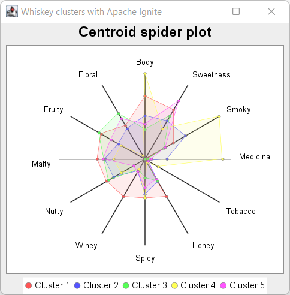

= Whiskey Clustering with Groovy and Apache Ignite
Paul King
:revdate: 2022-10-27T11:13:37+00:00
:keywords: data science, groovy, ignite, kmeans, clustering
:description: This post looks at using Apache Ignite with Apache Groovy and the K-Means algorithm to cluster scotch whiskeys.

In a previous https://groovy.apache.org/blog/using-groovy-with-apache-wayang[blog post],
image:https://www.apache.org/logos/res/ignite/default.png[Ignite logo,150,float="right"] we looked at
using https://wayang.apache.org/[Apache Wayang] (incubating) and
https://spark.apache.org/[Apache Spark] to scale up the
https://en.wikipedia.org/wiki/K-means_clustering[k-means] clustering algorithm.
Let's look at another useful technology for scaling up this problem,
https://ignite.apache.org/[Apache Ignite].
The Ignite team recently released a https://ignite.apache.org/releases/2.14.0/release_notes.html[new version],
but earlier versions are also fine for our example.

Before we start, a quick reminder of the problem.

== Whiskey Clustering

image:img/groovy_logo.png[Groovy logo,200,float="right"]
This problem looks at the quest of finding the perfect single-malt Scotch whiskey. The whiskies produced from https://www.niss.org/sites/default/files/ScotchWhisky01.txt[86 distilleries] have been ranked by expert tasters according to 12 criteria (Body, Sweetness, Malty, Smoky, Fruity, etc.). We'll use a K-means algorithm to calculate the centroids.

image:img/whiskey_bottles.jpg[whiskey_bottles,300,float="right"]
K-means is a standard data-science clustering technique. In our case, it groups whiskies with similar characteristics (according to the 12 criteria) into clusters. If we have a favourite whiskey, chances are we can find something similar by looking at other instances in the same cluster. If we are feeling like a change, we can look for a whiskey in some other cluster. The centroid is the notional "point" in the middle of the cluster. For us, it reflects the typical measure of each criteria for a whiskey in that cluster.

== Apache Ignite

Apache Ignite is a distributed database for high-performance computing with in-memory speed. It makes a cluster (or _grid_) of nodes appear like an in-memory cache.
This explanation drastically simplifies Ignite's feature set. Ignite can be used as:

* an in-memory cache with special features like SQL querying and transactional properties
* an in-memory data-grid with advanced read-through &amp; write-through capabilities on top of one or more distributed databases
* an ultra-fast and horizontally scalable in-memory database
* a high-performance computing engine for custom or built-in tasks including machine learning

It is mostly this last capability that we will use. Ignite's _Machine Learning API_ has purpose built, cluster-aware machine learning and deep learning algorithms for Classification, Regression, Clustering, and Recommendation among others. We'll use the distributed https://ignite.apache.org/docs/latest/machine-learning/clustering/k-means-clustering[K-means Clustering] algorithm from their library.
image:img/apache_ignite_architecture.png[Machine Learning _ Ignite Documentation]

== Implementation Details

Apache Ignite has special capabilities for reading data into the cache. We could use `IgniteDataStreamer` or `IgniteCache.loadCache()` and load data from files, stream sources, various database sources and so forth. This is particularly relevant when using a cluster.

For our little example, our data is in a relatively small CSV file and we will be using a single node, so we'll just read our data using https://commons.apache.org/csv/[Apache Commons CSV]:

[source,groovy]
----
var file = getClass().classLoader.getResource('whiskey.csv').file as File
var rows = file.withReader {r -> RFC4180.parse(r).records*.toList() }
var data = rows[1..-1].collect{ it[2..-1]*.toDouble() } as double[][]

----

We'll configure our single node Ignite data cache using code (but we could place the details in a configuration file in more complex scenarios):

[source,groovy]
----
var cfg = new IgniteConfiguration(
        peerClassLoadingEnabled: true,
        discoverySpi: new TcpDiscoverySpi(
                ipFinder: new TcpDiscoveryMulticastIpFinder(
                        addresses: ['127.0.0.1:47500..47509']
                )
        )
)

----

We'll create a few helper variables:

[source,groovy]
----
var features = ['Body', 'Sweetness', 'Smoky', 'Medicinal', 'Tobacco',
                'Honey', 'Spicy', 'Winey', 'Nutty', 'Malty', 'Fruity', 'Floral']
var pretty = this.&sprintf.curry('%.4f')
var dist = new EuclideanDistance()
var vectorizer = new DoubleArrayVectorizer().labeled(FIRST)

----

Now we start the node, populate the cache, run our k-means algorithm, and print the result.

[source,groovy]
----
Ignition.start(cfg).withCloseable { ignite ->
    println ">>> Ignite grid started for data: ${data.size()} rows X ${data[0].size()} cols"
    var dataCache = ignite.createCache(new CacheConfiguration<Integer, double[]>(
          name: "TEST_${UUID.randomUUID()}",
          affinity: new RendezvousAffinityFunction(false, 10)))
    data.indices.each { int i -> dataCache.put(i, data[i]) }
    var trainer = new KMeansTrainer().withDistance(dist).withAmountOfClusters(5)
    var mdl = trainer.fit(ignite, dataCache, vectorizer)
    println ">>> KMeans centroids:\n${features.join(', ')}"
    var centroids = mdl.centers*.all()
    centroids.each { c -> println c*.get().collect(pretty).join(', ') }
    dataCache.destroy()
}

----

== Results

Here is the output:

----
[18:13:11]    __________  ________________
[18:13:11]   /  _/ ___/ |/ /  _/_  __/ __/
[18:13:11]  _/ // (7 7    // /  / / / _/
[18:13:11] /___/\___/_/|_/___/ /_/ /x___/
[18:13:11]
[18:13:11] ver. 2.14.0#20220929-sha1:951e8deb
[18:13:11] 2022 Copyright(C) Apache Software Foundation
...
[18:13:11] Configured plugins:
[18:13:11]   ^-- ml-inference-plugin 1.0.0
[18:13:14] Ignite node started OK (id=f731e4ab)
...
>>> Ignite grid started for data: 86 rows X 13 cols
>>> KMeans centroids
Body, Sweetness, Smoky, Medicinal, Tobacco, Honey, Spicy, Winey, Nutty, Malty, Fruity, Floral
2.7037, 2.4444, 1.4074, 0.0370, 0.0000, 1.8519, 1.6667, 1.8519, 1.8889, 2.0370, 2.1481, 1.6667
1.8500, 1.9000, 2.0000, 0.9500, 0.1500, 1.1000, 1.5000, 0.6000, 1.5500, 1.7000, 1.3000, 1.5000
1.2667, 2.1333, 0.9333, 0.1333, 0.0000, 1.0667, 0.8000, 0.5333, 1.8000, 1.7333, 2.2667, 2.2667
3.6667, 1.5000, 3.6667, 3.3333, 0.6667, 0.1667, 1.6667, 0.5000, 1.1667, 1.3333, 1.1667, 0.1667
1.5000, 2.8889, 1.0000, 0.2778, 0.1667, 1.0000, 1.2222, 0.6111, 0.5556, 1.7778, 1.6667, 2.0000
[18:13:15] Ignite node stopped OK [uptime=00:00:00.663]
----

We can plot the centroid characteristics in a spider plot.

== More Information

* Repo containing the source code:
https://github.com/paulk-asert/groovy-data-science/tree/master/subprojects/WhiskeyIgnite[WhiskeyIgnite]
* Repo containing similar examples using a variety of libraries including Apache Commons CSV,
Weka, Smile, Tribuo and others:
https://github.com/paulk-asert/groovy-data-science/tree/master/subprojects/Whiskey[Whiskey]
* A similar example using Apache Spark directly but with a built-in parallelized k-means from the spark-mllib library rather than a hand-crafted algorithm:
https://github.com/paulk-asert/groovy-data-science/tree/master/subprojects/WhiskeySpark[WhiskeySpark]
