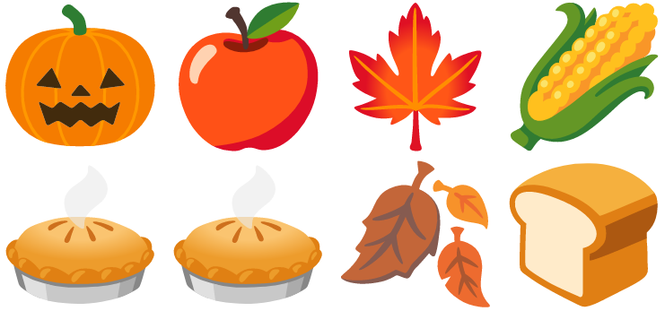
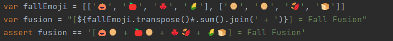
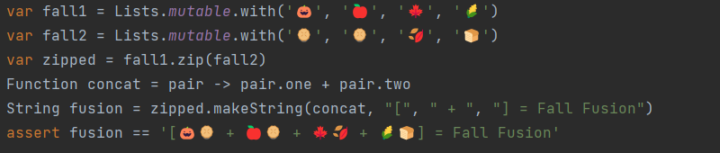
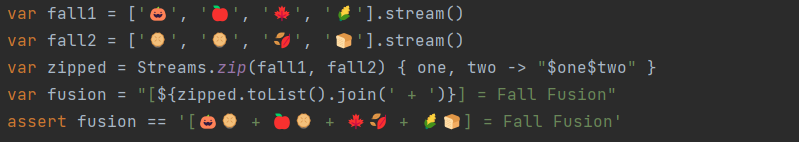
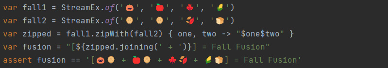
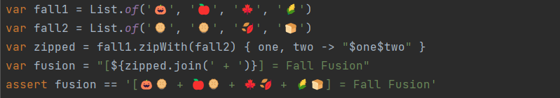
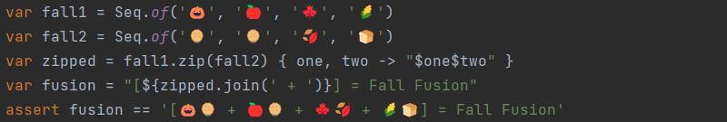
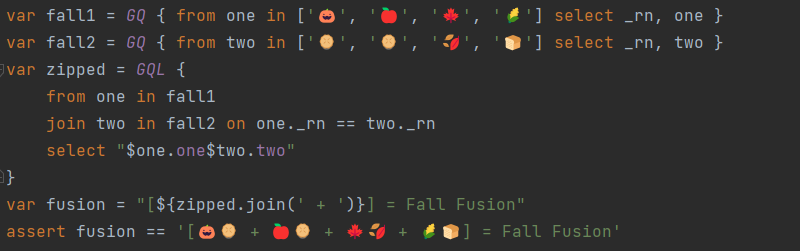

= Zipping Collections with Groovy
Paul King
:revdate: 2022-11-17T12:50:08+00:00
:keywords: groovy, collections, zip, eclipse collections, guava, vavr, streamex, jOOλ, ginq, gquery, emoji
:description: This post looks at zipping collections.

== What is zipping?

In computer science, https://en.wikipedia.org/wiki/Zipping_(computer_science)[zipping] translates sequences into sequences where, if visualized in two dimensions, the rows and columns are swapped. So the zip of:

[source,groovy]
----
[['a', 'b', 'c'],
[ 1 ,  2 ,  3 ]]
----

would be:

[source,groovy]
----
[['a', 1],
['b', 2],
['c', 3]]
----

It's a very handy operation and depending on the language, may be supported for tuples, lists, streams and other sequences or aggregates.

Java collections and streams don't currently support such functionality out-of-the-box with various workarounds discussed https://dzone.com/articles/bridge-the-gap-of-zip-operation[here]. The summary: language and library design is hard; any zip implementation that Java provides would have some limitations baked in, so they instead provide the necessary primitives to allow folks to build their own implementations based on their specific requirements.

We'll look at what Groovy provides and some of the available Java libraries that you can also use. The same caveats apply to these libraries, each will have its own implementation strengths and weaknesses.

We'll use an example inspired by this https://twitter.com/TheDonRaab[Donald Raab] https://donraab.medium.com/make-or-append-me-a-string-c654f247373a[blog post]. It looks at zipping (and formatting) lists of strings containing "fall"-inspired emoji. Yes, it's late spring for the southern hemisphere who also mostly call fall "autumn", but hopefully everyone will appreciate the inspiration.

'''

== Groovy

Groovy uses the `transpose` method for zipping:

== Eclipse Collections

Eclipse Collections has a `zip` method on its list classes:

== Guava

Guava has a streams utility class with a `zip` method:

== StreamEx

StreamEx provides an enhanced stream library which supports `zipWith`:

== Vavr

Vavr has a `zipWith` method on its list class:

== jOOλ

jOOλ has a `zip` method for its sequences:

== Groovy GQuery

If you are a fan of query-like DSLs, Groovy's language integrated query, GQuery (AKA GINQ), can also be used:

This uses a special `_rn` "row number" pre-defined variable in GQ expressions. It follows the same strategy as the IntStream "workaround" for Java mentioned in this https://www.baeldung.com/java-collections-zip[blog].

== More information

The code examples can be found in the https://github.com/paulk-asert/zipping-collections[repo]
