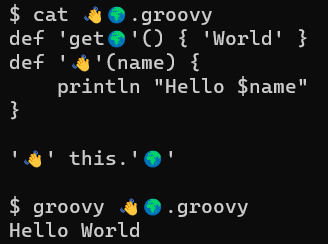

= Hello World with Emojis
Paul King
:revdate: 2023-04-04T12:24:07+00:00
:keywords: groovy, emoji
:description: This post looks at a Groovy hello world with some emoji fun.

In a https://groovy.apache.org/blog/jvm-hello-world-with-groovy[previous blog post]
we took an in-depth look at how to write a "hello world" class at the bytecode level
using various libraries.

Let's go the other way and look at a really fun way to write such a class with
kudos to https://twitter.com/hugs[Jason Huggins] for the https://twitter.com/hugs/status/1642004520874942464[idea]. It's all in the picture:

