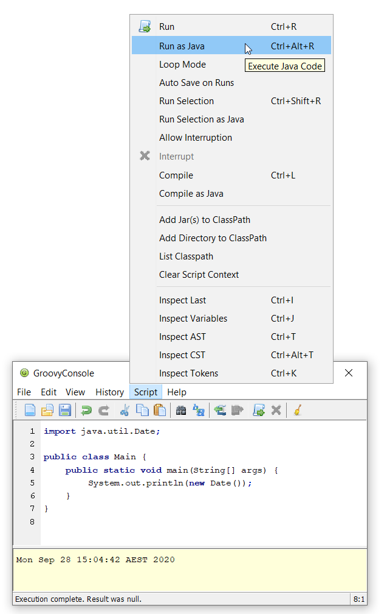

:source-highlighter: pygments
:pygments-style: emacs
:icons: font

Groovy 4 builds upon existing features of earlier versions of Groovy.
In addition, it incorporates numerous new features and streamlines various legacy aspects of the Groovy codebase.

[width="80%",align="center"]
|===
a| NOTE: _WARNING:_
Some features of Groovy 4 are designated as "incubating".
Where appropriate, related classes or APIs of these features may be annotated with the `@Incubating` annotation. +
Caution should be exercised when using incubating features as the details may change
in subsequent versions of Groovy.
We don't recommend using incubating features for production systems.
|===

[[Groovy4.0-naming-changes]]
== Important naming/structuring changes

[[Groovy4.0-maven-coordinates]]
=== Maven coordinate change

In Groovy 4.0, the _groupId_ of the maven coordinates for Groovy have changed from `org.codehaus.groovy`
to `org.apache.groovy`. Please update your Gradle/Maven/other build settings appropriately.

[[Groovy4.0-split-package-renaming]]
=== Legacy package removal

The Java Platform Module System (JPMS) requires that classes in distinct modules
have distinct package names (known as the "split packaging requirement").
Groovy has its own "modules" that weren't
historically structured according to this requirement.

Groovy 3 provided duplicate versions of numerous classes (in old and new packages)
to allow Groovy users to migrate towards the new JPMS compliant package names.
See the link:http://groovy-lang.org/releasenotes/groovy-3.0.html#Groovy3.0releasenotes-Splitpackages[Groovy 3 release notes]
for more details. Groovy 4 no longer provides the duplicate legacy classes.

In short, time to stop using `groovy.util.XmlSlurper` and start using `groovy.xml.XmlSlurper`.
Similarly, you should now be using `groovy.xml.XmlParser`, `groovy.ant.AntBuilder`, `groovy.test.GroovyTestCase`
and the other classes mentioned in the prior mentioned Groovy 3 release notes.

[[Groovy4.0-module-changes]]
=== Module changes for groovy-all

Based on user feedback and download statistics, we rejigged which modules are included in the `groovy-all` pom
(link:https://issues.apache.org/jira/browse/GROOVY-9647[GROOVY-9647]).
The `groovy-yaml` module is fairly widely used and is now included in `groovy-all`.
The `groovy-testng` module is less widely used and is no longer included in `groovy-all`.
Please adjust your build script dependencies if needed.
If you are using the Groovy distribution, no changes are required since it
includes the optional modules.

[[Groovy4.0-new]]
== New features

[[Groovy4.0-switch-expressions]]
=== Switch expressions

Groovy has always had a very powerful switch _statement_, but there are times when
a switch _expression_ would be more convenient.

In switch statements, case branches with fallthrough behavior are usually much rarer
than branches which handle one case and then break out of the switch.
The `break` statements clutter the code as shown here.

[source,groovy]
--------------------------------------
def result
switch(i) {
  case 0: result = 'zero'; break
  case 1: result = 'one'; break
  case 2: result = 'two'; break
  default: throw new IllegalStateException('unknown number')
}
--------------------------------------

A common trick is to introduce a method to wrap the switch.
In simple cases, multiple statements might reduce to a single return statement.
The `break` statements are gone, albeit replaced by `return` statements.

[source,groovy]
--------------------------------------
def stringify(int i) {
  switch(i) {
    case 0: return 'zero'
    case 1: return 'one'
    case 2: return 'two'
    default: throw new IllegalStateException('unknown number')
  }
}

def result = stringify(i)
--------------------------------------

Switch expressions (borrowing heavily from Java) provide a nicer alternative still:

[source,groovy]
--------------------------------------
def result = switch(i) {
    case 0 -> 'zero'
    case 1 -> 'one'
    case 2 -> 'two'
    default -> throw new IllegalStateException('unknown number')
}
--------------------------------------

Here, the right-hand side (following the `\->`) must be a single expression. If multiple statements are needed, a block can be used.
For example, the first case branch from the previous example could be re-written as:

[source,groovy]
--------------------------------------
    case 0 -> { def a = 'ze'; def b = 'ro'; a + b }
--------------------------------------

Switch expressions can also use the traditional `:` form with multiple statements
but in this case, a `yield` statement must be executed.

[source,groovy]
--------------------------------------
def result = switch(i) {
    case 0:
        def a = 'ze'
        def b = 'ro'
        if (true) yield a + b
        else yield b + a
    case 1:
        yield 'one'
    case 2:
        yield 'two'
    default:
        throw new IllegalStateException('unknown number')
}
--------------------------------------

The `\->` and `:` forms cannot be mixed.

All the normal Groovy case expressions are still catered for, e.g.:

[source,groovy]
--------------------------------------
class Custom {
  def isCase(o) { o == -1 }
}

class Coord {
  int x, y
}

def items = [10, -1, 5, null, 41, 3.5f, 38, 99, new Coord(x: 4, y: 5), 'foo']
def result = items.collect { a ->
  switch(a) {
    case null -> 'null'
    case 5 -> 'five'
    case new Custom() -> 'custom'
    case 0..15 -> 'range'
    case [37, 41, 43] -> 'prime'
    case Float -> 'float'
    case { it instanceof Number && it % 2 == 0 } -> 'even'
    case Coord -> a.with { "x: $x, y: $y" }
    case ~/../ -> 'two chars'
    default -> 'none of the above'
  }
}

assert result == ['range', 'custom', 'five', 'null', 'prime', 'float',
                  'even', 'two chars', 'x: 4, y: 5', 'none of the above']
--------------------------------------

Switch expressions are particularly handy for cases where
the visitor pattern might have been traditionally used, e.g.:

[source,groovy]
--------------------------------------
import groovy.transform.Immutable

interface Expr { }
@Immutable class IntExpr implements Expr { int i }
@Immutable class NegExpr implements Expr { Expr n }
@Immutable class AddExpr implements Expr { Expr left, right }
@Immutable class MulExpr implements Expr { Expr left, right }

int eval(Expr e) {
    e.with {
        switch(it) {
            case IntExpr -> i
            case NegExpr -> -eval(n)
            case AddExpr -> eval(left) + eval(right)
            case MulExpr -> eval(left) * eval(right)
            default -> throw new IllegalStateException()
        }
    }
}

@Newify(pattern=".*Expr")
def test() {
    def exprs = [
        IntExpr(4),
        NegExpr(IntExpr(4)),
        AddExpr(IntExpr(4), MulExpr(IntExpr(3), IntExpr(2))), // 4 + (3*2)
        MulExpr(IntExpr(4), AddExpr(IntExpr(3), IntExpr(2)))  // 4 * (3+2)
    ]
    assert exprs.collect { eval(it) } == [4, -4, 10, 20]
}

test()
--------------------------------------

==== Differences to Java

* Currently, there is no requirement that all possible values of the switch target
are covered exhaustively by case branches.
If no `default` branch is present, an
implicit one returning `null` is added.
For this reason, in contexts where `null`
is not desired, e.g.&nbsp;storing the result in a primitive, or constructing
a non-nullable `Optional`, then an explicit `default` should be given, e.g.:
+
[source,groovy]
--------------------------------------
// default branch avoids GroovyCastException
int i = switch(s) {
    case 'one' -> 1
    case 'two' -> 2
    default -> 0
}

// default branch avoids NullPointerException
Optional.of(switch(i) {
    case 1 -> 'one'
    case 2 -> 'two'
    default -> 'buckle my shoe'
})
--------------------------------------
+
In future Groovy versions, or perhaps through tooling like CodeNarc,
we expect to support the stricter checking of exhaustive case branches similar to Java.
This may be implemented automatically when using Groovy's static nature
or via an additional optional type checking extension.
For this reason, developers may wish to not rely on the automatic
default branch returning `null` and instead provide their own default or exhaustively
cover all branches.

[[Groovy4.0-sealed-types]]
=== Sealed types

Sealed classes, interfaces and traits restrict which other classes or interfaces may extend or implement them.
Groovy supports using a `sealed` keyword or a `@Sealed` annotation when writing a sealed type.
The permitted subclasses for a sealed type can be given explicitly
(using a `permits` clause with the `sealed` keyword or a `permittedSubclasses` annotation attribute for `@Sealed`), or automatically detected if compiling the relevant types
all at the same time.
For further details, see (link:https://groovy.apache.org/wiki/GEP-13.html[GEP-13]) and the
Groovy documentation.

As a motivating example, sealed hierarchies can be useful when specifying
Algebraic or Abstract Data Types (ADTs) as shown in the following example
(using the annotation syntax):

[source,groovy]
--------------------------------------
import groovy.transform.*

@Sealed interface Tree<T> {}
@Singleton final class Empty implements Tree {
    String toString() { 'Empty' }
}
@Canonical final class Node<T> implements Tree<T> {
    T value
    Tree<T> left, right
}

Tree<Integer> tree = new Node<>(42, new Node<>(0, Empty.instance, Empty.instance), Empty.instance)
assert tree.toString() == 'Node(42, Node(0, Empty, Empty), Empty)'
--------------------------------------

As another example, sealed types can be useful when creating enhanced enum-like hierarchies. Here is a weather example using the `sealed` keyword:

[source,groovy]
--------------------------------------
sealed abstract class Weather { }
class Rainy extends Weather { Integer rainfall }
class Sunny extends Weather { Integer temp }
class Cloudy extends Weather { Integer uvIndex }
def threeDayForecast = [
    new Rainy(rainfall: 12),
    new Sunny(temp: 35),
    new Cloudy(uvIndex: 6)
]
--------------------------------------

==== Differences to Java

* The `non-sealed` keyword (or `@NonSealed` annotation) isn't required to indicate that
subclasses are open to extension. A future version of Codenarc may have a rule that allows
Groovy developers who wish to follow that Java practice if they desire. Having said that,
keeping restrictions on extension (by using `final` or `sealed`) will lead to more places
where future type checking can check for exhaustive use of types (e.g. switch expressions).
* Groovy uses the `@Sealed` annotation to support sealed classes for JDK8+.
These are known as _emulated_ sealed classes.
Such classes will be recognised as sealed by the Groovy
compiler but not the Java compiler.
For JDK17+, Groovy will write sealed class information into the bytecode.
These are known as _native_ sealed classes.
See the `@SealedOptions` annotation to have further control over whether
emulated or native sealed classes are created.
* Java has requirements around classes within a sealed hierarchy being in the same module or
same package. Groovy currently doesn't enforce this requirement but may do so in a future version.
In particular, it is likely _native_ sealed classes (see previous dot point) will need this requirement.

[width="80%",align="center"]
|===
a| NOTE: _TIP:_
Sealed classes can use the `sealed` (and related) keywords
or the `@Sealed` (and related) annotations.
The keyword style is generally more succinct, however
if you have an editor or other tooling which doesn't yet provide
support for the new keywords, you might prefer the annotation style.
The syntax used for writing your sealed classes doesn't impact whether
_native_ or _emulated_ sealed classes are created.
This is determined solely by the bytecode version and options
given in `@SealedOptions`. Note that it is fine to use `@SealedOptions`
annotation on a class defined using the keyword style.
|===

[width="80%",align="center"]
|===
a| NOTE: _WARNING:_
Sealed classes are an _incubating_ feature.
While we don't expect large changes, some minor details
may change in future Groovy versions.
|===

[[Groovy4.0-new-records]]
=== Records and record-like classes (incubating)

Java 14 and 15 introduced _records_ as a _preview_ feature and for Java 16 records graduated from preview status.
As per this https://www.infoq.com/articles/java-14-feature-spotlight/[records spotlight article],
records "model _plain data aggregates_ with less ceremony".

Groovy has features like the `@Immutable` and `@Canonical` AST transformations which already support
modeling data aggregates with less ceremony, and while these features overlap to some degree
with the design of records, they are not a direct equivalent.
Records are closest to `@Immutable` with a few variations added to the mix.

Groovy 4 adds support for _native_ records for JDK16+ and also for
record-like classes (also known as _emulated_ records) on earlier JDKs.
Record-like classes have all the features of native records but don't have the same information at the
bytecode level as native records, and so won't be recognised as records by a Java compiler in cross-language
integration scenarios.
See the `@RecordOptions` annotation for further control over whether
_emulated_ or _native_ records are created.

Record-like classes look somewhat similar to classes generated when using Groovy's `@Immutable` AST transform.
That transform is itself a meta-annotation (also known as annotation collector)
which combines more fine-grained features. It is relatively simple to provide a record-like re-mix
of those features and that is what Groovy 4 provides with its record implementation.

You can write a record definition as follows:

[source,groovy]
--------------------------------------
record Cyclist(String firstName, String lastName) { }
--------------------------------------

Or in this longer form (which is more or less what the above single-line definition is converted into):

[source,groovy]
--------------------------------------
@groovy.transform.RecordType
class Cyclist {
    String firstName
    String lastName
}
--------------------------------------

And you'd use it as per the following example:

[source,groovy]
--------------------------------------
def richie = new Cyclist('Richie', 'Porte')
--------------------------------------

This produces a class with the following characteristics:

* it is implicitly final
* it has a private final field `firstName` with an accessor method `firstName()`; ditto for `lastName`
* it has a default `Cyclist(String, String)` constructor
* it has a default `serialVersionUID` of 0L
* it has implicit `toString()`, `equals()` and `hashCode()` methods

The `@RecordType` annotation combines the following transforms/marker annotations:

[source,groovy]
--------------------------------------
@RecordBase
@RecordOptions
@TupleConstructor(namedVariant = true, force = true, defaultsMode = DefaultsMode.AUTO)
@PropertyOptions
@KnownImmutable
@POJO
@CompileStatic
--------------------------------------

The `RecordBase` annotation also provides
`@ToString` and `@EqualsAndHashCode` functionality, either delegating
to those transforms or providing special native record equivalents.

We are keen for further feedback on how Groovy users might use
records or record-like structures.

[width="80%",align="center"]
|===
a| NOTE: _TIP:_
You can use the `record` keyword
or the `@RecordType` annotation for either _native_ or _emulated_ records.
The keyword style is generally more succinct, however
if you have an editor or other tooling which doesn't yet provide
support for the new keyword and compact syntax, you might prefer the annotation style.
The syntax used for writing your records doesn't impact whether
_native_ or _emulated_ records are created.
This is determined solely by the bytecode version and options
given in `@RecordOptions`. Note that it is fine to use `@RecordOptions`
annotation on a record defined using the keyword style.
|===

[width="80%",align="center"]
|===
a| NOTE: _WARNING:_
Records are an _incubating_ feature.
While we don't expect large changes, some minor details
may change in future Groovy versions.
|===

[[Groovy4.0-new-checkers]]
=== Built-in type checkers

Groovy's static nature includes an extensible type-checking mechanism.
This mechanism allows users to:

* selectively weaken type checking to allow more dynamic style code to parse static checking, or
* strengthen type checking, allowing Groovy to be much stricter than Java in scenarios where that is desirable

So far, we know this feature has been used internally by companies (e.g. type-checked DSLs),
but we haven't seen widespread sharing of type checker extensions.
From Groovy 4, we bundle some select type checkers within the optional
`groovy-typecheckers` module,
to encourage further use of this feature.

The first inclusion is a checker for regular expressions. Consider the following code:

[source,groovy]
--------------------------------------
def newYearsEve = '2020-12-31'
def matcher = newYearsEve =~ /(\d{4})-(\d{1,2})-(\d{1,2}/
--------------------------------------

This passes compilation but fails at runtime with a `PatternSyntaxException`
since we "accidentally" left off the final closing bracket.
We can get this feedback at compilation time using the new checker as follows:

[source,groovy]
--------------------------------------
import groovy.transform.TypeChecked

@TypeChecked(extensions = 'groovy.typecheckers.RegexChecker')
def whenIs2020Over() {
    def newYearsEve = '2020-12-31'
    def matcher = newYearsEve =~ /(\d{4})-(\d{1,2})-(\d{1,2}/
}
--------------------------------------

Which gives this expected compilation error:

--------------------------------------
1 compilation error:
[Static type checking] - Bad regex: Unclosed group near index 26
(\d{4})-(\d{1,2})-(\d{1,2}
 at line: 6, column: 19
--------------------------------------

As usual, Groovy's compiler customization mechanisms would allow you to
simplify application of such checkers, e.g. make it apply globally
using a compiler configuration script, as just one example.

We welcome further feedback on additional type checker extensions to include within Groovy.

[[Groovy4.0-new-macro-builtins]]
=== Built-in macro methods

Groovy macros were introduced in Groovy 2.5 to make it easier to create AST transforms
and other code which manipulates the compiler AST data structures.
One part of macros, known as macro methods, allows what looks like a global method call
to be replaced with transformed code during compilation.

A bit like type checker extensions, we know this feature has been used in numerous places,
but so far, we haven't seen widespread sharing of macro methods.
From Groovy 4, we bundle some select macro methods within the optional
`groovy-macro-library` module,
to encourage further use of this feature.

The first inclusions assist with old-school debugging (poor man's serialization?).
Suppose during coding you have defined numerous variables:

[source,groovy]
--------------------------------------
def num = 42
def list = [1 ,2, 3]
def range = 0..5
def string = 'foo'
--------------------------------------

Suppose now you want to print those out for debugging purposes.
You could write some appropriate `println` statements and maybe sprinkle in some
calls to `format()`. You might even have an IDE help you do that.
Alternatively, the `SV` and NV` macro methods come to the rescue.

The `SV` macro method creates a String (actually a gapi:groovy.lang.GString)
which contains the variables name and value.
Here is an example:

[source,groovy]
--------------------------------------
println SV(num, list, range, string)
--------------------------------------

which outputs:

--------------------------------------
num=42, list=[1, 2, 3], range=[0, 1, 2, 3, 4, 5], string=foo
--------------------------------------

Here, the `SV` macro method springs into action during the compilation process.
The compiler replaces the apparent global `SV` method call with an expression
which combines the names and `toString()` values of the supplied variables.

Two other variations exist. `SVI` calls Groovy's `inspect()` method rather than
`toString()` and `SVD` calls Groovy's `dump()` method. So this code:

[source,groovy]
--------------------------------------
println SVI(range)
--------------------------------------

produces the following output:

--------------------------------------
range=0..5
--------------------------------------

And this code:

[source,groovy]
--------------------------------------
println SVD(range)
--------------------------------------

yields:

--------------------------------------
range=<groovy.lang.IntRange@14 from=0 to=5 reverse=false inclusiveRight=true inclusiveLeft=true modCount=0>
--------------------------------------

The `NV` macro method provides similar functionality to `SV` but instead of
creating a "string", it creates a gapi:groovy.lang.NamedValue which lets
you further process the name and value information. Here is an example:

[source,groovy]
--------------------------------------
def r = NV(range)
assert r instanceof NamedValue
assert r.name == 'range' && r.val == 0..5
--------------------------------------

There is also a `NVL` macro method which creates a list of `NamedValue` instances.

[source,groovy]
--------------------------------------
def nsl = NVL(num, string)
assert nsl*.name == ['num', 'string']
assert nsl*.val == [42, 'foo']
--------------------------------------

We welcome further feedback on additional macro methods to include within Groovy.
If you do enable this optional module but want to limit which macro methods are enabled,
there is now a mechanism to disable individual macro methods (and extension methods)
link:https://issues.apache.org/jira/browse/GROOVY-9675[GROOVY-9675].

[[Groovy4.0-new-javashell]]
=== JavaShell (incubating)

A Java equivalent of GroovyShell, allowing to more easily work with snippets of Java code.
As an example, the following snippet shows compiling a _record_ (JDK14) and checking its `toString` with Groovy:

[source,groovy]
--------------------------------------
import org.apache.groovy.util.JavaShell
def opts = ['--enable-preview', '--release', '14']
def src = 'record Coord(int x, int y) {}'
Class coordClass = new JavaShell().compile('Coord', opts, src)
assert coordClass.newInstance(5, 10).toString() == 'Coord[x=5, y=10]'
--------------------------------------

This feature is used in numerous places within the Groovy codebase for testing purposes.
Various code snippets are compiled using both Java and Groovy to ensure the compiler is behaving as intended.
We also use this feature to provide a productivity enhancement for polyglot developers allowing
Java code to be compiled and/or run (as Java) from within the Groovy Console:

 +

[[Groovy4.0-new-pojo]]
=== POJO Annotation (incubating)

Groovy supports both dynamic and static natures.
Dynamic Groovy's power and flexibility comes from making (potentially extensive) use of the runtime.
Static Groovy relies on the runtime library much less. Many method calls will have bytecode
corresponding to direct JVM method calls (similar to Java bytecode)
while the Groovy runtime is often bypassed altogether.
But even for static Groovy, hard-links to the Groovy jars remain.
All Groovy classes still implement the `GroovyObject` interface (and so have methods like `getMetaClass` and `invokeMethod`)
and there are some other places which call into the Groovy runtime.

The `@POJO` marker interface is used to indicate that the generated class is more like a plain old Java object
than an enhanced Groovy object. The annotation is currently ignored unless combined with `@CompileStatic`.
For such a class, the compiler won't generate methods typically needed by Groovy, e.g. `getMetaClass()`.
This feature is typically used for generating classes which need to be used with Java or Java frameworks
in situations where Java might become confused by Groovy's "plumbing" methods.

The feature is incubating. Currently, the presence of the annotation should be
treated like a _hint_ to the compiler to produce bytecode not relying on the
Groovy runtime if it can, but _not a guarantee_.

Users of `@CompileStatic` will know that certain dynamic
features aren't possible when they switch to static Groovy.
They might expect that using `@CompileStatic` and `@POJO`
might result in even more restrictions.
This isn't strictly the case.
Adding `@POJO` does result in more Java-like code in certain places,
but numerous Groovy features still work.

Consider the following example. First a Groovy `Point` class:

[source,groovy]
--------------------------------------
@CompileStatic
@POJO
@Canonical(includeNames = true)
class Point {
    Integer x, y
}
--------------------------------------

And now a Groovy `PointList` class:

[source,groovy]
--------------------------------------
@CompileStatic
@POJO
class PointList {
    @Delegate
    List<Point> points
}
--------------------------------------

We can compile those classes using `groovyc` in the normal way
and should see the expected _Point.class_ and _PointList.class_ files produced.

We can then compile the following Java code.
We do not need the Groovy jars available for `javac` or `java`,
we only need the class files produced from the previous step.

[source,java]
--------------------------------------
Predicate<Point> xNeqY = p -> p.getX() != p.getY();  // <1>

Point p13 = new Point(1, 3);
List<Point> pts = List.of(p13, new Point(2, 2), new Point(3, 1));
PointList list = new PointList();
list.setPoints(pts);

System.out.println(list.size());
System.out.println(list.contains(p13));

list.forEach(System.out::println);

long count = list.stream().filter(xNeqY).collect(counting());  // <2>
System.out.println(count);
--------------------------------------
<1> Check whether x not equal to y
<2> Count points where x neq y

Note that while our `PointList` class has numerous list methods available
(`size`, `contains`, `forEach`, `stream`, etc.) courtesy of Groovy's `@Delegate` transform,
these are baked into the class file, and the bytecode produced doesn't call
into any Groovy libraries or rely on any runtime code.

When run, the following output is produced:

--------------------------------------
3
true
Point(x:1, y:3)
Point(x:2, y:2)
Point(x:3, y:1)
2
--------------------------------------

In essence, this opens up the possibility to use Groovy
as a kind of pre-processor similar to https://projectlombok.org/[Lombok] but backed by the Groovy language.

[width="80%",align="center"]
|===
a| NOTE: _WARNING:_
Not all parts of the compiler and not all AST transforms yet know about `POJO`.
Your mileage may vary whether using this approach will or won't require
the Groovy jars to be on the classpath. While we anticipate some improvements over time
allowing more Groovy constructs to work with `@POJO`, we currently make no guarantees that
all constructs will eventually be supported. Hence the incubating status.
|===

[[Groovy4.0-new-contracts]]
=== Groovy Contracts (incubating)

This optional module supports design-by-contract style of programming.
More specifically, it provides contract annotations that support the
specification of class-invariants, pre-conditions, and post-conditions
on Groovy classes and interfaces.
Here is an example:

[source,groovy]
--------------------------------------
import groovy.contracts.*

@Invariant({ speed() >= 0 })
class Rocket {
    int speed = 0
    boolean started = true

    @Requires({ isStarted() })
    @Ensures({ old.speed < speed })
    def accelerate(inc) { speed += inc }

    def isStarted() { started }

    def speed() { speed }
}

def r = new Rocket()
r.accelerate(5)
--------------------------------------

This causes checking logic, corresponding to the contract declarations, to be injected
as required in the classes methods and constructors.
The checking logic will ensure that any pre-condition is satisfied
before a method executes, that any post-condition holds after any method executes
and that any class invariant is true before and after a method is called.

This module replaces the previously external `gcontracts` project which is now archived.

=== GINQ, a.k.a. Groovy-Integrated Query or GQuery (incubating)

GQuery supports querying collections in a SQL-like style.
This could involve lists and/or maps or your own domain objects
or those returned when processing for instance JSON, XML and other
structured data.

[source, sql]
--------------------------------------
from p in persons
leftjoin c in cities on p.city.name == c.name
where c.name == 'Shanghai'
select p.name, c.name as cityName

from p in persons
groupby p.gender
having p.gender == 'Male'
select p.gender, max(p.age)

from p in persons
orderby p.age in desc, p.name
select p.name

from n in numbers
where n > 0 && n <= 3
select n * 2

from n1 in nums1
innerjoin n2 in nums2 on n1 == n2
select n1 + 1, n2
--------------------------------------

Let's look at a complete example. Suppose we have information
in JSON format about fruits, their prices (per 100g) and
the concentration of vitamin C (per 100g).
We can process the JSON as follows:

[source,groovy]
--------------------------------------
import groovy.json.JsonSlurper
def json = new JsonSlurper().parseText('''
{
    "prices": [
        {"name": "Kakuda plum",      "price": 13},
        {"name": "Camu camu",        "price": 25},
        {"name": "Acerola cherries", "price": 39},
        {"name": "Guava",            "price": 2.5},
        {"name": "Kiwifruit",        "price": 0.4},
        {"name": "Orange",           "price": 0.4}
    ],
    "vitC": [
        {"name": "Kakuda plum",      "conc": 5300},
        {"name": "Camu camu",        "conc": 2800},
        {"name": "Acerola cherries", "conc": 1677},
        {"name": "Guava",            "conc": 228},
        {"name": "Kiwifruit",        "conc": 144},
        {"name": "Orange",           "conc": 53}
    ]
}
''')
--------------------------------------

Now, suppose we are on a budget and want to select
the most cost-effective fruits to buy to help us achieve
our daily vitamin C requirements.
We _join_ the _prices_ and _vitC_ information and
order by most cost-effective fruit.
We'll select the top 2 in case our first choice isn't in stock
when we go shopping. We can see, for this data,
Kakadu plums followed by Kiwifruit are our best choices:

[source,groovy]
--------------------------------------
assert GQ {
    from p in json.prices
    join c in json.vitC on c.name == p.name
    orderby c.conc / p.price in desc
    limit 2
    select p.name
}.toList() == ['Kakuda plum', 'Kiwifruit']
--------------------------------------

We can look at the same example again for XML.
Our XML processing code might look something like:

[source,groovy]
--------------------------------------
import groovy.xml.XmlSlurper
def root = new XmlSlurper().parseText('''
<root>
    <prices>
        <price name="Kakuda plum">13</price>
        <price name="Camu camu">25</price>
        <price name="Acerola cherries">39</price>
        <price name="Guava">2.5</price>
        <price name="Kiwifruit">0.4</price>
        <price name="Orange">0.4</price>
    </prices>
    <vitaminC>
        <conc name="Kakuda plum">5300</conc>
        <conc name="Camu camuum">2800</conc>
        <conc name="Acerola cherries">1677</conc>
        <conc name="Guava">228</conc>
        <conc name="Kiwifruit">144</conc>
        <conc name="Orange">53</conc>
    </vitaminC>
</root>
''')
--------------------------------------

Our GQuery code might look like:

[source,groovy]
--------------------------------------
assert GQ {
    from p in root.prices.price
    join c in root.vitaminC.conc on c.@name == p.@name
    orderby c.toInteger() / p.toDouble() in desc
    limit 2
    select p.@name
}.toList() == ['Kakuda plum', 'Kiwifruit']
--------------------------------------

In a future Groovy version we hope to provide GQuery support for SQL databases
where an optimised SQL query is generated based on the GQuery expression
much like Groovy's DataSet functionality.
In the meantime, for small volumes of data, you can use Groovy's standard
SQL capabilities which return queries from the database as collections.
Here is what the code would look like for a database with
`Price` and `VitaminC` tables both having `name` and `per100g` columns:

[source,groovy]
--------------------------------------
// ... create sql connection ...
def price = sql.rows('SELECT * FROM Price')
def vitC = sql.rows('SELECT * FROM VitaminC')
assert GQ {
    from p in price
    join c in vitC on c.name == p.name
    orderby c.per100g / p.per100g in desc
    limit 2
    select p.name
}.toList() == ['Kakuda plum', 'Kiwifruit']
// ... close connection ...
--------------------------------------

More examples could be found in the link:../using-ginq.html[GQuery documentation] (or directly in
link:https://github.com/apache/groovy/blob/master/subprojects/groovy-ginq/src/spec/test/org/apache/groovy/ginq/GinqTest.groovy[the source repo]).

=== TOML Support (incubating)

Support is now available for handling link:https://toml.io/en/[TOML]-based files including building:

[source,groovy]
--------------------------------------
def builder = new TomlBuilder()
builder.records {
    car {
        name 'HSV Maloo'
        make 'Holden'
        year 2006
        country 'Australia'
        homepage new URL('http://example.org')
        record {
            type 'speed'
            description 'production pickup truck with speed of 271kph'
        }
    }
}
--------------------------------------

and parsing:

[source,groovy]
--------------------------------------
def ts = new TomlSlurper()
def toml = ts.parseText(builder.toString())

assert 'HSV Maloo' == toml.records.car.name
assert 'Holden' == toml.records.car.make
assert 2006 == toml.records.car.year
assert 'Australia' == toml.records.car.country
assert 'http://example.org' == toml.records.car.homepage
assert 'speed' == toml.records.car.record.type
assert 'production pickup truck with speed of 271kph' == toml.records.car.record.description
--------------------------------------

More examples could be found in the link:../processing-toml.html[groovy-toml] documentation.

[[Groovy4.0-other]]
== Other improvements

=== GString performance improvements

GString internals were revamped to improve performance.
When safe to do so, GString toString values are now automatically cached.
While infrequently used, GStrings do permit their internal data structures to
be viewed (and even changed!). In such circumstances, caching is disabled.
If you wish to view and not change the internal data structures, you can
call a `freeze()` method in `GStringImpl` to disallow changing of the internal
data structures which allows caching to remain active.
link:https://issues.apache.org/jira/browse/GROOVY-9637[GROOVY-9637]

As an example, the following script takes about 10s to run with Groovy 3 and about 0.1s with Groovy 4:

[source,groovy]
--------------------------------------
def now = java.time.LocalDateTime.now()
def gs = "integer: ${1}, double: ${1.2d}, string: ${'x'}, class: ${Map.class}, boolean: ${true}, date: ${now}"
long b = System.currentTimeMillis()
for (int i = 0; i < 10000000; i++) {
    gs.toString()
}
long e = System.currentTimeMillis()
println "${e - b}ms"
--------------------------------------

=== Enhanced Ranges

Groovy has always supported inclusive, e.g. `3..5`, and exclusive (or open on the right), e.g. `4..<10`, ranges.
From Groovy 4, ranges can be closed, open on the left, e.g. `3<..5`, right or both sides, e.g. `0<..<3`.
The range will exclude the left or right-most values for such ranges.
link:https://issues.apache.org/jira/browse/GROOVY-9649[GROOVY-9649]

=== Support for decimal fraction literals without a leading zero

Groovy has previously required a leading zero for fractional values, but leaving off the leading zero is now also supported.

[source,groovy]
--------------------------------------
def half = .5
def otherHalf = 0.5  // leading zero remains supported
double third = .333d
float quarter = .25f
def fractions = [.1, .2, .3]

// can be used for ranges too (with a rare edge case you might want to avoid)
def range1 = -1.5..<.5    // okay here
def range2 = -1.5.. .5    // space is okay but harder for humans <1>
def range3 = -1.5..0.5    // leading zero edge case <1>
assert range3 == [-1.5, -.5, .5]
--------------------------------------
<1> A fractional value without a leading zero can't appear immediately after the range `..` operator.
The three dots in a row would be confusing and similar to the varargs notation.
You should leave a space (might still be confusing for humans readers) or
retain the leading zero (recommended).

=== JSR308 improvements (incubating)

Groovy has been improving JSR-308 support over recent versions.
In Groovy 4.0, additional support has been added. In particular,
type annotations are now supported on generic types. This is useful
for users of tools like the link:https://jqwik.net/[Jqwik] property-based testing library
and technologies like the link:https://beanvalidation.org/2.0/[Bean Validation 2] framework.
Here is an example of a Jqwik test:

[source,groovy]
--------------------------------------
@Grab('net.jqwik:jqwik:1.5.5')
import net.jqwik.api.*
import net.jqwik.api.constraints.*

class PropertyBasedTests {
    @Property
    def uniqueInList(@ForAll @Size(5) @UniqueElements List<@IntRange(min = 0, max = 10) Integer> aList) {
        assert aList.size() == aList.toSet().size()
        assert aList.every{ anInt -> anInt >= 0 && anInt <= 10 }
    }
}
--------------------------------------

In earlier versions of Groovy, the `@Forall`, `@Size`, and `@UniqueElements` annotations
were handled, but the `@IntRange` annotation on the `List` generic type didn't appear in the
generated bytecode and now does.

Here is a Bean Validation 2 framework example:

[source,groovy]
--------------------------------------
@Grab('org.hibernate.validator:hibernate-validator:7.0.1.Final')
@Grab('org.hibernate.validator:hibernate-validator-cdi:7.0.1.Final')
@Grab('org.glassfish:jakarta.el:4.0.0')
import jakarta.validation.constraints.*
import jakarta.validation.*
import groovy.transform.*

@Canonical
class Car {
    @NotNull @Size(min = 2, max = 14) String make
    @Min(1L) int seats
    List<@NotBlank String> owners
}

def validator = Validation.buildDefaultValidatorFactory().validator

def violations = validator.validate(new Car(make: 'T', seats: 1))
assert violations*.message == ['size must be between 2 and 14']

violations = validator.validate(new Car(make: 'Tesla', owners: ['']))
assert violations*.message.toSet() == ['must be greater than or equal to 1', 'must not be blank'] as Set

violations = validator.validate(new Car(make: 'Tesla', owners: ['Elon'], seats: 2))
assert !violations
--------------------------------------

Again, all annotations except the `@NonBlank` annotation on the `List` generic type
were previously supported, and now `@NonBlank` will appear in the bytecode too.

This feature is marked as incubating. The generated bytecode is not expected to change
but some minor details of the AST representation of the annotations during compilation
may change slightly before the feature leaves incubating status.

In addition, type annotations that appear in code,
e.g. local variable types, cast expression types, catch block exception types,
are still work in progress.

=== AST transformation priorities

The order in which AST transforms are processed is determined first by the `phase`
declared in a transform's `@GroovyASTTransformation` declaration.
For transforms declared to be in the same phase, the order in which the
associated transform annotations appear in the source code is then used.

Now, transformation writers can also specify a priority for their transforms.
To do so, the AST transformation must implement the `TransformWithPriority` interface
and return their priority as an integer in the implemented `priority()` method.
The default priority is `0`. The transformation with the highest positive priority
will be processed first. Negative priorities will be processed after all transformations
with a priority of zero (the default).

Note that transformations are still all processed together. The priority only
affects ordering between other transformations. Other parts of the respective
compiler phase remain unchanged.

[[Groovy4.0-consolidation]]
== Legacy consolidation

[[Groovy4.0-parrot-only]]
=== Old parser removal

Groovy 3 introduced the new "Parrot" parser which supports lambdas, method
references, and numerous other tweaks. In Groovy 3, You could still revert to the old parser
if you wanted. In Groovy 4, the old Antlr2 based parser is removed.
Please use older versions of Groovy if you require the old parser.

[[Groovy4.0-indy-only]]
=== Classic bytecode generation removal

For many versions, Groovy could generate classic _call-site based_ bytecode
or bytecode targeting the JDK7+ invoke dynamic ("indy") bytecode instructions.
You could switch between them with a compiler switch and we had two sets of
jars ("normal" and "-indy") built with and without the switch enabled.
In Groovy 4.0, only bytecode using the latter approach can be generated.
There is now one set of jars and they happen to be indy flavored.

Currently, the Groovy runtime still contains any necessary support for
classes compiled using older versions of Groovy.
Please use Groovy versions up to 3.x if you need to generate the older
style bytecode.

This work was originally planned for Groovy 3.0, but there were numerous places
where "indy" code was noticeably slower than "classic" bytecode.
We have made numerous speed improvements (starting with https://issues.apache.org/jira/browse/GROOVY-8298[GROOVY-8298])
and have some ability to tune internal thresholds (search the code base for
`groovy.indy.optimize.threshold` and `groovy.indy.fallback.threshold`).
That work gave us useful speed improvements, but we welcome further feedback
to help improve overall performance of the indy bytecode.

[[Groovy4.0-breaking]]
== Other breaking changes

* Groovy added some very minor enhancements when using the link:https://javaee.github.io/jaxb-v2/[JAXB technology] in its optional `groovy-jaxb` module. Since JAXB is link:https://openjdk.java.net/jeps/320[no longer bundled in the JDK], we removed this module. Users wanting that functionality are likely able to use the Groovy 3 version of that module with Groovy 4, though we don't guarantee this going forward.
(link:https://issues.apache.org/jira/browse/GROOVY-10005[GROOVY-10005]).
* The optional `groovy-bsf` module provides a Groovy BSF engine for the version 2 of BSF (a.k.a. beanshell) framework. This version hasn't had a release since 2005 and has reached end-of-life. In Groovy 4 we have removed this module. Users wanting that functionality are likely able to use the Groovy 3 version of that module with Groovy 4, though we don't guarantee this going forward.
(link:https://issues.apache.org/jira/browse/GROOVY-10023[GROOVY-10023]).
* Numerous classes previously "leaked" ASM constants which are essentially an internal implementation detail by virtue of
implementing an `Opcodes` interface. This will not normally affect the majority of
Groovy scripts but might impact code which manipulates AST nodes such as AST transforms.
Before compiling with Groovy 4, some of these may need one or more appropriate static import statements added.
AST transforms which extend `AbstractASTTransformation` are one example of potentially affected classes.
(link:https://issues.apache.org/jira/browse/GROOVY-9736[GROOVY-9736]).
* `ASTTest` previously had `RUNTIME` retention but now has `SOURCE` retention.
We know of no users making use of the old retention but are aware of various
issues keeping the old value.
link:https://issues.apache.org/jira/browse/GROOVY-9702[GROOVY-9702]
* Groovy's `intersect` DGM method had a different semantics to other languages
when supplied with a projecting closure/comparator.
Other languages often have a `intersectBy` method in this case rather than overloading the `intersect` operator like Groovy does.
When no projecting function is in play,
`a.intersect(b)` should always equal `b.intersect(a)`.
When a projecting function is in play, most languages define `a.intersect(b)` as
the subset of elements from `a` which when projected match a projected value from `b`.
So the resulting values are always drawn from `a`. The objects involved can be reversed
to draw the elements from `b`. Groovy's semantics used to be the reverse of most
other languages but is now aligned. Some examples with the new behavior:
+
[source,groovy]
----
def abs = { a, b -> a.abs() <=> b.abs() }
assert [1, 2].intersect([-2, -3], abs) == [2]
assert [-2, -3].intersect([1, 2], abs) == [-2]

def round = { a, b -> a.round() <=> b.round() }
assert [1.1, 2.2].intersect([2.5, 3.5], round) == [2.2]
assert [2.5, 3.5].intersect([1.1, 2.2], round) == [2.5]
----
+
Simply reverse the order of the objects to get the previous behavior,
e.g. use `foo.intersect(bar)` instead of `bar.intersect(foo)`.
link:https://issues.apache.org/jira/browse/GROOVY-10275[GROOVY-10275]
* There were some inconsistencies with JavaBean property naming conventions
for various edge cases, e.g. for a field with a name being a single uppercase `X` and having a `getX` accessor,
then the field was given priority over the accessor.
link:https://issues.apache.org/jira/browse/GROOVY-9618[GROOVY-9618]
* Numerous mostly internal data structure classes, e.g. AbstractConcurrentMapBase, AbstractConcurrentMap, ManagedConcurrentMap
were deprecated and their usage replaced with better alternatives.
This should be mostly invisible but some changes might impact users using
internal Groovy classes directly.
link:https://issues.apache.org/jira/browse/GROOVY-9631[GROOVY-9631]
* We bumped our Picocli version. This resulted in minor formatting changes
of some CLI help messages. We recommend not relying on the exact format of such messages.
link:https://issues.apache.org/jira/browse/GROOVY-9627[GROOVY-9627]
* We are currently attempting to improve how Groovy code accesses private fields
in certain scenarios where such access is expected but problematic, e.g. within closure definitions where
subclasses or inner classes are involved
(link:https://issues.apache.org/jira/browse/GROOVY-5438[GROOVY-5438]).
You may notice breakages in Groovy 4 code in such scenarios until this issue is progressed.
As a workaround in the meantime, you may be able to use local variable outside a closure
to reference the relevant fields and then reference those local variables in the closure.
* Earlier Groovy versions unintentionally stored the constants -0.0f and -0.0d to be the same
as 0.0f and 0.0d respectively. This only applied to explicit constants, i.e. it didn't apply
to calculations which resulted in positive or negative zero. This also meant that certain
comparisons of positive and negative zero returned true in cases where they should have
been different, and calling `unique` might have resulted in a set containing just positive zero
instead of both positive and negative zero (the correct answer as per IEEE-745).
Depending on whether you are using primitive or wrapper floating point variants,
you may or may not be affected.
Consider using `equalsIgnoreZeroSign` and the boolean `ignoreZeroSign`
constructor variant to `NumberAwareComparator` if you are affected and desire the old behavior.
These modifications have also been back-ported to Groovy 3, so consider using them in
Groovy 3 code instead of relying on the old behavior so that your code can work
correctly across versions. The fix itself hasn't been back-ported to avoid breaking
existing code relying on the unintended flawed behavior. +
Bug fix:
link:https://issues.apache.org/jira/browse/GROOVY-9797[GROOVY-9797] +
Improved documentation and helper methods:
link:https://issues.apache.org/jira/browse/GROOVY-9981[GROOVY-9981]
* Various Groovy test classes had unnecessary hidden dependencies on JUnit 3/4 classes.
After modification, these classes can now be used with e.g. JUnit 5 (or Spock)
without Junit 3/4 on the classpath. It is a breaking change only if
code is looking explicitly at the class of thrown exceptions
or inspecting the class hierarchy through reflection. +
`NotYetImplemented`:
link:https://issues.apache.org/jira/browse/GROOVY-9492[GROOVY-9492] +
`GroovyAssert`:
link:https://issues.apache.org/jira/browse/GROOVY-9767[GROOVY-9767]
* Several `Sql#call` variants incorrectly throw `Exception` rather than `SQLException`.
This is a binary breaking change. Care should be taken with compiling code relying
on those methods with an older version of Groovy and then running on Groovy 4
and vice versa.
link:https://issues.apache.org/jira/browse/GROOVY-9923[GROOVY-9923]
* We removed `StaticTypeCheckingVisitor#collectAllInterfacesByName`
from our public API as it was buggy and there were numerous alternatives
available. We weren't aware of any framework use of this method.
Even though it was public, it was considered mostly internal.
link:https://issues.apache.org/jira/browse/GROOVY-10123[GROOVY-10123]
* Two jar files (`servlet-api.jar` and `jsp-api.jar`) were notionally "provided" dependencies but were previously
copied into the Groovy binary distribution. This is no longer the case.
link:https://issues.apache.org/jira/browse/GROOVY-9827[GROOVY-9827]
* Groovy code involving `plus` on arrays broke referential transparency
in certain contexts.
The expression `b + c`, where `b` and `c` are arrays,
potentially gave different results in the two expressions `a = b + c` and `b = b + c`.
The latter of these expressions (shorthand for `b += c`) was type preserving
but the former was returned as an Object[]. The type preserving behavior
was the intended one.
link:https://issues.apache.org/jira/browse/GROOVY-6837[GROOVY-6837].
+
[TIP]
====
To mimic the old behavior: If `b` is not an Object array and you desire an Object
array result, then instead of `b + c`, use one of:

* `b.union(c)`
* `new Object[0] + b + c`
* `[] as Object[] + b + c`
====
* Groovy's syntax borrows an "information hiding principal" idea from the Eiffel programming
language whereby accessing a public field or a property (private field with a getter)
can have the same syntactic form. This idea wasn't carried over to the `getProperties()`
method in an object's metaclass. Now `getProperties()` also returns public fields.
link:https://issues.apache.org/jira/browse/GROOVY-10449[GROOVY-10449].

[[Groovy4.0-requirements]]
== JDK requirements

Groovy 4.0 requires JDK16+ to build and JDK8 is the minimum version of the JRE that we support.
Groovy has been tested on JDK versions 8 through 17.

[[Groovy4.0-more-info]]
== More information

You can browse all the link:../changelogs/changelog-4.0.0-unreleased.html[tickets closed for Groovy 4.0 in JIRA].

[[Groovy4.0releasenotes-4.0.2]]
== Addendum for 4.0.2

* Groovy 4 enhanced the metadata stored for its dependencies
using Gradle's module metadata feature. As part of this change,
accessing the `groovy-all` dependency changed in a way that was
confusing for many users. In particular, there was a requirement
to use `platform` that was not required before.
The module metadata has been improved and using `platform` is no longer required.
link:https://issues.apache.org/jira/browse/GROOVY-10543[GROOVY-10543]
* Preliminary JDK19 support has been added
* Groovy optionally supports the use of security policy files
to trigger security exceptions if unpermitted operations are performed
(e.g. reading properties, exiting the JVM or accessing resources like files).
With the Java plan to phase out security policy framework (link:https://openjdk.java.net/jeps/411[JEP-411]), future Groovy versions will likely phase
out this optional support. In the meantime, users could expect warning
messages if using such features and potentially exceptions in JDK 18 or 19.
* Of particular note around security exceptions (see previous point), when using `groovysh` on JDK18 or JDK19, users should set `JAVA_OPTS` to `-Djava.security.manager=allow`. The `groovysh` tool uses a security manager to prohibit calls to `System::exit`. Alternative APIs to deal with this scenario are expected to emerge at some point and `groovysh` will move to those when available.
