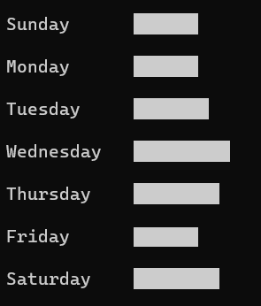

:source-highlighter: pygments
:pygments-style: emacs
:icons: font

Groovy 5 builds upon existing features of earlier versions of Groovy.
In addition, it incorporates numerous new features and streamlines various legacy aspects of the Groovy codebase.

[width="80%",align="center"]
|===
a| NOTE: _WARNING:_
Material on this page is still under development!
We are currently working on alpha versions of Groovy 5.0 with a goal of gathering
feedback on the language changes from our community. In addition, early versions
assist other projects and tool vendors within the Groovy ecosystem to begin assessing
the impact of moving to/supporting Groovy 5.0. Caution should be exercised if using
new features as the details may change before final release. +
&nbsp; +
We don’t recommend using alpha versions or incubating features for production systems.
We don't regard alpha versions as being feature-complete, so caution should be exercised
before undertaking any large scale ports to Groovy 5. Having said that, we don't
expect porting to Groovy 5 from Groovy 4 should involve much effort.
|===

[[Groovy5.0-new]]
== New features

=== Support for `var` with multi-assignment

The `var` keyword can be used in combination with multi-assignment:

[source,groovy]
----
var (x, y) = [1, 2]
assert x == 1 && y == 2
----

=== Scripting alternate forms

https://openjdk.org/jeps/445[JEP 445] (a preview feature for JDK 21) allows certain
Java executable classes to have a shortened form, potentially leaving out the class
declaration and having  a simplified `main` method declaration.
Such classes are still more verbose than Groovy scripts,
but we have provided support for JEP 445 compatible classes in
Groovy 5 to ease support for Java developers using Groovy and provide
a few nice benefits to Groovy developers along the way.

Let's recap the story so far. First, a traditional Java class:

[source,java]
----
public class HelloWorld {                       // Java
    public static void main(String[] args) {
        System.out.println("Hello, World!");
    }
}
----

Next, the Groovy equivalent:

[source,groovy]
----
println 'Hello, World!'
----

What is being proposed for JEP 445 in Java:

[source,java]
----
void main() {                                   // Java future
    System.out.println("Hello, World!");
}
----

What Groovy will also support:

[source,groovy]
----
void main() {
    println 'Hello, World!'
}
----

Obviously, this is longer than the traditional Groovy one-liner script
but has the advantage that we can place annotations on the `main` method.
`TYPE` targeted annotations on the `main` method will be moved to the generated
script class. `METHOD` targeted annotations remain on the method.

Classes created with an instance `main` method (like above) are JEP 445 compatible
classes and will need to be invoked from the JDK with JEP 445 capability enabled
(currently requires enabling preview in JDK21) or using the Groovy runner which
now supports such classes from JDK11+.

For backwards compatibility, classes created with a static `main` method are
_promoted_ to have the normal public static void main signature. They can be run
like normal Java or Groovy classes.

There are variants in Java and Groovy to also have arguments available:

[source,groovy]
----
@CompileStatic
static main(args) {
    println 'Groovy world!'
}
----

JEP 445 compatible classes may also contain other field and method definitions as shown here:

[source,groovy]
----
def main() {
    assert upper(foo) + lower(bar) == 'FOObar'
}

def upper(s) { s.toUpperCase() }

def lower = String::toLowerCase
def (foo, bar) = ['Foo', 'Bar']
----

But they can't contain any other "uncontained" statements, otherwise they
are treated like a normal Groovy script. Another important distinction for JEP 445
compatible classes is that fields (like `lower`, `foo`, and `bar` in the above example)
don't need to be annotated with `@Field`.

An additional form is also supported which involves overwriting the `run` method
in a script. This provides an alternate form to the earlier shown `main` variants.
The difference is that rather than producing a JEP 445 compatible class, Groovy
produces a script class which extends the `Script` class in the normal way and has
access to the normal script binding and context. The use case is again where you
might want to supply annotations, e.g.:

[source,groovy]
----
@JsonIgnoreProperties(["binding"])
def run() {
    var mapper = new ObjectMapper()
    assert mapper.writeValueAsString(this) == '{"pets":["cat","dog"]}'
}

public pets = ['cat', 'dog']
----

=== An Optional Type Checker for Format Strings

The `format` methods in `java.util.Formatter`, and other similar methods,
support formatted printing in the style of C's `printf` method with a
format string and zero or more arguments.

Let's consider an example which produces a string comprised of three terms:

* a floating-point representation (`%f`) of PI (with 2 decimal places of precision),
* the hex representation (`%X`) of 15 (as two uppercase digits with a leading 0),
* and the Boolean (`%B`) `True` (in uppercase).

The assertion checks our expectations:

[source,groovy]
----
assert String.format('%4.2f %02X %B', Math.PI, 15, true) == '3.14 0F TRUE'
----

This is a powerful method supporting numerous conversions and flags.
If the developer supplies incorrect conversions or flags,
they will receive one of numerous possible runtime errors.
As examples, consider the following mistakes and resulting runtime exceptions:

* supplying a String as the parameter for either of the first two arguments results in an
`IllegalFormatConversionException`,
* leaving out the last argument results in a
`MissingFormatArgumentException`,
* supplying the _leading zero_ flag for the Boolean parameter results in a
`FlagsConversionMismatchException`.

The goal of the `FormatStringChecker` is to eliminate
a large number of such runtime errors. If the API call passes type checking,
it will be guaranteed to succeed at runtime.

=== AST transform additions and improvements

There is a new `OperatorRename` AST transform.
This is very useful when using third-party libraries which use different
names to those used by Groovy's operator overloading functionality.
For example, using the Apache Commons Numbers Fraction library:

[source,groovy]
----
@OperatorRename(plus='add')
def testAddOfTwoFractions() {
    var half = Fraction.of(1, 2)
    var third = Fraction.of(1, 3)
    assert half.add(third) == Fraction.of(5, 6)  // old style still works
    assert half + third == Fraction.of(5, 6)     // fraction '+' operator!
}
----

This transform is quite handy when using various matrix packages.
Such packages often align with Groovy's operator overloading conventions
for many, but usually not all, operators.
For instance, you might like to rename:

* `mult` to `multiply` if using Ejml
* `add` to `plus` if using Commons Math matrices
* `sub` to `minus` if using Nd4j matrices

=== Extension method additions and improvements

==== Additional primitive array extensions

There are over 160 additional extension methods on primitive arrays.
Methods like `any`, `chop`, `each`, `eachWithIndex`, `equals`, `every`,
`first`, `head`, `init`, `join`, `last`, `max`, `maxBy`, `maxComparing`,
`min`, `minBy`, `minComparing`, `reverse`, `reverseEach`, `tail`, and `transpose`
now have variants for primitive arrays like `int[]`, `long[]`, `double[]`, etc.
And methods like `flatten` are added for `int[][]`,`long[][]`, etc.

Some examples:

[source,groovy]
----
int[] nums = -3..2
assert nums.any{ it > 1 }
       && nums.every(n -> n < 4)
       && nums.join(' ') == '-3 -2 -1 0 1 2'
       && nums.head() == -3
       && nums.tail() == -2..2
       && nums.max() == 2
       && nums.min{ it.abs() } == 0
       && nums.maxComparing(Comparator.reverseOrder()) == -3
       && nums.reverse() == 2..-3

int[][] matrix = [[1,   2],
                  [10,  20],
                  [100, 200]]
assert matrix.transpose() == [[1, 10, 100],
                              [2, 20, 200]]
----

In some cases, the methods existed for a few of the primitive types but now work with more primitive types.
In numerous cases, the functionality was only available by converting the array to a list first - which was easy but increased memory usage and decreased performance.
For other cases, implementations now avoid un/boxing where possible.
All up this means that Groovy now works better in data science scenarios
allowing more streamlined and performant code.

==== Additional File and Path extensions

There are some additional extension methods for `File` objects:

[source,groovy]
----
def myscript = new File('MyScript.groovy')
assert myscript     // Groovy truth: true if the file exists
assert myscript.extension == 'groovy'
assert myscript.baseName == 'MyScript'
----

And similar methods for `Path` objects:

[source,groovy]
----
def mypic = path.resolve('MyFigure.png')
assert mypic       // Groovy truth: true if the file exists
assert mypic.extension == 'png'
assert mypic.baseName == 'MyFigure'
----

==== Additional Collection extensions

We have added a `flattenMany` method which is a close cousin to the
`collectMany` method. These are Groovy's `flatMap` like methods.

[source,groovy]
----
var items = ["1", "2", "foo", "3", "bar"]
var toInt = s -> s.number ? Optional.of(s.toInteger()) : Optional.empty()
assert items.flattenMany(toInt) == [1, 2, 3]
assert items.flattenMany(String::toList) == ['1', '2', 'f', 'o', 'o', '3', 'b', 'a', 'r']
assert items.flattenMany{ it.split(/[aeiou]/) } == ['1', '2', 'f', '3', 'b', 'r']

assert ['01/02/99', '12/12/23'].flattenMany{ it.split('/') } ==
    ['01', '02', '99', '12', '12', '23']
----

If you are working solely with collections, using `collectMany` will offer
improved type inference with type checked code. If you also want to
flat other things like arrays and optionals, `flattenMany` gives some
added flexibility.

There are additional variants of `collectEntries` for arrays, iterables and iterators
with separate functions for transforming the keys and values. There are variants
with and without collectors.
There are also variants which transform just the key or value.
The `withCollectedKeys` method collects key/value pairs for each item with the
item as the value and the key being the item transformed by the supplied function.
The `withCollectedValues` method collects key/value pairs for each item with the
item as the key and the value being the item transformed by the supplied function.

[source,groovy]
----
def languages = ['Groovy', 'Java', 'Kotlin', 'Scala']

def collector = [clojure:7]
assert languages.collectEntries(collector, String::toLowerCase, String::size) ==
    [clojure:7, groovy:6, java:4, kotlin:6, scala:5]
assert languages.withCollectedKeys(s -> s.take(1)) ==
    [G:'Groovy', J:'Java', K:'Kotlin', S:'Scala']
assert languages.withCollectedValues(s -> s.size()) ==
    [Groovy:6, Java:4, Kotlin:6, Scala:5]
----

There are also equivalent variants for maps. The `collectEntries` method
takes separate functions for transforming the keys and values.
The `collectKeys` and `collectValues` variants take a single function
for transforming just the keys and values respectively.

[source,groovy]
----
def lengths = [Groovy:6, Java:4, Kotlin:6, Scala:5]

assert lengths.collectEntries(String::toLowerCase, { it ** 2 }) ==
    [groovy:36, java:16, kotlin:36, scala:25]
assert lengths.collectKeys{ it[0] } == [G:6, J:4, K:6, S:5]
assert lengths.collectValues(Math.&pow.rcurry(2)) ==
    [Groovy:36.0, Java:16.0, Kotlin:36.0, Scala:25.0]
assert lengths.collectValues(Math.&pow.curry(2).memoize()) ==
    [Groovy:64.0, Java:16.0, Kotlin:64.0, Scala:32.0]
----

There are a number of new extensions for Sets including operator overload
variants:

[source,groovy]
----
var a = [1, 2, 3] as Set
var b = [2, 3, 4] as Set
assert a.union(b) == [1, 2, 3, 4] as Set
assert a.intersect(b) == [2, 3] as Set
assert (a | b) == [1, 2, 3, 4] as Set
assert (a & b) == [2, 3] as Set
assert (a ^ b) == [1, 4] as Set

Set d = ['a', 'B', 'c']
Set e = ['A', 'b', 'D']
assert d.and(e, String.CASE_INSENSITIVE_ORDER) == ['a', 'B'] as Set
assert e.union(d, String.CASE_INSENSITIVE_ORDER) == ['A', 'b', 'D', 'c'] as Set
----

==== Checked collections

Java, being statically typed, tries hard to ensure type safety at compile time
but provides some flexibility to work with objects whose type can only be
checked at runtime. Because of type erasure, Java's runtime checking is curtailed
to some degree. It is not unusual for errant programs to fail, e.g. with a ClassCastException. The issue is the failure may occur
a long way from the part of the code which caused the problem. The CheckedXXX
classes within `java.util.Collections` provide a way to improve type safety and
find such issues at the origin of the problem. When debugging errant code,
one recommendation is to wrap your collections with the checked classes.
Once the error is found and fixed, remove the wrapping code for better performance.

Code using Groovy's dynamic
nature can be even more lenient than Java code, so Groovy can benefit from these
classes even more than Java, so we made them easy to use with an `asChecked`
method added for the common collection types.

[source,groovy]
----
// assume type checking turned off
List<String> names = ['john', 'pete']
names << 'mary' // ok
names << 35     // danger! but unnoticed at this point
println names*.toUpperCase() // fails here
----

In this example, we could turn type checking on for immediate feedback
but in general we might be using a library with less information available
due to type erasure. In any case, we can use `asChecked` to fail early:

[source,groovy]
----
// assume type checking turned off
List<String> names = ['john', 'pete'].asChecked(String)
names << 'mary' // ok
names << 35     // boom! fails early
----

[[Groovy5.0-other]]
== Other improvements

=== Underscore as a placeholder

The use of "_" (underscore) as a placeholder for unused parameters is earmarked
for inclusion in future Java versions (see "Treatment of underscores" in https://openjdk.java.net/jeps/302[JEP 302: Lambda Leftovers]).
This is available in Groovy 5. Some examples:

[source,groovy]
----
// unused components in multi-assignment
var (_, y, m, _, _, d) = Calendar.instance
println "Today is $y-${m+1}-$d" // Today is 2023-8-23

// unused lambda parameters
def c = (_, _, a, b) -> a + b
def d = (_, a, _, b) -> a + b
def e = (_, a, b, _) -> a + b
assert c(1000, 100, 10, 1) == 11
assert d(1000, 100, 10, 1) == 101
assert e(1000, 100, 10, 1) == 110

// unused closure parameters
def f = { a, _, _, b -> a + b }
def g = { a, _, b, _ -> a + b }
def h = { a, b, _, _ -> a + b }
assert f(1000, 100, 10, 1) == 1001
assert g(1000, 100, 10, 1) == 1010
assert h(1000, 100, 10, 1) == 1100
----

=== Miscellaneous enhancements

There is now a utility method to produce simple ascii-art barcharts. The following code:

[source,groovy]
----
['Sunday', 'Monday', 'Tuesday', 'Wednesday', 'Thursday', 'Friday', 'Saturday'].each {
    println "\n${it.padRight(12)}${bar(it.size(), 0, 10, 10)}"
}
----

produces this image:

[[Groovy5.0-ongoing]]
== Ongoing work

=== Enhanced switch (under investigation)

Groovy has always had a very powerful switch statement.
The statement could be made more powerful, e.g. support destructuring,
and could be supported in contexts where expressions are expected.

As inspiration, Java has made, or is investigating future enhancements
including switch expressions and other related enhancements:
link:https://openjdk.java.net/jeps/354[JEP 354: Switch Expressions (Second Preview)]
link:https://openjdk.java.net/jeps/361[JEP 361: Switch Expressions]
link:https://openjdk.java.net/jeps/405[JEP 405: Record Patterns & Array Patterns (Preview)]
link:https://openjdk.java.net/jeps/406[JEP 406: Pattern Matching for switch (Preview)]
We should investigate these proposals both in terms of enhancing the existing Groovy switch
but also in terms of deciding which syntax from Java we might like to support in the future.

Other languages like Python are also improving their switch statements:
https://www.python.org/dev/peps/pep-0622/[PEP 622 -- Structural Pattern Matching].
We should investigate whether any features of their design make sense for Groovy's dynamic nature.

As an example of destructuring, instead of the following existing code:

[source,groovy]
--------------------------------------
def make3D(pt) {
    switch(pt) {
        case Point3D:
            return pt
        case Point2D:
            return new Point3D(pt.x, pt.y, 0)
        case List:
            def (x, y, z) = pt
            if (x == 0 && y == 0 && z == 0)
                throw new IllegalArgumentException("Origin not allowed")
            return new Point3D(x, y, z)
            ...
    }
}
--------------------------------------

You could potentially use something like:

[source,groovy]
--------------------------------------
def make3D(pt) {
    switch(pt) {
        case Point3D:
            return pt
        case Point2D(x, y):
            return new Point3D(x, y, 0)
        case [0, 0, 0]:
            throw new IllegalArgumentException("Origin not allowed")
        case [x, y, z]:
            return new Point3D(x, y, z)
            ...
    }
}
--------------------------------------

An example of guarded patterns being considered for Java:

[source,java]
--------------------------------------
static void testTriangle(Shape s) {
    switch (s) {
        case null ->
            System.out.println("Null!");
        case Triangle t when t.calculateArea() > 100 ->
            System.out.println("Large triangle");
        case Triangle t ->
            System.out.println("Small triangle");
        default ->
            System.out.println("Non-triangle");
    }
}
--------------------------------------

Another destructuring example:

[source,java]
--------------------------------------
int eval(Expr n) {
     return switch(n) {
         case IntExpr(int i) -> i;
         case NegExpr(Expr n) -> -eval(n);
         case AddExpr(Expr left, Expr right) -> eval(left) + eval(right);
         case MulExpr(Expr left, Expr right) -> eval(left) * eval(right);
         default -> throw new IllegalStateException();
     };
}
--------------------------------------

We should consider the currently proposed nested record pattern when exploring our
destructuring options, e.g.:

[source,java]
--------------------------------------
static void printColorOfUpperLeftPoint(Rectangle r) {
    if (r instanceof Rectangle(ColoredPoint(Point p, Color c), ColoredPoint lr)) {
        System.out.println(c);
    }
}
--------------------------------------

=== Other Java-inspired enhancements

* Module definitions written in Groovy (i.e. module-info.groovy)
link:https://issues.apache.org/jira/browse/GROOVY-9273[GROOVY-9273]

[[Groovy5.0-breaking]]
== Other breaking changes

* Scripts containing a static `main` method and no statements outside that method have changed slightly
for improved JEP 445 compatibility. The script class for such methods no longer extends `Script` and
hence no longer has access to the script context or bindings. For many such scripts, access to the
binding isn't needed and there is now a simpler structure for those scripts. Scripts which need access
to the binding should instead use a no-arg instance `run` method.
(link:https://issues.apache.org/jira/browse/GROOVY-11118[GROOVY-11118])
* The `getProperty` method allows for getting properties that don't exist within a class.
Previously, static properties from an outer class were given priority over overrides
by `getProperty`. This is in conflict with the priority given to outer classes in other places.
(link:https://issues.apache.org/jira/browse/GROOVY-10985[GROOVY-10985])
* The minus operator for sets in Groovy was subject to an existing
https://bugs.openjdk.org/browse/JDK-6394757[JDK bug]
in the JDK's `AbstractSet#removeAll` method. The behavior now conforms
with the behavior of the fix being proposed for that bug.
If for some strange reason you rely on the buggy behavior, you can use
the `removeAll` method directly rather than the `minus` operator (at least until it is fixed in the JDK).
(link:https://issues.apache.org/jira/browse/GROOVY-10964[GROOVY-10964])
* Groovy 4 had a `$getLookup` method used to work around stricter JPMS access requirements.
Groovy no longer needs this hook. This method is not normally visible or of use to
typical Groovy users but if framework writers are making use of that hook,
they should rework their code.
(link:https://issues.apache.org/jira/browse/GROOVY-10931[GROOVY-10931])
* Groovy was incorrectly setting a null default value for annotations
without a default value. If framework writers have made use of,
or coded around the buggy behavior, they may need to rework their code.
It might mean simplification by removing a workaround.
(link:https://issues.apache.org/jira/browse/GROOVY-10862[GROOVY-10862])
* Some Groovy AST transform annotations, like `@ToString` were given
`RUNTIME` retention even though Groovy itself and typical Groovy user
behavior never needs access to that annotation at runtime. This was
done with a view that perhaps some future tools or framework might
be able to use that information in some useful way. We know of no such
frameworks or tools, so we have changed the retention to `SOURCE` to
give cleaner class files.
(link:https://issues.apache.org/jira/browse/GROOVY-10862[GROOVY-10862])
* Groovy's `%` operator is called the "remainder" operator. Informally,
it is also known as the "mod" operator and indeed, for operator overloading
purposes we have historically used the `mod` method. While this name is in
part just a convention, it can cause some confusion, since for example,
the `BigInteger` class has both `remainder` and `mod` methods and
our behavior, like Java's, follows the behavior of the `remainder` method.
In Groovy 5, operator overloading for `%` is now handled by the `remainder` method.
Fallback behavior is supported and workarounds exist for folks already using the `mod` method.
(link:https://issues.apache.org/jira/browse/GROOVY-10800[GROOVY-10800])
* Improvements have been made to better align how method selection
is performed between the dynamic Groovy runtime and with static compilation.
(link:https://issues.apache.org/jira/browse/GROOVY-8788[GROOVY-8788])
* In earlier versions of Groovy,
the compiler was lenient when finding duplicate imports or an import
and a similarly-named class definition.
While having duplicates was considered _poor style_, the compiler followed the
lenient behavior of letting the last definition "win", ignoring earlier definitions.
E.g. for two imports (Groovy 1-4):
+
[source,groovy]
----
import java.util.Date
import java.sql.Date

println Date // => class java.sql.Date
----
+
or an import and a class definition (Groovy 1-4):
+
[source,groovy]
----
import java.sql.Date
class Date { }

println Date // => class Date
----
+
or a regular import and an alias import (Groovy 1-4):
+
[source,groovy]
----
import java.util.Date
import java.util.Calendar as Date // don't do this!

println Date // => class java.util.Calendar
----
From Groovy 5, the compiler now follows Java behavior and gives an error in such cases
(link:https://issues.apache.org/jira/browse/GROOVY-8254[GROOVY-8254]). A slightly more
lenient approach is taken when using `groovysh`. For the `groovysh` repl, a newly entered
import is deemed to override an old import with the same simple name,
with the old import being discarded (link:https://issues.apache.org/jira/browse/GROOVY-11224[GROOVY-11224]).
* Improvements have been made to improve consistency when accessing fields within Map-like classes.
(link:https://issues.apache.org/jira/browse/GROOVY-6144[GROOVY-6144],
link:https://issues.apache.org/jira/browse/GROOVY-5001[GROOVY-5001])

[[Groovy5.0-requirements]]
== JDK requirements

Groovy 5 requires JDK16+ to build and JDK11 is the
minimum version of the JRE that we support.
Groovy 5 has been tested on JDK versions 11 through 20.

[[Groovy5.0-more-info]]
== More information

You can browse all the link:../changelogs/changelog-5.0.0-unreleased.html[tickets closed for Groovy 5.0 in JIRA].
