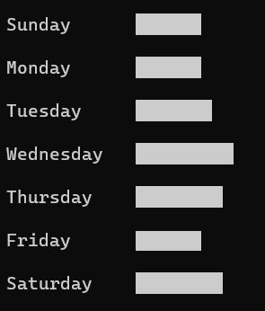

:source-highlighter: pygments
:pygments-style: emacs
:icons: font

:orange: pass:[]
:yellow: pass:[]
:end: pass:[]

Groovy 5 builds upon existing features of earlier versions of Groovy.
In addition, it incorporates numerous new features and streamlines various legacy aspects of the Groovy codebase.

[width="80%",align="center"]
|===
a| NOTE: _WARNING:_
Material on this page is still under development!
We are currently working on beta versions of Groovy 5.0 with a goal of gathering
feedback on the language changes from our community.
Be careful using beta versions or incubating features for production systems.
We don't regard beta versions as being feature-complete, so caution should be exercised
before undertaking any large scale ports to Groovy 5. Having said that, we don't
expect porting to Groovy 5 from Groovy 4 should involve much effort.
|===

[[Groovy5.0-new]]
== Additional Scripting Variations

https://openjdk.org/jeps/512[JEP 512], targeted for JDK25
(and previewed in earlier JDKs:
https://openjdk.org/jeps/445[JEP 445]
https://openjdk.org/jeps/463[JEP 463]
https://openjdk.org/jeps/477[JEP 477]
https://openjdk.org/jeps/495[JEP 495]
),
introduces a new `main` method signature and compact source notation for Java classes.
Groovy 5 supports this new notation, as well as Groovy's traditional scripts,
and an alternative abbreviated form.

Let's recap the story so far. First, a traditional (Java) class:

[source,java]
----
public class HelloWorld {                       // Java (also Groovy)
    public static void main(String[] args) {
        System.out.println("Hello, World!");
    }
}
----

Second, a traditional Groovy script:

[source,groovy]
----
println 'Hello, World!'
----

Groovy scripts are given implicit `main` and `run` methods and an implicit class definition.
Variable declarations in scripts are local variable declarations in the implicit `run` method
unless annotated with `@Field`, in which case they become field definitions of the implicit class.

Third, the "instance main" method proposed for JEP 512 in Java with an implicit class definition:

[source,java]
----
void main() {                                   // Java JDK25 (also Groovy 5+)
    IO.println("Hello, World!");
}
----

Variants with arguments are also supported as are "static main" methods.

Groovy supports such methods on JDK11+ and supports some slight simplifications:

[source,groovy]
----
def main() {
    println 'Hello, World!'
}
----

Finally, Groovy also provides an "instance run" method as an alternative form:

[source,groovy]
----
def run() {
    println 'Hello, World!'
}
----

You may wonder why Groovy supports the JEP 512 notation when the traditional Groovy script
is shorter? Firstly, there is Java compatibility, but also there are scenarios where we might like
to use method or class annotations, and that is hard to do for an implicit method or an implicit class.

`TYPE` targeted annotations on the `main` or `run` method will be moved to the generated
script class. `METHOD` targeted annotations remain on the method.

Classes created with an "instance main" method (like above) are JEP 512 compatible
classes and will need to be invoked from the JDK with JEP 512 capability enabled
or using the Groovy runner which now supports such classes from JDK11+.

For backwards compatibility, classes created with a static `main` method are
_promoted_ to have the normal public static void main signature. They can be run
like normal Java or Groovy classes.

There are variants in Java and Groovy to also have arguments available:

[source,groovy]
----
@CompileStatic
static main(args) {
    println 'Groovy world!'
}
----

JEP 512 compatible classes may also contain other field and method definitions as shown here:

[source,groovy]
----
def main() {
    assert upper(foo) + lower(bar) == 'FOObar'
}

def upper(s) { s.toUpperCase() }

def lower = String::toLowerCase
def (foo, bar) = ['Foo', 'Bar']
----

But they can't contain any other "uncontained" statements, otherwise they
are treated like a normal Groovy script. Another important distinction for JEP 512
compatible classes is that fields (like `lower`, `foo`, and `bar` in the above example)
don't need to be annotated with `@Field`.

An additional form is also supported which involves supplying a `run` method
instead of a `main` method.
This provides an alternate form to the earlier shown `main` variants.
The difference is that rather than producing a JEP 512 compatible class, Groovy
produces a script class which extends the `Script` class in the normal way and has
access to the normal script binding and context. The use case is again where you
might want to supply annotations, e.g.:

[source,groovy]
----
@JsonIgnoreProperties(["binding"])
def run() {
    var mapper = new ObjectMapper()
    assert mapper.writeValueAsString(this) == '{"pets":["cat","dog"]}'
}

public pets = ['cat', 'dog']
----

To summarise:

* If you need access to the script binding or context, write a traditional class that extends the `Script` class,
or a traditional Groovy script, or use the `run` method.
* If you use the supported `main` or `run` method variants, you can have field definitions and other methods,
and you don't need `@Field`. Consider these if you don't like `@Field` or you want to use annotations on the
implicit class or the main/run method.
* If your source file has any statements outside methods that aren't field declarations,
it will be treated as a traditional Groovy script.
* Use the "instance main" method variant if you want the generated bytecode to follow JEP 512 conventions.
You will need JDK25+ to run from Java, or JDK11+ to run from Groovy.

== Improved Web Content Creation

=== Jakarta EE support

The `groovy-servlet` module supports:

* Writing servlets as Groovy scripts (_Groovlets_), e.g.:
+
[source,groovy]
----
html.html {
    head {
         title 'My first Groovlet'
    }
    body { h1 'Welcome to Groovlets!' }
}
----
* Writing servlets as Groovy classes (typically extending `AbstractHttpServlet`)
* Writing Template-style, JSP-like _Groovy Server Pages_ which combine (typically) HTML with Groovy control-logic within special tags

Groovy 5 defaults to Jakarta EE versions of the Servlet-related standards.
This mostly involves using versions of the underlying classes with different
package names.

When writing Groovlets or GSPs, the change in package name might not be apparent,
since for simple examples, like the one shown above, the package names don't appear, but the underlying classes being used would change.
If you are using Groovylets, your transition to Jakarta EE should be a little
easier.

You can still obtain the older Javax EE versions of the relevant classes using
the "javax" classifier when specifying your dependency on `groovy-servlet`.

== Improved Type Checking

Groovy's type checking is extensible. This allows you to weaken or strengthen
type checking. In Groovy 5, we've added a type checker for format strings.
Errors in such strings are often not detected until runtime, but now you
can check them at compile time. It adds to the existing regex checking
capabilities.

=== An Optional Type Checker for Format Strings

The `format` methods in `java.util.Formatter`, and other similar methods,
support formatted printing in the style of C's `printf` method with a
format string and zero or more arguments.

Let's consider an example which produces a string comprised of three terms:

* a floating-point representation (`%f`) of PI (with 2 decimal places of precision),
* the hex representation (`%X`) of 15 (as two uppercase digits with a leading 0),
* and the Boolean (`%B`) `True` (in uppercase).

The assertion checks our expectations:

[source,groovy]
----
assert String.format('%4.2f %02X %B', Math.PI, 15, true) == '3.14 0F TRUE'
----

This is a powerful method supporting numerous conversions and flags.
If the developer supplies incorrect conversions or flags,
they will receive one of numerous possible runtime errors.
As examples, consider the following mistakes and resulting runtime exceptions:

* supplying a String as the parameter for either of the first two arguments results in an
`IllegalFormatConversionException`,
* leaving out the last argument results in a
`MissingFormatArgumentException`,
* supplying the _leading zero_ flag for the Boolean parameter results in a
`FlagsConversionMismatchException`.

The goal of the `FormatStringChecker` is to eliminate
a large number of such runtime errors. If the API call passes type checking,
it will be guaranteed to succeed at runtime.

== AST transform additions and improvements

=== Making Operators More Groovy

There is a new `OperatorRename` AST transform.
This is very useful when using third-party libraries which use different
names to those used by Groovy's operator overloading functionality.
For example, using the Apache Commons Numbers Fraction library:

[source,groovy]
----
@OperatorRename(plus='add')
def testAddOfTwoFractions() {
    var half = Fraction.of(1, 2)
    var third = Fraction.of(1, 3)
    assert half.add(third) == Fraction.of(5, 6)  // old style still works
    assert half + third == Fraction.of(5, 6)     // fraction '+' operator!
}
----

This transform is quite handy when using various matrix packages.
Such packages often align with Groovy's operator overloading conventions
for many, but usually not all, operators.
For instance, you might like to rename:

* `mult` to `multiply` if using Ejml
* `add` to `plus` if using Commons Math matrices
* `sub` to `minus` if using Nd4j matrices

Groovy has excellent support for writing Domain Specific Languages (DSLs),
but using the `@OperatorRename` transform means we can skip constructing our own DSL in simple cases.

=== Additional type safety for generated map constructors and copyWith methods

Groovy provides named parameter support through a convention of using a Map as the first parameter
for a Groovy or Java method. Such methods annotated with `@NamedParam` allow
Groovy's static compiler to provide full compile-time type safety including detecting unknown arguments.
Good IDEs will also provide auto-completion and checking for such methods.

Groovy has a couple of dozen methods annotated in this way and also automatically generates
such annotations already when using the `@NamedVariant` annotation or for records.
With Groovy 5, the `@NamedParam` annotation is now also added automatically when using
`@MapConstructor` (used by `@Immutable` and `@Canonical`) and the `copyWith` option for `@Immutable`.

[source,groovy]
----
@Immutable(copyWith = true)
class DoctorWho {
    String first, last
    Integer number
}
----

If we try to create a `DoctorWho` object with an unknown parameter, or use the `copyWith` method
with incorrect types, we will get runtime errors for dynamic Groovy and compile-time errors
for static Groovy (shown below):

----
[Static type checking] - unexpected named arg: born
 @ line 11, column 65.
def dr4 = new DoctorWho(first: 'Tom', last: 'Baker', number: 4, born: 1934)
                                                                ^

[Static type checking] - argument for named param 'number' has type 'java.lang.String' but expected 'java.lang.Integer'.
 @ line 12, column 40.
def dr6 = dr4.copyWith(first: 'Colin', number: 'six')
                                       ^
2 errors
----

== Extension method additions and improvements

Groovy provides over 2000 extension methods to 150+ JDK classes to enhance JDK functionality, with *350 new methods added in Groovy 5*. These methods reduce dependency on third-party libraries for common tasks, and make code more intuitive. Let's explore some highlights from those 350 new methods.

=== Additional Collection extensions

The `repeat` method repeats the elements in a collection a certain number of times, or infinitely.
The finite variant is an alias for `multiply`, the '*' operator.

[source,groovy]
----
def words = ['row'].repeat(3) + ['your', 'boat']
assert words.join(' ') == 'row row row your boat'

def batman = ['na'].repeat().take(13).join('-') + '...Batman'
assert batman == 'na-na-na-na-na-na-na-na-na-na-na-na-na...Batman'
----

The `zip` method creates tuples from elements of two collections, grouping elements with the same index.
In the case of differing size collections, the number of tuples created will be
equal to the size of the shorter of the two collections.

The `zipAll` method provides a way to handle collections of different sizes, giving
default values in that case.
The number of tuples created will be
equal to the size of the longer of the two collections.

[source,groovy]
----
def one = ['🍎'].repeat(4)
def two = ['🍏'].repeat(3)
assert one.zip(two).toString() == '[[🍎, 🍏], [🍎, 🍏], [🍎, 🍏]]'
assert two.zip(one).toString() == '[[🍏, 🍎], [🍏, 🍎], [🍏, 🍎]]'
assert one.zipAll(two, '_', '🍌')*.join() == ['🍎🍏', '🍎🍏', '🍎🍏', '🍎🍌']
assert two.zipAll(one, '🍊', '_')*.join() == ['🍏🍎', '🍏🍎', '🍏🍎', '🍊🍎']
----

The `interleave` method interleaves the elements from two collections.
If the collections are of different sizes, interleaving will stop once one
of the collections has no more elements. An optional boolean parameter allows the remaining
elements of the longer collection to be appended to the end of the result.

When the collections are the same size, the same result could be achieved by zipping
the collections and then flattening the result, but `interleave` is more efficient
and provides options for handling the case when the collections are different sizes.

[source,groovy]
----
def gs = ['🅶'].repeat(5)
def hs = ['💚'].repeat(3)
assert gs.interleave(hs).join() == '🅶💚🅶💚🅶💚'
assert hs.interleave(gs, true).join() == '💚🅶💚🅶💚🅶🅶🅶'
----

The `flattenMany` method is a close cousin to the
`collectMany` method. These are Groovy's `flatMap`-like methods.

[source,groovy]
----
var items = ["1", "2", "foo", "3", "bar"]
var toInt = s -> s.number ? Optional.of(s.toInteger()) : Optional.empty()
assert items.flattenMany(toInt) == [1, 2, 3]
assert items.flattenMany(String::toList) == ['1', '2', 'f', 'o', 'o', '3', 'b', 'a', 'r']
assert items.flattenMany{ it.split(/[aeiou]/) } == ['1', '2', 'f', '3', 'b', 'r']

assert ['01/02/99', '12/12/23'].flattenMany{ it.split('/') } ==
    ['01', '02', '99', '12', '12', '23']
----

If you are working solely with collections, using `collectMany` will offer
improved type inference with type checked code. If you also want to
flat other things like arrays and optionals, `flattenMany` gives some
added flexibility.

There are additional variants of `collectEntries` for arrays, iterables and iterators
with separate functions for transforming the keys and values. There are variants
with and without collectors.
There are also variants which transform just the key or value.
The `withCollectedKeys` method collects key/value pairs for each item with the
item as the value and the key being the item transformed by the supplied function.
The `withCollectedValues` method collects key/value pairs for each item with the
item as the key and the value being the item transformed by the supplied function.

[source,groovy]
----
def languages = ['Groovy', 'Java', 'Kotlin', 'Scala']

def collector = [clojure:7]
assert languages.collectEntries(collector, String::toLowerCase, String::size) ==
    [clojure:7, groovy:6, java:4, kotlin:6, scala:5]
assert languages.withCollectedKeys(s -> s.take(1)) ==
    [G:'Groovy', J:'Java', K:'Kotlin', S:'Scala']
assert languages.withCollectedValues(s -> s.size()) ==
    [Groovy:6, Java:4, Kotlin:6, Scala:5]
----

There are also equivalent variants for maps. The `collectEntries` method
takes separate functions for transforming the keys and values.
The `collectKeys` and `collectValues` variants take a single function
for transforming just the keys and values respectively.

[source,groovy]
----
def lengths = [Groovy:6, Java:4, Kotlin:6, Scala:5]

assert lengths.collectEntries(String::toLowerCase, { it ** 2 }) ==
    [groovy:36, java:16, kotlin:36, scala:25]
assert lengths.collectKeys{ it[0] } == [G:6, J:4, K:6, S:5]
assert lengths.collectValues(Math.&pow.rcurry(2)) ==
    [Groovy:36.0, Java:16.0, Kotlin:36.0, Scala:25.0]
assert lengths.collectValues(Math.&pow.curry(2).memoize()) ==
    [Groovy:64.0, Java:16.0, Kotlin:64.0, Scala:32.0]
----

There are a number of new extensions for Sets including operator overload
variants:

[source,groovy]
----
var a = [1, 2, 3] as Set
var b = [2, 3, 4] as Set
assert a.union(b) == [1, 2, 3, 4] as Set
assert a.intersect(b) == [2, 3] as Set
assert (a | b) == [1, 2, 3, 4] as Set
assert (a & b) == [2, 3] as Set
assert (a ^ b) == [1, 4] as Set

Set d = ['a', 'B', 'c']
Set e = ['A', 'b', 'D']
assert d.and(e, String.CASE_INSENSITIVE_ORDER) == ['a', 'B'] as Set
assert e.union(d, String.CASE_INSENSITIVE_ORDER) == ['A', 'b', 'D', 'c'] as Set
----

The `injectAll` method is like `inject` but collects intermediate results.
This is like the `scan` gatherer in JDK24 or the prefix scan operation in `Arrays#parallelPrefix`.

[source,groovy]
----
def letters = 'a'..'d'
assert ['a', 'ab', 'abc', 'abcd'] == letters.injectAll('', String::plus)
assert ['a', 'ab', 'abc', 'abcd'] == letters.stream().gather(Gatherers.scan(()->'', String::plus)).toList() // JDK24+

Integer[] nums = 1..4
Arrays.parallelPrefix(nums, Integer::plus)
assert [1, 3, 6, 10] == nums
assert [1, 3, 6, 10] == (1..4).injectAll(0, Integer::plus)
----

The `partitionPoint` method is used when processing partitioned (often sorted) collections.
You can use it to find the first and last index of a partition in a collection.
For a sorted collection, this would tell you where you could insert a new element and maintain
sorted ordering.

[source,groovy]
----
def nums = [0, 1, 1, 3, 4, 4, 4, 5, 7, 9]
def lower = nums.partitionPoint{ it < 4 }
def upper = nums.partitionPoint{ it <= 4 }
assert [lower, upper] == [4, 7]
nums.indices.every {
    it in lower..<upper ==> nums[it] == 4
}
----

The JDK's `List#subList` method is very handy for working with mutating methods from the JDK Collections API
on part of a list. Groovy 5, now offers a version of that method taking a range.

[source,groovy]
----
def fruit = ['🍏', '🍎', '🍉', '🍋', '🍇']
def apples = fruit.subList(0..<2)
assert apples == ['🍏', '🍎']
apples.clear()
assert fruit == ['🍉', '🍋', '🍇']
----

A known feature of some queues within the JDK Collections API,
is that the standard iterator for queues like `PriorityQueue` don't return elements in priority order.
Instead, the `poll()` method is used to return the next highest priority element.
The `drain` method provides an easy way to poll all the elements from a queue.

[source,groovy]
----
def letters = new PriorityQueue(String.CASE_INSENSITIVE_ORDER)
letters.addAll(['Z', 'y', 'X', 'a', 'B', 'c'])
assert letters.toList() == ['a', 'B', 'c', 'Z', 'X', 'y'] // uses iterator()
assert letters.drain() == ['a', 'B', 'c', 'X', 'y', 'Z']
assert letters.empty
----

==== Checked collections

Java, being statically typed, tries hard to ensure type safety at compile time
but provides some flexibility to work with objects whose type can only be
checked at runtime. Because of type erasure, Java's runtime checking is curtailed
to some degree. It is not unusual for errant programs to fail, e.g. with a ClassCastException. The issue is the failure may occur
a long way from the part of the code which caused the problem. The CheckedXXX
classes within `java.util.Collections` provide a way to improve type safety and
find such issues at the origin of the problem. When debugging errant code,
one recommendation is to wrap your collections with the checked classes.
Once the error is found and fixed, remove the wrapping code for better performance.

Code using Groovy's dynamic
nature can be even more lenient than Java code, so Groovy can benefit from these
classes even more than Java, so we made them easy to use with an `asChecked`
method added for the common collection types.

[source,groovy]
----
// assume type checking turned off
List<String> names = ['john', 'pete']
names << 'mary' // ok
names << 35     // danger! but unnoticed at this point
println names*.toUpperCase() // fails here
----

In this example, we could turn type checking on for immediate feedback
but in general we might be using a library with less information available
due to type erasure. In any case, we can use `asChecked` to fail early:

[source,groovy]
----
// assume type checking turned off
List<String> names = ['john', 'pete'].asChecked(String)
names << 'mary' // ok
names << 35     // boom! fails early
----

The `asChecked` methods add to the existing `asImmutable`, `asUnmodifiable`, and `asSynchronized` methods.

==== Iterator extension method improvements

The JDK stream API provides excellent functionality for working with streams of data.
It works really nicely with Groovy, but Groovy also offers a rich set of extension
methods on Iterators as an alternative approach for processing streams of data.
The following Iterator extension methods were added or improved for Groovy 5:

`chop`, `collate`, `collect`, `collecting`, `collectEntries`, `collectingEntries`, `collectMany`, `collectingMany`, `countBy`, `findingAll`, `findIndexValues`, `findingResults`,  `flatten`, `flattenMany`, `injectAll`,
`interleave`, `join`, `plus`, `repeat`, `tapEvery`, `withCollectedKeys`, `withCollectedValues`, `zip`, and `zipAll`.

We have seen some of these before, but the variants ending in "ing"
might look slightly different and some explanation is useful.
The streams API makes the distinction between intermediate and terminal operations.
The rough equivalent for Iterator methods is that methods with an Iterator return type are a little
like intermediate operations, and methods with a non-Iterator return type are a little like terminal operations.
There are many of both types in the iterator extension methods.
Methods like `drop`, `takeWhile`, `withIndex`, and `unique` all return Iterators (i.e. a stream of data).
Whereas `count`, `inject`, `max`, `every`, `any`, `find`, and `findIndexOf` all return simple numbers or booleans.

For historical reasons, there are some methods which return a List. There are times when you want the whole
list and other times when lazy Iterator processing is more appropriate. For most methods on Iterators,
we return Iterators, and you can call `toList()` to get the whole list if you want it.
But for backwards-compatibility of a handful of long-standing methods,
Groovy provides both eager and lazy variants:

[cols="1,1"]
|===
|Eager |Lazy

|collect
|collecting

|collectEntries
|collectingEntries

|collectMany
|collectingMany

|findAll
|findingAll

|findResults
|findingResults
|===

The lazy variants are necessary when working with infinite streams of data and, like streams,
will be more efficient in scenarios where lots of processing _might_
be needed, but an early return is also possible.

As an example, here is an eager example which uses a few hundred Mb of memory and takes a couple of minutes to run:

[source,groovy]
----
assert (0..1000000)
    .collect(n -> 1..n)        // [1..1, 1..2, 1..3, ...]
    .collect(r -> r.sum())     // [1, 3, 6, 10, ...]
    .collate(2)                // [[1, 3], [6, 10], ...]
    .collect{ a, b -> a * b }  // [3, 60, 315, ...]
    .findAll{ it % 2 }         // [3, 315, ...]
    .take(3) == [3, 315, 2475]
----

On the same machine, the lazy version uses a few hundred Kb of memory and takes a few 10s of milliseconds to run:

[source,groovy]
----
assert (1..100000).iterator()
    .collecting(n -> 1..n)        // [1..1, 1..2, 1..3, ...]
    .collecting(r -> r.sum())     // [1, 3, 6, 10, ...]
    .collate(2)                   // [[1, 3], [6, 10], ...]
    .collecting{ a, b -> a * b }  // [3, 60, 315, ...]
    .findingAll{ it % 2 }         // [3, 315, ...]
    .take(3)
    .toList() == [3, 315, 2475]
----

You can also switch readily between the {orange}stream{end} and {yellow}iterator{end} APIs:

[source,groovy,subs="+macros,+attributes"]
----
{yellow}assert (1..100000).iterator(){end}
{yellow}    .collecting(n -> 1..n){end}
{yellow}    .stream(){end}
{orange}    .map(r -> r.sum()){end}
{orange}    .iterator(){end}
{yellow}    .collate(2){end}
{yellow}    .collecting{ a, b -> a * b }{end}
{yellow}    .stream(){end}
{orange}    .filter{ it % 2 }{end}
{orange}    .limit(3){end}
{orange}    .toList() == [3, 315, 2475]{end}
----

NOTE: A desirable property of Groovy's extension methods is that
the series of calls needed for performing a series of operations
is the same regardless of whether arrays, iterables, or iterators
are being used. That currently isn't the case for the 5 methods
mentioned above for the case where you want iterator return types
for subsequent calls. This might sound like a flaw, but it's more like
the case where for Java streams, some custom functionality could be
implemented using either intermediate (Gatherer) or terminal (Collector) operators. +
 +
Having said that, a future release of Groovy may improve this
situation. It might provide aliases, like `map` for `collect`,
`filter` for `findAll`, etc. Alternatively, it might provide methods like
`collecting` for iterables and arrays. We are assessing usage of the current
changes before potentially offering such alternatives.

=== Additional array extensions

There are over 220 added or enhanced extension methods on Object and primitive arrays.
For single dimension arrays, we have: `any`, `chop`, `collectEntries`, `column`, `countBy`,
`each`, `eachColumn`, `eachWithIndex`, `equals`, `every`, `first`, `flattenMany`, `head`, `indexOf`,
`indexed`, `init`, `injectAll`, `join`, `last`, `lastIndexOf`, `max`, `maxComparing`,
`min`, `minComparing`, `partitionPoint`, `putAt`, `reverse`, `reverseEach`, `sort`,
`sum`, `tail`, `toSet`, `withCollectedKeys`, `withCollectedValues`, `withIndex`, `zip`, and `zipping`.
For multidimensional arrays we have: `flatten`, `transpose`, and `transposing`.

Here are some examples:

[source,groovy]
----
int[] nums = -3..2
assert nums.any{ it > 1 }
       && nums.every(n -> n < 4)
       && nums.join(' ') == '-3 -2 -1 0 1 2'
       && nums.head() == -3
       && nums.tail() == -2..2
       && nums.withIndex().take(2)*.join(' ') == ['-3 0', '-2 1']
       && nums.chop(3, 3) == [[-3, -2, -1], [0, 1, 2]]
       && nums.max() == 2
       && nums.max{ it.abs() } == -3
       && nums.reverse() == 2..-3
       && nums.partitionPoint{ it <= 1 } == 5

String[] letters = 'a'..'d'
assert letters.last() == 'd'
       && letters.countBy{ it < 'b' } == [(true):1, (false):3]
       && letters.withIndex()*.join()
           == ['a0', 'b1', 'c2', 'd3']
       && letters.indexed().collectEntries{ k, v -> [k, v * k] }
           == [0:'', 1:'b', 2:'cc', 3:'ddd']
       && letters.indexed().collectMany{ k, v -> [v] * k }
           == ['b', 'c', 'c', 'd', 'd', 'd']
       && letters.withCollectedValues(String::toUpperCase)
           == ['a':'A', 'b':'B', 'c':'C', 'd':'D']
       && letters.withCollectedKeys(String::toUpperCase)
           == ['A':'a', 'B':'b', 'C':'c', 'D':'d']
       && letters.injectAll('') { carry, next -> carry + next }
           == ['a', 'ab', 'abc', 'abcd']

letters[1..2] = 'YZ'.split('')
assert letters == ['a', 'Y', 'Z', 'd']

int[][] matrix = [[1,   2],
                  [10,  20],
                  [100, 200]]
assert matrix.transpose() == [[1, 10, 100],
                              [2, 20, 200]]
assert matrix.flatten() == [1, 2, 10, 20, 100, 200]
----

In some cases, the methods existed for a few of the primitive array types but now work with more.
In numerous cases, the functionality was only available by converting the array to a list first - which was easy but increased memory usage and decreased performance.
For other cases, implementations now avoid un/boxing where possible.
All up this means that Groovy now works better in data science scenarios
allowing more streamlined and performant code. Here is one microbenchmark showing
the performance of the new array extension methods compared to equivalent Java and Groovy stream operations:

image:img/arrayMaxPerformance.png[Array performance, width=600]

=== Additional File and Path extensions

There are some additional extension methods for `File` objects:

[source,groovy]
----
def myscript = new File('MyScript.groovy')
assert myscript     // Groovy truth: true if the file exists
assert myscript.extension == 'groovy'
assert myscript.baseName == 'MyScript'
----

And similar methods for `Path` objects:

[source,groovy]
----
def mypic = path.resolve('MyFigure.png')
assert mypic       // Groovy truth: true if the file exists
assert mypic.extension == 'png'
assert mypic.baseName == 'MyFigure'
----

=== Additional String extensions

Additional `next` and `previous` methods and a `codePoints` method were added for Strings.
A `getLength` method was added for `StringBuilder` and `StringBuffer`.
These help with simpler String processing in a number of scenarios:

[source,groovy]
----
assert (1..3).collect('💙'::next) == ['💚', '💛', '💜']
assert '❤️'.codePoints.size() == 2
assert new StringBuilder('FooBar').tap{ length -= 3 }.toString() == 'Foo'
----

=== Additional Stream extensions

Many of Groovy's shortcut notations (like the _plus_ and _spread-dot_ operators) are already supported for streams.
Groovy 5 adds support for the `getAt(int)` and `getAt(IntRange)` index operators
as short-circuiting terminal stream operations:

[source,groovy]
----
def nums = (10..20).stream()
assert nums[5] == 15
def letters = ('a'..'d').stream()
assert letters[1..2] == 'b'..'c'
----

=== Additional BitSet extensions

Groovy already supports numerous shortcut notations for the JDK's `BitSet` class (like the `and` ("&"), `or` ("|"), `xor` ("^"), `bitwiseNegate` ("~"), and index operators).
Groovy 5 adds support for the `leftShift` ("<<"), `rightShift` (">>"), and `rightShiftUnsigned` (">>>") operators:

[source,groovy]
----
def fortyTwo = BitSet.valueOf(42)
assert BitSet.valueOf(84) == fortyTwo << 1
assert BitSet.valueOf(21) == fortyTwo >> 1
----

[[Groovy5.0-javasyntax]]
== Java compatibility improvements

=== Multi-dimensional array notation

Groovy uses the curly braces `{ }` syntax when defining closures.
Early versions of Groovy excluded the use of any array literals to avoid conflict with the closure syntax,
and instead piggybacked on the list literal notation. Recent Groovy versions have allowed
single dimension array literals in contexts which are unambiguous. Groovy 5 extends
this to support multidimensional arrays using the Java syntax
(https://issues.apache.org/jira/browse/GROOVY-8551[GROOVY-8551]).
The existing forms using list notation remain supported.

[source,groovy]
----
int[] nums1 = [1, 2, 3]
def nums2 = [1, 2, 3] as int[]
def nums3 = new int[] {1, 2, 3}

int[][] numsA = [[1,2,3] as int[],[4,5,6] as int[]]
int[][] numsB = [[1,2,3],[4,5,6]]         // also with static type checking for Groovy 5
def numsC = [[1,2,3],[4,5,6]] as int[][]
def numsD = new int[][] {{1,2,3},{4,5,6}}        // added for Groovy 5
----

=== Pattern Matching for instanceof

JDK16 added support for https://openjdk.org/jeps/394[Pattern Matching for instanceof (JEP 394)].
It is intended to allow simplification for code where there is an `instanceof` test followed by a cast, like this:

[source,java]
----
if (obj instanceof String) {              // Java
    String s = (String) obj;
    // use s, e.g.
    System.out.println(s.toUpperCase());
}
----

Such code can be replaced with the shortened form:

[source,java]
----
if (obj instanceof String s) {            // Java
    System.out.println(s.toUpperCase());
}
----

In Groovy, this syntax isn't needed since the following will work just fine (via duck typing for dynamic Groovy, and type inference when using the static nature):

[source,groovy]
----
if (obj instanceof String) {
    println obj.toUpperCase()
}
----

But, for improved compatibility with Java, Groovy 5 supports the JEP-394 syntax (https://issues.apache.org/jira/browse/GROOVY-10943[GROOVY-10943]).

=== Underscore as a placeholder

The use of "_" (underscore) as a placeholder for unused parameters is earmarked
for inclusion in future Java versions (see "Treatment of underscores" in https://openjdk.org/jeps/302[JEP 302: Lambda Leftovers]).
This is available in Groovy 5 (https://issues.apache.org/jira/browse/GROOVY-10943[GROOVY-10943]).

Some examples:

[source,groovy]
----
// unused components in multi-assignment
var (_, y, m, _, _, d) = Calendar.instance
println "Today is $y-${m+1}-$d" // Today is 2023-8-23

// unused lambda parameters
def c = (_, _, a, b) -> a + b
def d = (_, a, _, b) -> a + b
def e = (_, a, b, _) -> a + b
assert c(1000, 100, 10, 1) == 11
assert d(1000, 100, 10, 1) == 101
assert e(1000, 100, 10, 1) == 110

// unused closure parameters
def f = { a, _, _, b -> a + b }
def g = { a, _, b, _ -> a + b }
def h = { a, b, _, _ -> a + b }
assert f(1000, 100, 10, 1) == 1001
assert g(1000, 100, 10, 1) == 1010
assert h(1000, 100, 10, 1) == 1100
----

=== Native support for default, private and static methods in interfaces

Earlier versions of Groovy supported the syntax of default methods in interfaces,
but implemented them using traits. In Groovy 5, default, private and static methods
in interfaces are now supported natively
(https://issues.apache.org/jira/browse/GROOVY-8299([GROOVY-8299]).
This improves various integration scenarios with mixed Groovy and Java codebases.

[[Groovy5.0-other]]
== Other improvements

=== Infinite Iterator generation

The JDK Streams API provides methods like `Stream.iterate` and `Stream.generate` to
create infinite streams of data (and there are variants in other classes like the `IntStream` class).
Groovy 5 provides equivalent methods for infinite Iterators.

Creating and using an iterator of infinite odd numbers might look like this:

[source,groovy]
----
assert Iterators.iterate(1, n -> n + 2).take(5).toList() == [1, 3, 5, 7, 9]
----

Creating and using an iterator of infinite consonants could look like this:

[source,groovy]
----
def consonants = ('a'..'z') - ['a', 'e', 'i', 'o', 'u']
def count = 0
def consonantSupplier = { consonants[count++ % consonants.size()] } as Supplier
assert Iterators.generate(consonantSupplier).take(5).toList() == ['b', 'c', 'd', 'f', 'g']
----

=== Additional methods for generating combinations

Groovy already provides various methods for working with combinations and permutations of elements.
Groovy 5 adds some extra options with `Iterators.combine` and `Iterables.combine` methods for generating combinations of elements from named sources including infinite sources.

If we have some Iterable sources of numbers and letters, we can combine them as follows:

[source,groovy]
----
assert Iterables.combine(num: 1..2, letter: 'a'..'c').toList() == [
    [num:1, letter:'a'], [num:1, letter:'b'], [num:1, letter:'c'],
    [num:2, letter:'a'], [num:2, letter:'b'], [num:2, letter:'c']
]
----

There is an equivalent method where the sources are Iterators.
If more than one source is infinite, you might want to set the optional
`fairOrdering` boolean parameter to `true`. Otherwise, you'd get
an infinite number of combinations with the _even_ value always being `0` and the _odd_ value
iterating through all odd numbers, or vice versa.

Generating combinations of odds and evens with fair ordering could look like this:

[source,groovy]
----
assert Iterators.combine(
    even: Iterators.iterate(0, n -> n + 2),
    odd: Iterators.iterate(1, n -> n + 2),
    true
).take(10).toList() == [
  [even:0, odd:1],
  [even:0, odd:3],
  [even:2, odd:1],
  [even:2, odd:3],
  [even:0, odd:5],
  [even:2, odd:5],
  [even:4, odd:1],
  [even:4, odd:3],
  [even:4, odd:5],
  [even:0, odd:7]
]
----

=== A new "logical implication" operator

Groovy 5 introduces a new operator, `=\=>`, which is the _logical implication_ operator.
This follows languages like Racket, Eiffel, and Dafny. We chose the "=\=>" syntax
to match what Dafny uses (and what has been proposed for Scala). It is short-circuiting,
like the existing equivalent, `!A || B`, but is often clearer in
preconditions, postconditions, invariants and some other logical expressions:

[source,groovy]
----
assert false ==> false
assert false ==> true
assert false ==> new RuntimeException()
assert true ==> true
assert !(true ==> false)
----

This operator corresponds to the `implies` extension method for `Boolean` values, but
is a not an overrideable operator, instead being expanded to its equivalent form `!A || B`.
Bear this in mind if using this operator in your Domain Specific Language (DSL) code.

=== Support for `var` with multi-assignment

The `var` keyword can be used in combination with multi-assignment:

[source,groovy]
----
var (x, y) = [1, 2]
assert x == 1 && y == 2
----

=== Support for an index variable in loops

You can now declare an index variable in a for loop definition:

[source,groovy]
----
var list = []
var hearts = ['💙', '💚', '💛', '💜']
for (int idx, var heart in hearts) {
    idx.times { list << heart }
}
assert list.join() == '💚💛💛💜💜💜'
----

=== Match operator support for named-capturing groups

Groovy's match operator, `=~`, already provides a convenient notation for accessing regex capturing groups by index:

[source,groovy]
----
def issueRegex = /(\w+)-(\d+)/
def m = 'GROOVY-11701' =~ issueRegex
assert m[0][1] == 'GROOVY'
assert m[0][2] == '11701'
----

Groovy 5 also supports accessing groups by name using the JDKs regex support for _named-capturing groups_,
with index access still available:

[source,groovy]
----
def issueRegex = /(?<project>\w+)-(?<number>\d+)/
def m = 'GROOVY-11701' =~ issueRegex
assert m[0][1] == 'GROOVY'
assert m[0]['project'] == 'GROOVY'
assert m[0].number == '11701'
----

=== Ascii barchart utility method

There is now a utility method to produce simple ascii-art barcharts. The following code:

[source,groovy]
----
[
    'Sunday', 'Monday', 'Tuesday',
    'Wednesday', 'Thursday',
    'Friday', 'Saturday'
].each { day ->
    def label = day.padRight(12)
    def bar = bar(day.size(), 0, 10, 10)
    println "\n$label$bar"
}
----

produces this output:

[[Groovy5.0-breaking]]
== Breaking changes

* The return type for the `findIndexValues` extension method for an `Iterator`
was changed to `Iterator` from `List`. This facilitates calling a series of iterator extension methods in sequence and retaining the inherent lazy nature of the iterator. If you need all index values calculated eagerly, simply add `.toList()`. If a subsequent extension method is called, no change may be needed. (https://issues.apache.org/jira/browse/GROOVY-11647[GROOVY-11647])
* The `chop` extension method accepts a sequence of numbers representing sizes of chopped chunks to return. Previous behavior was to return a list for each asked for size including when the chopped collection was fully used,
giving one or more empty lists in that case. For other language and libraries offering similar functionality, the common behavior is to stop once the chopped collection is fully used. Groovy 5 now defaults to the common behavior but has an optional boolean to obtain the previous behavior. (https://issues.apache.org/jira/browse/GROOVY-11604[GROOVY-11604])
* The return type for the `chop` extension method for an `Iterator`
was changed to `Iterator<List>` from `List<List>`. This facilitates calling a series of iterator extension methods in sequence and retaining the inherent lazy nature of the iterator. If you need all chopped lists calculated eagerly, simply add `.toList()`. If a subsequent extension method is called, no change may be needed. (https://issues.apache.org/jira/browse/GROOVY-11599[GROOVY-11599])
* Anonymous inner class visibility was made package-private instead of public to align with Java semantics (https://issues.apache.org/jira/browse/GROOVY-11481[GROOVY-11481])
* There was a breaking change for an edge case involving nulls and the "spread-dot" operator that shouldn't affect most users (https://issues.apache.org/jira/browse/GROOVY-11453[GROOVY-11453])
* Consistency was improved for Map-based property access with respect to visibility (https://issues.apache.org/jira/browse/GROOVY-11403[GROOVY-11403] and
https://issues.apache.org/jira/browse/GROOVY-11367[GROOVY-11367])
* Visibility was tightened/aligned for package-private fields, properties and methods (https://issues.apache.org/jira/browse/GROOVY-11357[GROOVY-11357])
* In earlier versions of Groovy,
the compiler was lenient when finding duplicate imports or an import
and a similarly-named class definition.
While having duplicates was considered _poor style_, the compiler followed the
lenient behavior of letting the last definition "win", ignoring earlier definitions.
E.g. for two imports (Groovy 1-4):
+
[source,groovy]
----
import java.util.Date
import java.sql.Date

println Date // => class java.sql.Date
----
+
or an import and a class definition (Groovy 1-4):
+
[source,groovy]
----
import java.sql.Date
class Date { }

println Date // => class Date
----
+
or a regular import and an alias import (Groovy 1-4):
+
[source,groovy]
----
import java.util.Date
import java.util.Calendar as Date // don't do this!

println Date // => class java.util.Calendar
----
From Groovy 5, the compiler now follows Java behavior and gives an error in such cases
(link:https://issues.apache.org/jira/browse/GROOVY-8254[GROOVY-8254]). A slightly more
lenient approach is taken when using `groovysh`. For the `groovysh` repl, a newly entered
import is deemed to override an old import with the same simple name,
with the old import being discarded (link:https://issues.apache.org/jira/browse/GROOVY-11224[GROOVY-11224]).
* Scripts containing a static `main` method and no statements outside that method have changed slightly
for improved JEP 512 compatibility. The script class for such methods no longer extends `Script` and
hence no longer has access to the script context or bindings. For many such scripts, access to the
binding isn't needed and there is now a simpler structure for those scripts. If you have a script with such a method, convert it to a normal Groovy script, or change it to instead use a no-arg instance `run` method.
(link:https://issues.apache.org/jira/browse/GROOVY-11118[GROOVY-11118])
* The `getProperty` method allows for getting properties that don't exist within a class.
Previously, static properties from an outer class were given priority over overrides
by `getProperty`. This is in conflict with the priority given to outer classes in other places.
(link:https://issues.apache.org/jira/browse/GROOVY-10985[GROOVY-10985])
* The minus operator for sets in Groovy was subject to an existing
https://bugs.openjdk.org/browse/JDK-6394757[JDK bug]
in the JDK's `AbstractSet#removeAll` method. The behavior now conforms
with the behavior of the fix being proposed for that bug.
If for some strange reason you rely on the buggy behavior, you can use
the `removeAll` method directly rather than the `minus` operator (at least until it is fixed in the JDK).
(link:https://issues.apache.org/jira/browse/GROOVY-10964[GROOVY-10964])
* Groovy 4 had a `$getLookup` method used to work around stricter JPMS access requirements.
Groovy no longer needs this hook. This method is not normally visible or of use to
typical Groovy users but if framework writers are making use of that hook,
they should rework their code.
(link:https://issues.apache.org/jira/browse/GROOVY-10931[GROOVY-10931])
* Groovy was incorrectly setting a null default value for annotations
without a default value. If framework writers have made use of,
or coded around the buggy behavior, they may need to rework their code.
It might mean simplification by removing a workaround.
(link:https://issues.apache.org/jira/browse/GROOVY-10862[GROOVY-10862])
* Some Groovy AST transform annotations, like `@ToString`, `@AutoClone`, and `@Sortable` were given
`RUNTIME` retention even though Groovy itself and typical Groovy user
behavior never needs access to that annotation at runtime. This was
done with a view that perhaps some future tools or framework might
be able to use that information in some useful way. We know of no such
frameworks or tools, so we have changed the retention to `SOURCE` to
give cleaner class files and reflect Groovy's use of those annotations.
Annotation collectors like `@Immutable` (`RUNTIME` for legacy reasons),
and `@Canonical` (`CLASS` for potential future tooling though not currently stored)
are also now `SOURCE` retention.
(link:https://issues.apache.org/jira/browse/GROOVY-10855[GROOVY-10855])
* Explicit `abstract` or `final` modifiers on an Enum definition were previously
ignored but now cause a compilation error. If you have used those modifiers, remove them
from your source files.
(link:https://issues.apache.org/jira/browse/GROOVY-10811[GROOVY-10811])
* Groovy's `%` operator is called the "remainder" operator. Informally,
it is also known as the "mod" operator and indeed, for operator overloading
purposes we have historically used the `mod` method. While this name is in
part just a convention, it can cause some confusion, since for example,
the `BigInteger` class has both `remainder` and `mod` methods and
our behavior, like Java's, follows the behavior of the `remainder` method.
In Groovy 5, operator overloading for `%` is now handled by the `remainder` method.
Fallback behavior is supported and workarounds exist for folks already using the `mod` method.
(link:https://issues.apache.org/jira/browse/GROOVY-10800[GROOVY-10800])
* It is now possible to create a custom class loader that extends `GroovyClassLoader` which
uses a different cache class for the source cache.
Anyone doing this and relying on the specific type for the protected `sourceCache` field should change their
code to use the `FlexibleEvictableCache` interface type rather than the previous hard-coded implementation class.
(link:https://issues.apache.org/jira/browse/GROOVY-9742[GROOVY-9742])
* Improvements have been made to include additional checking for captured types.
(link:https://issues.apache.org/jira/browse/GROOVY-9074[GROOVY-9074])
* Improvements have been made to better align how method selection
is performed between the dynamic Groovy runtime and with static compilation.
(link:https://issues.apache.org/jira/browse/GROOVY-8788[GROOVY-8788])
* Improvements have been made when mixing `@TupleConstructor` and traits with default values.
(link:https://issues.apache.org/jira/browse/GROOVY-8219[GROOVY-8219],
* Improvements have been made to improve consistency when accessing fields within Map-like classes.
(link:https://issues.apache.org/jira/browse/GROOVY-6144[GROOVY-6144],
link:https://issues.apache.org/jira/browse/GROOVY-5001[GROOVY-5001])

[[Groovy5.0-requirements]]
== JDK requirements

Groovy 5 requires JDK17+ to build and JDK11 is the
minimum version of the JRE that we support.
Groovy 5 has been tested on JDK versions 11 through 25.

[[Groovy5.0-more-info]]
== More information

You can browse all the link:../changelogs/changelog-5.0.0-unreleased.html[tickets closed for Groovy 5.0 in JIRA].
