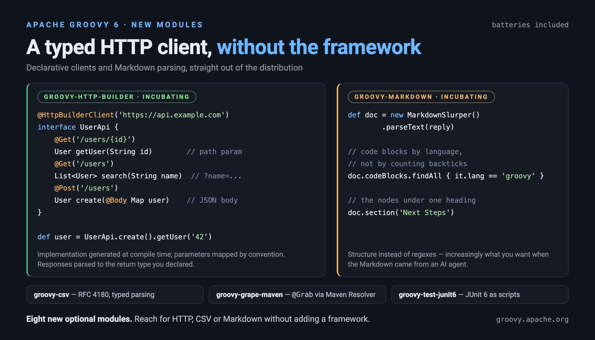
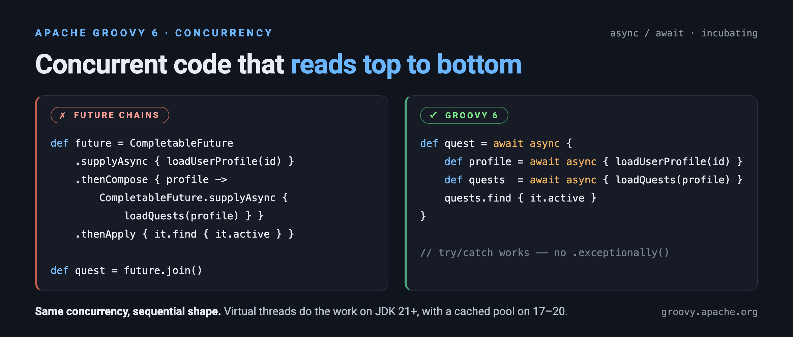
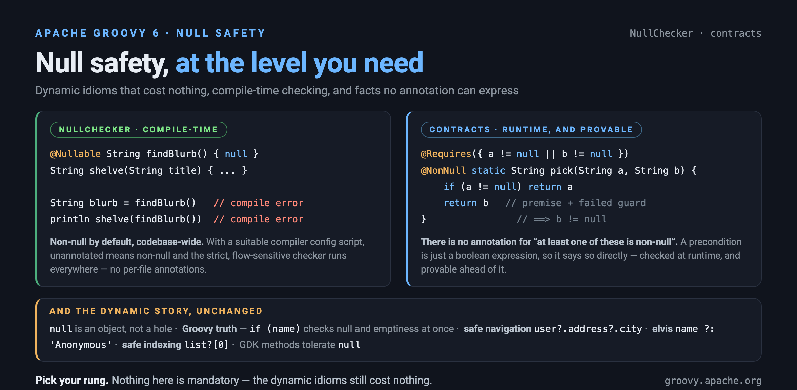
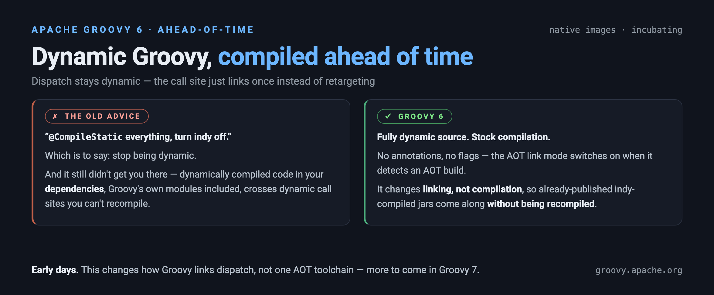

:source-highlighter: pygments
:pygments-style: emacs
:icons: font

:orange: pass:[<span style="background-color: #ffeecc">]
:yellow: pass:[<span style="background-color: #ffffcc">]
:end: pass:[</span>]

Groovy 6 builds upon existing features of earlier versions of Groovy.
In addition, it incorporates numerous new features and streamlines various legacy aspects of the Groovy codebase.

[width="80%",align="center"]
|===
a| NOTE: _WARNING:_
Material on this page is still under development!
We are currently working on beta versions of Groovy 6.0 with a goal of gathering feedback on the language changes from our community. In addition, early versions assist other projects and tool vendors within the Groovy ecosystem to begin assessing the impact of moving to/supporting Groovy 6.0. Caution should be exercised if using new features as the details may change before final release.
Some features described here as "incubating" may become stable before 6.0.0 final is released, others are expected to remain incubating for version 6. We don’t recommend using alpha versions or incubating features for production systems.
|===


== Highlights

Groovy 6 is a big release, so the headline changes are grouped below, each linking to a fuller section further down. A few themes tie them together: closing long-standing gaps with modern Java and Kotlin, growing the batteries-included standard library and modules that make Groovy such a productive scripting language, making concurrent code readable again, and — looking ahead — turning code into specifications that people and AI tools alike can reason about.

*_<<async-await,Native Async/Await>> (incubating)_*

Closes Groovy's biggest concurrency gap: asynchronous code you read top to bottom instead of stitching together callbacks and futures — with virtual threads doing the work on JDK 21+.

- Sequential-style concurrent code — no callbacks or `CompletableFuture` chains.
- Automatic *virtual threads* on JDK 21+; cached thread pool fallback on JDK 17–20.
- Generators with `yield return`, Go-style channels, `for await`, structured concurrency via `AsyncScope`.

*_<<concurrency-toolkit,Integrated Concurrency Toolkit>> (incubating)_*

Gathers high-level concurrency — agents, actors, dataflow, channels and parallel collections — into one coherent package, so you pick the right tool for the job instead of hand-rolling threads, and it's callable from Java too. Previous users of https://gpars.org/[GPars] will find much of its functionality here, but now aligned with modern paradigms like virtual-thread and structured
concurrency support.

- Unified `groovy.concurrent` package: agents, actors, dataflow variables, channels, and parallel collections.
- `@ActiveObject` adds actor semantics to ordinary classes — no message protocols to hand-write.
- Parallel `Collection` methods (`collectParallel`, `findAllParallel`, `eachParallel`, ...) for CPU-bound work.
- Same APIs available to Java, Kotlin and other JVM languages via the standalone <<concurrent-java,`groovy-concurrent-java`>> module.

*_New Language Features_*

Small, sharp ergonomics that cut day-to-day friction and keep Groovy in step with modern Java and Kotlin.

- <<val-keyword,`val` contextual keyword>> for final declarations — a clean companion to `var`.
- <<module-imports,Module imports>> (JEP 511): `import module java.sql` covers every exported package in one line even on JDK17.
- Additional <<destructuring,destructuring>> e.g. with rest binders: `def (h, *t) = list`.
- <<compound-assignment-overloading,Compound-assignment operator overloading>> (`plusAssign`, `minusAssign`, ...) for efficient in-place mutation, even on `final` fields.
- <<intersection-cast,Intersection-type cast>> for lambdas, method references and closures — `(Runnable & Serializable) () -> ...`.
- AST transforms now valid on <<loop-transforms,loop statements>> — `@Parallel` for-loops, `@Invariant`, `@Decreases`.
- <<nested-copywith,Nested `copyWith`>> for `@Immutable`/`@RecordType` — dotted-path map keys and a transactional block form, with structural sharing preserved.

*_<<human-ai-reasoning,Designed for Human and AI Reasoning>>_*

The release's most forward-looking theme: contracts, purity and frame conditions make each method a self-describing, compile-checked specification — as useful to an AI assistant as to the next person reading the code.

- New <<type-checking-extensions,`NullChecker`>> type checker with an optional flow-sensitive `strict` mode requiring no annotations.
- `@Modifies` frame conditions and `@Pure` purity declarations, verified at compile time by `ModifiesChecker` and `PurityChecker`.
- `CombinerChecker` verifies parallel-reduction combiners are associative, via new `@Associative`/`@Reducer` declarations.
- <<monadic-comprehensions,`DO` macro>> for `for`/`do`-style monadic comprehensions across the standard JVM carriers, FunctionalJava and Vavr control types, and user `@Monadic` types — with `MonadicChecker` and `MonadicShapeChecker` enforcing the carrier shape at compile time.
- <<groovy-contracts,Loop invariants and termination measures>> via `@Invariant`/`@Decreases`.
- Contracts (`@Requires`, `@Ensures`, `@Invariant`) now also work in scripts.
- Each method becomes a self-contained specification — readable without descending into bodies.
- Those verified declarations are machine-actionable — a foundation for AI skills and tooling, not just for reading.

*_<<g6-new-modules,New Optional Modules>>_*

Batteries-included scripting: reach for HTTP, CSV, Markdown or a Maven-backed `@Grab` right out of the box — reinforcing Groovy as the _Python of the JVM_.

- <<concurrent-java,`groovy-concurrent-java`>> — Standalone Java library exposing the `groovy.concurrent` toolkit; no Groovy runtime required.
- <<http-builder,`groovy-http-builder`>> — HTTP client with imperative DSL and declarative `@HttpBuilderClient` interface.
Auto-parsed JSON, XML and HTML responses; typed return objects driven by interface signatures.
- <<csv,`groovy-csv`>> — RFC 4180 CSV reading/writing with optional Jackson-backed typed parsing.
- <<markdown,`groovy-markdown`>> — CommonMark parser with section, code-block and table extraction helpers.
- <<grape,`groovy-grape-ivy`>> — `@Grab` Ivy backend, now its own optional module (previously bundled in core).
- <<grape,`groovy-grape-maven`>> — `@Grab` powered by Maven Resolver, alongside the existing Ivy engine.
- `groovy-reactor` / `groovy-rxjava` — `await` and `for await` over reactive `Mono`/`Flux`/`Observable` types.
- <<junit6,`groovy-test-junit6`>> — Run JUnit Jupiter 6 tests as Groovy scripts.

*_Existing Module Improvements_*

Less ceremony for querying and parsing data, with more consistency across formats.

- <<ginq,GINQ>> provides a cleaner `groupby ... into` which binds a group to a named variable with aggregate access, and gains SQL-style set operators: `union`, `intersect`, `minus`, `unionall`.
- Consistent <<typed-parsing,typed parsing>> across JSON, CSV, TOML, YAML and XML modules.

*_A Focus on Performance_*

Groovy 6 spends a lot of effort below the surface: dynamic dispatch that stays fast when metaclasses change, fewer allocations on hot paths, and less generated bytecode — with no changes to semantics.

- *<<g6-other-core-api,Scoped `invokedynamic` invalidation>>*: a metaclass change no longer deoptimizes every call site in the JVM. Call sites now guard on a `SwitchPoint` owned by the receiver's metaclass, so churn on one class leaves hot call sites elsewhere linked and inlined — the payoff is largest for frameworks like Grails and for test suites that install and remove metaclasses.
- *<<g6-other-core-api,Dynamic property writes go through `invokedynamic`>>* by default, bringing property _writes_ in line with property _reads_.
- *<<fat-free,Allocation-free higher-order methods>>*: `java.util.function` overloads across the GDK (`each`, `collect`, `findAll`, `inject`, ...) take a lambda or method reference directly, with no per-call `Closure` allocation.
- *<<compound-assignment-overloading,Compound-assignment operator overloading>>* (`plusAssign`, `minusAssign`, ...) lets `a += b` mutate in place rather than allocate a new object each time.
- *Faster closure calls from Java*: the `Closure.call` override cache is now an arity-indexed table, so multi-argument closure invocations from Java -- all `Map` iteration, `eachWithIndex`, `inject` -- take the cached fast path instead of full metaclass dispatch (https://issues.apache.org/jira/browse/GROOVY-12164[GROOVY-12164], https://issues.apache.org/jira/browse/GROOVY-12165[GROOVY-12165]).
- *Smaller bytecode*: a new peephole optimizer rewrites short, local instruction sequences into cheaper equivalents, with no behavioural change.
- *Fewer closure classes* (experimental, link:../wiki/GEP-27.html[GEP-27]): statically-compiled lambdas can be _hoisted_ to a method on the enclosing class, and eligible closures _packed_, instead of generating a class per closure — cutting class count, jar size and allocation. Both are opt-in, and the value stays a real `groovy.lang.Closure`.
- *<<nested-copywith,Nested `copyWith`>>* rebuilds only the branches that change, so untouched subtrees keep their identity through structural sharing.
- *<<concurrency-toolkit,Parallel collections>>* and the async/await support put idle cores and virtual threads to work on collection and I/O-bound workloads.

Groovy's performance work is tracked continuously by a JMH benchmark suite published to a
https://apache.github.io/groovy/dev/bench/[public dashboard] -- including a Grails-oriented
https://apache.github.io/groovy/dev/bench/jmh/grails-ad/indy/[metaclass-heavy suite] that
watches the dispatch patterns dynamic frameworks depend on, and an
https://apache.github.io/groovy/dev/bench/jmh-adhoc/[idiom-comparison suite] that measures
time and allocation side by side. The latter makes the "fat-free" story concrete: counting
matches in a 1,000-element list runs around twelve times faster through the new
`java.util.function` overloads than through the `rcurry` closure idiom, and allocates
nothing at all where the closure forms allocate tens of kilobytes per call.

image:img/fatfree_time.png[Time per call: closure idioms vs Groovy 6 fat-free overloads, width=700]

image:img/fatfree_allocation.png[Allocation per call: closure idioms vs Groovy 6 fat-free overloads, width=700]

Read those two charts together with one caveat: the `rcurry` and closure-literal variants
are `@CompileDynamic`, since that is how the idiom is normally written, while the overload
variants are `@CompileStatic`. The dividing line is therefore the compilation mode as much
as the closure -- as the last `@CompileStatic` row shows, a plain `Closure` routed through
`Closures.curryWith` is just as allocation-free, and the quickest variant measured.

A few other measured figures, each with the workload it came from:

[cols="3,2", options="header"]
|===
| What was measured | Result

| `Map.each` invoked from Java through `Closure.call`, after the arity-indexed
fast-path cache (GROOVY-12165). Default-on.
| `each` ~3--3.6x faster, `inject` ~2x, `eachWithIndex` ~1.65x

| A representative Grails `RemarkCriteria` domain class, as compiled today --
the baseline that motivates GEP-27 rather than a result of it.
| 24 closure classes totalling 80 KB -- 1.19x the bytecode of the entire rest
of the class

| A class reproducing seven real Grails `FormTagLib` closure patterns, compiled
with closure packing (GEP-27). Opt-in.
| 8 class files -> 1; 23.8 KB -> 7.3 KB of bytecode; ~90% of the bytes removed
were `Closure` scaffolding rather than closure code

| Groovy's own `groovy-macro` module rebuilt with closure packing on, then its
test suite run against the packed classes (GEP-27). Opt-in.
| 148 -> 44 classes, 520 KB -> 228 KB; 66/66 tests pass; cold suite ~6% faster
|===

Two honesty notes on those. Closure packing is *off by default* in Groovy 6, so its
rows describe a flag you switch on, not a dividend you get by upgrading; its own JMH
runs put capturing closures at 1.4--1.9x faster packed but the tightest non-capturing
`collect` shape at ~0.6x -- that is, *slower* -- with Grails-shaped blended workloads
netting +17--23%. And the closure-class figures are bytecode size and class count,
which is a cold-start and jar-size story: on that same `groovy-macro` module a
steady-state hot loop measured at parity (~0.98x), not faster.

The `RemarkCriteria` row deserves its own caveat, because it is the one figure above
that Groovy 6 does *not* bank. Those 24 closure classes come from `static constraints`,
`mapping` and `namedQueries` blocks, which are field-assigned -- precisely the signal
that makes packing's escape gate decline them, so they stay real closure classes and
their delegate resolution is untouched. Hoisting nested closures like these needs
owner-correct retargeting, which is Groovy 7 work. The number is there to show what
closure scaffolding costs in idiomatic Grails code, not what upgrading recovers.

*_<<g6-extensions,Extension Method Additions>>_*

The GDK standard library keeps growing, so more everyday tasks are one method call away rather than a hand-written loop or an extra dependency.

- New methods including `groupByMany`, `waitForResult`, `findGroups`/`findAllGroups`, `isSorted`, `zipWithNext`/`groupConsecutive`, and lazy `grepping`.
- Asynchronous file I/O on `Path` (`textAsync`, `bytesAsync`, `writeAsync`) returning `CompletableFuture` — composes with `await`.
- Streamlined process handling: `pipeline`, `onExit`, `toProcessBuilder`, named-parameter `execute(dir:, env:, ...)`.

*_Tooling Improvements_*

The docs, shell and console catch up with modern expectations — Markdown, syntax highlighting, dark mode and inline charts.

- <<groovydoc,GroovyDoc>> adds JEP 467 Markdown doc comments (`///`) and JEP 413 `{@snippet}` blocks for inline and external code samples. Also added is Prism.js syntax highlighting, class-hierarchy tree pages, `{@value}`/`{@inheritDoc}` support, and improved script documentation.
- Light, dark, "follow system" and <<theming,custom themes>> for GroovyDoc, the GDK reference, and GroovyConsole.
- <<groovysh,Groovysh>> gains an `/img` command for inline images and charts using JLine's terminal-graphics support, Markdown handling in `/slurp`.

*_JDK/Java Integration Improvements_*

Keeps Groovy a first-class citizen on today's JVM: current JDK support, one-line module imports, and cleaner interop for mixed Groovy/Java projects.

- Tested across JDK 17–27; <<Groovy6.0-requirements,JDK 17>> is now the minimum supported runtime. Module import already mentioned.
- <<joint-compilation-stubs,Joint Compilation Stub Improvements>>: AST-transform-generated members (`@Immutable`, `@Builder`, `@TupleConstructor`, `@Delegate`, ...) are now visible in generated stubs. Java code in mixed-language projects can finally call constructors and methods contributed by transforms.
- <<native-image,GraalVM native images>>: an AOT link mode lets even _dynamic_ Groovy dispatch run ahead-of-time compiled — including already-published indy-compiled jars, without recompilation.

*_Security & Hardening_*

This is the safest Groovy yet — a broad sweep of security hardening across the core and modules, secure-by-default where it counts.

- <<xml-processing,Secure-by-default XML>> parsing (XXE/DTD protections) across the XML APIs.
- SQL-injection defence in depth: the <<sql-injection-checker,`SqlInjectionChecker`>> at compile time plus `groovy-sql` rejection at runtime.
- <<regex-timeout,Regex timeouts>> (`@SafeRegex`) guard against ReDoS, alongside JSON nesting-depth limits and stricter Grape coordinate validation.
- Fewer sandboxing gaps: `SecureASTCustomizer` restrictions now also cover constructors, initializer blocks, field initializers and authored code relocated into generated or synthetic members (purely generated code, such as accessors and trait bridges, remains exempt); embedders can disable `@ASTTest` when compiling source they don't control.

[[g6-new-modules]]
== New Modules



Groovy 6 ships eight new optional modules, plus two long-standing pieces
of core (Grape's Ivy backend and the classic call-site caching runtime)
split out into their own modules:

[cols="1,3", options="header"]
|===
| Module | Purpose

| `groovy-callsite`
| Classic (non-`invokedynamic`) call-site caching runtime -- previously
in core, now its own module; only needed when running with
`invokedynamic` disabled
(https://issues.apache.org/jira/browse/GROOVY-12185[GROOVY-12185])

| `groovy-concurrent-java`
| Standalone Java library exposing the `groovy.concurrent` toolkit
(structured concurrency, actors, agents, dataflow, pools) without
the Groovy runtime -- see <<concurrent-java>>

| `groovy-csv`
| CSV parsing and writing via Jackson CSV

| `groovy-grape-ivy`
| `@Grab` engine backed by http://ant.apache.org/ivy/[Apache Ivy] --
previously in core, now its own module

| `groovy-grape-maven`
| New `@Grab` engine backed by
https://maven.apache.org/resolver/[Maven Resolver]

| `groovy-http-builder`
| Imperative DSL and declarative annotation-driven client over JDK
`java.net.http.HttpClient`

| `groovy-markdown`
| https://commonmark.org/[CommonMark] Markdown parser

| `groovy-reactor`
| gapi:groovy.concurrent.AwaitableAdapter[AwaitableAdapter] SPI for
https://projectreactor.io/[Project Reactor] (`Mono`/`Flux`) -- enables
`await` and `for await` over reactive types

| `groovy-rxjava`
| `AwaitableAdapter` SPI for
https://github.com/ReactiveX/RxJava[RxJava 3]
(`Single`/`Maybe`/`Observable`/`Flowable`/`Completable`)

| `groovy-test-junit6`
| Groovy runner for JUnit 6 (Jupiter) tests as scripts
|===

Most of these modules have a dedicated section below covering their public API, examples, and any migration notes.

[[async-await]]
== Native Async/Await (incubating)

Groovy 6 adds native `async`/`await` support
(https://issues.apache.org/jira/browse/GROOVY-9381[GROOVY-9381]),
enabling developers to write concurrent code in a sequential, readable style --
no callbacks, no jdk:java.util.concurrent.CompletableFuture[] chains, no manual thread management.
On JDK 21+, tasks automatically leverage virtual threads.

See also the https://groovy.apache.org/blog/groovy-async-await[async/await blog post]
for a detailed walkthrough.



=== Before and after

Without `async`/`await`, concurrent code requires chaining futures:

[source,groovy]
----
// Before: CompletableFuture chains
def future = CompletableFuture.supplyAsync { loadUserProfile(id) }
    .thenCompose { profile -> CompletableFuture.supplyAsync { loadQuests(profile) } }
    .thenApply { quests -> quests.find { it.active } }

def quest = future.join()
----

With `async`/`await`, the same logic reads like synchronous code:

[source,groovy]
----
// After: sequential style, concurrent execution
def quest = await async {
    def profile = await async { loadUserProfile(id) }
    def quests = await async { loadQuests(profile) }
    quests.find { it.active }
}
----

Exception handling works with standard `try`/`catch` -- no `.exceptionally()` chains.

=== Parallel tasks and combinators

Launch tasks concurrently and coordinate results:

[source,groovy]
----
def a = async { fetchFromServiceA() }
def b = async { fetchFromServiceB() }
def c = async { fetchFromServiceC() }

// Wait for all three
def (resultA, resultB, resultC) = await(a, b, c)
----

=== Generators with `yield return`

An `async` closure containing `yield return` becomes a lazy generator --
it produces values on demand with natural back-pressure:

[source,groovy]
----
def fibonacci = async {
    long a = 0, b = 1
    while (true) {
        yield return a
        (a, b) = [b, a + b]
    }
}

assert fibonacci.take(8).collect() == [0, 1, 1, 2, 3, 5, 8, 13]
----

=== Channels

Go-style inter-task communication. A producer sends values into a channel
(gapi:groovy.concurrent.AsyncChannel[AsyncChannel]);
a consumer receives them:

[source,groovy]
----
def ch = AsyncChannel.create(5)  // buffered channel

async {
    for (i in 1..10) ch.send(i)
    ch.close()
}

for (val in ch) { println val }  // prints 1..10
----

=== Structured concurrency

gapi:groovy.concurrent.AsyncScope[AsyncScope] binds the lifetime of
child tasks to a scope -- when the scope exits, all children are
guaranteed complete or cancelled:

[source,groovy]
----
AsyncScope.run {
    def users = async { loadUsers() }
    def config = async { loadConfig() }
    processResults(await(users), await(config))
}
// Both tasks guaranteed complete here
----

=== Iterating and cleaning up: `for await` and `defer`

`for await` consumes an async source -- a generator, channel, or
reactive stream -- pulling values as they arrive, while `defer`
registers a cleanup action that runs when the enclosing scope exits
(LIFO order, on success or failure alike):

[source,groovy]
----
async {
    def reader = openLogStream()
    defer { reader.close() }                    // runs on scope exit, always

    for await (line in tailLines(reader)) {     // consume values as produced
        if (line.contains('ERROR')) println line
    }
}   // reader.close() runs here
----

`defer` is a contextual keyword: it is parsed as a keyword only inside
`async` closures, so existing code that uses `defer` as an ordinary
identifier elsewhere is unaffected
(https://issues.apache.org/jira/browse/GROOVY-12254[GROOVY-12254]).

=== Feature summary

[cols="1,3", options="header"]
|===
| Feature | Description

| `async { }` / `await`
| Start background tasks; collect results in sequential style

| Virtual threads
| Automatic on JDK 21+; cached thread pool fallback on JDK 17--20

| gapi:groovy.concurrent.Awaitable[Awaitable]`.all()`, multi-arg `await(a, b, c)`
| Wait for all tasks to complete

| `Awaitable.any()`
| Race -- first to complete wins

| `Awaitable.first()`
| First _success_ wins (ignores individual failures)

| `Awaitable.allSettled()`
| Wait for all; inspect each outcome individually

| `yield return`
| Lazy generators with back-pressure

| gapi:groovy.concurrent.AsyncChannel[AsyncChannel]
| Buffered and unbuffered Go-style channels

| `for await`
| Iterate over async sources (generators, channels, reactive streams)

| `defer`
| LIFO cleanup actions, runs on scope exit regardless of success/failure

| `AsyncScope`
| Structured concurrency -- child lifetime bounded by scope

| Timeouts
| `Awaitable.timeout(duration)` and `Awaitable.timeout(duration, fallback)`

| `Awaitable.delay()`
| Non-blocking pause

| `CompletableFuture` / `Future` interop
| `await` works directly with JDK async types

| Framework adapters (SPI)
| `groovy-reactor` (Mono/Flux), `groovy-rxjava` (Single/Observable)

| Executor configuration
| Pluggable; default auto-selects virtual threads or cached pool
|===

See the dochome6:core-async-await.html[Async/Await user guide]
for the full API and additional examples.

[[concurrency-toolkit]]
== Integrated Concurrency and Parallel Processing (incubating)

Groovy 6 brings a unified concurrency and parallel-processing toolkit
into core under
link:../wiki/GEP-18.html[GEP-18: Integrated Concurrency and Parallel Processing]
(https://issues.apache.org/jira/browse/GROOVY-11952[GROOVY-11952],
https://issues.apache.org/jira/browse/GROOVY-11953[GROOVY-11953]).
The new abstractions live in the `groovy.concurrent` package and
modernise patterns from
http://gpars.org/[GPars] around virtual threads, structured concurrency,
and Groovy 6's `async`/`await`. The same combinators
(`await`, `Awaitable.all`, `for await`) work uniformly across all of
them — agents, actors, dataflow variables, channels, and parallel
collections — so you compose features rather than learning separate
APIs.

For Java-only consumers, the same APIs are also published as the
new `groovy-concurrent-java` module — see <<concurrent-java>>.

=== Agents — thread-safe mutable state

An gapi:groovy.concurrent.Agent[Agent] wraps a value and serialises
updates via functions, eliminating data races by design. Reads compose
with `await`:

[source,groovy]
----
import groovy.concurrent.Agent

def counter = Agent.create(0)
counter.send { it + 1 }
counter.send { it + 1 }
counter.send { it + 1 }

assert await(counter.getAsync()) == 3
----

An agent also exposes its update stream as a
`java.util.concurrent.Flow.Publisher` via `changes()`, so `for await`
consumes state transitions directly:

[source,groovy]
----
def agent = Agent.create(0)
async {
    3.times { agent.send { it + 1 } }
    agent.shutdown()
}
def seen = []
for await (v in agent.changes()) { seen << v }
assert seen == [1, 2, 3]
----

=== `@ActiveObject` — actor semantics with class syntax

A hand-written actor (gapi:groovy.concurrent.Actor[Actor]) encodes its
message protocol explicitly -- typed messages, a `switch` over message
kinds, and `send`/`sendAndGet` plumbing at every call site -- so a
reader (human or AI) has to trace each message kind through the
dispatch loop and every call site to know the actor is used safely.
gapi:groovy.transform.ActiveObject[@ActiveObject] (target: `TYPE`)
inverts this: write a normal class, mark the methods that run on the
actor's serialised mailbox with
gapi:groovy.transform.ActiveMethod[@ActiveMethod] (target: `METHOD`),
and the AST transform routes those calls through an internal actor:

[source,groovy]
----
import groovy.transform.ActiveObject
import groovy.transform.ActiveMethod

@ActiveObject
class Account {
    private double balance = 0

    @ActiveMethod
    void deposit(double amount) { balance += amount }

    @ActiveMethod
    void withdraw(double amount) {
        if (amount > balance) throw new RuntimeException('Insufficient funds')
        balance -= amount
    }

    @ActiveMethod
    double getBalance() { balance }
}

def account = new Account()
account.deposit(100)
account.deposit(50)
account.withdraw(30)
assert account.getBalance() == 120.0
----

The thread-safety contract is now explicit and local. The
`@ActiveObject` annotation declares the concurrency model;
`@ActiveMethod` bodies contain plain business logic; callers see
ordinary method calls — no message types to invent, no `switch` to
parse, no manual reply plumbing. For non-blocking use,
`@ActiveMethod(blocking = false)` returns an `Awaitable` that plugs
straight into `await` and `Awaitable.all`.

=== Dataflow variables

A gapi:groovy.concurrent.DataflowVariable[DataflowVariable] is a
single-assignment variable: any thread that reads before it is bound
blocks until a value is available. `DataflowVariable` implements
`Awaitable`, so it composes directly with `await` and `async {}`
regardless of which task binds first:

[source,groovy]
----
import groovy.concurrent.DataflowVariable

def x = new DataflowVariable()
def y = new DataflowVariable()
def z = new DataflowVariable()

async { z << await(x) + await(y) }   // blocks until x and y bind
async { x << 10 }                     // bind in any order
async { y << 5 }

assert await(z) == 15
----

The companion gapi:groovy.concurrent.Dataflows[Dataflows] class
auto-creates variables on property access for an even more concise
form (`async { df.fullName = "${df.first} ${df.last}" }`).

=== Parallel collections

For CPU-bound data parallelism, `Collection` gains a family of
parallel methods backed by a `ForkJoinPool`:

[source,groovy]
----
def squares = (1..1_000).toList().collectParallel { it * it }
def adults  = people.findAllParallel { it.age >= 18 }
def total   = amounts.sumParallel { a, b -> a + b }
----

gapi:groovy.concurrent.ParallelScope[ParallelScope]`.withPool`
binds a pool for a block, and gapi:groovy.concurrent.Pool[Pool]
offers `Pool.cpu()`, `Pool.fixed(n)`, `Pool.io()`, and
`Pool.virtual()` factories so CPU-bound and I/O-bound workloads can
use distinct pools without leaking into the common pool. The
previously introduced gapi:groovy.transform.Parallel[@Parallel] loop
annotation shares this infrastructure:

[source,groovy]
----
import groovy.concurrent.ParallelScope
import groovy.concurrent.Pool

ParallelScope.withPool(Pool.cpu()) { scope ->
    def hot = bigList.findAllParallel { it.score > threshold }
    hot.eachParallel { archive(it) }
}
----

As a rule of thumb, prefer parallel collections (or `@Parallel`) for
CPU-bound work and `async`/`await` with virtual threads for
I/O-bound work — `ForkJoinPool` workers are precious and should not
be tied up in `Thread.sleep`, network calls, or blocking I/O.

=== Channel composition and broadcast

`AsyncChannel` (introduced with async/await) gains composable
pipeline operations — `filter`, `map`, `merge`, `split`, `tap` — and
gapi:groovy.concurrent.ChannelSelect[ChannelSelect] for Go-style
multi-channel selection.
gapi:groovy.concurrent.BroadcastChannel[BroadcastChannel] adds
one-to-many delivery and exposes `asPublisher()` for direct
`Flow.Publisher` interop, so any subscriber — including a `for await`
loop — receives every message:

[source,groovy]
----
import groovy.concurrent.BroadcastChannel

def broadcast = BroadcastChannel.create()
def publisher = broadcast.asPublisher()

async {
    ['hello', 'world'].each { broadcast.send(it) }
    broadcast.close()
}

for await (msg in publisher) { println msg }   // hello, world
----

The same `for await` works against any JDK `Flow.Publisher`, Reactor
`Flux` (via `groovy-reactor`), or RxJava `Observable` (via
`groovy-rxjava`).

[[concurrent-java]]
=== Java-only module: `groovy-concurrent-java`

For Java, Kotlin, and other JVM languages that want the same
toolkit without the full Groovy runtime, the standalone
`groovy-concurrent-java` module exposes `AsyncScope`, `Pool`,
`ParallelScope`, `Actor`, `Agent`, `DataflowVariable`,
`AsyncChannel`, `BroadcastChannel`, and `ChannelSelect` against
plain `java.util.function` types. The Groovy-only sugar
(`async`/`await` keywords, `for await`, `defer`, `@ActiveObject`,
`Dataflows`, parallel extension methods) requires the full Groovy
dependency.

[source,java]
----
import groovy.concurrent.AsyncScope;
import org.apache.groovy.runtime.async.AsyncSupport;

var result = AsyncScope.withScope(scope -> {
    var a = scope.async(() -> fetchUser(id));
    var b = scope.async(() -> fetchOrders(id));
    return Map.of(
        "user",   AsyncSupport.await(a),
        "orders", AsyncSupport.await(b)
    );
});
----

The module ships under the `org.apache.groovy:groovy-concurrent-java`
coordinate and is mutually exclusive with the full `groovy` runtime
(Gradle enforces this via a shared capability; a runtime warning
fires if both jars are detected on the classpath).

=== Feature summary

[cols="2,3,1", options="header"]
|===
| Feature | Description | Ticket

| `Agent`
| Thread-safe mutable value updated via serialised functions; exposes
a `Flow.Publisher` of state changes via `changes()`.
| https://issues.apache.org/jira/browse/GROOVY-11952[GROOVY-11952],
https://issues.apache.org/jira/browse/GROOVY-11953[GROOVY-11953]

| `Actor.reactor` / `Actor.stateful`
| Stateless and stateful actors with `Awaitable`-based reply via
`sendAndGet`.
| https://issues.apache.org/jira/browse/GROOVY-11952[GROOVY-11952]

| `@ActiveObject` / `@ActiveMethod`
| AST-driven actor semantics with class syntax. `blocking = false`
returns an `Awaitable`.
| https://issues.apache.org/jira/browse/GROOVY-11952[GROOVY-11952]

| `DataflowVariable`, `Dataflows`
| Single-assignment variables; `Dataflows` auto-creates on property
access. Implements `Awaitable` and supports `then` chaining.
| https://issues.apache.org/jira/browse/GROOVY-11952[GROOVY-11952]

| `AsyncChannel.filter` / `map` / `merge` / `split` / `tap`
| Composable channel pipelines.
| https://issues.apache.org/jira/browse/GROOVY-11952[GROOVY-11952]

| `BroadcastChannel`, `ChannelSelect`
| One-to-many broadcast (with `asPublisher()` for Reactive Streams);
Go-style multi-channel select.
| https://issues.apache.org/jira/browse/GROOVY-11952[GROOVY-11952],
https://issues.apache.org/jira/browse/GROOVY-11953[GROOVY-11953]

| Parallel collection methods
| `collectParallel`, `findAllParallel`, `eachParallel`, `sumParallel`,
`injectParallel`, `groupByParallel`, etc., on `Collection`.
| https://issues.apache.org/jira/browse/GROOVY-11952[GROOVY-11952]

| `Pool` and `ParallelScope`
| `Pool.cpu()`, `Pool.fixed(n)`, `Pool.io()`, `Pool.virtual()` pool
factories; `ParallelScope.withPool { }` binds a pool for a block.
| https://issues.apache.org/jira/browse/GROOVY-11952[GROOVY-11952]

| `groovy-concurrent-java`
| Standalone Java module exposing the same concurrent APIs without
the Groovy runtime.
| https://issues.apache.org/jira/browse/GROOVY-11952[GROOVY-11952]

| `Actor` production hardening
| An `Actor.Stop` sentinel for in-handler self-termination, an `onError`
callback so `send` failures are no longer silently swallowed, a bounded
mailbox with `BLOCK` / `DROP_NEWEST` / `FAIL` overflow strategies, and
per-actor executor selection. All additions are backward compatible.
| https://issues.apache.org/jira/browse/GROOVY-12033[GROOVY-12033]
|===

See the user guides for the full APIs and additional examples:
dochome6:core-concurrent-actors.html[concurrent actors and agents],
dochome6:core-concurrent-dataflow.html[concurrent dataflow],
dochome6:core-parallel-collections.html[parallel collections], and
dochome6:core-concurrent-java.html[the Java-only module].

[[http-builder]]
== HttpBuilder: HTTP Client Module (incubating)

Groovy 6 introduces a new `groovy-http-builder` module
(https://issues.apache.org/jira/browse/GROOVY-11879[GROOVY-11879],
https://issues.apache.org/jira/browse/GROOVY-11924[GROOVY-11924])
providing both an imperative DSL and a declarative annotation-driven
client over the JDK's `java.net.http.HttpClient`.
It is designed for scripting, automation, and typed API clients,
filling the gap left by the earlier HttpBuilder/HttpBuilder-NG libraries.
The two entry points are gapi:groovy.http.HttpBuilder[HttpBuilder]
for the imperative DSL and
gapi:groovy.http.HttpBuilderClient[@HttpBuilderClient] for the
declarative client; supporting types live in the `groovy.http` package.

Applicable targets for the new annotations: `@HttpBuilderClient` — `TYPE`;
`@Get`/`@Post`/`@Put`/`@Delete`/`@Patch`/`@Form`/`@Timeout` — `METHOD`;
`@Body`/`@BodyText`/`@Query` — `PARAMETER`;
`@Header` — `TYPE`, `METHOD`.

=== Imperative DSL

A closure-based DSL for quick scripting:

[source,groovy]
----
import static groovy.http.HttpBuilder.http

def client = http('https://api.github.com')
def result = client.get('/repos/apache/groovy')
assert result.json.license.name == 'Apache License 2.0'
----

Responses auto-parse by content type: `result.json`, `result.xml`,
`result.html` (via jsoup), or `result.parsed` for auto-dispatch.

=== Declarative client

Define a typed interface and Groovy generates the implementation at
compile time. Parameters are mapped by convention -- no annotations
needed for the common case:

[source,groovy]
----
@HttpBuilderClient('https://api.example.com')
interface UserApi {
    @Get('/users/{id}')
    User getUser(String id)             // path param: {id}

    @Get('/users')
    List<User> search(String name)      // implied query param: ?name=...

    @Post('/users')
    User create(@Body Map user)         // JSON body

    @Post('/login')
    @Form
    Map login(String username, String password)  // form-encoded
}

def api = UserApi.create()
def user = api.getUser('42')
----

=== Async support

Both sides offer native async via `HttpClient.sendAsync()` -- no
extra threads consumed while waiting:

[source,groovy]
----
// Imperative
def future = client.getAsync('/slow-endpoint')
def result = future.get()

// Declarative
@HttpBuilderClient('https://api.example.com')
interface AsyncApi {
    @Get('/data/{id}')
    CompletableFuture<Map> getData(String id)
}
----

These `CompletableFuture` returns are first-class `await` targets in
Groovy 6: `def data = await api.getDataAsync('42')`.

=== Feature summary

[cols="2,1,1", options="header"]
|===
| Feature | Imperative | Declarative

| HTTP methods (GET, POST, PUT, DELETE, PATCH)
| All
| All (gapi:groovy.http.Get[@Get], gapi:groovy.http.Post[@Post], gapi:groovy.http.Put[@Put], gapi:groovy.http.Delete[@Delete], gapi:groovy.http.Patch[@Patch])

| JSON body / response
| `json()` / `result.json`
| gapi:groovy.http.Body[@Body] / return-type driven

| Form-encoded body
| `form()`
| gapi:groovy.http.Form[@Form]

| Plain text body
| `text()`
| gapi:groovy.http.BodyText[@BodyText]

| XML / HTML response
| `result.xml` / `result.html`
| `GPathResult` / jsoup `Document` return type

| Typed response objects
| Manual (`result.json as User`)
| Automatic (return type driven)

| Query parameters
| `query()`
| Implied from parameter name (or gapi:groovy.http.Query[@Query])

| Path parameters
| Manual
| Auto-mapped via `{name}` placeholders

| Headers
| `header()` in config/request
| gapi:groovy.http.Header[@Header] on interface/method

| Async
| `getAsync()`, `postAsync()`, etc.
| `CompletableFuture<T>` return type

| Timeouts (connect / request)
| Config DSL
| `connectTimeout`, `requestTimeout` on `@HttpBuilderClient`

| Per-method timeout
| Per-request `timeout()`
| gapi:groovy.http.Timeout[@Timeout]`(seconds)`

| Redirect following
| Config DSL
| `followRedirects` on `@HttpBuilderClient`

| Error handling
| Manual (check `result.status()`)
| Auto-throw; custom exception via `throws` clause

| JDK client access (auth, SSL, proxy)
| `clientConfig { builder -> ... }`
| `create { clientConfig { ... } }`
|===

For safety, requests -- and any redirects they follow -- are confined to
the configured base URI, so a redirect cannot silently escape to a
different host
(https://issues.apache.org/jira/browse/GROOVY-12182[GROOVY-12182]).

See the dochome6:http-builder.html[HTTP client user guide]
for the full API and configuration options.

[[loop-transforms]]
== AST Transforms in More Places (incubating)

Groovy 6 extends the AST transformation infrastructure to support
annotations on loop statements -- for-in, classic for, while, and do-while
(https://issues.apache.org/jira/browse/GROOVY-11878[GROOVY-11878]).
The following built-in transforms now declare `LOOP` as a valid target:

* gapi:groovy.transform.Parallel[@Parallel] -- runs each iteration on
its own task; uses virtual threads on JDK 21+ and falls back to
platform threads otherwise (applicable target: `LOOP` only)
* gapi:groovy.contracts.Invariant[@Invariant] -- asserts a condition
at the start of each iteration (also valid on imports; see
<<groovy-contracts>>)
* gapi:groovy.contracts.Decreases[@Decreases] -- loop termination
measure; see <<groovy-contracts>>
* gapi:groovy.transform.ASTTest[@ASTTest] -- compile-time AST
inspection utility used primarily for transform development and testing

`@Parallel` is the most visible application:

[source,groovy]
----
@Parallel
for (int i in 1..4) {
    println i ** 2
}
// Output (non-deterministic order): 1, 16, 9, 4
----

Custom transforms can opt into loop targeting by declaring
`@ExtendedTarget(ExtendedElementType.LOOP)`, following the same
contract as class/method/field-level transforms. See
<<annotation-validation>> for the corresponding compile-time
validation rules.

[[ast-query]]
== Fluent AST Query API (incubating)

A small, read-only, fluent query API over the Groovy AST is now available
in the `org.codehaus.groovy.ast.query` package (`AstQuery` / `AstContext`).
It lets AST transform, type-checker and tooling authors locate nodes
declaratively, without hand-writing a `CodeVisitorSupport` subclass that
carries mutable state
(https://issues.apache.org/jira/browse/GROOVY-12116[GROOVY-12116]).

Several internal AST walkers were ported to it. For example, the
`@TailRecursive` recursive-call detector dropped from a 41-line
`CodeVisitorSupport` subclass -- two `visitXxx` overrides plus mutable
fields and a `synchronized` entry point -- to a 16-line class whose
entire logic is a single query:

[source,java]
----
public boolean test(MethodNode method) {
    RecursivenessTester tester = new RecursivenessTester();
    return AstQuery.from(method.getCode())
            .descendants(MethodCallExpression.class, StaticMethodCallExpression.class)
            .where(call -> tester.isRecursive(Maps.of("method", method, "call", call)))
            .any();
}
----

[[groovy-contracts]]
== Groovy-Contracts Enhancements

The `groovy-contracts` module receives several enhancements in Groovy 6,
including support for contracts in scripts, loop annotations,
and frame conditions. The module itself graduates from incubating to
stable in 6.0 (see <<g6-stabilised>>); the newest of these enhancements --
loop-level annotations and `@Modifies` frame conditions, which build on
the still-incubating loop AST-transform support -- remain incubating for
this release.

=== Contracts in scripts

Contract annotations now work in Groovy scripts, not just inside classes
(https://issues.apache.org/jira/browse/GROOVY-11885[GROOVY-11885]).
gapi:groovy.contracts.Requires[@Requires] and
gapi:groovy.contracts.Ensures[@Ensures] can be placed on script methods,
and gapi:groovy.contracts.Invariant[@Invariant] can be placed on an
import statement to apply as a class-level invariant for the script:

[source,groovy]
----
@Invariant({ balance >= 0 })
import groovy.transform.Field
import groovy.contracts.Invariant

@Field Integer balance = 5

@Requires({ balance >= amount })
def withdraw(int amount) { balance -= amount }

def deposit(int amount) { balance += amount }

deposit(5)       // balance = 10, OK
withdraw(20)     // throws ClassInvariantViolation (balance would be -5)
----

=== Combining contracts

These annotations can be combined to build strong confidence
in the correctness of an algorithm. Consider this insertion sort
that merges two pre-sorted lists:

[source,groovy]
----
@Ensures({ result.isSorted() })
List insertionSort(List in1, List in2) {
    var out = []
    var count = in1.size() + in2.size()
    @Invariant({ in1.size() + in2.size() + out.size() == count })
    @Decreases({ [in1.size(), in2.size()] })
    while (in1 || in2) {
        if (!in1) return out + in2
        if (!in2) return out + in1
        out += (in1[0] < in2[0]) ? in1.pop() : in2.pop()
    }
    out
}
----

The `@Ensures` postcondition verifies that the result is sorted.
The `@Invariant` asserts that no elements are lost or gained --
the total number of elements across all three lists stays constant
throughout the loop. The `@Decreases` annotation uses a lexicographic
measure over the two input list sizes, giving us confidence that
the loop terminates: on each iteration at least one input list
shrinks, and they can never grow.

See also the https://groovy.apache.org/blog/loop-invariants[loop invariants blog post]
for more on how contracts support correctness reasoning.

=== Exceptional behaviour with `@ThrowsIf`

The `@Requires`/`@Ensures`/`@Invariant` trio covers _normal_ behaviour.
The new gapi:groovy.contracts.ThrowsIf[@ThrowsIf] annotation
(https://issues.apache.org/jira/browse/GROOVY-12135[GROOVY-12135])
covers _exceptional_ behaviour -- the guard clause that is otherwise
written by hand:

[source,groovy]
----
@ThrowsIf(value = { b == 0 }, exception = ArithmeticException)
int divide(int a, int b) { a.intdiv(b) }
----

It reads as an _iff_: the method throws `ArithmeticException` exactly
when `b == 0`. With the default `woven = true`, groovy-contracts
_generates_ the guard at method entry (the same idea as
gapi:groovy.transform.NullCheck[@NullCheck] for the null-check special
case); `woven = false` keeps it as machine-readable documentation only.

=== Feature summary

[cols="1,3,1", options="header"]
|===
| Feature | Description | Ticket

| `@Invariant` on loops
| Assert a condition at the start of each iteration of any loop type
(for-in, classic for, while, do-while). Multiple invariants can be stacked.
Violations throw `LoopInvariantViolation`.
Targets: `TYPE` (existing) plus extended `LOOP` and `IMPORT` (new in 6.0).
| https://issues.apache.org/jira/browse/GROOVY-11878[GROOVY-11878]

| gapi:groovy.contracts.Decreases[@Decreases]
| Loop termination measure (loop _variant_). Takes a closure returning a
value or list of values that must strictly decrease each iteration while
remaining non-negative. Lists use lexicographic comparison.
Violations throw `LoopVariantViolation`.
Targets: `TYPE` plus extended `LOOP`.
| https://issues.apache.org/jira/browse/GROOVY-11890[GROOVY-11890]

| gapi:groovy.contracts.Modifies[@Modifies]
| Frame condition declaring which fields a method may change.
Everything not listed is guaranteed unchanged.
gapi:groovy.transform.Pure[@Pure] is shorthand for `@Modifies({ [] })`.
Targets: `CONSTRUCTOR`, `METHOD` (both `@Modifies` and `@Pure`).
| https://issues.apache.org/jira/browse/GROOVY-11909[GROOVY-11909]

| Contracts in scripts
| `@Requires`, `@Ensures` on script methods; `@Invariant` on import
statements as a class-level invariant for the script.
| https://issues.apache.org/jira/browse/GROOVY-11885[GROOVY-11885]

| `@Ensures` on static methods
| Postconditions are now supported on `static` methods. The `old` snapshot
is also available there, but -- since a static method has no instance state --
`old` may only capture a method parameter's entry value; `old.<field>` is
rejected.
| https://issues.apache.org/jira/browse/GROOVY-12052[GROOVY-12052],
https://issues.apache.org/jira/browse/GROOVY-12078[GROOVY-12078]

| gapi:groovy.contracts.ThrowsIf[@ThrowsIf]
| Guard-clause (exceptional-behaviour) contract: throw a given exception
_exactly when_ a condition holds. With `woven = true` (default) the guard
is generated at method entry; `woven = false` records it as documentation.
Violations throw `ThrowsIfViolation`. Targets: `METHOD`, `CONSTRUCTOR`.
| https://issues.apache.org/jira/browse/GROOVY-12135[GROOVY-12135]

| `@Decreases` on methods
| Beyond loop variants, `@Decreases` may now be placed on a method as a
call-stack/recursion termination measure, giving confidence that a
recursive method terminates.
| https://issues.apache.org/jira/browse/GROOVY-12060[GROOVY-12060]

| `@Requires(woven = false)`
| A precondition can opt out of weaving to act as machine-readable
documentation only -- useful when an existing library already performs
the validation and you want that intent clearer than javadoc alone.
| https://issues.apache.org/jira/browse/GROOVY-12136[GROOVY-12136]

| Multiple `@Ensures` per method
| All postconditions on a method now fire; previously only the first
`@Ensures` was woven. Postconditions are also honoured for a braceless
`if` return (and under `@TailRecursive`), where they were previously
dropped.
| https://issues.apache.org/jira/browse/GROOVY-12083[GROOVY-12083],
https://issues.apache.org/jira/browse/GROOVY-12079[GROOVY-12079]

| Nested closures in conditions
| Contract conditions may now contain nested closures (e.g.
`every`/`collect` inside a pre/postcondition), which previously failed
to compile or weave. Generic type parameters on closure parameters are
also preserved, keeping type checking accurate inside conditions.
| https://issues.apache.org/jira/browse/GROOVY-12059[GROOVY-12059],
https://issues.apache.org/jira/browse/GROOVY-12071[GROOVY-12071]

| Loop annotations under `@TypeChecked`
| `@Invariant`/`@Decreases` on loops now compile under `@TypeChecked`
(and `@CompileStatic`) instead of failing type checking. Loop invariants
also resolve normal and `static` imports, and loop checks fire at points
consistent with loop semantics.
| https://issues.apache.org/jira/browse/GROOVY-12053[GROOVY-12053],
https://issues.apache.org/jira/browse/GROOVY-12072[GROOVY-12072],
https://issues.apache.org/jira/browse/GROOVY-12128[GROOVY-12128]

| `@Synchronized` + contracts
| A `@Synchronized` method carrying `@Ensures`/`@Invariant` (but no
`@Requires`) no longer throws `ClassCastException` during weaving.
| https://issues.apache.org/jira/browse/GROOVY-12084[GROOVY-12084]
|===

[[monadic-comprehensions]]
== Monadic Comprehensions (incubating)

Groovy 6 introduces `DO` — a comprehension macro that gives Scala
`for`-comprehension and Haskell `do`-notation ergonomics to any type
with monadic shape. See link:../wiki/GEP-23.html[GEP-23: Monadic
comprehensions]
(https://issues.apache.org/jira/browse/GROOVY-12021[GROOVY-12021]) for
the full specification.

A `DO` block rewrites at compile time to a chain of bind operations on
a participating *carrier* type. The notation reads top-to-bottom;
short-circuiting (empty `Optional`, failed `Try`, failed `Awaitable`)
is delivered by the carrier rather than by the macro.

[source,groovy]
----
import static org.apache.groovy.macrolib.MacroLibGroovyMethods.DO

@TypeChecked(extensions = 'groovy.typecheckers.MonadicChecker')
Optional<String> greet(Map<String, String> users, String userId) {
    DO(user in Optional.ofNullable(users[userId]),
       name in Optional.ofNullable(user.split(/\|/)[0])) {
        Optional.of("Hello, $name!".toString())
    }
}

assert greet([u42: 'Alice|admin'], 'u42').get() == 'Hello, Alice!'
assert greet([u42: 'Alice|admin'], 'u99') == Optional.empty()
----

The same shape works over `Stream`, `CompletableFuture`,
gapi:groovy.concurrent.Awaitable[Awaitable] and
gapi:groovy.concurrent.DataflowVariable[DataflowVariable], and over
FunctionalJava and Vavr control carriers (recognised by name, no
Groovy dependency on the library).

=== Carrier participation

A type qualifies as a carrier via any of four routes. The built-in
allow-list recognises stdlib and Groovy-core types by class --
`Optional`, `Stream`, `CompletionStage`/`CompletableFuture`, and
`Awaitable`/`DataflowVariable` -- and common FunctionalJava
(`fj.data.*`) and Vavr (`io.vavr.control.*`) carriers by
fully-qualified name, with no Groovy dependency on those libraries.
Beyond the list, any type exposing a single-argument `flatMap` (plus
`map`) qualifies structurally, and a user type whose method names
diverge can opt in with gapi:groovy.transform.Monadic[@Monadic]
(naming its `bind`/`map`, and optionally a `unit` factory for
law-checking tooling). GEP-23 has the per-carrier method mapping and
the exact shape rules.

=== Compile-time checking

Two type-checking extensions back the feature, each activated like any
other (`@TypeChecked(extensions = '...')`).
gapi:groovy.typecheckers.MonadicChecker[MonadicChecker] -- shown in the
example above -- enforces carrier participation and the closure-return
shape of `DO` chains, and restores the comprehension's static result
type. gapi:groovy.typecheckers.MonadicShapeChecker[MonadicShapeChecker]
is independent of `DO`: it lints hand-written
`flatMap`/`map`/`thenCompose`/`thenApply` chains, catching a `flatMap`
that returns a non-carrier or a different carrier (which Groovy's
closure coercion would otherwise let through), and the
`map`-returning-`M<M<T>>` foot-gun. The two compose -- code mixing both
forms can opt into both.

=== Feature summary

[cols="1,3,1", options="header"]
|===
| Feature | Description | Ticket

| `DO` macro
| Compile-time rewrite of generator/body comprehensions into a chain
of bind operations on a participating carrier. Recognises stdlib and
Groovy-core carriers by type; FunctionalJava and Vavr control carriers
by fully-qualified name; structural and `@Monadic`-keyed user
carriers.
| https://issues.apache.org/jira/browse/GROOVY-12021[GROOVY-12021]

| gapi:groovy.transform.Monadic[@Monadic]
| Opt-in marker for user types whose bind/map methods diverge from the
structural convention. Optional `bind` / `map` attributes name the
methods.
| https://issues.apache.org/jira/browse/GROOVY-12021[GROOVY-12021]

| gapi:groovy.typecheckers.MonadicChecker[MonadicChecker]
| Type-checking extension that enforces carrier participation, the
closure-return shape of `DO` chains, and the comprehension's result
type under `@CompileStatic`/`@TypeChecked`.
| https://issues.apache.org/jira/browse/GROOVY-12021[GROOVY-12021]

| gapi:groovy.typecheckers.MonadicShapeChecker[MonadicShapeChecker]
| Sibling extension that lints hand-written
`flatMap`/`map`/`thenCompose`/`thenApply` chains over the same carrier
set, independent of `DO`.
| https://issues.apache.org/jira/browse/GROOVY-12021[GROOVY-12021]

| Carrier registry
| Standard allow-list shared by the runtime bind/map dispatcher and
the type-checking extensions; covers stdlib carriers by type and
FunctionalJava / Vavr carriers by name.
| https://issues.apache.org/jira/browse/GROOVY-12021[GROOVY-12021]
|===

See link:../wiki/GEP-23.html[GEP-23] for the full specification, the
desugaring rules, the carrier-shape requirements, and the relationship
to `for await` / parallel collections / actors and agents.

== Trait Static Members (incubating)

Traits may declare `static` methods, properties and fields, with each
implementing class receiving its own copy of the static state.
This feature has been available across numerous Groovy versions
but is further enhanced and clarified in Groovy 6
(the area remains incubating). A summary follows, but
see link:../wiki/GEP-22.html[GEP-22] for the full trait specification.

A public trait `static` method is *declarer-bound* by default: a call
to it from trait code always reaches the trait's own copy, and it is
promoted onto the generated trait interface as a JVM-native interface
static, so both `Trait.m()` and `Impl.m()` resolve at the JVM level
(https://issues.apache.org/jira/browse/GROOVY-12111[GROOVY-12111]).

When a trait wants implementing classes to be able to *override* a
static default -- and wants the trait's own logic to honour that
override -- the method can be annotated `@groovy.transform.Virtual`.
Trait-body calls to a `@Virtual` static then dispatch through the
implementing class, so a same-signature static on the implementer
shadows the trait's default. This is the template-method pattern applied
to a static member, and the mechanism behind framework hooks such as
Grails' `Validateable.defaultNullable()`
(https://issues.apache.org/jira/browse/GROOVY-12093[GROOVY-12093]).

[source,groovy]
----
import groovy.transform.Virtual

trait Validateable {
    @Virtual static boolean defaultNullable() { false }   // overridable default
    static boolean check() { defaultNullable() }          // honours the override
}
class Book implements Validateable {
    static boolean defaultNullable() { true }             // per-class override
}
assert Book.check()                                       // true
----

`@Virtual` is valid only on public, non-abstract `static` trait methods;
applying it elsewhere is a compile-time error. A `@Virtual` static is
not promoted onto the interface (interface statics are declarer-bound by
JVM rule), so a qualified `Trait.m(...)` to a `@Virtual` static is now
rejected with a clear compile-time error rather than a generic
"cannot find matching method"
(https://issues.apache.org/jira/browse/GROOVY-12112[GROOVY-12112]).

Static methods inherited from a super-trait now resolve from a
sub-trait's own body by the same rules as a static declared in the
sub-trait, with subtype-aware argument resolution matching plain-class
static inheritance
(https://issues.apache.org/jira/browse/GROOVY-12106[GROOVY-12106]);
this resolution is also independent of the order in which co-compiled
sibling traits are processed
(https://issues.apache.org/jira/browse/GROOVY-12117[GROOVY-12117]).

Two trait-body qualifier forms that previously produced invalid bytecode
or runtime errors are now rejected at compile time: `T.this.*`, which
has no coherent meaning inside trait code (use `this.m(...)` or
`T.super.m(...)`)
(https://issues.apache.org/jira/browse/GROOVY-12104[GROOVY-12104]),
and an unqualified `super.m(...)` from a `static` trait method (use
`T.super.m(...)`)
(https://issues.apache.org/jira/browse/GROOVY-12105[GROOVY-12105]).

See link:../wiki/GEP-22.html[GEP-22] for the full trait specification,
including the complete static-member dispatch model.

[[type-checking-extensions]]
== Type Checking Extensions



Groovy's type checking is extensible, allowing you to strengthen
type checking beyond what the standard checker provides.
Groovy 6 adds support for _parameterized_ type checking extensions
(https://issues.apache.org/jira/browse/GROOVY-11908[GROOVY-11908]),
allowing extensions to accept configuration arguments
directly in the gapi:groovy.transform.TypeChecked[@TypeChecked]
annotation string.
Several new type checking extensions take advantage of this capability.
The new checkers below all live in the `groovy.typecheckers` package.

=== NullChecker

The gapi:groovy.typecheckers.NullChecker[NullChecker] extension
(https://issues.apache.org/jira/browse/GROOVY-11894[GROOVY-11894])
validates code annotated with `@Nullable`, `@NonNull`, and
`@MonotonicNonNull` annotations, detecting null-related errors
at compile time. It recognises these annotations by simple name
from any package (JSpecify, JSR-305, JetBrains, SpotBugs,
Checker Framework, or your own):

[source,groovy]
----
@TypeChecked(extensions = 'groovy.typecheckers.NullChecker')
int safeLength(@Nullable String text) {
    if (text != null) {
        return text.length()                       // ok: null guard
    }
    return -1
}

assert safeLength('hello') == 5
assert safeLength(null) == -1
----

Without the null guard, dereferencing a `@Nullable` parameter
produces a compile-time error.
The checker also recognises safe navigation, early-exit patterns,
gapi:groovy.transform.NullCheck[@NullCheck], and `@MonotonicNonNull` for lazy initialisation.

The guard vocabulary covers idiomatic Groovy: Groovy-truth guards
(`if (x) { x.foo() }`), `instanceof` checks, short-circuit
conjunctions (`x != null && x.foo()`), `Objects.nonNull`/`isNull`,
`assert` statements, and guard conditions in `while` loops and
ternaries are all recognised
(https://issues.apache.org/jira/browse/GROOVY-12208[GROOVY-12208]).
Nullness is also tracked through expression _results_, not just
variables: the result of a safe navigation used as an unguarded
receiver (`a?.b.c`), a `@Nullable`-returning call passed straight to a
`@NonNull` parameter, and ternary or Elvis expressions with a nullable
branch are all flagged
(https://issues.apache.org/jira/browse/GROOVY-12209[GROOVY-12209]).
And nullability metadata is honoured wherever it comes from:
type-use annotations and package-level JSpecify-style `@NullMarked`
declarations are read from compiled dependencies on the classpath
(including their `package-info.class`), so precompiled APIs are
checked just like source
(https://issues.apache.org/jira/browse/GROOVY-12206[GROOVY-12206],
https://issues.apache.org/jira/browse/GROOVY-12207[GROOVY-12207]).

Calls that _guarantee_ an argument is non-null when they complete
normally narrow that argument afterwards: validator methods such as
`Objects.requireNonNull(x)` (the natural "cast to non-null" escape
hatch) and Guava-style `checkNotNull(x)`; test assertions such as
`assertNotNull(x)`, with JUnit 4's `(message, actual)` and
JUnit 5 / TestNG's `(actual, message)` argument orders both recognised
by parameter types rather than position; and fluent assertion chains
like `assertThat(x).isNotNull()` (AssertJ, Truth, or similar), looking
through intermediate chained calls such as `describedAs(...)`.
Consistent with the checker's design, these methods are matched by
simple name, so any library following the common naming conventions is
recognised without configuration
(https://issues.apache.org/jira/browse/GROOVY-12250[GROOVY-12250]).

Nullness annotations are also honoured _inside_ type arguments --
JSpecify's headline generics capability. Wherever the static type
checker's generics inference carries a `@Nullable` type argument
through a class or method level type variable, the result is treated
as nullable: `get(0)` on a `List<@Nullable String>`, the idiomatic
subscript `xs[0]`, GDK calls such as `head()` and `first()`, and
`get(key)` or `m[key]` on a `Map<String, @Nullable Integer>`. The
nullable result participates in all the existing analyses -- unguarded
dereference is flagged, the recognised guards and safe navigation are
accepted, and passing it to a `@NonNull` parameter is an error --
whether the annotated type appears in source or is read from a
compiled dependency
(https://issues.apache.org/jira/browse/GROOVY-12252[GROOVY-12252]).

=== Strict mode: no annotations needed

Passing `strict: true` extends the checker with flow-sensitive analysis
that detects null issues even in completely unannotated code --
no `@Nullable`, no `@NonNull`, no special types:

[source,groovy]
----
@TypeChecked(extensions = 'groovy.typecheckers.NullChecker(strict: true)')
static main(args) {
    def x = null
    x.toString()                                   // compile error: 'x' may be null

    def y = null
    y = 'hello'
    assert y.toString() == 'hello'                 // ok: reassigned non-null
}
----

The checker tracks nullability through assignments and control flow,
catching potential dereferences that would otherwise surface only at runtime.
This is also an example of parameterized type checking extensions in action --
the `strict: true` argument is passed directly in the extension string.

Strict mode also checks that every explicitly-annotated `@NonNull`
instance field is _definitely initialized_ -- at its declaration, in
an instance initializer block, or by every declared constructor (a
constructor delegating via `this(...)` relies on its delegate). A
`@NonNull` field nothing ever assigns is otherwise exactly the field
the checker would wrongly trust at every dereference:

[source,groovy]
----
@TypeChecked(extensions = 'groovy.typecheckers.NullChecker(strict: true)')
class Library {
    @NonNull String catalog                  // never assigned
    Library(String catalog) { }              // forgot: this.catalog = catalog
}
----

reports `@NonNull field 'catalog' is not initialized by all
constructors`. Fields that are non-null merely by default (under
`@NullMarked` and friends) are not subject to the check, keeping it
noise-free for idiomatic Groovy such as named-argument construction
(https://issues.apache.org/jira/browse/GROOVY-12251[GROOVY-12251]).

See also the https://groovy.apache.org/blog/groovy-null-checker[NullChecker blog post]
for a detailed walkthrough.

=== CombinerChecker

The parallel `Collection` reductions (`sumParallel`, `injectParallel`) split,
reorder, and recombine their input. That is only correct when the combining
function is _associative_ -- `combine(a, combine(b, c))` must equal
`combine(combine(a, b), c)` -- and, for the seeded `injectParallel`, when the
seed is an _identity_. A non-associative combiner (subtraction, division)
compiles and runs but produces a different, non-deterministic result depending
on how the work was partitioned -- among the hardest bug classes to detect by
testing alone.

The gapi:groovy.typecheckers.CombinerChecker[CombinerChecker] extension
(https://issues.apache.org/jira/browse/GROOVY-12013[GROOVY-12013])
verifies at compile time that combiners reaching these methods carry the
contract. A combiner _declares_ it with the new
gapi:groovy.transform.Associative[@Associative] and
gapi:groovy.transform.Reducer[@Reducer] annotations (`@Reducer` also names an
identity element via `zero()`):

[source,groovy]
----
import groovy.transform.Associative

class Maths {
    @Associative static int add(int a, int b) { a + b }
}

@TypeChecked(extensions = 'groovy.typecheckers.CombinerChecker')
def reduce() {
    [1, 2, 3].injectParallel(0, Maths.&add)        // ok: declared @Associative
    [1, 2, 3].injectParallel(0) { a, b -> a + b }  // ok: lenient, associative
    [1, 2, 3].injectParallel(0) { a, b -> a - b }  // compile error: non-associative
}
----

The `default` (lenient) mode flags only high-confidence problems -- a
non-associative operator (`-`, `/`, `%`, `**`) applied directly to the
combiner parameters, or an `injectParallel` seed that contradicts a
`@Reducer`'s declared `zero()`. The parameterized `strict` mode additionally
requires the combiner to be a method reference to an annotated method. The
checker also recognises `Monoid`/`Semigroup` carriers from external libraries,
and covers `java.util.stream` `reduce` overloads. Since associativity is
undecidable in general, this is a conservative, false-positive-averse safety
net rather than a proof: the annotations assert the law and are meant to be
backed by tests -- and because the law is fully specified by the annotation,
those tests are <<human-ai-reasoning,machine-actionable>> and can be
auto-derived from the declaration.

[[sql-injection-checker]]
=== SqlInjectionChecker

The `SqlInjectionChecker` extension
(https://issues.apache.org/jira/browse/GROOVY-12187[GROOVY-12187])
flags a common SQL-injection smell at compile time: a `GString` whose
interpolated value is placed inside string quotes in a SQL query. Such a
value is concatenated into the query text rather than bound as a
`PreparedStatement` parameter, so quoting it defeats `groovy-sql`'s
placeholder handling (CWE-89):

[source,groovy]
----
@TypeChecked(extensions = 'groovy.typecheckers.SqlInjectionChecker')
void findUser(Sql sql, String name) {
    sql.rows("SELECT * FROM users WHERE name = '$name'")  // flagged
    sql.rows("SELECT * FROM users WHERE name = $name")    // OK -- bound as a parameter
}
----

Like the other bundled checkers it lives in the `groovy-typecheckers`
module and is activated via `@TypeChecked(extensions = ...)` or a global
`ASTTransformationCustomizer`. It complements the runtime hardening in
`groovy-sql`, which rejects the same quoted-interpolation pattern when a
query executes (see <<Groovy6.0-breaking,Breaking changes>> and
https://issues.apache.org/jira/browse/GROOVY-12118[GROOVY-12118]).

=== Feature summary

[cols="1,3,1", options="header"]
|===
| Feature | Description | Ticket

| Parameterized extensions
| Type checking extensions can accept configuration arguments directly
in the `@TypeChecked` annotation string, e.g. `NullChecker(strict: true)`.
| https://issues.apache.org/jira/browse/GROOVY-11908[GROOVY-11908]

| `NullChecker`
| Compile-time null safety. Validates `@Nullable`, `@NonNull`, and
`@MonotonicNonNull` annotations. Recognises null guards, safe
navigation, early exits, and `@NullCheck`.
| https://issues.apache.org/jira/browse/GROOVY-11894[GROOVY-11894]

| `NullChecker(strict: true)`
| Flow-sensitive null analysis without annotations. Tracks variables
assigned `null`, left uninitialized, or resulting from expressions
with a `null` branch.
| https://issues.apache.org/jira/browse/GROOVY-11894[GROOVY-11894]

| `NullChecker` + `@Requires`/`@Ensures`
| Recognises null-safety facts from `groovy-contracts`: top-level
`x != null` conjuncts in `@Requires` mark parameters as implicit
`@NonNull`, and `result != null` in `@Ensures` marks the return as
implicit `@NonNull`.
| https://issues.apache.org/jira/browse/GROOVY-11894[GROOVY-11894]

| `NullChecker` guard and flow breadth
| Broadened guard recognition (Groovy-truth, `instanceof`,
conjunctions, `Objects.nonNull`, `assert`, `while`/ternary conditions)
and nullness tracked through `?.`, `?:` and ternary results.
| https://issues.apache.org/jira/browse/GROOVY-12208[GROOVY-12208],
https://issues.apache.org/jira/browse/GROOVY-12209[GROOVY-12209]

| `NullChecker` + compiled dependencies
| Type-use nullability annotations and package-level `@NullMarked`
(from `package-info.class`) are read from jars on the classpath, so
precompiled APIs are checked like source.
| https://issues.apache.org/jira/browse/GROOVY-12206[GROOVY-12206],
https://issues.apache.org/jira/browse/GROOVY-12207[GROOVY-12207]

| `NullChecker` validator and assertion narrowing
| `Objects.requireNonNull`, `checkNotNull`, `assertNotNull` (JUnit 4/5
and TestNG argument orders), and fluent `assertThat(x).isNotNull()`
chains narrow their argument to non-null afterwards; matched by
simple name across libraries.
| https://issues.apache.org/jira/browse/GROOVY-12250[GROOVY-12250]

| `NullChecker(strict: true)` field initialization
| Every explicitly-annotated `@NonNull` instance field must be
definitely initialized: at declaration, in an instance initializer
block, or by every declared constructor.
| https://issues.apache.org/jira/browse/GROOVY-12251[GROOVY-12251]

| `NullChecker` generics nullness
| `@Nullable` type arguments are honoured through generics inference:
`get(0)`, `xs[0]`, `head()` on a `List<@Nullable String>` and map
lookups yield a checked nullable result, from source or compiled
dependencies.
| https://issues.apache.org/jira/browse/GROOVY-12252[GROOVY-12252]

| gapi:groovy.typecheckers.ModifiesChecker[ModifiesChecker]
| Verifies `@Modifies` frame conditions at compile time. Checks that
methods only assign to declared fields and that `@Pure` methods make
no field assignments.
| https://issues.apache.org/jira/browse/GROOVY-11910[GROOVY-11910]

| gapi:groovy.typecheckers.PurityChecker[PurityChecker]
| Enforces functional purity at compile time. Verifies `@Pure` methods
have no side effects. Configurable `allows` parameter to permit
`LOGGING`, `METRICS`, `IO`, or `NONDETERMINISM`.
Also recognises `@SideEffectFree`, `@Contract(pure = true)`, and `@Memoized`.
| https://issues.apache.org/jira/browse/GROOVY-11914[GROOVY-11914]

| gapi:groovy.typecheckers.CombinerChecker[CombinerChecker]
| Verifies combiners passed to `sumParallel`/`injectParallel` (and
`java.util.stream` `reduce`) carry the associativity contract those methods
require. Recognises `@Associative`/`@Reducer` declarations and
`Monoid`/`Semigroup` carriers; configurable lenient/`strict` mode.
| https://issues.apache.org/jira/browse/GROOVY-12013[GROOVY-12013]

| gapi:groovy.typecheckers.SqlInjectionChecker[SqlInjectionChecker]
| Flags a `GString` interpolation placed inside string quotes in a SQL
query -- a value that is concatenated into the query text rather than
bound as a parameter (SQL-injection risk, CWE-89).
| https://issues.apache.org/jira/browse/GROOVY-12187[GROOVY-12187]
|===

[[classtag]]
== Compiler-Supplied Class Tokens (incubating)

Erasure forces JVM APIs that need the runtime class of a generic type
argument to take an explicit `Class` token, even though that token
repeats a type the compiler already knows. The new
gapi:groovy.transform.stc.ClassTag[@ClassTag] parameter annotation
(https://issues.apache.org/jira/browse/GROOVY-12115[GROOVY-12115]) marks
such a token as compiler-supplied: under `@TypeChecked` or
`@CompileStatic`, a call that omits the token selects the tagged
overload and the type checker injects `X.class`, reified from the
receiver's type argument:

[source,groovy]
----
List<String> names = []
List<String> checked = names.asChecked()   // compiler injects String.class
----

Injection is normally additive -- it only applies when the call as
written matches no method, so existing code keeps its meaning. An API
author may additionally mark an overload `@ClassTag(preempt=true)`,
letting it transparently upgrade calls that bound a token-less overload
declared by the same class. Groovy's checked `withDefault` variants
declare this, closing the type-soundness hole of their lenient sibling
(https://issues.apache.org/jira/browse/GROOVY-11807[GROOVY-11807]): a
statically-compiled `map.withDefault{ ... }` on a typed map now returns
a view that rejects ill-typed keys and values. Preemption is contained
-- a library can only upgrade calls to its own API, so a jar on the
compile classpath can never capture calls it does not own -- and the
consuming build can veto it globally with
`-Dgroovy.classtag.preemption.disable=true` (or
`CompilerConfiguration.setClassTagPreemptionDisabled`). Dynamic code is
unaffected: there, the `Class` token is passed explicitly.

[[regex-timeout]]
== Regex Timeout Facility

Catastrophic backtracking can make an otherwise innocuous regular
expression run for a very long time on hostile input (ReDoS). The new
gapi:groovy.transform.SafeRegex[@SafeRegex] transform
(https://issues.apache.org/jira/browse/GROOVY-12122[GROOVY-12122]) bounds
regex evaluation with a wall-clock timeout, throwing
`groovy.util.regex.RegexTimeoutException` when a match exceeds it:

[source,groovy]
----
@SafeRegex(millis = 250)
def match(String input) {
    input ==~ /(a+)+$/   // guarded -- throws RegexTimeoutException if it runs too long
}
----

`millis` defaults to `1000`. Matching semantics are otherwise unchanged.

[[human-ai-reasoning]]
== Designed for Human and AI Reasoning

A key design goal for Groovy 6 is making code easier to reason about --
for both humans and AI. Several of the contract and type checking
features described above work together to achieve this:
gapi:groovy.contracts.Modifies[@Modifies] and
gapi:groovy.transform.Pure[@Pure] declare _what changes_ (and what doesn't),
gapi:groovy.contracts.Requires[@Requires] and
gapi:groovy.contracts.Ensures[@Ensures] declare _what holds_ before and after,
and type checking extensions like
gapi:groovy.typecheckers.ModifiesChecker[ModifiesChecker] and
gapi:groovy.typecheckers.PurityChecker[PurityChecker] verify these
declarations at compile time. The combined effect is that each method
becomes a self-contained specification -- you can reason about what it
does without reading its body.

Consider this annotated class, verified by both `ModifiesChecker`
and `PurityChecker`:

[source,groovy]
----
@TypeChecked(extensions = ['groovy.typecheckers.ModifiesChecker',
                           'groovy.typecheckers.PurityChecker'])
@Invariant({ balance >= 0 })
class Account {
    BigDecimal balance = 0
    List<String> log = []

    @Requires({ amount > 0 })
    @Ensures({ balance == old.balance + amount })
    @Modifies({ [this.balance, this.log] })
    void deposit(BigDecimal amount) {
        balance += amount
        log.add("deposit $amount")
    }

    @Requires({ amount > 0 && amount <= balance })
    @Ensures({ balance == old.balance - amount })
    @Modifies({ [this.balance, this.log] })
    void withdraw(BigDecimal amount) {
        balance -= amount
        log.add("withdraw $amount")
    }

    @Pure
    BigDecimal available() { balance }
}
----

When analysing a sequence of calls:

[source,groovy]
----
account.deposit(100)
account.withdraw(30)
def bal = account.available()
----

*With annotations*, each call reads as a self-contained specification:
chain the `@Ensures` postconditions and trust `@Modifies` to bound what
changed, without opening a single method body.

*Without annotations*, the analyser must read every method body,
verify what each one modifies (2 fields × 3 calls = 6 "did this change?"
questions), re-verify earlier state after later calls, and check whether
`available()` has hidden side effects.
In general, this grows as _O(fields × calls × call_depth)_ --
which is where AI starts hallucinating or saying
"I'd need to see more context."

[cols="3,2,3",options="header"]
|===
| What must be verified | With annotations | Without annotations

| Does `deposit` change anything besides `balance` and `log`?
| *No* -- `@Modifies` proves it
| Must read body + all callees

| Does `withdraw` undo the deposit?
| *No* -- `@Modifies` + `@Ensures` prove independence
| Must read both method bodies

| Is `available()` side-effect-free?
| *Yes* -- `@Pure` proves it (verified by `PurityChecker`)
| Must read body, check for overrides

| What is `balance` after all three calls?
| Derive from `@Ensures` chain: 0 + 100 - 30 = 70
| Replay all mutations manually

| Can `deposit`/`withdraw` be reordered safely?
| Check `@Modifies` sets + `@Requires` preconditions
| Must analyse all pairs for interference
|===

The type checkers provide the compile-time guarantee that these
annotations are truthful: `ModifiesChecker` verifies method bodies
only modify declared fields, and `PurityChecker` verifies `@Pure`
methods have no side effects. Without that guarantee, annotations
would be just comments -- claims you'd still need to verify by
reading the code.

Reading and verification are two payoffs; a third is that the same
declarations are _machine-actionable_. Because `@Pure`, `@Modifies`,
`@Requires`/`@Ensures`, `@Invariant`/`@Decreases` and the algebraic
`@Associative`/`@Reducer` are both machine-readable and
compiler-enforced, tooling and AI skills can build on them rather than
guess -- deriving tests and documentation, validating refactorings, and
treating each verified contract as a guardrail an agent must not cross.
The compile-time guarantee is what makes this safe: a skill can rely on
a `@Pure` method being pure because `PurityChecker` proved it, not
because a comment claimed it. A Groovy 6 codebase is therefore not only
easier for humans and AI to _read_ -- it is a verified specification
they can reliably _build on_.

[[val-keyword]]
== `val` Keyword for Final Declarations

Groovy 6 adds `val` as a contextual keyword for declaring final
variables and fields
(https://issues.apache.org/jira/browse/GROOVY-9308[GROOVY-9308],
link:../wiki/GEP-16.html[GEP-16]).
`val` complements the existing `var` keyword: `val` declares an
immutable binding (equivalent to `final def`), while `var` continues
to declare a mutable one. The shape and naming will be familiar to
anyone who has seen Kotlin or Scala code declaring read-only (immutable) variables.

[source,groovy]
----
val name = 'Groovy'         // equivalent to: final def name = 'Groovy'
val list = [1, 2, 3]        // shallow finality — list contents may still mutate
list << 4                   // OK
name = 'Other'              // compile error: cannot assign to final variable
----

Like `var`, `val` is contextual -- it remains usable as a variable
name, method name, map key, or property name. Existing code such as
`def val = 1`, `obj.val`, and `[val: 42]` continues to work
unchanged. `val` is rejected only where it would be ambiguous with a
type (for example, as a method return type or in a `class val {}`
declaration), mirroring the restrictions already in place for `var`.

When statically type-checking code, `val` carries the same type
inference rules as `var`:

[source,groovy]
----
val x = 42                  // inferred as int
val s = 'hello'             // inferred as String
val list = [1, 2, 3]        // inferred as ArrayList<Integer>
----

A small number of pre-existing parser edge cases around `var` apply
equally to `val` -- chiefly a field named `val` (or `var`) declared
immediately before a method or constructor, and `val as Type` cast
expressions. For codebases that need more time to migrate, a
`-Dgroovy.val.enabled=false` system property disables the keyword
entirely, lexing `val` as a plain identifier
(https://issues.apache.org/jira/browse/GROOVY-11994[GROOVY-11994]).

See link:../wiki/GEP-16.html[GEP-16] for the full specification,
including the migration flag and the complete list of edge cases.

[[destructuring]]
== Multi-assignment Destructuring

Groovy 6 extends `def (...)` multi-assignment with rest bindings and
map-style key destructuring
(https://issues.apache.org/jira/browse/GROOVY-11964[GROOVY-11964]).
Three idioms common in modern languages but previously unavailable in
Groovy are now supported. The extension is strictly additive --
every program valid in Groovy 4 / 5 compiles with identical semantics --
because each new shape uses an unparseable token sequence in the
existing grammar.

See link:../wiki/GEP-20.html[GEP-20] for the full specification.

=== Tail rest binding

A trailing `*ident` captures the remaining elements:

[source,groovy]
----
def (h, *t) = [1, 2, 3, 4]
assert h == 1
assert t == [2, 3, 4]

def (a, b, c, *rest) = 'hello'
assert a == 'h' && b == 'e' && c == 'l'
assert rest == 'lo'    // String slice — type tracks the RHS
----

The rest binding works against any RHS supporting either
`getAt(IntRange)` or `iterator()`. The compiler picks one of three
lowerings -- a `Stream` rewrap that keeps lazy pipelines lazy, an
`getAt(IntRange)` slice (whose return type drives the rest binder's
type), or an iterator fallback that supports unbounded sources without
materialising them:

[source,groovy]
----
// Lazy iterator — rest stays lazy
def naturals = (1..Integer.MAX_VALUE).iterator()
def (first, *more) = naturals
assert first == 1
assert more.next() == 2 && more.next() == 3

// Stream — pipeline preserved, sequential
def (header, *body) = Stream.of('# title', 'line 1', 'line 2')
assert header == '# title'
assert body.collect(Collectors.toList()) == ['line 1', 'line 2']
----

=== Rest binding in head and middle positions

`*ident` in non-tail position lowers via indexed access against a
sized, indexable RHS:

[source,groovy]
----
def (*front, last) = [1, 2, 3, 4]
assert front == [1, 2, 3]
assert last == 4

def (l, *middle, r) = [1, 2, 3, 4, 5]
assert l == 1 && r == 5
assert middle == [2, 3, 4]

def (a, b, *m, y, z) = 1..6
assert a == 1 && b == 2 && y == 5 && z == 6
assert m == [3, 4]
----

=== Map-style destructuring

`key: ident` pairs in the declarator list bind via property access
(map keys, JavaBean getters, or `getProperty` via the MOP):

[source,groovy]
----
def person = [name: 'Alice', age: 30, role: 'admin']
def (name: n, age: a) = person
assert n == 'Alice' && a == 30

// Type ascriptions pin or coerce binding types
def (name: String fullName, age: int years) = person

// Works on JavaBeans too
def (year: y, month: m) = Calendar.instance
----

=== Type ascriptions on rest binders

The rest binder may carry a type ascription, mirroring the existing
positional form:

[source,groovy]
----
def (h, List<Integer> *t) = [1, 2, 3, 4]
def (c, String *cs)       = 'hello'
def (l, List<Integer> *m, r) = [1, 2, 3, 4, 5]
----

=== `def` / `var` binder markers and modifier propagation

For symmetry with switch case patterns and bracket-form declarations,
`def` and `var` may appear before any binder; they are equivalent to
omitting a type. Modifiers on the outer declaration propagate to every
binder (including rest and map-style):

[source,groovy]
----
def (var a, var b)             = [1, 2]                    // same as: def (a, b) = [1, 2]
def (def a, var b, int c)      = [1, 2, 3]                 // mix and match
final (a, *t)                  = [1, 2, 3]                 // both `a` and `t` are final
final (name: n, age: a)        = [name: 'A', age: 1]       // both `n` and `a` are final
----

=== `_` for unwanted slots

The "discard" convention, e.g. `def (+_+, y, m) = Calendar.instance`,
applies uniformly across every new form. `+_+` is a regular identifier
throughout -- no wildcard semantics, no special parser node:

[source,groovy]
----
def (_, *t)           = [1, 2, 3]              // _ binds to the head
def (h, *_)           = [1, 2, 3]              // _ binds to the rest
def (*_, last)        = [1, 2, 3]              // _ binds to the front
def (l, *_, r)        = [1, 2, 3, 4, 5]        // _ binds to the middle
def (name: _, age: a) = [name: 'A', age: 30]   // _ binds to the name slot
----

[[compound-assignment-overloading]]
== Compound Assignment Operator Overloading

Groovy 6 lets classes overload the compound assignment operators
(`+=`, `-=`, `*=`, ...) independently from their base operators
(https://issues.apache.org/jira/browse/GROOVY-11970[GROOVY-11970],
link:../wiki/GEP-15.html[GEP-15]).
Historically, `x += y` always desugared to `x = x.plus(y)` -- creating a
new value and rebinding the variable. That forced mutable types into
inefficient create-and-reassign patterns and made compound assignment
unavailable on `final` fields and variables.

A class can now define a dedicated `*Assign` method (`plusAssign`,
`minusAssign`, `multiplyAssign`, and so on). When such a method is
resolved on the receiver, the operator mutates the receiver in place
instead of reassigning the LHS:

[source,groovy]
----
class Accumulator {
    int total = 0
    void plusAssign(int n) { total += n }                      // mutate in place
    Accumulator plus(int n) { new Accumulator(total: total + n) } // create new
}

def acc = new Accumulator()
acc += 5            // calls plusAssign — no reassignment
assert acc.total == 5
----

Because no reassignment occurs when `*Assign` is used, compound
assignment now works on `final` fields and variables under
`@CompileStatic`/`@TypeChecked` whenever a matching `*Assign` method
exists on the receiver type. For property LHS, the setter is *not*
invoked. The expression value of `x op= y` is the (mutated) `x`, not the
return value of `*Assign`.

The change is strictly additive: if no `*Assign` method matches, the
legacy `x = x.op(y)` desugar still applies, so existing code keeps
working. Resolution is direct under static compilation and via the MOP
in dynamic code; `*Assign` methods are also discoverable as extension
methods or categories. Names can be remapped via
gapi:groovy.transform.OperatorRename[@OperatorRename] (e.g.
`@OperatorRename(plusAssign='addInPlace')`).

The full set of compound assignment operators and their corresponding
`*Assign` methods (with `op` fallbacks) is:

[cols="1,2,2" options="header"]
|====
| Operator | Assign method | Fallback method

| `+=`   | `plusAssign`               | `plus`
| `-=`   | `minusAssign`              | `minus`
| `*=`   | `multiplyAssign`           | `multiply`
| `/=`   | `divAssign`                | `div`
| `%=`   | `remainderAssign`          | `remainder`
| `**=`  | `powerAssign`              | `power`
| `<<=`  | `leftShiftAssign`          | `leftShift`
| `>>=`  | `rightShiftAssign`         | `rightShift`
| `>>>=` | `rightShiftUnsignedAssign` | `rightShiftUnsigned`
| `&=`   | `andAssign`                | `and`
| `\|=`  | `orAssign`                 | `or`
| `^=`   | `xorAssign`                | `xor`
|====

See link:../wiki/GEP-15.html[GEP-15] for the full specification.

[[nested-copywith]]
== Nested `copyWith` for `@Immutable` and Records

gapi:groovy.transform.Immutable[@Immutable] and
gapi:groovy.transform.RecordType[@RecordType] have long offered an opt-in
`copyWith` (`copyWith=true`) that returns a new instance with selected
properties replaced. Groovy 6 extends it to _nested_ updates across an
immutable object graph
(https://issues.apache.org/jira/browse/GROOVY-12015[GROOVY-12015]).

A map key may now be a dotted _nested path_. Untouched branches are reused
rather than rebuilt, so structural sharing (and `is` identity) is preserved
transitively:

[source,groovy]
----
@Immutable(copyWith = true) class Address { String city, zip }
@Immutable(copyWith = true) class Person  { String name; Address address }

def p = new Person('Alice', new Address('NYC', '10001'))
def q = p.copyWith('address.city': 'Boston')

assert q.address.city == 'Boston'
assert q.address.zip  == '10001'   // carried over unchanged
assert q.name == 'Alice'
----

Every node on the path must itself provide `copyWith(Map)` (i.e. be declared
with `copyWith=true`); otherwise a clear error is raised.

A _transactional block form_ is also generated as sugar over the map form.
Inside the block, `old` is the original (pre-state) object -- aligning with
`old` in `@Ensures`/`@Contract` -- so new values can be derived from it, and
`prop.modify { }` is shorthand for the transform-this-same-field case
(e.g. `loginCount.modify { it + 1 }`):

[source,groovy]
----
def r = p.copyWith {
    name = 'Bob'                                // plain set
    address.city = old.address.city.reverse()   // derive from pre-state
}
assert r.name == 'Bob'
assert r.address.city == 'NYC'.reverse()
assert p.copyWith { }.is(p)                     // empty block: identity
----

The same nested map and block forms work for record-in-record graphs and
mixed `@Immutable`/`@RecordType` hierarchies.

[[sealed-types]]
[[g6-stabilised]]
== Stabilised features

* Sealed classes, interfaces and traits -- introduced as an incubating
feature in Groovy 4.0 and stabilised through the 5.x line -- are
*promoted out of incubation in Groovy 6.0*
(https://issues.apache.org/jira/browse/GROOVY-12008[GROOVY-12008]).
The full specification for sealed types is in
link:../wiki/GEP-13.html[GEP-13: Sealed Types], which was revised
alongside the 6.0 graduation.

* The `groovy-toml` module -- introduced as an incubating module in
Groovy 4.0 -- is *promoted out of incubation in Groovy 6.0*
(https://issues.apache.org/jira/browse/GROOVY-12010[GROOVY-12010]).
Its public API is now covenanted and subject to binary-compatibility
checks.

* The `groovy-ginq` module (GINQ -- Groovy-Integrated Query) --
introduced as an incubating module in Groovy 4.0 -- is *promoted out of
incubation in Groovy 6.0*
(https://issues.apache.org/jira/browse/GROOVY-12042[GROOVY-12042]).
The 6.0 query enhancements are described in <<ginq,GINQ Enhancements>>.

* The `groovy-contracts` module is *promoted out of incubation in
Groovy 6.0*
(https://issues.apache.org/jira/browse/GROOVY-12038[GROOVY-12038]).
Its core `@Requires`/`@Ensures`/`@Invariant` API is now stable; the
newest additions described in <<groovy-contracts>> that build on
still-incubating infrastructure -- loop-level `@Invariant`/`@Decreases`
and `@Modifies` frame conditions -- remain incubating for this release.

* The `RegexChecker` and `FormatStringChecker` type-checking extensions
are *promoted out of incubation in Groovy 6.0*
(https://issues.apache.org/jira/browse/GROOVY-12039[GROOVY-12039]).
`RegexChecker` now also validates the pattern argument of `String#matches`
at compile time -- alongside its existing checks for the `=~`/`==~`
operators and `Pattern.compile`/`Pattern.matches` -- so an invalid regex
such as `'foo'.matches(/?/)` is flagged as a compile-time error
(https://issues.apache.org/jira/browse/GROOVY-12081[GROOVY-12081]).

* The macro framework -- the `@Macro` annotation and related classes --
is *promoted out of incubation in Groovy 6.0*
(https://issues.apache.org/jira/browse/GROOVY-12029[GROOVY-12029]).

* The `PropertyHandler` SPI for property-style AST transforms is
*promoted out of incubation in Groovy 6.0*
(https://issues.apache.org/jira/browse/GROOVY-12030[GROOVY-12030]).

* `JavaShell` is *promoted out of incubation in Groovy 6.0*
(https://issues.apache.org/jira/browse/GROOVY-12026[GROOVY-12026]) and
gains a new `compileAllTo` method
(https://issues.apache.org/jira/browse/GROOVY-12025[GROOVY-12025]).

[[g6-extensions]]
== Extension method additions and improvements

Groovy provides over 2000 extension methods to 150+ JDK classes to enhance
JDK functionality, with new methods added in Groovy 6.

=== `groupByMany` — multi-key grouping

Several variants of `groupByMany`
(https://issues.apache.org/jira/browse/GROOVY-11808[GROOVY-11808])
exist for grouping lists, arrays, and maps of items by multiple keys --
similar to Eclipse Collections' `groupByEach` and a natural fit for
many-to-many relationships that SQL handles with `GROUP BY`.

The most common form takes a closure that maps each item to a list of keys:

[source,groovy]
----
var words = ['ant', 'bee', 'ape', 'cow', 'pig']

var vowels = 'aeiou'.toSet()
var vowelsOf = { String word -> word.toSet().intersect(vowels) }

assert words.groupByMany(s -> vowelsOf(s)) == [
    a:['ant', 'ape'], e:['bee', 'ape'], i:['pig'], o:['cow']
]
----

For maps whose values are already lists, a no-args variant groups keys by their values:

[source,groovy]
----
var availability = [
    '🍎': ['Spring'],
    '🍌': ['Spring', 'Summer', 'Autumn', 'Winter'],
    '🍇': ['Spring', 'Autumn'],
    '🍒': ['Autumn'],
    '🍑': ['Spring']
]

assert availability.groupByMany() == [
    Winter: ['🍌'],
    Autumn: ['🍌', '🍇', '🍒'],
    Summer: ['🍌'],
    Spring: ['🍎', '🍌', '🍇', '🍑']
]
----

A two-closure form also exists for transforming both keys and values.
See the https://groovy.apache.org/blog/fruity-eclipse-grouping[groupByMany blog post]
for more examples including Eclipse Collections interop.

=== Process handling

`waitForResult` replaces the manual stream/exit-code dance with a single call
(https://issues.apache.org/jira/browse/GROOVY-11901[GROOVY-11901]):

[source,groovy]
----
var result = 'echo Hello World'.execute().waitForResult()
assert result.output == 'Hello World\n'
assert result.exitValue == 0

// With timeout
var result = 'sleep 60'.execute().waitForResult(5, TimeUnit.SECONDS)
----

Process output streams are now decoded using the system's native encoding
rather than the JVM default charset, which is what most command-line
tools actually emit. Set `-Dgroovy.process.encoding=<charset>` to override
it explicitly
(https://issues.apache.org/jira/browse/GROOVY-12155[GROOVY-12155]).

=== Asynchronous file I/O

The `groovy-nio` module adds async file operations on `Path` that return
`CompletableFuture` results
(https://issues.apache.org/jira/browse/GROOVY-11902[GROOVY-11902]).
These compose naturally with Groovy 6's `async`/`await`:

[source,groovy]
----
import java.nio.file.Path

// Read two files concurrently
def a = Path.of('config.json').textAsync
def b = Path.of('data.csv').textAsync
def (config, data) = await(a, b)
----

=== Regex group extraction

Capturing regex groups was always possible via `Matcher` (`m[0][1]` and
friends), but the common case -- pull a few named pieces out of a string --
meant juggling group indices and guarding against a non-match. `findGroups`
returns the full match followed by each capture group as a `List`, so it
pairs naturally with multi-assignment. This isn't new capability; it just
removes the `Matcher` boilerplate from one very common case
(https://issues.apache.org/jira/browse/GROOVY-11958[GROOVY-11958]):

[source,groovy]
----
def semver = /(\d+)\.(\d+)\.(\d+)(?:-(.+))?/

def (_, major, minor, patch, qualifier) = '6.0.0-beta-2'.findGroups(semver)
assert [major, minor, patch, qualifier] == ['6', '0', '0', 'beta-2']

// optional qualifier absent: multi-assignment pads with null,
// so the same destructuring works whether or not it matched
def (_all, ma, mi, pa, q) = '4.0.28'.findGroups(semver)
assert [ma, mi, pa, q] == ['4', '0', '28', null]
----

For the balanced, properly-nested case that a plain regex cannot match on
its own, the new `findBalancedGroups` GDK method returns the spans between
a matching open/close pair (parentheses, brackets, tags, ...)
(https://issues.apache.org/jira/browse/GROOVY-12133[GROOVY-12133]):

[source,groovy]
----
'f(g(x), h(y))'.findBalancedGroups(/\(/, /\)/)
// -> the outer group 'g(x), h(y)' and its nested groups
----

=== Locale-aware number formatting

The GDK gains locale-aware currency and percent formatting, plus
locale-aware parsing, wrapping `java.text.NumberFormat` to cover cases
that `sprintf`/`String.format` structurally cannot -- currency conversion
and percent scaling/placement
(https://issues.apache.org/jira/browse/GROOVY-12147[GROOVY-12147]):

[source,groovy]
----
assert 1234.5.toCurrencyString(Locale.US) == '$1,234.50'
assert '$1,234.50'.toCurrencyNumber(Locale.US) == 1234.5
----

The formatting methods are `Number.toCurrencyString([Locale])` and
`Number.toPercentString([Locale])`; the parsing methods are
`CharSequence.toNumber(Locale)`, `toCurrencyNumber([Locale])`, and
`toPercentNumber([Locale])`, each returning a `Number`. The overloads
without a `Locale` use the default locale, so a localized percent such
as German `94,5 %` round-trips via `toPercentString()` /
`toPercentNumber(Locale.GERMANY)`.

=== Sliding pairs and consecutive runs

Two new GDK methods cover common "look at neighbours" list operations that
previously needed index juggling or a manual fold
(https://issues.apache.org/jira/browse/GROOVY-12016[GROOVY-12016]).

`zipWithNext` pairs each element with its successor, optionally combining
each pair -- handy for deltas, ratios, or detecting transitions:

[source,groovy]
----
assert [1, 2, 3, 4].zipWithNext() == [[1, 2], [2, 3], [3, 4]]

// successive deltas via the combiner form
assert [10, 13, 12, 18].zipWithNext { a, b -> b - a } == [3, -1, 6]
----

`groupConsecutive` splits an iterable into maximal runs -- by equality, by a
key function, or by an adjacency predicate (note: only _consecutive_ equal
keys group together, unlike `groupBy`):

[source,groovy]
----
assert [1, 1, 2, 2, 2, 3, 1].groupConsecutive() == [[1, 1], [2, 2, 2], [3], [1]]

assert ['apple', 'avocado', 'banana', 'cherry', 'citrus', 'date']
    .groupConsecutive { it[0] } == [['apple', 'avocado'], ['banana'], ['cherry', 'citrus'], ['date']]
----

Both have lazy `Iterator` variants and array overloads, so they compose with
other sequence operations without materialising intermediates.

[[fat-free]]
=== Allocation-free higher-order methods (`java.util.function` overloads)

Many of Groovy's higher-order extension methods now have overloads that accept
`java.util.function` SAM types -- `Predicate`, `Function`, `Consumer`,
`BiPredicate`, `BiFunction`, and friends -- directly, instead of requiring a
`Closure` wrapper
(https://issues.apache.org/jira/browse/GROOVY-12034[GROOVY-12034],
https://issues.apache.org/jira/browse/GROOVY-12054[GROOVY-12054]). Passing a
lambda or method reference straight through avoids the per-call `Closure`
allocation -- "fat-free" -- and improves interop with Java APIs that already
hand you `java.util.function` values. The standard overloads mirror the
existing `Closure` forms one-for-one, covering `each`/`eachWithIndex`,
`collect`/`collectEntries`, `collectMany`, `groupBy`, `countBy`, `split`,
`takeWhile`/`dropWhile`, `inject`/`injectAll`, `any`/`every`,
`find`/`findAll`, `count`, and the lazy
`collecting`/`collectingMany`/`findingAll` iterator variants
(https://issues.apache.org/jira/browse/GROOVY-12215[GROOVY-12215],
https://issues.apache.org/jira/browse/GROOVY-12216[GROOVY-12216]).
Map receivers take the two-argument forms (`BiFunction`/`BiPredicate`),
and the fold/reduce forms take a `BinaryOperator` when no initial value
is given, or a `BiFunction` when one is. Array receivers have the same
twins (https://issues.apache.org/jira/browse/GROOVY-12218[GROOVY-12218]),
including `any`/`every`/`count` overloads on `int[]`, `long[]` and
`double[]` accepting `IntPredicate`/`LongPredicate`/`DoublePredicate` --
giving primitive arrays a predicate form of `count` for the first time.
Under `@TypeChecked` / `@CompileStatic`, a method reference or lambda
argument now selects the functional-interface overload when a `Closure`
overload also applies, so these calls type-check and compile statically
(https://issues.apache.org/jira/browse/GROOVY-12214[GROOVY-12214]).

[source,groovy]
----
import java.util.function.Predicate
import java.util.function.Function

Predicate<Integer> even = n -> n % 2 == 0
Function<Integer, Integer> square = n -> n * n

assert [1, 2, 3, 4].findAll(even) == [2, 4]
assert [1, 2, 3].collect(square) == [1, 4, 9]
----

A companion `curryWith` helper (in `org.apache.groovy.util.Lambdas`, and in
`org.apache.groovy.util.Closures` for hybrid results usable as both a
`Closure` and a `java.util.function` type) right-partials a two-argument SAM
by fixing its second argument, so a shared `BiPredicate`/`BiFunction` can be
reused across calls without a capturing closure:

[source,groovy]
----
import static org.apache.groovy.util.Closures.curryWith
import java.util.function.BiPredicate

BiPredicate<Integer, Integer> divisibleBy = (n, d) -> n % d == 0
assert [1, 2, 3, 4, 5, 6].findAll(curryWith(divisibleBy, 2)) == [2, 4, 6]
----

A matching set of *incubating* `...(self, BiPredicate/BiFunction, param)`
overloads bake this right-curry in directly -- `list.find(condition, param)`
is equivalent to `list.find(curryWith(condition, param))` -- covering
`collect`/`collecting`, `find`/`findAll`/`findingAll`, `any`/`every`, and
`count`:

[source,groovy]
----
def divisibleBy = { n, d -> n % d == 0 }
assert [1, 2, 3, 4, 5, 6].findAll(divisibleBy, 2) == [2, 4, 6]   // incubating
----

=== Other new extension methods

[cols="2,3,1", options="header"]
|===
| Method | Description | Ticket

| `isSorted()`
| Check whether elements of an Iterable, Iterator, array, or Map
are in sorted order. Supports natural ordering, `Comparator`, or `Closure`,
with primitive `int[]`/`long[]` overloads.
| https://issues.apache.org/jira/browse/GROOVY-11891[GROOVY-11891],
https://issues.apache.org/jira/browse/GROOVY-12070[GROOVY-12070]

| `execute(dir:, env:, ...)`
| Named parameters for process configuration: `dir`, `env`,
`redirectErrorStream`, `inheritIO`, file redirection.
| https://issues.apache.org/jira/browse/GROOVY-11901[GROOVY-11901]

| `toProcessBuilder()`
| Convert a String, String array, or List into a `ProcessBuilder`
for fluent process configuration.
| https://issues.apache.org/jira/browse/GROOVY-11901[GROOVY-11901]

| `pipeline()`
| Create native OS pipelines from a list of commands via
`ProcessBuilder#startPipeline()`.
| https://issues.apache.org/jira/browse/GROOVY-11901[GROOVY-11901]

| `onExit { }`
| Register a closure to execute asynchronously when a process terminates.
`Process.onExit()` returns a `CompletableFuture`, so it composes
naturally with `await`.
| https://issues.apache.org/jira/browse/GROOVY-11901[GROOVY-11901]

| `textAsync` / `bytesAsync`
| Asynchronous file reading on `Path`, returning `CompletableFuture`.
| https://issues.apache.org/jira/browse/GROOVY-11902[GROOVY-11902]

| `writeAsync()` / `writeBytesAsync()`
| Asynchronous file writing on `Path`, returning `CompletableFuture`.
| https://issues.apache.org/jira/browse/GROOVY-11902[GROOVY-11902]

| `grepping(filter)` / `grepping()`
| Lazy `Iterator` variants of `grep`: filter elements using `isCase`
(classes, patterns, ranges, closures, etc.) without materialising
an intermediate collection. The no-arg form uses the IDENTITY closure
for Groovy-truth filtering. Rounds out the `-ing` family alongside
`collecting`, `findingAll`, and `findingResults`.
| https://issues.apache.org/jira/browse/GROOVY-11596[GROOVY-11596],
https://issues.apache.org/jira/browse/GROOVY-11957[GROOVY-11957]

| `findAllGroups(regex)` / `findAllGroups(pattern)`
| Return a list of all matches of a regex within a `CharSequence`, with
each match represented by a `List` containing the full match followed by
each capture group.
| https://issues.apache.org/jira/browse/GROOVY-11958[GROOVY-11958]

| `clamp(lower, upper)` / `clamp(range)`
| Constrain a `Comparable` to the inclusive bounds `[lower, upper]`
(or a `Range`), returning the nearest bound when outside, e.g.
`10.clamp(1, 5) == 5`.
| https://issues.apache.org/jira/browse/GROOVY-12032[GROOVY-12032]

| `takeIf { }`
| Return the receiver if it satisfies the predicate, otherwise `null` --
pairs naturally with Elvis/safe-navigation, e.g.
`url.takeIf{ it.startsWith('http') } ?: "https://$url"`.
| https://issues.apache.org/jira/browse/GROOVY-12031[GROOVY-12031]

| `toMutableList()` / `toImmutableList()` / `toImmutableSet()`
| Explicit-mutability accumulators for `Stream`/`BaseStream` (and
`Iterable`/`Iterator`): `toMutableList` always yields a modifiable
`ArrayList`, while `toImmutableList`/`toImmutableSet` yield unmodifiable
results. The older `toList(Stream)` shim is deprecated in favour of the
native JDK `Stream.toList()`.
| https://issues.apache.org/jira/browse/GROOVY-12037[GROOVY-12037]

| `each { }` on primitive arrays
| `Closure` overloads of `each` for `boolean[]`/`byte[]`/`char[]`/`short[]`/
`int[]`/`long[]`/`float[]`/`double[]` complement the existing `*Consumer`
variants, keeping element-type inference for the closure parameter under
static type checking.
| https://issues.apache.org/jira/browse/GROOVY-12100[GROOVY-12100]

| `findingResults()`
| No-arg overload of the lazy `findingResults` for `Iterator`: finds
the non-null elements using the IDENTITY closure, matching the other
no-arg `-ing` variants.
| https://issues.apache.org/jira/browse/GROOVY-12224[GROOVY-12224]
|===

[[g6-extension-disable]]
== Selectively Disabling Extension Methods

The `groovy.extension.disable` system property has been enhanced
(https://issues.apache.org/jira/browse/GROOVY-11892[GROOVY-11892]),
to allow finer-grained control over which
Groovy extension methods are disabled. Previously, setting
`-Dgroovy.extension.disable=groupBy` would disable _all_ overloads
of `groupBy`. Now, specific overloads can be targeted by
receiver type or full parameter signature:

[cols="1,2",options="header"]
|===
| Syntax | Effect

| `groupBy`
| Disables all `groupBy` overloads

| `groupBy(MutableList)`
| Disables only the overload for `MutableList` receivers

| `groupBy,countBy`
| Disables all overloads of both methods
|===

Type names can be simple (`Set`) or fully qualified (`java.util.Set`).

This is particularly useful when integrating with libraries like
https://eclipse.dev/collections/[Eclipse Collections] that define
methods with the same name as Groovy's extension methods but return
different types. For example, Groovy's `groupBy` returns lists or maps
from the standard collections library, but Eclipse Collections' `groupBy` returns a `Multimap`.
By disabling the Groovy overload only for Lists,
we can still use Groovy's `groupBy` on `java.util.Map` instances.

[source,groovy]
----
// disable groupBy only for Lists
// (well, all iterables but only for the Closure variant)
// -Dgroovy.extension.disable=groupBy(Iterable,Closure)

var fruits = Lists.mutable.of('🍎', '🍌', '🍎', '🍇', '🍌')

// Eclipse Collections groupBy → returns a Multimap
assert fruits.groupBy { it } ==
        Multimaps.mutable.list.empty()
                .withKeyMultiValues('🍎', '🍎', '🍎')
                .withKeyMultiValues('🍌', '🍌', '🍌')
                .withKeyMultiValues('🍇', '🍇')

// Groovy's groupBy still works on Maps
def result = [a:1,b:2,c:3,d:4].groupBy { it.value % 2 }
assert result == [0:[b:2, d:4], 1:[a:1, c:3]]
----

[[groovy-to-string]]
== Customisable Object Display with `groovyToString`

Groovy 6 introduces a `groovyToString()` protocol
(https://issues.apache.org/jira/browse/GROOVY-11893[GROOVY-11893])
that lets classes control how their instances appear in string
interpolation, `println`, collection formatting, and other display contexts.

When a class defines a `groovyToString()` method returning `String`,
Groovy uses it instead of `toString()` for display purposes:

[source,groovy]
----
class Foo {
    String toString() { 'some foo' }
    String groovyToString() { 'some bar' }
}

assert "${new Foo()}" == 'some bar'
assert [foo: new Foo()].toString() == '[foo:some bar]'
----

Groovy also provides built-in `groovyToString` extension methods for
collections, maps, ranges, and primitive arrays, giving them their
familiar Groovy formatting (e.g. `[1, 2, 3]` for `int[]` rather than
Java's `[I@hashcode`). These can be selectively disabled using the
`groovy.extension.disable` system property if needed.

[[ginq]]
== GINQ Enhancements

GINQ (Groovy-Integrated Query) runs SQL-style queries over in-memory
collections. Groovy 6 adds two conveniences. The examples use the `GQ`
macro, which returns a queryable result; its sibling `GQL` returns a
plain `List`.

=== `groupby` ... `into`

GINQ's `groupby` clause now supports an `into` keyword
(https://issues.apache.org/jira/browse/GROOVY-11915[GROOVY-11915])
that binds each group to a named variable with aggregate access:

[source,groovy]
----
GQ {
    from n in [1, 11, 111, 8, 80]
    groupby (n % 2 == 0 ? 'even' : 'odd') into g
    select g.key, g.count() as count, g.sum(n -> n) as sum, g.toList() as numbers
}
----

----
+------+-------+-----+--------------+
| key  | count | sum | numbers      |
+------+-------+-----+--------------+
| even | 2     | 88  | [8, 80]      |
| odd  | 3     | 123 | [1, 11, 111] |
+------+-------+-----+--------------+
----

=== Set operators

SQL-style set operators
(https://issues.apache.org/jira/browse/GROOVY-11919[GROOVY-11919])
for combining query results: `union`, `intersect`, `minus`, and `unionall`:

[source,groovy]
----
def java  = ['Alice', 'Bob', 'Carol']
def groovy = ['Bob', 'Carol', 'Dave']

assert GQL {
    from n in java select n
    union
    from n in groovy select n
} == ['Alice', 'Bob', 'Carol', 'Dave']
----

See the dochome6:using-ginq.html[GINQ user guide]
for the full set of clauses and operators.

[[csv]]
== CSV Module (incubating)

Groovy 6 adds a new `groovy-csv` module
(https://issues.apache.org/jira/browse/GROOVY-11923[GROOVY-11923])
for reading and writing https://datatracker.ietf.org/doc/html/rfc4180[CSV (RFC 4180)] data.
Classes live in the `groovy.csv` package.

=== Reading CSV

gapi:groovy.csv.CsvSlurper[CsvSlurper] parses CSV text into a list of maps,
keyed by column headers:

[source,groovy]
----
def csv = new CsvSlurper().parseText('name,age\nAlice,30\nBob,25')
assert csv.size() == 2
assert csv[0].name == 'Alice'
assert csv[0].age == '30'
----

The separator and quote characters can be customised via fluent setters,
and quoted fields follow RFC 4180 rules (embedded commas, newlines, and
doubled quotes). Set `useHeader = false` to treat the first row as data
and key rows by auto-generated column names. Reader/InputStream/File/Path
overloads of `parse` are provided alongside `parseText`.

=== Writing CSV

gapi:groovy.csv.CsvBuilder[CsvBuilder] converts collections of maps to CSV:

[source,groovy]
----
def data = [
    [name: 'Alice', age: 30],
    [name: 'Bob', age: 25]
]
def csv = CsvBuilder.toCsv(data)
assert csv.contains('name,age')
assert csv.contains('Alice,30')
----

=== Typed parsing and writing

When Jackson is on the classpath, `CsvSlurper` can parse CSV directly
into typed objects, and `CsvBuilder` can write typed objects to CSV.
This is particularly useful for CSV since all values are strings --
Jackson handles conversion to numeric, date, and other types automatically:

[source,groovy]
----
class Sale {
    String customer
    BigDecimal amount
}

def sales = new CsvSlurper().parseAs(Sale, 'customer,amount\nAcme,1500.00\nGlobex,250.50')
assert sales[0].customer == 'Acme'
assert sales[0].amount == 1500.00
----

See the dochome6:csv-userguide.html[Processing CSV user guide]
for the full API and configuration options.

[[typed-parsing]]
== Typed Parsing and Writing Across Format Modules

Groovy 6 brings typed parsing support across all data format modules,
giving a consistent way to convert structured data into typed objects.
Given a target class:

[source,groovy]
----
class ServerConfig { String host; int port; boolean debug }
----

Each format can parse directly into it:

[source,groovy]
----
// JSON — as coercion (no extra deps)
def config = new JsonSlurper().parseText(json) as ServerConfig

// TOML — Jackson-backed parseTextAs
def config = new TomlSlurper().parseTextAs(ServerConfig, toml)

// XML — Jackson-backed parseTextAs
def config = new XmlParser().parseTextAs(ServerConfig, xml)
----

[cols="1,2,2", options="header"]
|===
| Format | Typed Parsing | Typed Writing

| JSON
| gapi:groovy.json.JsonSlurper[JsonSlurper] + `as` coercion (no deps); `ObjectMapper` for advanced cases
| gapi:groovy.json.JsonOutput[JsonOutput]`.toJson()`

| CSV
(https://issues.apache.org/jira/browse/GROOVY-11923[GROOVY-11923])
| gapi:groovy.csv.CsvSlurper[CsvSlurper]`.parseAs(Type, csv)` (Jackson)
| gapi:groovy.csv.CsvBuilder[CsvBuilder]`.toCsv(items, Type)`

| TOML
(https://issues.apache.org/jira/browse/GROOVY-11925[GROOVY-11925])
| gapi:groovy.toml.TomlSlurper[TomlSlurper]`.parseTextAs(Type, toml)` (Jackson)
| gapi:groovy.toml.TomlBuilder[TomlBuilder]`.toToml(object)`

| YAML
(https://issues.apache.org/jira/browse/GROOVY-11926[GROOVY-11926])
| gapi:groovy.yaml.YamlSlurper[YamlSlurper]`.parseTextAs(Type, yaml)` (Jackson)
| gapi:groovy.yaml.YamlBuilder[YamlBuilder]`.toYaml(object)`

| XML (see <<xml-processing>>)
(https://issues.apache.org/jira/browse/GROOVY-11927[GROOVY-11927])
| gapi:groovy.xml.XmlParser[XmlParser]`.parseTextAs(Type, xml)` (optional Jackson);
`Node.toMap()` + `as` coercion (no deps)
| --
|===

[NOTE]
====
For CSV, TOML, YAML, and XML, the `parseTextAs`/`parseAs` methods use
Jackson databinding and support `@JsonProperty`, `@JsonFormat`, etc.
For simple cases, Groovy's `as` coercion works without Jackson.
For XML, `jackson-dataformat-xml` can be used directly for full
Jackson XML annotation support.

The typed parse/write paths for CSV, TOML and YAML support `java.time`
types -- `LocalDate`, `LocalTime`, `LocalDateTime` and `OffsetDateTime`
-- with `OffsetDateTime` retaining its original zone offset rather than
being normalised to UTC
(https://issues.apache.org/jira/browse/GROOVY-12010[GROOVY-12010],
https://issues.apache.org/jira/browse/GROOVY-12011[GROOVY-12011],
https://issues.apache.org/jira/browse/GROOVY-12012[GROOVY-12012]).
Date and time values (including legacy `java.util.Date`/`Calendar`) are
written as ISO-8601 strings, not numeric timestamps. The *untyped*
slurper path (`parseText`/`parse`) returns temporal values as `String`;
use the typed `parseAs`/`parseTextAs` API for `java.time` fidelity.
====

[[xml-processing]]
== XML Processing Improvements

The `groovy-xml` module gains secure-by-default XML processing,
StAX streaming helpers, named-parameter construction for parsers,
and a richer gapi:groovy.xml.XmlUtil[XmlUtil]`.serialize` API.
For typed parsing of XML documents into POJOs, see <<typed-parsing>>.

=== Secure-by-default XML processing

XXE attacks, billion-laughs entity expansion, and unintended network
access via external DTDs all stem from JDK XML factories that ship with
permissive defaults. The front-line Groovy parsers --
gapi:groovy.xml.XmlParser[XmlParser],
gapi:groovy.xml.XmlSlurper[XmlSlurper], the static
gapi:groovy.xml.dom.DOMBuilder[DOMBuilder]`.parse(...)` overloads, and
`XmlUtil.newSAXParser` -- were already secure-by-default. Groovy 6
closes the remaining gaps in `XmlUtil.serialize`, `FactorySupport`, and
`DOMBuilder.newInstance`
(https://issues.apache.org/jira/browse/GROOVY-11979[GROOVY-11979],
https://issues.apache.org/jira/browse/GROOVY-11981[GROOVY-11981]) --
see <<Groovy6.0-breaking>> for the per-API migration knobs. A new XML
security chapter in the user guide documents the contract end-to-end.

=== StAX streaming helpers

Two new `XmlUtil` methods stream over XML sources without loading the
whole document into memory
(https://issues.apache.org/jira/browse/GROOVY-11979[GROOVY-11979]):
`events(reader)` returns a `Stream<XMLEvent>`, and
`streamElements(reader, [namespaceURI,] localName)` pulls each matching
subtree as a small DOM `Node`. Both run on a hardened `XMLInputFactory`,
so streaming an untrusted feed is safe out of the box.

Combined with the new <<http-builder,HttpBuilder>>, we can fetch a
published Groovy pom from Maven Central and extract its license:

[source,groovy]
----
import groovy.xml.XmlUtil
import static groovy.http.HttpBuilder.http

def pom = http('https://repo1.maven.org/maven2')
    .get('/org/apache/groovy/groovy/5.0.5/groovy-5.0.5.pom').body

def licenses = XmlUtil.streamElements(new StringReader(pom), 'license')
    .map { l -> l.getElementsByTagName('name').item(0).textContent }
    .toList()

assert licenses == ['The Apache Software License, Version 2.0']
----

The lower-level `events` API suits counts and scans where a DOM `Node`
per match would be wasteful -- counting `<dependency>` entries across
both `dependencyManagement` and `dependencies` is a single filter:

[source,groovy]
----
import javax.xml.stream.events.XMLEvent

def deps = XmlUtil.events(new StringReader(pom))
    .filter { it.eventType == XMLEvent.START_ELEMENT &&
              it.asStartElement().name.localPart == 'dependency' }
    .count()

assert deps == 5
----

=== Other improvements

[cols="1,3,1", options="header"]
|===
| Feature | Description | Ticket

| Named-parameter construction
| `XmlParser` and `XmlSlurper` accept all parser options as named
parameters, including `validating`, `namespaceAware`,
`allowDocTypeDeclaration`, and `trimWhitespace`. For example:
`new XmlParser(namespaceAware: false, trimWhitespace: true)`.
| https://issues.apache.org/jira/browse/GROOVY-7633[GROOVY-7633]

| `SerializeOptions` for `XmlUtil.serialize`
| `XmlUtil.serialize` accepts a
gapi:groovy.xml.SerializeOptions[SerializeOptions] bundle controlling
encoding, indentation, DOCTYPE handling, and `allowExternalResources`
in one parameter. For example:
`XmlUtil.serialize(node, new SerializeOptions(encoding: 'ISO-8859-1', indent: 4))`.
| https://issues.apache.org/jira/browse/GROOVY-7571[GROOVY-7571]

| Extended JAXP factory access
| gapi:groovy.xml.FactorySupport[FactorySupport] now covers all six
JAXP factory types -- the existing `DocumentBuilderFactory` and
`SAXParserFactory` plus new `XMLInputFactory`, `TransformerFactory`,
`SchemaFactory`, and `XPathFactory` accessors -- with
`allowDocTypeDeclaration` / `allowExternalResources` overloads where
appropriate.
| https://issues.apache.org/jira/browse/GROOVY-11979[GROOVY-11979]

| Security-feature diagnostics
| gapi:groovy.xml.FactorySupport[FactorySupport] now logs a warning when
a requested XML parser security feature cannot be set, instead of failing
silently, making hardened-parser misconfigurations visible.
| https://issues.apache.org/jira/browse/GROOVY-12120[GROOVY-12120]

| Markup builder injection hardening
| The streaming markup builders (`StreamingMarkupBuilder`,
`StreamingDOMBuilder`) now reject processing-instruction and comment
terminators across all output paths, closing XML-injection gaps.
| https://issues.apache.org/jira/browse/GROOVY-12103[GROOVY-12103]
|===

[[markdown]]
== Markdown Module (incubating)

Groovy 6 adds a new optional `groovy-markdown` module
(https://issues.apache.org/jira/browse/GROOVY-11940[GROOVY-11940])
for parsing https://commonmark.org/[CommonMark] Markdown into a
navigable document model. Classes live in the `groovy.markdown`
package. A common motivating use case is extracting structured
pieces from LLM output -- code blocks by language, sections by
heading, links, and tables -- but the module is useful anywhere
Markdown is processed programmatically.

=== MarkdownSlurper

gapi:groovy.markdown.MarkdownSlurper[MarkdownSlurper] parses Markdown
text into a gapi:groovy.markdown.MarkdownDocument[MarkdownDocument]
backed by nested lists and maps. Each node is a `Map` with a `type`
key plus type-specific fields:

[source,groovy]
----
def doc = new MarkdownSlurper().parseText('# Hello World')
def h = doc.headings[0]
assert h.level == 1
assert h.text == 'Hello World'
----

The document exposes convenience properties -- `headings`,
`codeBlocks`, `links`, `tables` -- that recursively walk the tree,
so nodes nested inside list items or block quotes are still found.
A `text` property gives a plain-text projection of the whole
document with formatting markers stripped.

The slurper is resilient to malformed input, capping nesting depth
(default `1000`) to avoid stack overflow on pathological documents. The
limit is configurable per parser via `setMaxNestingDepth(int)` (a value
`<= 0` disables the check) or globally with the
`groovy.markdown.maxNestingDepth` system property
(https://issues.apache.org/jira/browse/GROOVY-12183[GROOVY-12183]).

=== Extracting code blocks

Pulling fenced code blocks by language is a common pattern when
consuming LLM output:

[source,groovy]
----
def doc = new MarkdownSlurper().parseText(md)
def groovySnippets = doc.codeBlocks.findAll { it.lang == 'groovy' }*.text
----

=== Sections

`section(headingText)` returns the nodes between a given heading
and the next heading of equal or higher level -- handy for parsing
structured agent replies:

[source,groovy]
----
def doc = new MarkdownSlurper().parseText(md)
def next = doc.section('Next Steps')
assert next[0].type == 'list'
assert next[0].items*.text == ['Item one', 'Item two']
----

=== Tables (optional)

GFM-style tables are supported when the
`org.commonmark:commonmark-ext-gfm-tables` jar is on the classpath.
Call `enableTables(true)` on the slurper and each row comes back as
a `Map` keyed by header:

[source,groovy]
----
def doc = new MarkdownSlurper().enableTables(true).parseText(md)
def rows = doc.tables[0].rows
assert rows[0].name == 'Alice'
assert rows[1].age == '25'
----

Supported node types include `heading`, `paragraph`, `code_block`,
`list`/`list_item`, `block_quote`, `link`, `image`, `text`,
`inline_code`, `emphasis`/`strong`, `html_block`/`html_inline`,
`thematic_break`, line breaks, and (with the GFM extension) `table`.

See the dochome6:markdown-userguide.html[Processing Markdown user guide]
for the full node schema and additional examples.

[[grape]]
== Grape: Dual Engine Support (incubating)

Groovy 6 introduces a major evolution of the Grape dependency
management system
(https://issues.apache.org/jira/browse/GROOVY-11871[GROOVY-11871])
by adding a second built-in engine alongside the existing Apache
Ivy backend. Both engines expose the same
gapi:groovy.lang.Grab[@Grab] family of annotations and the
gapi:groovy.grape.Grape[Grape] facade API, so most existing scripts
work unchanged.

=== Engine comparison

[cols="1,2,2", options="header"]
|===
| Aspect | GrapeIvy (default) | GrapeMaven (new)

| Backend
| http://ant.apache.org/ivy/[Apache Ivy]
| https://maven.apache.org/resolver/[Maven Resolver (Aether)]

| Engine class
| `groovy.grape.ivy.GrapeIvy`
| `groovy.grape.maven.GrapeMaven`

| Local cache
| `~/.groovy/grapes` (Ivy format)
| `~/.groovy/grapesM2` (Maven format)

| Configuration file
| `~/.groovy/grapeConfig.xml` (full Ivy XML)
| None -- use `@GrabResolver` / `Grape.addResolver`

| `conf:` parameter
| Ivy configurations; lists supported (e.g. `['default','optional']`)
| Single Maven scope only

| `@GrabConfig(autoDownload=false)`
| Honoured (cache-only resolution)
| Not honoured

| Version wildcard `'*'`
| Resolves to Ivy's `latest.default`
| Resolves to Maven's `LATEST`
|===

Both engines respect the `grape.root` system property for relocating the cache root.

=== Selecting the engine

When both engines are on the classpath, GrapeIvy is selected by default.
To switch to GrapeMaven for a specific invocation:

[source]
----
groovy -Dgroovy.grape.impl=groovy.grape.maven.GrapeMaven yourscript.groovy
----

Set the same property in `JAVA_OPTS` for a global default.

=== Custom engines via Java SPI

Custom gapi:groovy.grape.GrapeEngine[GrapeEngine] implementations are
discovered via the standard `java.util.ServiceLoader` mechanism by
including a jar with a `META-INF/services/groovy.grape.GrapeEngine`
entry naming the implementation class. See the user guide for the
full registration protocol.

=== Migration

Most existing `@Grab` scripts work unchanged with both engines. The
notable differences when moving from GrapeIvy to GrapeMaven:

- *Multi-value `conf:` parameters* (e.g. `conf:['default','optional']`)
are not supported -- GrapeMaven uses a single Maven scope.
- *`@GrabConfig(autoDownload=false)`* is not honoured -- point
`@GrabResolver` at a local-only repository for similar semantics.
- *`~/.groovy/grapeConfig.xml`* settings are GrapeIvy-only -- register
custom repositories via `@GrabResolver` or
`Grape.addResolver` instead.

Switching from GrapeMaven back to GrapeIvy is generally straightforward
since GrapeIvy's defaults are more permissive.

See the dochome:grape.html[Grape user guide]
for the full per-engine specification, custom-engine registration steps,
per-engine logging configuration, and detailed migration walkthrough.

=== Coordinate shorthands for the `grape` CLI

The `grape install` command line tool now accepts the same Maven and
Ivy coordinate shorthands as `@Grab` and the
gapi:groovy.grape.Grape[Grape] facade, in addition to its original
positional form
(https://issues.apache.org/jira/browse/GROOVY-12004[GROOVY-12004]):

[source]
----
grape install com.example foo 1.2.3          # positional (as before)
grape install com.example:foo:1.2.3          # Maven shorthand
grape install com.example:foo:1.2.3:jdk15@zip # Maven shorthand with classifier and extension
grape install com.example#foo;1.2.3          # Ivy shorthand
----

The static `Grape.grab(String)` Java API has been broadened along the
same lines: in addition to its existing endorsed-module notation it
now recognises both shorthand forms, dispatching to `grab(Map)` once
the coordinate has been parsed.

=== Hardening

Grape resolution has been hardened against several real-world failure
modes (https://issues.apache.org/jira/browse/GROOVY-12005[GROOVY-12005]):

* Coordinate values containing `..` path segments are now rejected
(`should not contain '..'`) in both the Ivy and Maven engines, guarding
against path traversal in the cache layout
(https://issues.apache.org/jira/browse/GROOVY-12073[GROOVY-12073]).
* A corrupt or truncated JAR (e.g. a CDN `429`/partial response) no
longer aborts the whole `@Grab`; extension-method scanning skips the
bad JAR with a warning while the remaining artifacts continue to register.
* Strict local-`m2` and cached-grapes resolvers reject half-populated
POM-only stubs and corrupt artifacts so a poisoned cache entry is
re-fetched rather than silently used; a relaxed configuration is
available for environments that need the previous lenient behaviour.
* A checksum mismatch now fails resolution in the Maven engine rather
than logging a warning and using the artifact anyway, matching the Ivy
engine's long-standing behaviour
(https://issues.apache.org/jira/browse/GROOVY-12265[GROOVY-12265]).
Artifacts published without any checksum continue to resolve, as they do
with the Ivy engine, and `@GrabConfig(disableChecksums=true)` (or
`-Dgroovy.grape.disableChecksums`) still skips verification entirely.
* A resolver root using a plaintext protocol, such as a `@GrabResolver`
naming an `http://` repository, is now reported since artifacts fetched
from it can be read or modified in transit
(https://issues.apache.org/jira/browse/GROOVY-12266[GROOVY-12266]).
`-Dgroovy.grape.insecureProtocolPolicy` selects `fail` to reject such a
resolver, `warn` (the default) to log it and add the resolver anyway, or
`ignore` to skip the check; roots naming a loopback host are exempt under
every policy. The check applies to both engines, since every route to
adding a resolver passes through the same facade.

[[platform-logging]]
== Platform Logging

Groovy's own diagnostics can now be routed, filtered, or silenced
through standard JVM logging -- no more hard-coded `System.err` output
you can't control.

Groovy 6 replaces direct `System.err` output with the JDK's
Platform Logging API (`java.lang.System.Logger`)
for internal errors and warnings
(https://issues.apache.org/jira/browse/GROOVY-11886[GROOVY-11886]).
This means Groovy's diagnostic messages can now be controlled
through standard JVM logging configuration.
By default, messages still appear on the console via `java.util.logging`,
but users can plug in any logging framework (SLF4J, Log4j2, etc.)
by providing a `System.LoggerFinder` implementation on the classpath.

=== Configuring logging

Groovy's command-line tools resolve logging configuration
in the following order (first match wins):

1. A file specified via `-Djava.util.logging.config.file=...`
2. A user configuration at `~/.groovy/logging.properties`
   (auto-discovered by Groovy at startup)
3. The JDK default at `$JAVA_HOME/conf/logging.properties`

For example, to enable verbose Grape logging, create
`~/.groovy/logging.properties` with:

[source,properties]
----
handlers = java.util.logging.ConsoleHandler
java.util.logging.ConsoleHandler.level = ALL
groovy.grape.Grape.level = FINE
----

Loggers are organised by module (Core, Grape, Ant, Console, GroovyDoc,
JSON, Servlet, Swing, Testing) -- see the
https://groovy-lang.org/logging.html[logging guide]
for the full list of logger names and their levels.

[[joint-compilation-stubs]]
== Joint Compilation Stub Improvements (incubating)

This work is specified by link:../wiki/GEP-21.html[GEP-21].
When mixing Groovy and Java sources, Groovy generates Java stubs so
`javac` can compile Java files that reference Groovy classes.
Historically, those stubs were generated before AST transforms ran, so
members contributed by transforms such as gapi:groovy.transform.TupleConstructor[@TupleConstructor],
gapi:groovy.transform.Immutable[@Immutable], or gapi:groovy.transform.builder.Builder[@Builder] were absent from the stubs and Java code
relying on them failed to compile.

Groovy 6 extends the AST transform framework so that opt-in transforms
can contribute member signatures (constructors, methods, fields) to the
generated stubs. The change is strictly additive -- transforms that do
not opt in behave exactly as before
(https://issues.apache.org/jira/browse/GROOVY-11976[GROOVY-11976]).

For example, a Groovy class using `@Immutable`:

[source,groovy]
----
// UserAccount.groovy
@groovy.transform.Immutable
class UserAccount {
    String name
    int age
}
----

is now visible to Java callers during joint compilation:

[source,java]
----
// Caller.java
UserAccount user = new UserAccount("alice", 30);
----

A wide range of built-in transforms have been updated to contribute
stubs, including `@AutoClone`, `@AutoImplement`, `@Bindable`, `@Builder`,
`@Delegate`, `@EqualsAndHashCode`, `@ExternalizeMethods`, `@Final`,
`@Immutable`, `@IndexedProperty`, `@InheritConstructors`, `@Lazy`,
`@ListenerList`, `@MapConstructor`, `@NamedVariant`, `@RecordType`,
`@Singleton`, `@Sortable`, `@ToString`, `@TupleConstructor`, and
`@Vetoable`. Custom transforms can opt in via one of three shapes
(annotation attribute, marker interface, or split-transform classes).

See link:../wiki/GEP-21.html[GEP-21] for the full specification.

In addition:

* Native records now appear as native records in stubs
(https://issues.apache.org/jira/browse/GROOVY-11974[GROOVY-11974])
* Static methods declared in Groovy traits are now correctly
visible from Java callers during joint compilation
(https://issues.apache.org/jira/browse/GROOVY-11899[GROOVY-11899])
* Groovy sealed types now carry the correct
`sealed` / `permits` / `non-sealed` declarations in stubs
(https://issues.apache.org/jira/browse/GROOVY-12008[GROOVY-12008])

[[junit6]]
== JUnit 6 Support

Groovy 6 updates its testing support to include JUnit 6
(https://issues.apache.org/jira/browse/GROOVY-11788[GROOVY-11788]).
JUnit 6 (Jupiter 6.x) is the latest evolution of JUnit,
building upon the JUnit 5 platform.

=== Using JUnit 6 with Groovy

For most users, no special Groovy module is needed --
simply add the standard JUnit Jupiter dependencies to your
Gradle or Maven project and write tests in Groovy as usual:

[source,groovy]
----
// build.gradle
testImplementation 'org.junit.jupiter:junit-jupiter:6.0.3'
----

=== The groovy-test-junit6 module

The new `groovy-test-junit6` module
provides additional capabilities for users who need them:

* **Running individual test scripts** -- execute a Groovy test file
  directly as a script without a full build tool setup
* **Conditional test execution annotations** -- scripting support
  for JUnit Jupiter's conditional execution annotations
  (https://issues.apache.org/jira/browse/GROOVY-11887[GROOVY-11887]),
  allowing conditions to be expressed as Groovy scripts
* **`@ForkedJvm`** -- runs an annotated test method or class in a
  freshly forked JVM, with optional `systemProperties`, `jvmArgs`, and
  `inheritProperties` attributes. Useful for tests that need a clean
  process state, an isolated system property, or specific module-access
  flags (e.g.&nbsp;`--add-opens=...`). `inheritProperties` accepts
  exact property names or prefix patterns ending in `*`
  (e.g.&nbsp;`'spock.*'`) and propagates matching properties from the
  parent JVM to the child -- handy when the build (Gradle, Maven) sets
  a property the forked test still needs
  (https://issues.apache.org/jira/browse/GROOVY-11997[GROOVY-11997]).
* **`@ExpectedToFail`** -- inverts the pass/fail outcome of a test:
  the test passes when it throws (optionally an exception of a given
  type or with a message containing a given substring), and fails
  when it does not. Composes with `@ForkedJvm` in either declaration
  order
  (https://issues.apache.org/jira/browse/GROOVY-11997[GROOVY-11997]).
* **Convenient dependency management** -- a single dependency that
  transitively pulls in compatible JUnit 6 libraries

Similarly, the existing `groovy-test-junit5` module continues
to provide the same capabilities for JUnit 5 users.

[[groovy-console-args]]
== GroovyConsole: Script Arguments

GroovyConsole now supports setting script arguments directly from the UI
(https://issues.apache.org/jira/browse/GROOVY-11895[GROOVY-11895]).
Previously, users had to manually set `args` within their script
as a workaround. A new _Set Script Arguments_ option in the _Script_ menu
lets you specify space-separated arguments that are passed to the script.

[[groovysh]]
== Groovysh Enhancements

=== Inline images and charts with `/img`

The new `/img` command renders an image inline in the REPL using JLine's
terminal-graphics support (Sixel, Kitty, or iTerm2 protocols, auto-detected)
(https://issues.apache.org/jira/browse/GROOVY-12003[GROOVY-12003]).
The argument can be a local file path, an `http(s)://` URL, or a Groovy
variable reference using the standard `$` syntax:

[source,jshell]
--------------
groovy> /img chart.png
groovy> /img --width=80 https://example.com/diagram.png
groovy> img = new java.awt.image.BufferedImage(200, 100, 1)
groovy> /img $img
--------------

When the argument resolves to a Groovy value, `/img` accepts a
`BufferedImage` or `RenderedImage` directly, anything with a
`createBufferedImage(int, int)` or `toBufferedImage(int, int)` method
(duck-typed -- no compile-time dependency), or a `javax.swing.JComponent`
that is laid out and painted at the requested size. This means popular
charting libraries can be rendered in the REPL without saving to a file
first. JFreeChart matches the `createBufferedImage` shape, Smile's
`Figure` matches `toBufferedImage`, Smile's `Canvas`/`MultiFigurePane`
and Orson Charts' `Chart3DPanel` match the `JComponent` path, and
XChart's `BitmapEncoder.getBufferedImage(chart)` returns a plain
`BufferedImage`. For example, a JFreeChart bar chart:

image:img/repl_img_jfreechart.png[Using /img with JFreeChart]

Or feeding CSV through the existing `/slurp` command into an XChart
line plot:

image:img/repl_img_xchart.png[Using /img with XChart]

The `--width` and `--height` options are in terminal character cells for
raw-pixel inputs and in source-image pixels for inputs that generate the
image at the requested size; aspect ratio is preserved by default. If
the active terminal doesn't speak a supported graphics protocol (common
cases: macOS Terminal.app, VS Code's built-in terminal, JetBrains
terminals, plain Windows console), `/img` prints a `[image: WxH, label]`
summary instead -- pass `--gui` to open a Swing window with the image
regardless. The command requires the `java.desktop` module at runtime;
on a JVM where that module is unavailable, `/img` is not registered.

=== Markdown support for `/slurp`

The `/slurp` command -- a shortcut for parsing files into shared
variables using Groovy's various slurpers (JSON, XML, YAML, CSV, TOML,
properties) -- now also handles Markdown
(https://issues.apache.org/jira/browse/GROOVY-12002[GROOVY-12002]).
Files with `.md` or `.markdown` extensions are routed through the new
<<markdown,`MarkdownSlurper`>> from `groovy-markdown` (when it is on the
classpath), yielding a `MarkdownDocument` that exposes structured
elements -- headings, code blocks, links, tables -- via the iterator and
convenience properties documented in that module. Combined with `/img`
above, this enables short pipelines from Markdown reports into rendered
charts directly in the REPL.

=== Case-insensitive syntax-highlight names

Highlight-style names supplied to `/print -s <FORMAT>` (and the
`/highlighter` switch) are now resolved case-insensitively, so `json`,
`JSON`, and `Json` all select the same nanorc grammar
(https://issues.apache.org/jira/browse/GROOVY-12018[GROOVY-12018]).

[[theming]]
== Theming Improvements

To match recent theming improvements to the Groovy website -- which
gained light, dark, and "follow system" options earlier in the year --
Groovy 6 brings consistent light/dark/custom theming to its
documentation tooling and to GroovyConsole.

Theming is more than visual polish or matching personal preference:
it is also an accessibility improvement. Readers with light
sensitivity, low-vision users running high-contrast palettes, and
anyone working in a low-light environment all benefit from a tool
surface that respects the system colour scheme rather than forcing
one on them.

=== GroovyDoc

GroovyDoc gained a `-theme` flag controlling the output palette
strategy
(https://issues.apache.org/jira/browse/GROOVY-11947[GROOVY-11947]):

- `auto` (default) -- follow the reader's OS
  `prefers-color-scheme`. Both palettes are emitted; the browser
  picks at view time.
- `light` / `dark` -- lock the output to a single palette regardless
  of OS preference.

The default stylesheet has been refactored around semantic CSS
custom properties (`--fg`, `--bg`, `--link`, `--bg-panel`, etc.), so
author stylesheets supplied via `--add-stylesheet` can reference the
same tokens and become theme-aware automatically -- the same hook
that enables fully custom palettes. When Prism.js syntax
highlighting is enabled, the highlight theme swaps in sync with the
page palette
(https://issues.apache.org/jira/browse/GROOVY-11946[GROOVY-11946]).

image:img/groovydoc_light.png[Groovydoc light theme]

image:img/groovydoc_dark.png[Groovydoc dark theme]

image:img/groovydoc_custom.png[Groovydoc custom theme]


=== docgenerator (Groovy user guide)

The same theming model has been extended to `docgenerator`, the
tool that produces the Groovy user guide and other
distribution-bundled documentation. Output supports light, dark,
and custom themes, following the OS preference by default and
sharing the GroovyDoc CSS-custom-property approach so that custom
stylesheets remain palette-aware.

image:img/gdk_light.png[GDK light theme]

image:img/gdk_dark.png[GDK dark theme]

=== GroovyConsole

GroovyConsole now offers light, dark, follow-system, and custom
theme options, applied across the editor pane, output pane, and
surrounding chrome. The active choice is persisted between sessions.

image:img/console_light.png[GroovyConsole light theme]

image:img/console_dark.png[GroovyConsole dark theme]

image:img/console_custom.png[GroovyConsole custom theme]

[[groovydoc]]
== GroovyDoc Enhancements

Groovy 6 brings GroovyDoc substantially closer to modern Javadoc
feature parity and adds a few enhancements of its own. The two
headline items are support for JEP 467 Markdown doc comments and
JEP 413 `{@snippet}` code snippets, both working in `.groovy` and
`.java` sources.

=== Markdown doc comments (JEP 467)

A run of `///` line comments can now be used as a doc comment whose
body is CommonMark Markdown
(https://issues.apache.org/jira/browse/GROOVY-11542[GROOVY-11542]):

[source,groovy]
----
/// # Greet
///
/// Returns a friendly greeting. Inline tags still work:
/// {@link String} and {@code greet}.
///
/// ```groovy
/// assert greeter.greet('world') == 'Hello, world'
/// ```
///
/// @param name the subject to greet
/// @return the greeting
String greet(String name) { "Hello, $name" }
----

Headings, bullets, fenced code blocks, emphasis, and inline code all
render as you would expect. Headings are shifted down two levels
(so `#` becomes `<h3>`), fitting under each page's existing title
structure. Inline Javadoc tags continue to work inside Markdown
bodies; tag-like text inside fenced code blocks stays literal.
Traditional `/** ... */` Javadoc blocks still work and can coexist
with `///` comments in the same source file.

See https://openjdk.org/jeps/467[JEP 467] and
https://commonmark.org[CommonMark] for the full syntax and
semantics.

=== Code snippets via `{@snippet}`

The JEP 413 `{@snippet}` tag is now supported
(https://issues.apache.org/jira/browse/GROOVY-11938[GROOVY-11938])
in three forms. Inline body:

[source,groovy]
----
/**
 * {@snippet lang="groovy" :
 * def greet(name) { "Hello, $name" }
 * greet('world')
 * }
 */
----

External reference to a file in the package's `snippet-files/`
directory (a region can also be selected via `region="name"`):

[source,groovy]
----
/** {@snippet file="GreetExample.groovy"} */
----

Markup comments inside snippet bodies let authors highlight,
replace, or link to portions of the code without editing the source
itself:

[source,groovy]
----
/**
 * {@snippet lang="groovy" :
 * def greet(name) { "Hello, $name" }  // @highlight substring="greet"
 * // @link substring="Greeter" target="Greeter"
 * Greeter.instance.greet('world')
 * }
 */
----

`@highlight`, `@replace`, and `@link` all support `substring=`,
`regex=`, and `region=` attributes. See
https://openjdk.org/jeps/413[JEP 413] for the full markup
reference.

Two author-facing conveniences apply to the external form: the
language class is inferred from the file's extension when no
explicit `lang="..."` is given, and a leading license or copyright
header in the referenced file is stripped from the rendered output
(opt out with `keepHeader=true`). See the
dochome:groovydoc.html[Groovydoc
documentation] for the full list of recognised extensions and the
header-detection heuristic.

=== Syntax highlighting and dark mode

Two new generator flags make the rendered output immediately more
modern:

[source]
----
groovydoc -syntaxHighlighter prism -theme auto ...
----

`-syntaxHighlighter=prism` bundles
https://prismjs.com/[Prism.js] for client-side syntax highlighting
of `{@snippet}` blocks and Markdown fenced code. Groovy, Java, XML,
JSON, YAML, TOML, SQL, CSV, Markdown, JavaScript, and regex are
supported out of the box.

`-theme` controls the palette strategy
(https://issues.apache.org/jira/browse/GROOVY-11947[GROOVY-11947]):

- `auto` (default) -- follow the reader's OS
  `prefers-color-scheme`. Light and dark palettes are both emitted;
  the browser picks at view time. Syntax highlighting swaps themes
  in sync
  (https://issues.apache.org/jira/browse/GROOVY-11946[GROOVY-11946]).
- `light` / `dark` -- lock the output to one palette regardless of
  OS preference.

Under the hood, the default stylesheet has been refactored around
semantic CSS custom properties (`--fg`, `--bg`, `--link`,
`--bg-panel`, etc.). Author stylesheets supplied via
`--add-stylesheet` can reference the same tokens and become theme-aware
automatically.

=== Highlighting legacy `<pre>` blocks

The new `-preLanguage <lang>` option (CLI) / `preLanguage="lang"`
attribute (Ant task) sets a default Prism language for unattributed
`<pre>` blocks in doc comments, so legacy code samples get
highlighted without source edits
(https://issues.apache.org/jira/browse/GROOVY-11950[GROOVY-11950]).
See the
dochome6:groovydoc.html[Groovydoc
documentation] for the rewrite rules and the per-block opt-out.

=== Feature summary

Smaller improvements that collectively close the long-standing gap
with modern Javadoc:

[cols="1,3", options="header"]
|===
| Feature | Description

| Class hierarchy tree pages
| `overview-tree.html` and per-package `package-tree.html` with
class/interface nesting
(https://issues.apache.org/jira/browse/GROOVY-11942[GROOVY-11942])

| Script documentation
| Top-level scripts now get documented; leading `/** */` comments
lift to the synthetic Script class
(https://issues.apache.org/jira/browse/GROOVY-8877[GROOVY-8877])

| `@Internal` filtering
| Members annotated with `groovy.transform.@Internal` (per GEP-17)
are hidden by default; `-showInternal` opts them in
(https://issues.apache.org/jira/browse/GROOVY-9572[GROOVY-9572])

| `{@value}` inline tag
| Inlines compile-time constants. Supports `{@value #FIELD}`,
`{@value Class#FIELD}`, and bare `{@value}` on a field's own
comment
(https://issues.apache.org/jira/browse/GROOVY-6016[GROOVY-6016])

| `{@inheritDoc}`
| Pulls in the parent class's/interface's corresponding
documentation -- including from external (JDK) classes, resolved from
the local JDK source archive
(https://issues.apache.org/jira/browse/GROOVY-3782[GROOVY-3782],
https://issues.apache.org/jira/browse/GROOVY-11988[GROOVY-11988])

| `@apiNote`, `@implSpec`, `@implNote`
| Recognised with proper heading labels (e.g. "Implementation
Requirements:" rather than raw tag names)
(https://issues.apache.org/jira/browse/GROOVY-11945[GROOVY-11945])

| `@Documented` filter on annotation refs
| Annotation references are only emitted when the annotation type
itself is `@Documented`, matching Javadoc
(https://issues.apache.org/jira/browse/GROOVY-4634[GROOVY-4634])

| `doc-files/` and `snippet-files/`
| Per-package directories are copied verbatim to the output for
sibling images, diagrams, and external snippet sources
(https://issues.apache.org/jira/browse/GROOVY-5986[GROOVY-5986])

| `--add-stylesheet`
| Add a custom stylesheet _alongside_ the default (contrast with
`-stylesheetfile` which replaces); repeatable or comma-separated
(https://issues.apache.org/jira/browse/GROOVY-11941[GROOVY-11941])

| Optional-page toggles
| `-noindex`, `-nodeprecatedlist`, `-nohelp` suppress the matching
auxiliary page and remove its nav-bar link
(https://issues.apache.org/jira/browse/GROOVY-11943[GROOVY-11943])

| Ant `<link module="...">`
| JPMS-style module segment in external-link URLs for JDK 9+
Javadoc layouts
(https://issues.apache.org/jira/browse/GROOVY-11682[GROOVY-11682])

| Non-zero exit on errors
| CLI returns a non-zero exit code when source files fail to
parse, so CI jobs fail rather than silently succeed
(https://issues.apache.org/jira/browse/GROOVY-9057[GROOVY-9057])

| Miscellaneous fixes
| No spurious `Foo.1.html` pages for enums with per-constant
bodies
(https://issues.apache.org/jira/browse/GROOVY-10162[GROOVY-10162]);
NPE on closures in annotations fixed
(https://issues.apache.org/jira/browse/GROOVY-8025[GROOVY-8025]);
long-standing stray-brace bug in `{@inheritDoc}` rendering resolved
(https://issues.apache.org/jira/browse/GROOVY-3782[GROOVY-3782])
|===

=== Build tool support

The new options above are exposed through the GroovyDoc CLI
(`groovydoc`) and the Ant task. Gradle's built-in `groovydoc`
task currently lags behind both surfaces and does not yet expose
every new flag.

Until that gap closes, we recommend either driving GroovyDoc via
the Ant task from Gradle, or replicating the approach used by the
Apache Groovy and Grails builds themselves -- both projects wrap
GroovyDoc in their own plugin/build glue to access the full
feature set.

[[annotation-validation]]
== Improved Annotation Validation

Misplaced annotations that used to compile silently are now caught at
compile time. Groovy 6 closes gaps in annotation target validation for Groovy-specific
annotation targets
(https://issues.apache.org/jira/browse/GROOVY-11884[GROOVY-11884]),
and to now be fully compliant with JLS 9.6.4.1
(https://issues.apache.org/jira/browse/GROOVY-11838[GROOVY-11838]) for normal Java targets.

Previously, annotations could be placed on import statements and
loop statements without validation -- for example:

[source,groovy]
----
@Deprecated import java.lang.String
----

would compile without error even though `@Deprecated` does not target imports.

The compiler now enforces that only annotations explicitly declaring
Groovy-specific targets are permitted in these positions.
A new gapi:groovy.lang.annotation.ExtendedTarget[@ExtendedTarget]
meta-annotation with an
gapi:groovy.lang.annotation.ExtendedElementType[ExtendedElementType] enum
defines two Groovy-only targets:

- `IMPORT` -- for annotations valid on import statements (e.g.
gapi:groovy.lang.Grab[@Grab] and related annotations,
gapi:groovy.lang.Newify[@Newify],
gapi:groovy.transform.BaseScript[@BaseScript])
- `LOOP` -- for annotations valid on loop statements (e.g.
gapi:groovy.contracts.Invariant[@Invariant],
gapi:groovy.contracts.Decreases[@Decreases],
gapi:groovy.transform.Parallel[@Parallel])

Annotations without the appropriate `@ExtendedTarget` declaration
are now flagged as compile errors when applied to these constructs.
This is a <<Groovy6.0-breaking,breaking change>> for code that
previously relied on the lenient behaviour.

== Java Compatibility

Groovy 6 narrows the gap with Java syntax in a few places, so that
code copied from Java sources compiles without the previously required
Groovy-specific rewrites.

[[module-imports]]
=== Module import declarations

Groovy 6 supports Java's module import declarations
(https://issues.apache.org/jira/browse/GROOVY-11896[GROOVY-11896]),
giving scripts and classes a concise way to pull in every public
type exported by a named module with a single statement:

[source,groovy]
----
import module java.sql

def conn = DriverManager.getConnection('jdbc:h2:mem:test')
def stmt = conn.createStatement()
----

An `import module java.sql` is equivalent to a star import
(`import pkg.*`) for every package the module exports, and also
covers packages reached via `requires transitive`. For example,
a single `import module java.sql` makes `Connection` and
`DriverManager` directly available, along with types like
`javax.xml.transform.Source` (from `java.xml`) and
`java.util.logging.Logger` (from `java.logging`).

Module imports work with system modules (JDK modules like
`java.base`, `java.sql`, `java.desktop`), JPMS modules from modular
JARs on the classpath, and automatic modules. Explicit single-type
imports take priority, so naming conflicts can be resolved by
adding a specific import:

[source,groovy]
----
import module java.desktop
import java.util.List

// The explicit single-type import wins over
// the module-expanded java.awt.List
assert List.name == 'java.util.List'
----

The `module` keyword is context-sensitive -- it remains usable as
a variable, method, or class name. Wildcard
(`import module java.base.*`) and alias
(`import module java.base as jb`) forms are not supported.
See https://openjdk.org/jeps/511[JEP 511] for the corresponding
Java language feature.

=== Array initializers in annotations

* Array initializer syntax (`{...}`) is now accepted in annotation
attribute values, matching Java -- e.g. `@A(name={})` and
`@A(name={""})` on a class. Previously these required explicit
`new String[]{...}` syntax
(https://issues.apache.org/jira/browse/GROOVY-11866[GROOVY-11866]).
* Array initializer syntax is also accepted in annotation default
values within `@interface` declarations -- e.g.
`String[] value() default {}`
(https://issues.apache.org/jira/browse/GROOVY-11845[GROOVY-11845]).

=== Labelled break targeting non-loop blocks

Labelled `break` targeting a labelled (non-loop) block now correctly
exits that block, matching Java. Previously the `break` exited only
the innermost enclosing loop, causing statements after the labelled
block to re-execute
(https://issues.apache.org/jira/browse/GROOVY-6844[GROOVY-6844],
https://issues.apache.org/jira/browse/GROOVY-7463[GROOVY-7463]).

[[instanceof-flow-scoping]]
=== `instanceof` pattern variable flow scoping (JEP 394)

Pattern variables introduced by `instanceof` (and Groovy's native
`!instanceof`) now follow Java's flow scoping rules
(https://openjdk.org/jeps/394[JEP 394]): the variable is in scope
exactly where the compiler can prove the test succeeded
(https://issues.apache.org/jira/browse/GROOVY-12242[GROOVY-12242]).
In particular, the Java-idiomatic early-return form now works:

[source,groovy]
----
def describe(o) {
    if (!(o instanceof String s)) {
        return 'not a string'
    }
    s.toUpperCase()        // ok: the test must have succeeded to get here
}
----

Flow scoping composes through `!`, `&&` and `||` in the condition:
`o instanceof String s && s.length() > 4` binds `s` for the right-hand
side of the `&&` and for the if-block, a negated test binds the
else-block, and the variable remains bound after the whole statement
when the branch it is not bound in cannot complete normally (as
above). Where flow scoping says the variable is *not* bound -- the
else-block of a plain `instanceof` test, or anywhere after
`o instanceof String s || other` -- a same-named declaration is now
permitted and introduces an ordinary new local. Reads outside the
flow scope are compile-time errors under `@TypeChecked` /
`@CompileStatic` and dynamic property lookups in dynamic code; this
is a behaviour change for code that relied on the previous leaking
scope (see <<Groovy6.0-breaking,Breaking changes>>). `while`
conditions support the short-circuit and loop-body bindings; Java's
introduction of the variable *after* a loop whose body cannot
complete normally is not currently applied.

[[intersection-cast]]
=== Intersection-type casts for lambdas, method references and closures

Groovy 6 accepts Java's intersection-type cast syntax on lambdas,
method references and closures, so that a single expression can be
declared to satisfy several interface contracts at once
(https://issues.apache.org/jira/browse/GROOVY-11998[GROOVY-11998]):

[source,groovy]
----
Runnable r = (Runnable & Serializable) () -> println('hello')
----

The cast carries through static compilation: when one of the bounds
is `Serializable`, the generated synthetic class implements
`Serializable` and emits the required `$deserializeLambda$` plumbing,
so the resulting lambda can be persisted, sent across JVMs, or used
in frameworks that rely on serialised lambdas (such as JPA Criteria
APIs and some distributed-computing libraries). The same applies to
method references
(https://issues.apache.org/jira/browse/GROOVY-11993[GROOVY-11993]) --
a `(Supplier<String> & Serializable)`-typed `text::trim` survives a
round-trip through `ObjectOutputStream`/`ObjectInputStream`.

The non-functional bounds are passed through to
`LambdaMetafactory` as marker interfaces, so reflective checks
(`instanceof Serializable`, `instanceof Cloneable`, ...) on the
resulting object behave as Java programmers expect.

In addition to the Java-style cast, Groovy's `as` coercion accepts the
same intersection form -- handy when coercing a closure rather than a
lambda:

[source,groovy]
----
def r = { println 'hello' } as (Runnable & Serializable)
----

[[native-image]]
== Dynamic Groovy in GraalVM Native Images (incubating)



Dynamic Groovy in a GraalVM native image has historically been a
non-starter: native image restricts exactly the operations Groovy's
runtime leans on -- defining classes at runtime and retargeting
`invokedynamic` call sites -- so only fully statically-compiled code
stood much chance. Groovy 6 removes those obstacles piece by piece,
so dynamically dispatched Groovy code can run ahead-of-time compiled:

* *AOT link mode for `invokedynamic` dispatch*: native image supports
every `java.lang.invoke` building block Groovy's indy runtime
composes except retargeting an already-linked call site. In AOT link
mode -- detected automatically inside a native image, or forced on a
normal JVM with `-Dgroovy.indy.aot.link=true` -- every call site
links once, permanently: inline-cache lookup, freshness check and
invocation run as ordinary compiled code, and metaclass changes
advance a global stamp that triggers re-selection instead of
`SwitchPoint` invalidation (coarser than the scoped invalidation of
GROOVY-12191, but never stale). The reflective cold dispatch tier
(https://issues.apache.org/jira/browse/GROOVY-12137[GROOVY-12137])
serves as the AOT steady state, since reflective dispatch runs in
AOT-compiled stubs while runtime-created method handles would fall
back to the much slower native method-handle interpreter. Because the
bootstrap method referenced by existing class files is unchanged,
already-published indy-compiled jars become native-capable without
recompilation
(https://issues.apache.org/jira/browse/GROOVY-12234[GROOVY-12234]).
* *Packed closures without runtime class definition*: the GEP-27
packed-closure machinery (see <<g6-other-core-api,Other Core API
Changes>>) now links its dispatchers through compiler-emitted
`LambdaMetafactory` call sites instead of a runtime reflective lookup
plus programmatic `LambdaMetafactory` -- the two operations
ahead-of-time runtimes restrict -- so packed closures run in a native
image with no extra reachability metadata
(https://issues.apache.org/jira/browse/GROOVY-12227[GROOVY-12227]).
* *Argument-less enum constants* are now created with a direct
constructor call rather than reflection, so such enums initialize in
native images without reachability metadata for the enum (see
<<Groovy6.0-breaking,Breaking changes>>;
https://issues.apache.org/jira/browse/GROOVY-12240[GROOVY-12240]).
* *Hidden-class definition soft-fails*: where Groovy now prefers
hidden classes for its runtime-generated helpers (see
<<g6-other-core-api,Other Core API Changes>>), environments that
forbid runtime class definition fall back transparently
(https://issues.apache.org/jira/browse/GROOVY-12223[GROOVY-12223]).

A note on class-initialization policy: recipes written for earlier Groovy
versions often passed a blanket `--initialize-at-build-time` (with no
argument, meaning every package) to coax a statically compiled script
through. Don't carry that over. Run-time initialization is already the
default for application classes in current `native-image` releases, and it is
what the AOT link mode expects; forcing Groovy's runtime to initialize at
build time instead pulls its internal state into the image heap, where
`native-image` rejects live objects such as running threads and seeded
`Random` instances. Leaving the flag off is both shorter and correct.

[[g6-other-core-api]]
== Other Core API Changes

* `ASTTransformationCustomizer` now supports annotations whose
`@GroovyASTTransformationClass` lists multiple transforms (e.g. `@Sealed`,
`@RecordBase`) and `@AnnotationCollector` aliases (e.g. `@AutoExternalize`),
via a new `forAnnotation(...)` static factory that returns one customizer
per resolved transform class
(https://issues.apache.org/jira/browse/GROOVY-11973[GROOVY-11973]).
For example: `config.addCompilationCustomizers(*ASTTransformationCustomizer.forAnnotation(Sealed))`.
* The Groovy 5.0 change to `File`/`Path` truthiness -- whereby a
non-existent file is _falsy_ -- can be reverted as a porting aid by
setting `-Dgroovy.truth.file.exists.enabled=false`. With the flag set
to `false`, any non-`null` `File` or `Path` reference is truthy
(matching Groovy 4 behaviour); the default (`true`) preserves the
Groovy 5 existence-aware semantics
(https://issues.apache.org/jira/browse/GROOVY-11996[GROOVY-11996]).
* `Tuple.equals` now follows Groovy's `List` equals semantics: a `Tuple`
compares equal to any `List` with the same elements (element-wise, using
Groovy equality), rather than requiring another `Tuple`
(https://issues.apache.org/jira/browse/GROOVY-12017[GROOVY-12017]).
* The `invokedynamic` polymorphic inline cache evicts GC-cleared entries
inline on the calling thread, under the (bounded) cache's existing lock.
During development this release briefly used a background `PIC-Cleaner`
daemon thread with a `groovy.indy.callsite.cleaner.inline` opt-out
(https://issues.apache.org/jira/browse/GROOVY-12092[GROOVY-12092]);
the thread and its flag were removed again because a never-terminating
daemon started from a static initializer pins the defining class loader
in redeploy scenarios — inline sweeping is now the only mode
(https://issues.apache.org/jira/browse/GROOVY-12142[GROOVY-12142]).
* Subscript increment/decrement and elvis-assignment no longer evaluate
the receiver (and index) more than once: `a[i]++` / `a[i]--` evaluate
the receiver a single time
(https://issues.apache.org/jira/browse/GROOVY-12098[GROOVY-12098]),
and `a[i] ?= v` evaluates both the receiver and the index once
(https://issues.apache.org/jira/browse/GROOVY-12099[GROOVY-12099]).
Side effects in the receiver or index expression now occur exactly once.
* Internal, locale-independent case conversions now use `Locale.ROOT`
instead of the default locale, so keyword, identifier and format
handling no longer varies by platform locale (e.g. the Turkish
dotless-`i`). Case conversion in your own code is unaffected
(https://issues.apache.org/jira/browse/GROOVY-12055[GROOVY-12055]).
* Dynamic property writes now compile to `invokedynamic` call sites by
default (when `invokedynamic` is in use). The `groovy.indy.setproperty`
flag flips from opt-in to opt-out; set `-Dgroovy.indy.setproperty=false`
to restore the previous static `ScriptBytecodeAdapter.setProperty`
codegen. Runtime behaviour is unchanged -- this is a code-generation and
performance change that brings property _writes_ in line with property
_reads_
(https://issues.apache.org/jira/browse/GROOVY-12138[GROOVY-12138]).
* `groovyc` now prints collected warnings to `stderr` after a
_successful_ compilation, making the long-documented `-w` /
`--warningLevel` option effective (previously collected warnings were
shown only when compilation failed). This also applies to Ant's
`<groovyc>` in-process compiles; the `groovy` script runner is
deliberately left unchanged
(https://issues.apache.org/jira/browse/GROOVY-12132[GROOVY-12132]).
* *Check-only compilation*: `CompilerConfiguration` gains a `targetPhase`
property giving the last phase to be processed when
`CompilationUnit.compile()` is called without an explicit phase (the
default remains all phases). Setting an earlier phase such as
`Phases.INSTRUCTION_SELECTION` reports parse, resolution, and static
type-checking errors without generating any class files. The new
`groovyc --check` option is shorthand for exactly that, giving a faster
feedback loop for editors, CI checks, and coding agents
(https://issues.apache.org/jira/browse/GROOVY-12204[GROOVY-12204]).
* The Parrot parser gains an optional *error-recovery* mode: instead of
aborting at the first syntax error it collects multiple diagnostics and
returns a partial AST, improving the IDE/tooling experience. A partial
module is only returned when the error collector actually holds
diagnostics, so a failed parse can never surface as silent success.
Enable it with `CompilerConfiguration.setErrorRecoveryEnabled(true)` or
`-Dgroovy.parser.error.recovery=true`
(https://issues.apache.org/jira/browse/GROOVY-9192[GROOVY-9192]).
* Compiler diagnostics for unbalanced delimiters are clearer: missing
`)`, `]` and `}` now produce more descriptive messages with accurate
caret positions
(https://issues.apache.org/jira/browse/GROOVY-12169[GROOVY-12169]), and a
`$` that is not followed by a valid interpolation inside a `GString`
gives a targeted error rather than a generic one
(https://issues.apache.org/jira/browse/GROOVY-12171[GROOVY-12171]).
* Bytecode generation now runs a *peephole optimization* pass that
rewrites short, local instruction sequences into cheaper equivalents,
producing smaller and slightly faster bytecode with no behavioural change
(https://issues.apache.org/jira/browse/GROOVY-12065[GROOVY-12065],
https://issues.apache.org/jira/browse/GROOVY-12162[GROOVY-12162]).
* Exception-handling bytecode is slimmer: a `try`/`catch` without a
`finally` block no longer emits a synthetic identity catch-all
handler, shrinking exception tables and generated code with no
behavioural change
(https://issues.apache.org/jira/browse/GROOVY-12161[GROOVY-12161]).
* *Experimental (link:../wiki/GEP-27.html[GEP-27])*: statically-compiled
lambdas and eligible closures can be _hoisted_ to a method on the
enclosing class instead of generating a per-instance class, reducing
class count and allocation. Lambda hoisting is opt-in via
`-Dgroovy.target.lambda.hoist=true`
(https://issues.apache.org/jira/browse/GROOVY-12143[GROOVY-12143]);
closure packing is opt-in via `@PackedClosures` or
`-Dgroovy.target.closure.pack=true` under `@CompileStatic`
(https://issues.apache.org/jira/browse/GROOVY-12151[GROOVY-12151]). Both
default off; ineligible or escaping closures are unchanged, and the value
stays a real `groovy.lang.Closure`. Adding
`-Dgroovy.target.closure.pack.report=true` reports each closure that is
declined for packing, with the reason.
* *Reproducible builds*: several code-generation paths that previously
emitted members in JVM hash order -- which varies across runs and
platforms -- now emit them in a deterministic, source-encounter order.
This covers method selection during static compilation
(https://issues.apache.org/jira/browse/GROOVY-12156[GROOVY-12156]),
covariant bridge methods
(https://issues.apache.org/jira/browse/GROOVY-12157[GROOVY-12157]),
`@AutoImplement` methods
(https://issues.apache.org/jira/browse/GROOVY-12158[GROOVY-12158]),
synthetic class-literal fields and accessors
(https://issues.apache.org/jira/browse/GROOVY-12159[GROOVY-12159]),
`@AnnotationCollector` members
(https://issues.apache.org/jira/browse/GROOVY-12160[GROOVY-12160]) and
annotation member ordering generally
(https://issues.apache.org/jira/browse/GROOVY-12146[GROOVY-12146],
https://issues.apache.org/jira/browse/GROOVY-12149[GROOVY-12149]), so
identical sources now yield byte-identical class files.
* Closure deserialization is hardened against a crafted owner/delegate
reference cycle that could otherwise cause unbounded recursion
(https://issues.apache.org/jira/browse/GROOVY-12109[GROOVY-12109]).
* Type-use (`ElementType.TYPE_USE`) annotations are now ingested when
reading already compiled Java or Groovy classes, where they reside in
type-annotation bytecode attributes rather than on member declarations.
Annotation-driven tooling sees the same annotations whether a class
comes from source or from a jar -- in particular, the `NullChecker`
type checking extension now recognises JSpecify-style nullability
annotations in compiled dependencies on the classpath
(https://issues.apache.org/jira/browse/GROOVY-12206[GROOVY-12206]).
The same applies at package level: `package-info.class` files of
compiled dependencies are consulted during resolution, so a
JSpecify-style `@NullMarked` package declaration in a jar takes effect
(https://issues.apache.org/jira/browse/GROOVY-12207[GROOVY-12207]).
* Runtime-generated helper classes -- map/interface proxies,
reflection dispatch helpers and per-class meta-method artifacts -- are
now defined as https://openjdk.org/jeps/371[JEP 371] _hidden classes_
where possible, via the new `org.apache.groovy.util.HiddenClassDefiner`.
Hidden classes are not discoverable by name, can share private access
with their host class as nestmates (honouring module boundaries), and
can be unloaded independently of the defining class loader, reducing
metaspace pressure in long-running applications. Environments that
restrict runtime class definition fall back transparently to the
classic `defineClass` path
(https://issues.apache.org/jira/browse/GROOVY-12223[GROOVY-12223]).
* Embedders that compile source they do not control can now disable
`@ASTTest` with `-Dgroovy.asttest.enable=false`. The annotation's
closure executes during compilation, so merely _compiling_ untrusted
source would otherwise run it; the switch mirrors `groovy.grape.enable`
for `@Grab`
(https://issues.apache.org/jira/browse/GROOVY-12236[GROOVY-12236]).
* `SecureASTCustomizer` now applies its restrictions beyond the script
body and method bodies: constructors, static and instance initializer
blocks, and field initializers are checked
(https://issues.apache.org/jira/browse/GROOVY-12238[GROOVY-12238]),
as is authored code that a transformation relocates into a generated
or synthetic member -- such as `@TupleConstructor(pre=...)` blocks and
the `@ConditionalInterrupt` condition
(https://issues.apache.org/jira/browse/GROOVY-12244[GROOVY-12244]).
Purely generated code (accessors, delegate forwarders, enum machinery,
trait bridges) remains exempt.
Import rules now also cover a method pointer or method reference's
target type (`ProcessBuilder.&new`, `ProcessBuilder::new`), casts and
coercions that construct an instance from a list, map or closure
literal (`(Foo) [..]`, `[..] as Foo`, `(Runnable) { }`), and
named-argument subscript construction (`Foo[a: 1]`)
(https://issues.apache.org/jira/browse/GROOVY-12279[GROOVY-12279],
https://issues.apache.org/jira/browse/GROOVY-12283[GROOVY-12283]).
* *Scoped `invokedynamic` invalidation*: metaclass changes no longer
deoptimize every `invokedynamic` call site in the JVM. Previously a single
process-wide `SwitchPoint` guarded all indy call sites, so any metaclass
mutation -- one `Foo.metaClass.bar = { ... }`, one registry update --
forced every linked call site in the application to re-link. Call sites now
guard on a `SwitchPoint` owned by the receiver's metaclass, so a change to
one class leaves hot call sites on unrelated classes linked and inlined.
Process-wide retirement is kept only where selection can depend on state
outside the affected class: category enter/leave (`use { }` and
`VMPlugin.invalidateCallSites()`), non-stock custom `MetaClass`
implementations, and registry events that carry no class attribution.
Dispatch semantics are unchanged; this is a performance change, and it is
most visible in applications that mutate metaclasses at runtime, such as
Grails, or during test suites that install and remove metaclasses between
tests. Setting `-Dgroovy.indy.invalidation.stats=true` logs invalidation
counts (exact-class, category, and bulk) at `FINE` level for diagnosis. The
internal `IndyInterface.switchPoint` field, which held the old shared
`SwitchPoint`, has been removed
(https://issues.apache.org/jira/browse/GROOVY-12191[GROOVY-12191]).
A follow-up makes category enter/leave and other bulk invalidation
proportional to the number of live call-site domains rather than to
all loaded classes
(https://issues.apache.org/jira/browse/GROOVY-12259[GROOVY-12259]).
* Further dynamic-dispatch tuning: cached `Closure` `doCall` targets
are now invoked through `MethodHandle`s, with high-arity targets
cached as argument-spreading handles
(https://issues.apache.org/jira/browse/GROOVY-12263[GROOVY-12263]),
and the argument-class guards on `invokedynamic` call sites gain
fixed-arity forms for arities 1-4, avoiding the argument-array
collection previously done on every guard check
(https://issues.apache.org/jira/browse/GROOVY-12284[GROOVY-12284]).
* Compiler performance: several hot spots in the compiler itself were
tuned -- the static type checker indexes extension methods by name and
no longer clones non-generic method parameters
(https://issues.apache.org/jira/browse/GROOVY-12285[GROOVY-12285]),
class generation avoids a full bytecode re-parse when completing
`NestMembers` attributes
(https://issues.apache.org/jira/browse/GROOVY-12211[GROOVY-12211])
and streamlines its scan for unrelated default methods
(https://issues.apache.org/jira/browse/GROOVY-12264[GROOVY-12264]),
and the supertype lookups `ClassWriter` performs when computing
stack-map frames are cached per generated class
(https://issues.apache.org/jira/browse/GROOVY-12288[GROOVY-12288]).
These reduce compilation time and have no effect on the bytecode the
compiler emits.
* Opt-in soft `GroovyClassValue` mode: running with
`-Dgroovy.use.classvalue=soft` keeps the `java.lang.ClassValue`
per-`Class` fast path for dynamic dispatch but stores each association
through a `SoftReference`, cutting the only strong chain from immortal
platform classes to Groovy's class loader (JDK-8136353) -- the
mechanism behind metaspace growth on repeated redeploys
(https://issues.apache.org/jira/browse/GROOVY-12142[GROOVY-12142]).
Class metadata carrying non-reconstructible state -- an installed or
per-instance metaclass, registry-written MOP state -- is strong-rooted
so nothing observable is lost when memory pressure clears an entry;
cleared entries are rebuilt on next use with call-site guard soundness
preserved for both `invokedynamic` and legacy classic call sites. The
default behaviour is unchanged, and the fully `ClassValue`-free
fallback (`groovy.use.classvalue=false`) — an escape hatch Groovy 5.0
had dropped, restored in this release — is again available, now with
its dispatch cost quantified in the integration guide
(https://issues.apache.org/jira/browse/GROOVY-12281[GROOVY-12281]).

== Other Module Changes

For the `groovy-xml` module changes (secure-by-default XML processing,
StAX streaming helpers, `SerializeOptions`, and named-parameter
construction), see <<xml-processing>>.

* *groovy-sql*: The `DataSet` class now correctly handles
non-literal expressions in queries
(https://issues.apache.org/jira/browse/GROOVY-5373[GROOVY-5373]).
* *groovy-sql*: New `Sql.inList` helper expands a collection into
the parameter list of a SQL `IN` clause, avoiding manual string
concatenation
(https://issues.apache.org/jira/browse/GROOVY-5436[GROOVY-5436]).
* *groovy-sql*: Added Map-based named-parameter overloads for
`call`, `callWithRows`, and `callWithAllRows`, matching the
existing named-parameter support on `eachRow`, `rows`, etc.
(https://issues.apache.org/jira/browse/GROOVY-11936[GROOVY-11936]).
* *groovy-ant*: The `<groovy>` Ant task now inherits the surrounding
project's Ant properties when running in forked mode, matching the
behaviour of non-forked execution
(https://issues.apache.org/jira/browse/GROOVY-6908[GROOVY-6908]).
* *groovy-ant*: The `<groovyc>` task gains nested `<jvmarg>`,
`<sysproperty>`, and `<syspropertyset>` elements (mirroring Ant's
`<java>` task) that are passed to the spawned compiler JVM when
`fork="true"`, plus an `inheritAll` attribute to pass _all_ parent-
project properties as system properties at once. Useful for
compile-time configuration consumed by AST transforms, the
parser/lexer, or annotation processors -- for example
`<jvmarg value="--add-opens=java.base/java.lang=ALL-UNNAMED"/>` or
`<sysproperty key="groovy.val.enabled" value="false"/>`. Explicit
`<sysproperty>` / `<syspropertyset>` entries take precedence on name
collision with `inheritAll`
(https://issues.apache.org/jira/browse/GROOVY-11995[GROOVY-11995]).
* *groovy-jmx*: Removed dead IIOP support and refreshed documentation
(https://issues.apache.org/jira/browse/GROOVY-11921[GROOVY-11921]).
* *groovy-servlet*: Jakarta EE 11 compatibility
(https://issues.apache.org/jira/browse/GROOVY-11922[GROOVY-11922]).
* *groovy-json*: `JsonSlurper` now enforces a maximum nesting depth
(default 1000) when parsing, guarding against stack exhaustion from
maliciously deep documents. The limit is configurable per parser via
`setMaxNestingDepth(int)` (a value `<= 0` disables the check) or globally
with the `groovy.json.maxNestingDepth` system property
(https://issues.apache.org/jira/browse/GROOVY-12064[GROOVY-12064]).
* *groovy-json*: integer values exceeding the `long` range now parse to
`BigInteger`, preserving full precision instead of overflowing; values
within `long` range are unchanged
(https://issues.apache.org/jira/browse/GROOVY-12101[GROOVY-12101]).
* The YAML, TOML, CSV and Markdown stream parsers now decode
`InputStream` input as UTF-8 rather than the platform default charset,
for consistent cross-environment results; pass a `Reader` to use a
different encoding
(https://issues.apache.org/jira/browse/GROOVY-12074[GROOVY-12074]).
* *groovy-jmx*: `JmxBuilder` now passes the connector environment map
through to the JMX connector server/client rather than discarding it, so
connector-specific options are honoured
(https://issues.apache.org/jira/browse/GROOVY-12119[GROOVY-12119]).
* *groovy-jmx*: `JmxBuilder`'s documented connector authentication
properties (`authenticate`, `passwordFile`, `accessFile`, and the new
`loginConfig` for JAAS) are now mapped onto the standard
`jmx.remote.x.*` keys that connectors actually consume, so
authentication configured through `JmxBuilder` is enforced rather than
silently ignored. Requesting `authenticate: true` without any source of
credentials is now rejected rather than starting an open connector. The
legacy `com.sun.management.jmxremote.*` spellings remain accepted as
input but are no longer copied into the connector environment, where
they had no effect
(https://issues.apache.org/jira/browse/GROOVY-12270[GROOVY-12270]).
* *groovy-datetime*: `TimeCategory` gains two modern flavours -- a
`java.time`-based category producing `Duration`/`Period` values for the
modern date/time API, and a "dequirked" `java.util.Date` category that
keeps the familiar DSL while smoothing over the legacy `Date`/`Calendar`
rough edges. The original `groovy.time.TimeCategory` remains for backwards
compatibility
(https://issues.apache.org/jira/browse/GROOVY-12124[GROOVY-12124]).

[[Groovy6.0-breaking]]
== Breaking changes

=== Removal of Security Manager support

Java's Security Manager has been deprecated for removal by
https://openjdk.org/jeps/411[JEP 411],
which argues that it is rarely used to secure modern applications
and that security is better achieved through other mechanisms
such as containers and operating system security.

Groovy 6 removes its use of `AccessController.doPrivileged` calls
and related Security Manager infrastructure
(https://issues.apache.org/jira/browse/GROOVY-10581[GROOVY-10581]).
Code that relied on Groovy's Security Manager integration
should adopt alternative security mechanisms.
Groovy 5 still includes such support on JDK versions that support it.

=== Other changes

* `val` is now a contextual keyword for declaring final variables
(see <<val-keyword>>). A few pre-existing edge cases around the
sibling `var` keyword now apply to `val` as well -- chiefly a field
named `val` declared immediately before a method or constructor, and
`val as Type` cast expressions. The `-Dgroovy.val.enabled=false`
system property reverts to the prior behaviour as a porting aid.
(https://issues.apache.org/jira/browse/GROOVY-9308[GROOVY-9308],
https://issues.apache.org/jira/browse/GROOVY-11994[GROOVY-11994])
* Annotation target validation is now enforced for import and loop statements
(see <<annotation-validation>>).
(https://issues.apache.org/jira/browse/GROOVY-11884[GROOVY-11884])
* The inner class `methodMissing` and `propertyMissing` protocol was redesigned.
Some scenarios that previously allowed access to an outer class's members
through an inner class instance (e.g. accessing outer fields via an object expression,
outer class `invokeMethod`/MOP overloads from anonymous inner classes)
may no longer work.
(https://issues.apache.org/jira/browse/GROOVY-11853[GROOVY-11853])
* When multiple `set(String, ...)` method overloads exist, Groovy now selects
the best-matching overload based on the value type rather than always using
the same method. This fixes incorrect `GroovyCastException` errors at runtime
but may change which setter is invoked if your code relied on the previous behaviour.
(https://issues.apache.org/jira/browse/GROOVY-11829[GROOVY-11829])
* `TomlSlurper` and `YamlSlurper` no longer prematurely close `Reader`
and `InputStream` arguments passed to parsing methods. Callers are now
responsible for closing resources they create, following standard conventions.
(https://issues.apache.org/jira/browse/GROOVY-11925[GROOVY-11925],
https://issues.apache.org/jira/browse/GROOVY-11926[GROOVY-11926])
* `XmlParser.parse(File)` and `XmlParser.parse(Path)` now properly
close the underlying `InputStream` after parsing (see <<xml-processing>>).
Previously, the stream was not closed, which could cause file descriptor leaks.
(https://issues.apache.org/jira/browse/GROOVY-11927[GROOVY-11927])
* `XmlParser.setNamespaceAware(boolean)` now throws `IllegalStateException`
if called after parsing has started (see <<xml-processing>>). Previously, the setter silently
updated the field but had no effect since the SAX parser was already configured.
(https://issues.apache.org/jira/browse/GROOVY-7633[GROOVY-7633])
* *groovy-xml* hardening: three default-behaviour changes to behind-the-scenes
XML factory creation paths -- see <<xml-processing>> for the security
rationale and per-API details. The front-line parsers (`XmlParser`,
`XmlSlurper`, the static `DOMBuilder.parse(...)` overloads,
`XmlUtil.newSAXParser`) were already secure-by-default and are unaffected.
Migration knobs:
(1) `SerializeOptions.allowExternalResources = true` re-enables external
XSL imports/includes and external DTD references in `XmlUtil.serialize`.
(2) Direct callers of the zero-arg
`FactorySupport.createDocumentBuilderFactory()` /
`createSaxParserFactory()` parsing DOCTYPE-bearing input should switch
to the new `(true)` overload.
(3) Code that reaches into `domBuilder.documentBuilder` and parses
DOCTYPE-bearing XML directly should use the new three-arg
`DOMBuilder.newInstance(validating, namespaceAware, allowDocTypeDeclaration)`.
(https://issues.apache.org/jira/browse/GROOVY-11981[GROOVY-11981])
* The last references to `javax.swing.JApplet` have been removed from
`groovy-swing` (the `SwingBuilder` factory registration) and from the
Groovy Console. `JApplet` was deprecated for removal since Java 9 and
has been removed in JDK 26, so these references would otherwise cause
`NoClassDefFoundError` at `SwingBuilder` initialisation on JDK 26+.
Code that explicitly used the applet-related factories should migrate
to standard `JFrame`/`JWindow` alternatives.
(https://issues.apache.org/jira/browse/GROOVY-11912[GROOVY-11912])
* `StringGroovyMethods#stripIndent(boolean)` now handles non-`String`
arguments as documented. Previously certain non-`String` `CharSequence`
inputs were not stripped as advertised; affected code now produces the
documented (stripped) result.
(https://issues.apache.org/jira/browse/GROOVY-12009[GROOVY-12009])
* `IntRange.containsWithinBounds` no longer delegates to `contains`,
restoring the continuous-bounds contract (the bounds check ignores any
non-unit step). Code that relied on the previous step-aware delegation
may see different results.
(https://issues.apache.org/jira/browse/GROOVY-12067[GROOVY-12067])
* `ClassNodeUtils.getPropNameForAccessor` now uses JavaBeans
decapitalization, matching runtime property naming (e.g. an accessor
`getURL` maps to property `URL`, not `uRL`). This corrects property-name
derivation in AST transforms and type checking but may change derived
names in code that relied on the prior behaviour.
(https://issues.apache.org/jira/browse/GROOVY-12058[GROOVY-12058])
* `SourceText` now slices source using UTF-16 offsets aligned with the
code-point columns carried by the AST, so retrieved source containing
supplementary characters (e.g. emoji, some CJK) is no longer truncated.
Tooling that compensated for the previous truncation may need adjustment.
(https://issues.apache.org/jira/browse/GROOVY-12085[GROOVY-12085])
* Map membership via the `in` operator (and `isCase`) is now
*key-based*: `key in map` tests `map.containsKey(key)` rather than the
former value-truthy semantics, which could even mutate a `withDefault`
map by materialising the queried key. Code that tested a map's
*values* should use `map.containsValue(v)` (or `v in map.values()`).
(https://issues.apache.org/jira/browse/GROOVY-9848[GROOVY-9848])
* Under static compilation, `withDefault` on a map whose key/value types
are statically known now binds the type-checked variant (via `@ClassTag`
preemption): the wrapped map throws `ClassCastException` for ill-typed
keys and values -- including a wrong-typed key materialised by a `get`
-- instead of silently violating the map's declared generics. Set
`-Dgroovy.classtag.preemption.disable=true` to defer the upgrade
(porting aid -- see <<classtag>>). Dynamic code is unaffected.
(https://issues.apache.org/jira/browse/GROOVY-12115[GROOVY-12115],
https://issues.apache.org/jira/browse/GROOVY-11807[GROOVY-11807])
* Plain subscript assignment evaluates strictly left-to-right again:
in `a[index] = expr`, the receiver and `index` are evaluated before
`expr`. A long-standing regression (from GROOVY-2556) had caused `expr`
to be evaluated first. Code whose `index` or right-hand side has side
effects that relied on the previous order may behave differently.
(https://issues.apache.org/jira/browse/GROOVY-12097[GROOVY-12097])
* *groovy-sql*: a GString query containing a *quoted* dynamic expression
(an interpolation placed inside quotes, which cannot be bound as a
`PreparedStatement` placeholder and is a SQL-injection risk, CWE-89) is
now rejected with a `SQLException` rather than only warned about. Set
`-Dgroovy.sql.injection.lenient=true` to restore the previous
(less secure) behaviour as a porting aid. The same pattern can be caught
earlier, at compile time, with the <<sql-injection-checker,SqlInjectionChecker>>
type-checking extension
(https://issues.apache.org/jira/browse/GROOVY-12187[GROOVY-12187]).
(https://issues.apache.org/jira/browse/GROOVY-12118[GROOVY-12118])
* A `for`-in (enhanced for-each) loop variable captured by a deferred
closure, lambda or anonymous inner class now uses a *fresh binding per
iteration*, so the capture observes the value from the iteration that
created it (as Java does for enhanced-`for`/lambda capture) rather than
the loop's final value. Assignments to the loop variable within the same
iteration remain visible to captures made in that iteration; classic
`for`/`while` loops are unchanged. To restore the historical single
shared binding, set `-Dgroovy.forin.per.iteration.capture=false` or call
`CompilerConfiguration.setForInPerIterationCaptureEnabled(false)`
(https://issues.apache.org/jira/browse/GROOVY-11792[GROOVY-11792]).
* Enum constants that supply no arguments of their own are now created
with a direct call to the enum's `(String,int)` constructor -- the
bytecode shape `javac` emits -- so creating them no longer needs
reflection over the enum's constructors at class initialization. Such
enums now initialize in environments where that reflection must be
declared ahead of time: GraalVM native images without reachability
metadata for the enum, or shrunken Android applications without keep
rules for the enum's constructor.
Consequently the creation of those constants no longer dispatches
through the enum's meta class: a meta class registered before the enum
initializes no longer sees the constants being created. Declaring a
constant with an explicit empty argument list, e.g. `ONE()`, supplies
the same name and ordinal through the previous meta-class-mediated path
and restores interceptability for that enum. This is a compile-time
change: enums compiled by earlier Groovy versions keep their existing
behaviour whichever Groovy runs them
(https://issues.apache.org/jira/browse/GROOVY-12240[GROOVY-12240]).
* `instanceof` (and `!instanceof`) pattern variables now follow Java's
flow scoping rules (see <<instanceof-flow-scoping>>). In dynamic code,
reading a pattern variable where flow scoping says it is not bound --
for example in the else-block of a plain `instanceof` test, after the
if-statement, or on the right of `||` -- is now a dynamic property
lookup, typically failing at runtime with `MissingPropertyException`,
where it previously read the leaked variable. Under `@TypeChecked` /
`@CompileStatic` such reads are compile-time errors. Declaring a new
variable with the pattern variable's name where it is not bound is now
allowed
(https://issues.apache.org/jira/browse/GROOVY-12242[GROOVY-12242]).
* Switch expressions are now compiled as first-class AST
(`SwitchExpression` and `YieldStatement` nodes) instead of being
desugared into an immediately-called closure wrapping a switch
statement, eliminating the per-evaluation closure allocation and the
synthetic closure class. Two behavioural consequences: a dynamic
switch expression whose selector matches no arm now throws
`IllegalStateException`, where the desugared form silently evaluated
to `null`; and under `@TypeChecked` / `@CompileStatic` a
non-exhaustive switch expression (no `default` arm and not covering a
complete enum) is now a compile-time error. Matching semantics are
unchanged -- arms still use Groovy's `isCase` (class, regex,
collection, closure) -- and `tableswitch`/`lookupswitch` dispatch is
emitted when the selector and labels are constants Java could switch
on. AST transforms and visitors that assumed the old closure-call
shape need to handle the new nodes; `GroovyCodeVisitor` supplies
default methods so existing visitors keep compiling
(https://issues.apache.org/jira/browse/GROOVY-12255[GROOVY-12255]).
* Method-level type-checking annotations now override a class-level
`SKIP`: a method (or constructor) whose own `@TypeChecked` or
`@CompileStatic` annotation has the default non-`SKIP` mode is type
checked -- and for `@CompileStatic`, statically compiled -- even when
its declaring class is annotated with `@CompileDynamic`,
`@CompileStatic(TypeCheckingMode.SKIP)` or
`@TypeChecked(TypeCheckingMode.SKIP)`. Previously the class-level
`SKIP` silently won and the method-level annotation was ignored; such
methods may now raise type-checking errors that previously went
unreported, and their bodies are statically compiled where they were
previously dynamic. Remove the method-level annotation (or give it
`SKIP` mode) to restore the old behaviour. Nested classes already
behaved this way: the most specific annotation wins, and a class-level
`SKIP` is the default only for members without their own annotation.
Unchanged: method-level `@CompileStatic(TypeCheckingMode.SKIP)` /
`@CompileDynamic` still disables static compilation only, without
exempting the method from an enclosing class's `@TypeChecked` checking
(https://issues.apache.org/jira/browse/GROOVY-12292[GROOVY-12292]).
* The `CompilerConfiguration` copy constructor now copies compilation
customizers (and type-checking extension configuration), so a
configuration cloned from a base config behaves like the original.
Code that worked around the omission by re-adding customizers after
copying should drop the workaround, or the customizers will be applied
twice
(https://issues.apache.org/jira/browse/GROOVY-9585[GROOVY-9585]).
* The classic (non-`invokedynamic`) call-site caching runtime has
moved from core into the optional `groovy-callsite` module (see
<<g6-new-modules,New Modules>>). Applications that run with
`invokedynamic` disabled must add that module to their classpath;
the default `invokedynamic` runtime needs nothing extra
(https://issues.apache.org/jira/browse/GROOVY-12185[GROOVY-12185]).
* As part of scoped `invokedynamic` invalidation (see
<<g6-other-core-api,Other Core API Changes>>), the internal
`IndyInterface.switchPoint` field, which held the former process-wide
`SwitchPoint`, has been removed. Tooling that reached into that field
must be updated; dispatch semantics are unchanged
(https://issues.apache.org/jira/browse/GROOVY-12191[GROOVY-12191]).

[[g6-system-properties]]
== System Property Reference

Groovy 6 introduces or changes a number of runtime feature switches. Each
is a JVM system property, set on the command line with
`-D<name>=<value>` (or via `System.setProperty` before the relevant code
runs). This table collects the switches added or changed in this release;
it does not repeat the compiler options already listed in the
gapi:org.codehaus.groovy.control.CompilerConfiguration[CompilerConfiguration]
javadoc.

[cols="2,1,3,1", options="header"]
|===
| Property | Default | Effect | Ticket

| `groovy.val.enabled`
| `true`
| `false` reverts the `val` contextual keyword to prior behaviour
(porting aid -- see <<val-keyword>>).
| https://issues.apache.org/jira/browse/GROOVY-9308[GROOVY-9308],
https://issues.apache.org/jira/browse/GROOVY-11994[GROOVY-11994]

| `groovy.truth.file.exists.enabled`
| `true`
| `false` makes any non-`null` `File`/`Path` truthy (Groovy 4 behaviour)
instead of the existence-aware Groovy 5+ semantics.
| https://issues.apache.org/jira/browse/GROOVY-11996[GROOVY-11996]

| `groovy.forin.per.iteration.capture`
| `true`
| `false` restores the legacy single shared binding for a `for`-in loop
variable captured by a closure/lambda/AIC (every capture sees the loop's
final value) instead of per-iteration capture.
| https://issues.apache.org/jira/browse/GROOVY-11792[GROOVY-11792]

| `groovy.parser.error.recovery`
| off
| `true` enables Parrot parser error recovery: collect multiple syntax
errors and return a partial AST (also
`CompilerConfiguration.setErrorRecoveryEnabled`).
| https://issues.apache.org/jira/browse/GROOVY-9192[GROOVY-9192]

| `groovy.classtag.preemption.disable`
| `false`
| `true` disables `@ClassTag` preemption globally under static
compilation: calls keep binding their token-less overloads (e.g.
`withDefault` stays lenient) as before Groovy 6 (porting aid -- see
<<classtag>>; also `CompilerConfiguration.setClassTagPreemptionDisabled`).
| https://issues.apache.org/jira/browse/GROOVY-12115[GROOVY-12115]

| `groovy.indy.setproperty`
| `true`
| `false` restores static `ScriptBytecodeAdapter.setProperty` codegen
instead of `invokedynamic` property writes.
| https://issues.apache.org/jira/browse/GROOVY-12138[GROOVY-12138]

| `groovy.indy.invalidation.stats`
| `false`
| `true` logs scoped `SwitchPoint` invalidation counts (exact-class,
category, bulk) at `FINE` level, for diagnosing call-site
deoptimization.
| https://issues.apache.org/jira/browse/GROOVY-12191[GROOVY-12191]

| `groovy.indy.aot.link`
| auto
| `true` forces AOT link mode: every `invokedynamic` call site links
once, permanently, with cache freshness via a global stamp. Detected
automatically inside GraalVM native images (see <<native-image>>).
| https://issues.apache.org/jira/browse/GROOVY-12234[GROOVY-12234]

| `groovy.use.classvalue`
| `true`
| Selects the class-metadata store: `true` uses `java.lang.ClassValue`
(per-`Class` fast path); `false` uses a weak-key map instead — an
escape hatch dating back to Groovy 2.4 that Groovy 5.0 ignored,
restored in this release; the new `soft` keeps the `ClassValue` fast
path while holding metadata via `SoftReference` (redeploy/metaspace
aid).
| https://issues.apache.org/jira/browse/GROOVY-12142[GROOVY-12142],
https://issues.apache.org/jira/browse/GROOVY-12281[GROOVY-12281]

| `groovy.target.lambda.hoist`
| `false`
| _Experimental (GEP-27)_: hoist eligible statically-compiled lambdas to
a method on the enclosing class (see <<g6-other-core-api,Other Core API
Changes>>).
| https://issues.apache.org/jira/browse/GROOVY-12143[GROOVY-12143]

| `groovy.target.closure.pack`
| `false`
| _Experimental (GEP-27)_: pack eligible closures under `@CompileStatic`
into a shared adapter.
| https://issues.apache.org/jira/browse/GROOVY-12151[GROOVY-12151]

| `groovy.target.closure.pack.report`
| `false`
| Diagnostic companion to closure packing: report each closure declined
for packing, with the reason.
| https://issues.apache.org/jira/browse/GROOVY-12151[GROOVY-12151]

| `groovy.sql.injection.lenient`
| `false`
| `true` restores warn-only handling of quoted `GString` interpolation in
`groovy-sql` (less secure -- see <<Groovy6.0-breaking,Breaking changes>>).
| https://issues.apache.org/jira/browse/GROOVY-12118[GROOVY-12118]

| `groovy.json.maxNestingDepth`
| `1000`
| Maximum nesting depth for `JsonSlurper`; a value `<= 0` disables the
check.
| https://issues.apache.org/jira/browse/GROOVY-12064[GROOVY-12064]

| `groovy.markdown.maxNestingDepth`
| `1000`
| Maximum nesting depth for `MarkdownSlurper`; a value `<= 0` disables the
check.
| https://issues.apache.org/jira/browse/GROOVY-12183[GROOVY-12183]

| `groovy.process.encoding`
| native encoding
| Charset used to decode subprocess output streams (`text`, `in`, ...);
defaults to the system's native encoding.
| https://issues.apache.org/jira/browse/GROOVY-12155[GROOVY-12155]

| `groovy.async.parallelism`
| `256`
| Maximum threads in the async/await cached daemon pool (the JDK 17--20
fallback path used when virtual threads are unavailable).
| https://issues.apache.org/jira/browse/GROOVY-9381[GROOVY-9381],
https://issues.apache.org/jira/browse/GROOVY-12181[GROOVY-12181]

| `groovy.asttest.enable`
| `true`
| `false` makes `@ASTTest` a no-op, so embedders can compile source
they do not control without executing its compile-time closures
(mirrors `groovy.grape.enable` for `@Grab`).
| https://issues.apache.org/jira/browse/GROOVY-12236[GROOVY-12236]

| `groovy.extension.disable`
| --
| Comma-separated GDK extension-method signatures to disable, e.g.
`groupBy(MutableList)` (see <<g6-extension-disable,Selectively Disabling
Extension Methods>>).
| https://issues.apache.org/jira/browse/GROOVY-11892[GROOVY-11892]
|===

NOTE: The `SqlInjectionChecker` compile-time check
(<<sql-injection-checker>>) is not a system property; it can be suppressed
at a call site with `@SuppressWarnings("groovy.sql.injection")`.

== Under exploration (before GA release)

* Further performance improvements
* Further improvements to the language specification documentation

[[Groovy6.0-requirements]]
== JDK requirements

Groovy 6 requires JDK17+ to build and JDK17 is the
minimum version of the JRE that we support.
Groovy 6 has been tested on JDK versions 17 through 27.

`CompilerConfiguration` also recognises a `JDK27` (`"27"`)
`targetBytecode` value, mapped to the corresponding ASM `V27` class-file
version, ahead of that JDK's general release
(https://issues.apache.org/jira/browse/GROOVY-12028[GROOVY-12028]).

[[Groovy6.0-more-info]]
== More information

You can browse all the link:../changelogs/changelog-6.0.0-unreleased.html[tickets closed for Groovy 6.0 in JIRA].
